<h1 style="color:orange">Cài đặt DHCP trên CentOS7</h1>
<h2 style="color:orange">1. Cách thức hoạt động</h2>

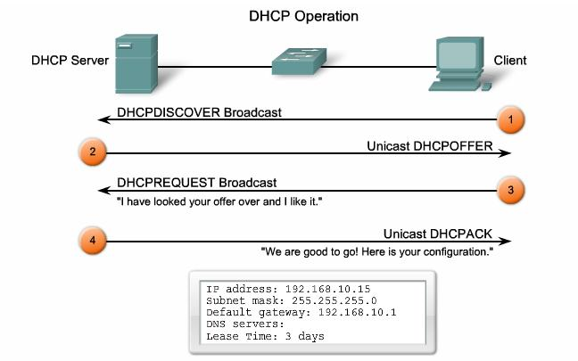 
- Khi máy tính/server client được khởi động và xác định cần xin cấp IP động từ DHCP Server. Thì client sẽ gửi gói tin `DHCPDISCOVER` dưới dạng broadcast trên lớp mạng thiết bị mà client đang kết nối tới. Mục đích của `DHCPDISCOVER` là tìm được DHCP Server cấp IP.
- Nếu có tồn tại DHCP Server, thì DHCP Server sẽ nhận được gói tin `DHCPDISCOVER` của client. Lúc này DHCP Server tiến hành rà soát Cơ Sở Dữ Liêu IP đã cấp cho các client khác, xem còn trống IP nào không. Nếu có sẽ tiến hành gởi thông tin địa chỉ IP đính kèm cùng các thông tin khác trong gói tin `Unicast DHCPOFFER` gửi trả về máy tính client.
- Máy tính client khi nhận được gói tin `DHCPOFFER` phản hồi từ DHCP Server sẽ tiến hành đánh giá thông tin IP động được cấp phát. Sau đó sẽ gửi trả lời DHCP Server bằng gói tin `DHCPREQUEST` với nội dung gói tin là thông tin địa chỉ IP trong gói tin `DHCPOFFER` trước đó. `DHCPREQUEST` chính là yêu cầu DHCP Server hãy cấp IP mà bạn đã đề nghị cho tôi đi.
- DHCP server đồng ý cấp IP cho client thông qua gói `Unicast DHCPACK`.
<h2 style="color:orange">2. Chuẩn bị</h2>
1 server DHCP: 192.168.57.2/24 
Gateway: 192.168.57.1 
1 client 

Lưu ý :
- Trong 1 vùng mạng chỉ tồn tại 1 DHCP server duy nhất. Tạo thêm 1 server sẽ không có tác dụng gì
- Trong môi trường lab như VM ware, virtual box thì phải chọn host only và vô hiệu hóa dhcp của có sẵn trong cụm mới có thể thực hiện bài lab:

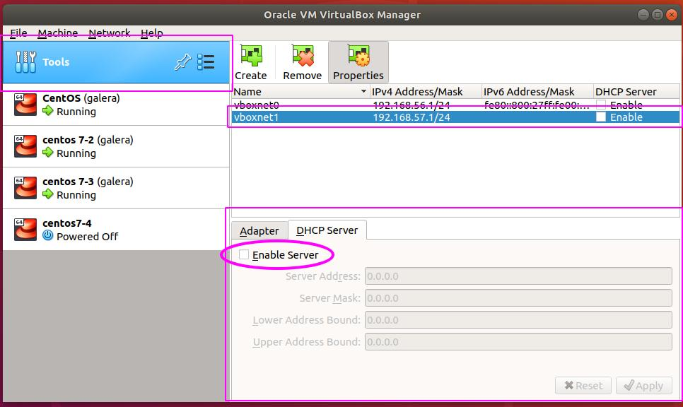 
- Vào tools -> preferences -> create để tạo 1 card mạng mới (ở đây là vboxnet1) vô hiệu hóa DHCP mặc định.
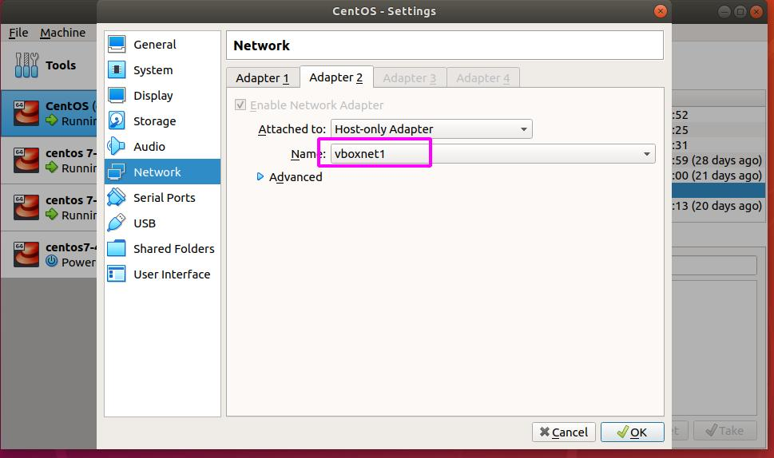 
- Vào phần 2 máy ảo muốn thực hiện -> Settings -> Network -> Adapter 2 -> Host-only Adapter -> vboxnet1 -> Apply

Khi cài card mạng mới vào máy ảo đầu tiên sẽ chưa có file config. Dùng lệnh:

       # nmtui
để tạo file config cho card mạng host-only  
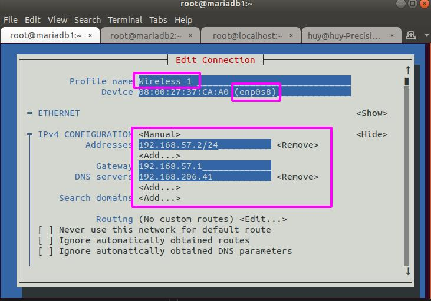 
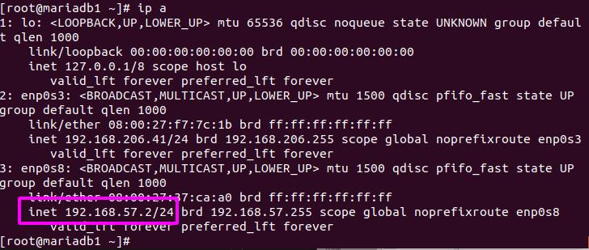 
Đổi wireless 1 thành enp0s8; nếu là server DHCP thì để Manual và cấu hình địa chỉ IP tĩnh cho DHCP server 
Còn nếu là client thì để automatic.
<h2 style="color:orange">3. Trên DHCP server</h2>
Cài đặt gói DHCP:

    # yum install -y dhcp
Kiểm tra các gói dhcp đã được cài đặt chưa

    # rpm -qa|grep dhcp
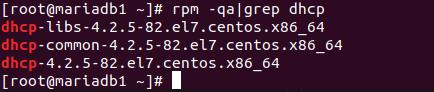 
Vào file /etc/dhcp/dhcpd.conf để thêm cấu hình

    # vim /etc/dhcp/dhcpd.conf

    option domain-name "srv.world";
    option domain-name-servers ns1.srv.world, ns2.srv.world;
    default-lease-time 600;
    max-lease-time 7200;
    lease-file-name "/var/lib/dhcpd/dhcpd.leases";
    authoritative;
    log-facility local7;
    deny leasequery;

    subnet 192.168.57.0 netmask 255.255.255.0 {
        range 192.168.57.10 192.168.57.90;
        default-lease-time 3600;
        max-lease-time 7200;
        option subnet-mask 255.255.255.0;
        option routers 192.168.57.1;
        option broadcast-address 192.168.57.255;
        option domain-name-servers 192.168.57.2;
        host giam-doc {
        hardware  ethernet 08:00:27:c7:0e:b4;
        fixed-address 192.168.57.21;
        }
    }
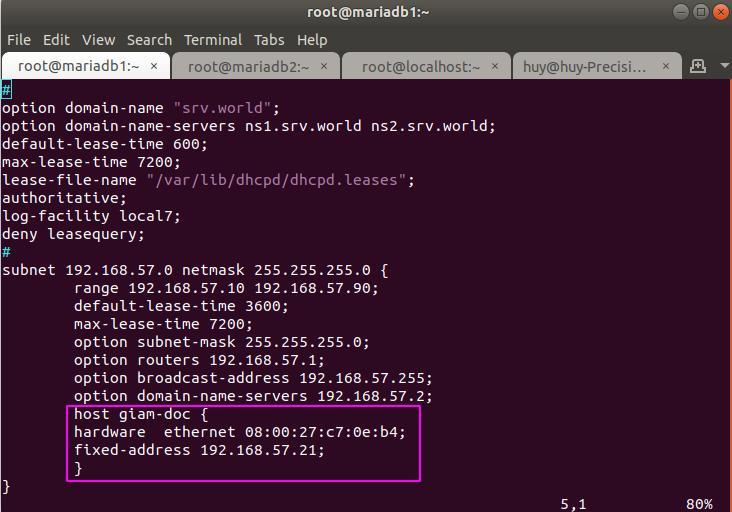 
<h3 style="color:orange">3.1. Chú thích</h3>

- Cấu trúc các file/thư mục của dịch vụ DHCP Server mà bạn cần biết:
./etc/dhcp/dhcpd.conf : file cấu hình dịch vụ DHCP. 
./var/lib/dhcpd/dhcpd.leases : file chứa thông tin các IP động đang cấp qua DHCP. 
./var/log/message : log mặc định chứa quá trình DHCP 4 bước. 
<h3 style="color:orange">3.1.1. Cấu hình global</h3>
 Cấu hình quy định những thông tin giá trị mặc định cho các khai báo lớp mạng (subnet) cấp phát ip động DHCP.

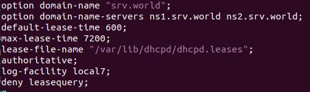 

- option domain-name : khai báo tên miền lớp mạng chung.
- option domain-name-server : khai báo Name Server của domain bạn đã cung cấp ở trên.
- default-lease-time : thời gian mặc định một IP DHCP tồn tại được cấp phát cho người dùng.
- max-lease-time : thời gian tối đa một IP DHCP tồn tại được cấp phát cho người dùng.
- lease-file-name : chỉ định file chứa thông tin về địa chỉ IP đã được cấp phát qua DHCP.
- authoritative : nếu máy chủ dịch vụ DHCP này là máy chủ DHCP Server chính thức cho các mạng nội bộ, config này sẽ set đây là master DHCP server giúp tránh các server giả mạo.

Ngoài ra, còn 1 số config khác:

    allow bootp;
    ignore client-updates;
    deny leasequery;
- allow [ bootp ] : cho phép phản hồi với các gói tin query BOOTP.
- deny [ leasequery ] : không trả lời các gói tin DHCPLEASEQUERY, gói tin này nhằm gia hạn thời gian sử dụng IP DHCP cấp khi sắp hết hạn sử dụng.
- ignore [ client-updates ] : từ chối các request cập nhật Dynamic DNS. 
Các cấu hình khác : https://linux.die.net/man/5/dhcpd.conf
<h3 style="color:orange">3.1.2. Cấu hình khai báo mạng DHCP</h3>

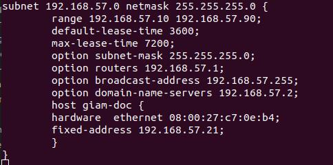 

- range <ip_1> <ip_2> : ip_1 là điểm bắt đầu và ip_2 là điểm kết thúc
- option subnet-mask : thông tin subnet mask của mạng IP được cấp phát.
- option routers: cung cấp thông tin địa chỉ IP của router gateway mà client sẽ sử dụng khi nhận IP DHCP.
- option broadcast-address : cung cấp thông tin broadcast của lớp mạng mà client sẽ nhận IP sử dụng.
- option domain-name-servers : cung cấp thông tin DNS Server cho client.
- default-lease-time : thời gian mặc định một IP DHCP tồn tại được cấp phát cho người dùng. Giá trị này khi nằm trong cấu hình “subnet” sẽ được áp dụng riêng với giá trị cấu hình “global“.
- max-lease-time : thời gian tối đa một IP DHCP tồn tại được cấp phát cho người dùng.  Giá trị này khi nằm trong cấu hình “subnet” sẽ được áp dụng riêng với giá trị cấu hình “global“. 
- Bạn hoàn toàn có thể cấu hình nhiều “subnet” trong file cấu hình DHCP.
<h3 style="color:orange">3.1.3. Cấp địa chỉ IP cho 1 máy cụ thể</h3>
Trường hợp này là bạn đang muốn dành riêng 1 địa chỉ IP trong range IP DHCP cho một máy tính cụ thể trong hệ thống mạng. Máy tính đó có thể là của sếp, của trưởng phòng,.. 

Vậy để làm được điều đó, thì DHCP Server trên CentOS cần có được thông tin địa chỉ MAC Address của máy tính của sếp hoặc trưởng phòng. Để khi mà máy tính client đi xin DHCP IP thì DHCP Server sẽ dựa vào địa chỉ MAC trong file cấu hình mẫu như dưới và cấp địa chỉ IP nằm trong giá trị khai báo “fixed-address“.

    subnet 192.168.100.0 netmask 255.255.255.0 {
    ...
    host giam-doc {
        hardware  ethernet 08:00:27:c7:0e:b4;
        fixed-address 192.168.57.21;
    }
 
    host truong-phong {
        hardware  ethernet 00:4g:8h:13:8h:3a;
        fixed-address 192.168.57.11;
    }
    }
Ở ví dụ trên, cài máy client có địa chỉ của giam-doc.
<h3 style="color:orange">3.1.4. Cơ sở dữ liệu đã cấp bởi DHCP server</h3>
Trên máy chủ dịch vụ DHCP Server trên CentOS, thì file ‘/var/lib/dhcpd/dhcpd.leases‘ sẽ lưu trữ toàn bộ thông tin về IP đang được cấp phát cho máy tính client. Nếu không có file này thì DHCP Server sẽ không hoạt động.

    # touch /var/lib/dhcp/dhcpd.leases
    # chown dhcpd:dhcpd /var/lib/dhcp/dhcpd.leases
    # chmod 644 /var/lib/dhcp/dhcpd.leases
<h3 style="color:orange">3.2. Cấu hình firewall</h3>
Mở port 67 cho DHCP hoạt động

    # firewall-cmd --permanent --zone=public --add-port=67/udp
    # firewall-cmd --permanent --zone=public --add-service=dhcp
    # firewall-cmd --reload
    
    # systemctl start dhcpd
    # systemctl enable dhcpd
Kiểm tra dịch vụ DHCPd đã được listen socket port 67 udp

    # netstat -lnup|grep 67
<h3 style="color:orange">4. Cấu hình trên client</h3>
Cài đặt dhcp trong file network config enp0s8 như trong phần chuẩn bị

    # vim /etc/sysconfig/network-scripts/ifcfg-enp0s8 
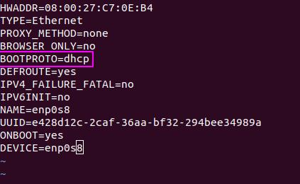 

    # systemctl restart network
    # ip a để kiểm tra
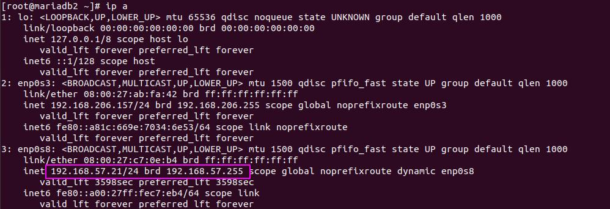 
----> thành công.