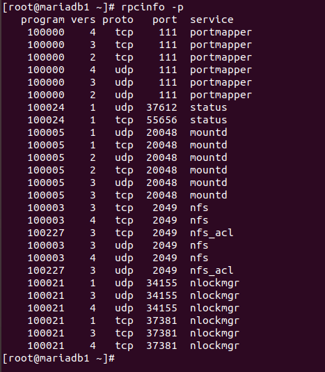
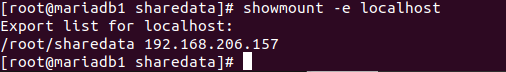
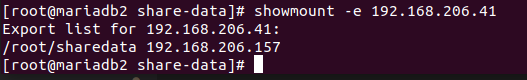

<h1 style="color:orange">NFS CentOS7</h1>
NFS (Network File System) là một hệ thống giao thức chia sẻ file phát triển bởi Sun Microsystems từ năm 1984, cho phép một người dùng trên một máy tính khách truy cập tới hệ thống file chia sẻ thông qua một mạng máy tính giống như truy cập trực tiếp trên ổ cứng.

Hiện tại có 3 phiên bản NFS là NFSv2, NFSv3, NFSv4.

<h2 style="color:orange">1. Chuẩn bị</h2>
1 server NFS: 192.168.206.41/24 
1 client: 192.168.206.157/24 
<h2 style="color:orange">2. Trên NFS server</h2>
Cài đặt pack-age nfs

    # yum install nfs-utils
Tạo thư mục để chia sẻ tài nguyên

    # mkdir /root/sharedata
Phân quyền cho file vừa tạo :

    # chmod -R 755 /sharedata
    # chown nfsnobody:nfsnobody /sharedata
Vào file /etc/exports để thiết lập quyền truy cập

    # vim /etc/exports
    /root/sharedata    192.168.206.41(rw,sync,no_root_squash,no_all_squash)
    hoặc 
    /root/sharedata    192.168.206.0/24(rw,sync,no_root_squash,no_all_squash)
Cấu hình firewall trên nfs server

    # firewall-cmd --permanent --zone=public --add-service=nfs
    # firewall-cmd --permanent --zone=public --add-service=mountd
    # firewall-cmd --permanent --zone=public --add-service=rpc-bind
    hoặc
    # firewall-cmd --permanent --zone=public --add-port=111/udp
    # firewall-cmd --permanent --zone=public --add-port=2049/tcp
    # firewall-cmd --reload
Mặc định giao thức NFS làm việc trên cổng 111/udp và 2049/tcp

Khởi động nfs

    # systemctl enable rpcbind
    # systemctl enable nfs-server
    # systemctl enable nfs-lock
    # systemctl enable nfs-idmap

    # systemctl start rpcbind
    # systemctl start nfs-server
    # systemctl start nfs-lock
    # systemctl start nfs-idmap
Kiểm tra port sử dụng bởi NFS

    # rpcinfo -p
 
Kiểm tra mount point trên server

    # showmount -e localhost
 
<h2 style="color:orange">3. Trên NFS client</h2>
Cài đặt nfs package

    # yum install nfs-utils
Tạo và mount thư mục tới file vừa tạo:
    
    # mkdir -p /root/test/share-data
    # mount -t nfs 192.168.206.41:/root/sharedata /root/test/share-data
Kiểm tra mount point

    # showmount -e 192.168.206.41
 

Để tự động mount tới NFS Server khi máy chủ reboot, thì bạn sửa file /etc/fstab, thêm dòng sau vào cuối file

    # vim /etc/fstab
    
    192.168.206.41:/root/sharedata /root/test/share-data nfs rw,sync,hard,intr 0 0
<h2 style="color:orange">3. Kiểm tra</h2>
Trên client, trong file /root/test/share-data tạo 1 file a.txt và chỉnh sửa nội dung file

    # vim /root/test/share-data/a.txt
Khi chuyên sang nfs server sẽ thấy file a.txt nằm trong /root/sharedata đã được chỉnh sửa nội dung

-------> thành công
<h2 style="color:orange">4. Các file cấu hình quan trọng của NFS</h2>

- /etc/exports : Đây là file config chính của NFS, chứa thông tin danh sách các file và thư mục chia sẻ trên NFS Server.
- /etc/fstab : Để tự động mount một thư mục NFS trên hệ thống của bạn trong trượng reboot.
- /etc/sysconfig/nfs : File config của NFS để quản lý port đang lắng nghe của rpc và các service khác.
<h2 style="color:orange">5. Một số command hay dùng</h2>

- showmount -e : Hiển thị thư mục Share trên hệ thống của bạn
- showmount -e <server-ip or hostname>: Hiển thị danh sách thư mục - share trên một Remote Server
- showmount -d : Liệt kê danh sách các thư mục còn
- exportfs -v : Hiển thị danh sách các file chia sẻ và các options trên server
- exportfs -a : Exports toàn bộ thư mục share trong /etc/exports
- exportfs -u : Unexports toàn bộ thư mục share trong /etc/exports
- exportfs -r : Refresh sau khi đã chỉnh sửa /etc/exports