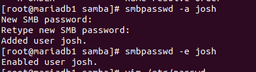
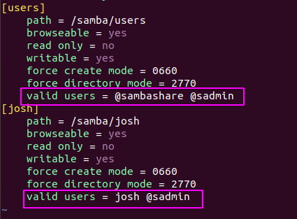
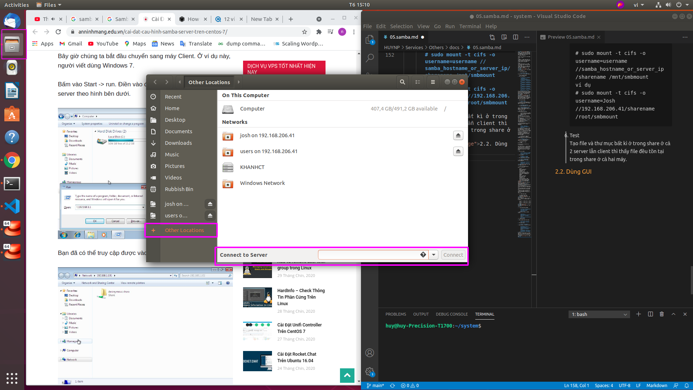
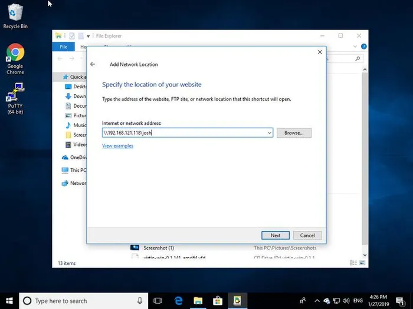
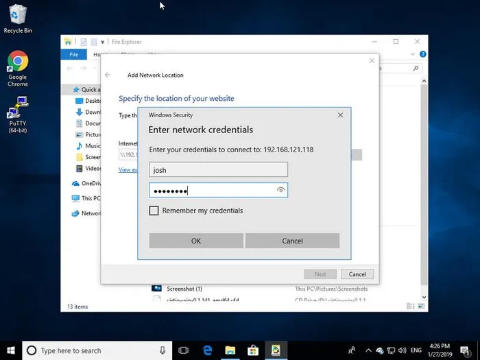

<h1 style="color:orange">Samba</h1>
Samba là một phần mềm mã nguồn mở sử dụng giao thức chia sẻ file qua mạng SMB/CIFS cho phép người dùng cuối truy nhập file, máy in và các tài nguyên chung khác.

Trong ví dụ, chúng ta sẽ tạo Samba shares và users

Users:
- sadmin - 1 người dùng admin với quyền read/write với tất cả shares.
- josh - 1 user bình thường với private share của user đó

Shares:
- users: Phần share này sẽ được truy cập bởi quyền read/write bởi tất cả user
- josh: Phần chia này sẽ được truy cập bởi quyền read/write chỉ bởi user josh và sadmin.
<h1 style="color:orange">1. Cấu hình</h1>
<h2 style="color:orange">Trên Samba server CentOS7</h2>

1. Cài đặt package samba

       # yum install samba* -y
Để kiểm tra các gói samba trong máy

    # rpm -qa|grep samba
2. Cấu hình firewall

       # firewall-cmd --permanent --zone=public --add-service=samba
       # firewall-cmd --permanent --zone=public --add-port=137/tcp
       # firewall-cmd --permanent --zone=public --add-port=138/tcp
       # firewall-cmd --permanent --zone=public --add-port=139/tcp
       # firewall-cmd --permanent --zone=public --add-port=445/tcp
       # firewall-cmd --permanent --zone=public --add-port=901/tcp
       # firewall-cmd --reload
Mặc định smbd service chia sẻ file và máy in trên port 139 và 445/tcp. Nmbd service cung cấp NETBIOS qua IP tới client và lắng nghe trên port 137/udp.
<h2 style="color:orange">1.1. Tạo Samba users và thư mục samba</h2>
Để dễ dàng quản lý thì thay vì sử dụng thư mục mặc định (/home/user), tất cả thư mục Samba và dữ liệu sẽ được đặt trong thư mục /samba

1. Tạo thư mục Samba

       # mkdir /samba
2. Tạo group mới tên sambashare. Về sau chúng ta sẽ thêm tất cả samba users vào group này

       # groupadd sambashare
3. set group sambashare cho //samba

       # chgrp sambashare /samba
Samba sử dụng hệ thống users và group của Linux nhưng nó cũng có hệ thống bảo mật riêng.

4. Tạo samba user 
Để tạo user mới tên Josh:

       # sudo useradd -M -d /samba/josh -s /usr/sbin/nologin -G sambashare josh
Trong đó: 
.-M: không tạo thư mục home cho user này. Chúng ta sẽ tự tạo thư mục 
.-d: /samba/josh - set thư mục home cho /samba/josh 
.-s: /usr/sbin/nologin - vô hiệu hóa shell cho user này 
.-G: sambashare - thêm user này vào sambashare group 

5. Tạo thư mục home cho các user và đặt quyền cho josh và group sambashare

       # mkdir /samba/josh
       # chown josh:sambashare /samba/josh
Câu lệnh sau sẽ thêm sgit vào thư mục /samba/josh và những file mới tạo trong thư mục này sẽ kế thừa group của các thư mục chứa nó. Bằng cách này, với user bất kì tạo thêm 1 file mới, file mới sẽ có group-owner của sambashare. Ví dụ nếu không set 2770 cho thư mục, những file sadmin tạo thì josh sẽ không dùng được.

       # chmod 2770 /samba/josh
6. Thêm user Josh vào Samba database bằng cách set user password

       # smbpasswd -a josh
 
Sau khi set xong password:
       
    # smbpasswd -e josh
để xác nhận.

Để tạo user khác, lặp lại tiến trình tương tự.

Tiếp theo tạo user và group sadmin. Tất cả thành viên của group này sẽ có quyền quản trị. Nếu muốn phân quyền quản trị cho 1 user khác thì đơn giản thêm user đó vào sadmin group.

1. Tạo user sadmin:

       # sudo useradd -M -d /samba/users -s /usr/sbin/nologin -G sambashare sadmin
2. Set password:

       # smbpasswd -a sadmin
       # smbpasswd -e sadmin
3. Tạo shared thư mục cho sadmin

       # mkdir //samba/users
4. Phân quyền cho user sadmin và group sambashare

       # chown sadmin:sambashare /samba/users
       # chmod 2770 /samba/users
<h2 style="color:orange">1.2. Cấu hình samba shares</h2>

    # vim /etc/samba/smb.conf
paste vào cấu hình

    [users]
    path = /samba/users
    browseable = yes
    read only = no
    writable = yes
    force create mode = 0660
    force directory mode = 2770
    valid users = @sambashare @sadmin
    [josh]
    path = /samba/josh
    browseable = yes
    read only = no
    writable = yes
    force create mode = 0660
    force directory mode = 2770
    valid users = josh @sadmin
 
Trong đó: 
.[users] và [josh]: Tên shares sẽ dùng khi đăng nhập 
.path: Đường dẫn tới share 
.browseable: có cho phép những user khác nhìn thấy share 
.force create mode - Set quyền cho những file mới được tạo trong share này
.force directory mode - phân quyền cho những thư mục mới trong share này.
.valid user: Danh sách những user và group có quyền truy cập vào share. group được phân biệt bới ký hiệu '@'.

------> khởi động samba

    # systemctl start smb
    # systemctl enable smb
<h3 style="color:orange">1.3. Cấu hình SELinux</h3>
Lưu ý : SELinux sẽ chặn kết nối từ máy ngoài đến các thư mục share. Để bỏ chặn :

    # chcon -t samba_share_t /samba/josh
    # chcon -t samba_share_t /samba/users
<h2 style="color:orange">2. Kết nối đến samba server</h2>
<h3 style="color:orange">2.1. Trên linux</h3>

1. Cài đặt smbclient pạckage

       # sudo apt install smbclient (trên ubuntu, debian)
       # sudo yum install samba-client
2. syntax để kết nối đến samba server
       
       # mbclient //samba_hostname_or_server_ip/share_name -U username
       ví dụ
       # smbclient //192.168.206.41/josh -U josh
----> Nhập password

3. Mount samba share trên linux

       # apt install cifs-utils
       # yum install cifs-utils
4. Tạo mount point:
       
       # mkdir /root/smbmount
5. Mount share vào thư mục vừa tạo:

       # sudo mount -t cifs -o username=username //samba_hostname_or_server_ip/sharename /mnt/smbmount
       ví dụ
       # sudo mount -t cifs -o username=Josh //192.168.206.41/sharename /root/smbmount
6. Test  
Tạo file và thư mục bất kì ở trong share ở cả 2 server lẫn client thì thấy file đều tồn tại trong share ở cả hai máy.
<h3 style="color:orange">2.2. Dùng GUI</h3>

Vào files trên ubuntu --> other locations nhập cú pháp

    smb://samba_hostname_or_server_ip/sharename.
    ví dụ
    smb://192.168.206.41/josh
 
Chọn registered user ----> nhập mật khẩu ---> connect
<h3 style="color:orange">2.3. Trên windows</h3>

1. Mở File Explorer và trên pane, right-click vào “This PC”.
2. CHọn “Choose a custom network location” và click “Next”. 
 
3. Nhập mật khẩu -----> next
 