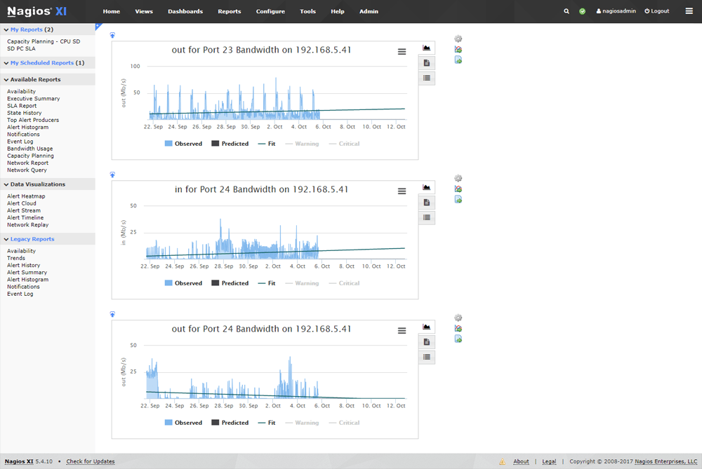

<h1 style="color:orange">Nagios</h1>
Nagios core là một hệ thống giám sát mạnh mẽ, cho phép các tổ chức xác định và giải quyết các vấn đề cơ sở hạ tầng CNTT trước khi chúng gây ảnh hưởng đến các quy trình kinh doanh và các hệ thống quan trọng.

Hiện tại nhà phát triển chỉ hỗ trợ triển khai Nagios hệ thống trên Hệ Điều Hành Linux. Với Nagios bạn sẽ có thêm kênh giám sát và cảnh báo cho các máy chủ, switch, ứng dụng và dịch vụ.

Nagios core được phát hành từ năm 1999 bởi Ethan Galstad, và lúc đó nó có cái tên là Nestaint. Đến năm 2002 được đổi tên thành Nagios và năm 2009 nó đã chính thức có tên là Nagios core. Nagios không ngừng phát triển lớn mạnh, hàng ngàn dự án đã được phát triển bởi cộng đồng Nagios trên toàn thế giới. Nagios được chính thức tài trợ bởi Nagios Enterprises, với mục đích hỗ trợ cộng đồng bằng nhiều cách khác nhau thông qua việc bán các sản phẩm và dịch vụ thương mại của mình.
<h2 style="color:orange">1. Tổng quan</h2>

- Tính năng: Nhiều tính năng mà Nagios cung cấp sẽ giúp bạn dễ dàng hơn trong việc triển khai tại hầu hết các môi trường.
- Cộng đồng nguồn mở: Một cộng đồng lớn những người ủng hộ và đóng góp đã tạo nên sự tuyệt vời cho Nagios. Với hàng triệu người dùng trên toàn thế giới, hàng nghìn plugin và addons, Cộng đồng Nagios là một tài sản mạnh mẽ cho mọi nhu cầu hỗ trợ hoặc phát triển.
- Dự án: Có hàng ngàn dự án Nagios có thể được sử dụng nhằm xây dựng giải pháp giám sát hoàn hảo.

Các chức năng Nagios cung cấp :
- Giám sát tài nguyên máy chủ
- Giám sát dịch vụ mạng
- Giám sát phần cứng
- Giám sát từ xa
- Cung cấp phương thức cảnh báo khi gặp sự cố, etc…
<h2 style="color:orange">2. Các khái niệm trong Nagios</h2>
<h3 style="color:orange">2.1. Plugins</h3>

- Là một lớp trừu tượng ở giữa nagios server và host hay service
- Là một dòng lệnh hay có thể là một đoạn script
- Plugins có chức năng kiểm tra host và service rồi trả lại kết quả cho nagios server
- Những plugin có 2 loại : loại có sẵn (do cộng đồng đóng góp), lọai tự viết (do quản trị viên tự viết ra để phù hợp nhu cầu sử dụng) bằng nhiều ngôn ngữ như shell script, C ++, Perl, Ruby, Python, PHP, C#, …
<h3 style="color:orange">2.2. Web server</h3>

- Là nơi lưu trữ các file, các thành phần của website ( file html, css, ảnh…)
- Là nơi cung cấp dữ liệu của website cho người dùng muốn truy cập và sử dụng. Nó sẽ cung cấp dữ liệu cho người dùng thông qua internet.
<h3 style="color:orange">2.3. DATABASE (DB)</h3>
DB bao gồm DATA và DBMS

- DATA : Là loại dữ liệu của nagios server. Dữ liệu này là thông tin của các client sau khi được kiểm tra
- DBMS (database management system) là hệ quản trị cơ sở dữ liệu. Được thiết kế nhằm mục đích quản lý dữ liệu dễ dàng hơn, bảo mật cao hơn. Theo mặc định thì DATA của nagios server sẽ được lưu trữ trong file nhưng có thể lưu trữ nó ở trong một hệ quản trị cơ sở dữ liệu
Trên DB người dùng sẽ dễ dàng thao tác với dữ liệu được lưu trữ trong file.
- Trong nagios có hỗ trợ 2 DB là mysql và postgreSQL
<h3 style="color:orange">2.4. CGI (Common Gateway Interface)</h3>

 
- CGI hay còn được gọi là giao diện dòng lệnh nó cung cấp giao thức để web server sử dụng
- Web server thường gửi thông tin biểu mẫu cho một quy trình xử lý dữ liệu và có thể gửi lại thông báo xác nhận. Quá trình đó được gọi là CGI.
- CGI có thể được viết nên từ ngôn ngữ nào đó như : C, perl, shell…
<h2 style="color:orange">3. Luồng hoạt động Nagios</h2>

 
1. Bước 1: Client sẽ sử dụng giao thức http để tạo yêu cầu thông tin website cho nagios server
2. Bước 2: Web server sẽ sử dụng CGI để lấy thông tin từ nagios server
3. Bước 3: Nagios server sẽ xem lại file cache. Nếu trong đó có thông tin mà client yêu cầu thì nó sẽ lập tức trả lại kết quả. Nếu không có nagios sẽ tạo ra một plugins để kiểm tra lại thông tin mà client yêu cầu
4. Bước 4: Plugins sẽ check thông tin theo yêu cầu và sau đó trả lại thông tin lại cho nagios server
5. Bước 5: Sau khi được nhận thông tin từ plugins thì nagios server sẽ lưu trữ thông tin đó vào một file hoặc một DB do cài đặt của người quản trị. Và đồng thời nó sẽ lưu trữ thông tin này vào file cache nếu người quản trị có sử dụng chức năng của file này
6. Bước 6: Nagios sẽ xác định những việc phải làm dựa trên thông tin được trả về từ nagios. Có cần cảnh báo hay không và đánh giá trạng thái của các host hay service. Rồi sau đó trả lại thông tin cho webserver
7. Bước 7: Web server sẽ sử dụng lại giao thức http trả lại thông tin mà client yêu cầu.
<h2 style="color:orange">4. Ưu/ nhược điểm Nagios</h2>
<h3 style="color:orange">4.1. Ưu điểm</h3>

- Là một phần mềm mã nguồn mở và miễn phí
- Giám sát tập trung
- Có thể tích hợp được nhiều ngôn ngữ khác nhau
- Có một cộng đồng phát triển plugins lớn, vì vậy có rất nhiều các plugins đã có sẵn
<h3 style="color:orange">4.2. Nhược điểm</h3>

- Giao diện đồ họa lâu đời.
- Không có khả năng tự phát hiện host khi được thêm vào. Người quản trị sẽ phải cấu hình thủ công tất cả các host và các service. Việc này ảnh hưởng đến khả năng mở rộng quy mô khó khăn.
<h2 style="color:orange">4. Nagios hoạt động như thế nào</h2>

 

- `Monitoring (giám sát):`

Nhân viên CNTT cấu hình Nagios để giám sát các thành phần cơ sở hạ tầng CNTT quan trọng, bao gồm các chỉ số hệ thống (system metric), giao thức mạng, ứng dụng, dịch vụ, máy chủ và cơ sở hạ tầng mạng.

Alerting Nagios gửi thông báo khi các cơ sở hạ tầng quan trọng bị sự cố phát sinh (fail) và phục hồi hiện trạng (recovery), cung cấp hình thức giúp thông báo cho quản trị viên về các sự kiện quan trọng. Cảnh báo có thể được gửi qua email, SMS hoặc tập lệnh tùy chỉnh.
- `Response (phản hồi)`:

Nhân viên CNTT có thể xác nhận tình trạng xử lý các cảnh báo và bắt đầu giải quyết sự cố ngừng hoạt động cũng như điều tra cảnh báo bảo mật ngay lập tức. Cảnh báo có thể được chuyển đến các nhóm khác nhau nếu cảnh báo không được công nhận một cách kịp thời.
- `Reporting (báo cáo)`:

Nagios có thể báo cáo cung cấp hồ sơ lịch sử về sự cố ngừng hoạt động, sự kiện, thông báo và các phản hồi cảnh báo để xem xét sau. Báo cáo tính khả dụng giúp đảm bảo thời gian SLA (Service-Level Agreement) của bạn đang được đáp ứng .
- `Maintenance (bảo trì):`

Thiết lập thời gian ngừng hoạt động (bảo trì) theo lịch trình giúp ngăn cảnh báo nhận được trong thời gian này.
- `Planning (lập kế hoạch)`;

Biểu đồ, báo cáo về xu hướng và khả năng lập kế hoạch cho phép bạn xác định các đối tượng nâng cấp cơ sở hạ tầng cần thiết trước khi xảy ra lỗi.