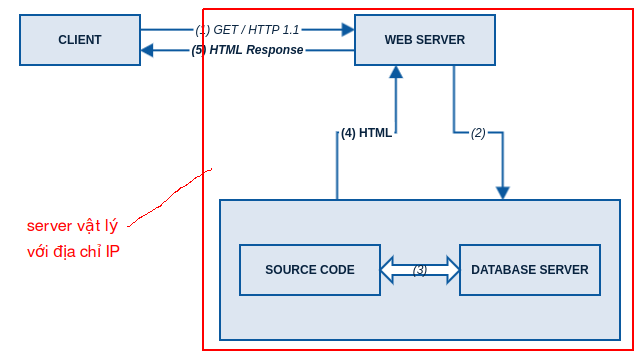
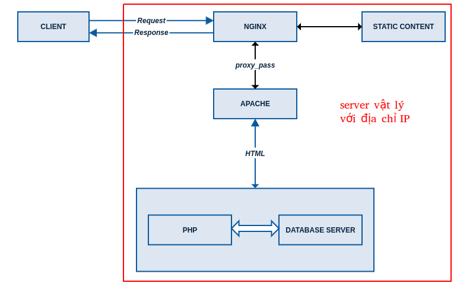

<h1 style="color:orange">Cấu hình đơn giản một hệ thống web</h1>

Trong đó:
- Client (còn gọi là web client): là công cụ chúng ta dùng để truy cập web như Web Browser (Chrome, IE, Firefox, Safari …), hoặc truy cập thông qua các script như curl, python, perl, java, …
- Web Server: Service tiếp nhận các request do Client gửi lên và điều phối xử lý.
- Source code: mã nguồn của website, bao gồm các file code (PHP, Java, ASP.NET …) và các file static content (hình ảnh, js, css, font …) (về cơ bản là frontend và backend)
- Database Server: cơ sở dữ liệu.

Một request duyệt web thông thường sẽ được xử lý theo trình tự sau:

1. Client truy cập vào link của website (hay gọi là Client gửi request đến server)
2. Web server tiếp nhận request, nhận thấy request liên quan đến code (Program-language như PHP, Python) nên gọi code xử lý.
3. Trong quá trình xử lý của mình, code sẽ kết nối đến Database server để tương tác với dữ liệu.
4. Kết quả của quá trình xử lý code là 1 cục HTML được trả ngược lại cho Web Server.
5. Web server tiếp nhận cục HTML và điều chỉnh nếu cần, sau đó trả kết quả về cho Client.
6. Client nhận được HTML sẽ xử lý và request các resources cần thiết tiếp theo sau đó hiển thị kết quả cho người dùng.
<h1 style="color:orange">1. LAMP</h1>
LAMP stack là nền tảng của các hosting website sử dụng chủ yếu Linux. Viết tắt của:

- L: Linux – Hệ điều hành
- A: Apache – Service đóng vai trò Web Server, thường được gọi bằng cái tên khác là httpd.
- M: MySQL/MariaDB – Service đóng vai trò Database Server.
- P: PHP – ngôn ngữ lập trình (Program-language)

Là stack thường dùng để triển khai một web server, được dùng từ rất lâu và phổ biến nhất trên thế giới. Apache là Web Server hoạt động trên cơ chế Process Oriented, nghĩa là mỗi Request của Client sẽ do một Process/Thread handle, điều này khiến cho các website có lượng truy cập lớn khi sử dụng Apache sẽ tốn nhiều tài nguyên RAM/CPU (do process được sinh ra nhiều). Tuy nhiên, Apache hỗ trợ Rewrite bằng .htaccess, điều này giúp phần lớn mà nguồn tương thích.
<h1 style="color:orange">2. LEMP</h1>
LEMP viết tắt của:

- L: Linux – Hệ điều hành
- E: Nginx (đọc là Engine X): Service đóng vai trò Web server.
- M: MySQL/MariaDB – Service đóng vai trò Database Server.
- P: PHP – ngôn ngữ lập trình.
 
Ra đời sau LAMP, tuy nhiên LEMP đang là lựa chọn ưu tiên hiện nay do Nginx sử dụng cơ chế Event-Driven, xử lý các request dựa trên event nên tiêu tốn ít tài nguyên, thích hợp với các website có lượng truy cập lớn. Do Apache được thay thế bằng Nginx nên LEMP không hỗ trợ file .htaccess, nếu muốn sử dụng, người dùng phải convert rule trong .htaccess sang các rewrite tương ứng của Nginx. Ngoài ra, khi sử dụng LEMP thì PHP sẽ được xử lý bởi PHP-FPM.
<h2 style="color:orange">3. So sánh LAMP và LEMP</h2>
Sự khác biệt cơ bản là việc sử dụng web server giữa Apache và Nginx

1. Apache:
- Apache đã được sử dụng từ lâu (từ những năm 1995), có rất nhiều các module được viết và cả người dùng tham gia vào mở rộng hệ chức năng cho Apache.
- Phương pháp process/thread-oriented – sẽ bắt đầu chậm lại khi xuất hiện tải nặng, cần tạo ra các quy trình mới dẫn đến tiêu thụ nhiều RAM hơn, bên cạnh đó, cũng tạo ra các thread mới cạnh tranh các tài nguyên CPU và RAM;
- Giới hạn phải được thiết lập để đảm bảo rằng tài nguyên không bị quá tải, khi đạt đến giới hạn, các kết nối bổ sung sẽ bị từ chối;
- Yếu tố hạn chế trong điều chỉnh Apache: bộ nhớ và thế vị cho các dead-locked threads cạnh tranh cho cùng một CPU và bộ nhớ.
2. Nginx:
- Ứng dụng web server mã nguồn mở được viết để giải quyết các vấn đề về hiệu suất và khả năng mở rộng có liên quan đến Apache.
- Phương pháp Event-driven, không đồng bộ và không bị chặn, không tạo các process mới cho mỗi request từ web.
- Đặt số lượng cho các worker process và mỗi worker có thể xử lý hàng nghìn kết nối đồng thời
- Các module sẽ được chèn vào trong thời gian biên dịch, có trình biên dịch mã PHP bên trong (không cần đến module PHP).

------> Nginx nhanh hơn và có khả năng xử lý tải cao hơn nhiều so với Apache khi sử dụng cùng một bộ phần cứng. Tuy nhiên, Apache vẫn là tốt hơn nhiều khi nói đến chức năng và tính sẵn sàng của các module cần thiết để làm việc với các ứng dụng máy chủ back-end và chạy các ngôn ngữ kịch bản lệnh.
-------> kết hợp cả hai khi dùng web server
<h2 style="color:orange">4. Reverse Proxy</h2>
Là sự kết hợp của LAMP và LEMP, trong đó Nginx sẽ đóng vai trò là Web Server chính tiếp nhận request của Client. Nginx sẽ phục vụ các static content, các request cần liên quan đến việc xử lý code PHP, Nginx sẽ đẩy request về cho Apache xử lý. Mô hình này phù hợp cho nhu cầu cân bằng giữa hiệu năng và tính phù hợp với mã nguồn. Mô hình Reverse Proxy sẽ tận dụng được cơ chế Event-Driven của Nginx để phục vụ lượng truy cập lớn, tiết kiệm tài nguyên nhưng đồng thời vẫn tương thích với mã nguồn sử dụng .htaccess.

