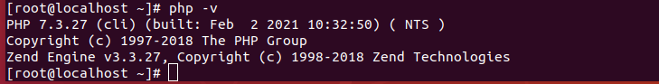

<h1 style="color:orange">PHP</h1>
Trong kho phần mềm chính thức của CentOS 7 thì PHP 5.4 đã cũ và không còn được các nhà phát triển hỗ trợ, duy trì và cập nhật bản vá lỗi. 
Hiện tại, PHP 7.3 là phiên bản được phát hành mới nhất của PHP.
<h2 style="color:orange">1. Cài đặt PHP</h2>
Để cài đặt PHP 7, bạn cần cài đặt và kích hoạt EPEL và Remi repository trên hệ thống CentOS 7 bằng câu lệnh sau:

1. Cài đặt EPEL

       # yum install https://dl.fedoraproject.org/pub/epel/epel-release-latest-7.noarch.rpm
2. Cài đặt Remi

       # yum install http://rpms.remirepo.net/enterprise/remi-release-7.rpm
Server đã được thiết lập để cài đặt PHP từ yum repository. Sử dụng lệnh để cài PHP 7.3:

       # yum --enablerepo=remi-php73 install php
3. Sau khi tiến trình hoàn tất, sử dụng lệnh:

       # php -v
để kiểm tra lại thông tin phiên bản php

<h2 style="color:orange">2. Cài đặt PHP Modules</h2>
Sau khi cài đặt một phiên bản PHP 7.x trên server, để cài đặt thêm một số PHP modules cần thiết cho các ứng dụng, bạn sử dụng lệnh bên dưới cho phiên bản 7.3:

       # yum --enablerepo=remi-php73 install php-xml php-soap php-xmlrpc php-mbstring php-json php-gd php-mcrypt
Ngoài ra có thể sử dụng lệnh để xem các PHP modules có sẵn trong yum repository đã được cấu hình:

       # yum --enablerepo=remi-php73 search php | grep php73 [cho PHP 7.3]
<h2 style="color:orange">3. Cấu hình PHP hoạt động với Apache</h2>
Nếu bạn đang sử dụng Apache làm máy chủ web của mình thì chỉ cần khởi động lại dịch vụ Apache bằng lệnh sau:

      # systemctl restart httpd

- Cấu hình PHP 7 hoạt động với Nginx 
Không giống như Apache, Nginx không có hỗ trợ tích hợp để xử lý các tệp PHP, vì vậy các bạn cần cài đặt một ứng dụng riêng là PHP-FPM để xử lý các tệp PHP. Để cài đặt gói PHP FPM, hãy chạy lệnh sau:

      # yum install php-fpm -y
Theo mặc định, PHP-FPM sẽ chạy dưới quyền user apache trên cổng 9000. Thay đổi người dùng thành nginx và chuyển từ TCP socket sang Unix socket.

      # vim /etc/php-fpm.d/www.conf

Thay đổi các dòng sau đây:

    … 
    user = nginx 
    … 
    group = nginx 
    … 
    listen = /run/php-fpm/php7.sock 
    … 
    listen.owner = nginx 
    listen.group = nginx 