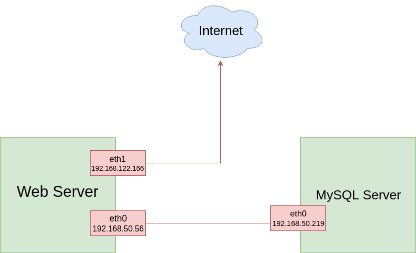
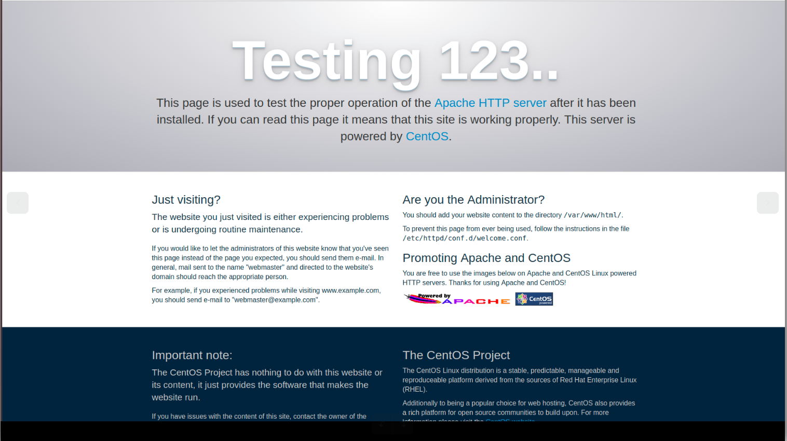
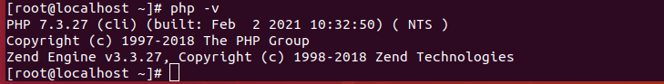
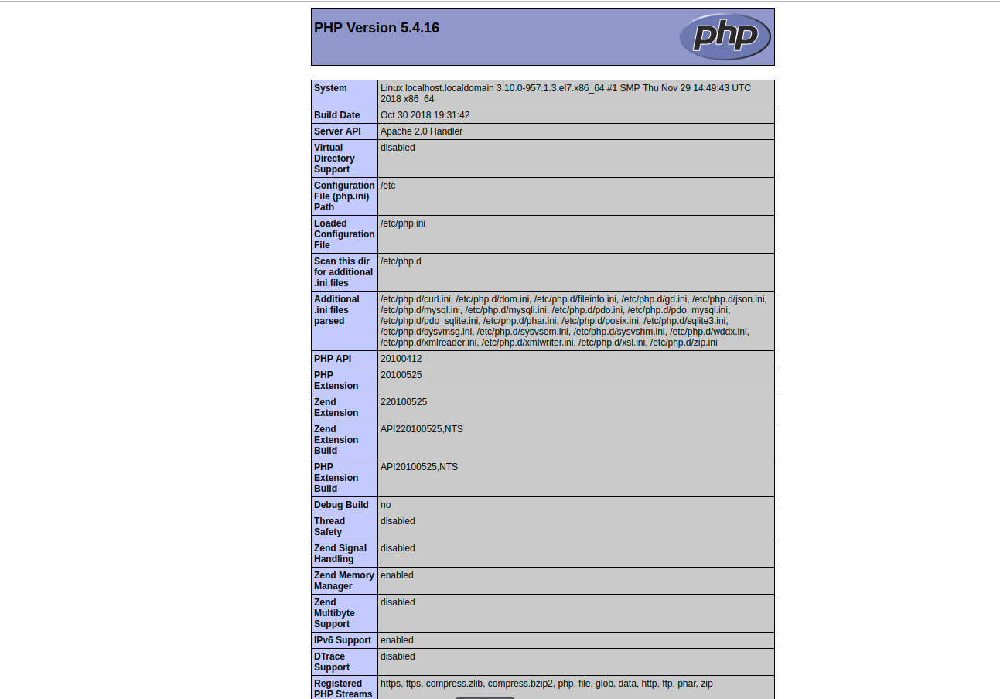
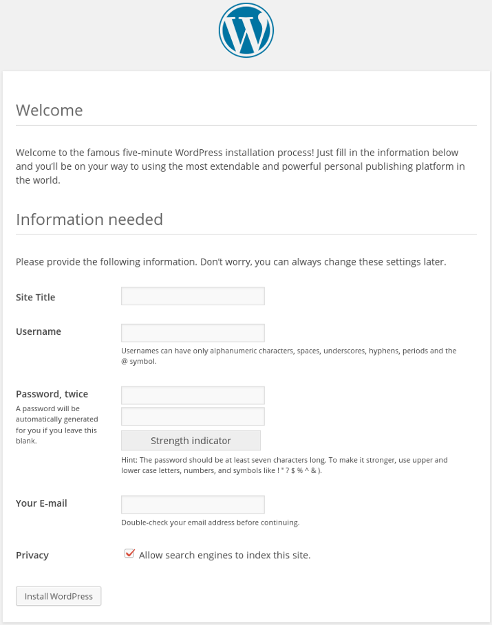
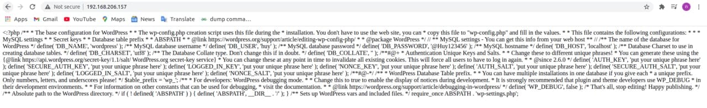
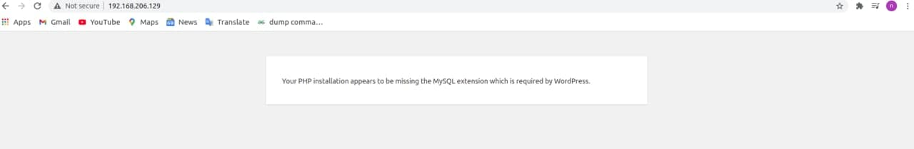
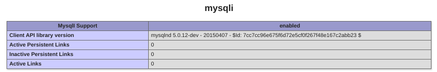
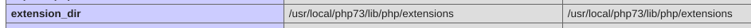

<h1 style="color:orange">Cài wordpress trên LAMP</h1>
Mô hình wordpress thường sẽ như sau:

Với 1 máy làm web server và 1 máy làm MySQL server. Tuy nhiên trong ví dụ này ta có thể sử dụng 1 máy đóng vai trò cả hai server.

Vì đây là môi trường lab nên tiến hành stop firewalld trên cả 2 máy và SElinux trên Web Server. 
Sử dụng lệnh

     setenforce 0
     systemctl stop firewalld
Nếu không muốn bạn có thể thực hiện mở port 80 trên Web Server và mở kết nối tới DB còn trên máy MySQL cần mở port 3306.

     firewall-cmd --zone=public --add-port=80/tcp
     firewall-cmd --zone=public --add-port=3306/tcp
<h2 style="color:orange">1. Cài MySQL</h2>
Tiến hành cài MySQL. Lưu ý, cài phiên bản MySQL > 5.6. Các phiên bản trước không tương thích với PHP>7.0 -----> gây ra lỗi.

1. Đăng nhập vào MySQL

        mysql -uroot -p
2. Tạo database. ví dụ database wordpress

        create database wordpress;
3. Tạo user mới

        create user 'huy'@'localhost' identified by 'password';
Grant quyền

      grant all privileges on wordpress.* to huy@localhost;
      flush privileges;
<h2 style="color:orange">2. Cài Apache</h2>

1. Update và Upgrade phiên bản CentOS:

       # sudo yum install update
       # sudo yum install epel-release
2. Install:
      
       # sudo yum install httpd
3. Apache sẽ cần port 80 (http) và port 443 (https) để sử dụng:
 
       # firewall-cmd --permanent --add-service=http
       # firewall-cmd --permanent --add-service=https
4. Reload firewall
       
       # firewall-cmd --reload
5. Bật apache

       # systemctl start httpd
Sau khi bật wordpress, vào google chrome gõ địa chỉ ip máy dùng làm web server:

      http://địa-chỉ-IP

<h2 style="color:orange">3. Cài PHP</h2>

Để cài đặt PHP 7, bạn cần cài đặt và kích hoạt EPEL và Remi repository trên hệ thống CentOS 7 bằng câu lệnh sau:

1. Cài đặt EPEL

       # yum install https://dl.fedoraproject.org/pub/epel/epel-release-latest-7.noarch.rpm
2. Cài đặt Remi

       # yum install http://rpms.remirepo.net/enterprise/remi-release-7.rpm
Server đã được thiết lập để cài đặt PHP từ yum repository. Sử dụng lệnh để cài PHP 7.3:

       # yum --enablerepo=remi-php73 install php
       # yum --enablerepo=remi-php73 install php-mysql
       # yum install php-mysql php-gd php-pear –y
Mysql cần 1 số extension của php để hoạt động bình thường. 
3. Sau khi tiến trình hoàn tất, sử dụng lệnh:

       # php -v
để kiểm tra lại thông tin phiên bản php

4. Kiểm tra phiên bản trên web 

       echo "<?php phpinfo(); ?>" > /var/www/html/info.php
5. restart apache

       # systemctl restart httpd
Vào giao diện web (gg chrome) gõ: 

      http://địa chỉ Ip/info.php 
Kết quả trả ra sẽ như này 
 
<h2 style="color:orange">4. Cài wordpress</h2>
Tải file cài wordpress

     cd ~
     wget http://wordpress.org/latest.tar.gz
Giải nén

     tar -xzvf latest.tar.gz
Đưa folder giải nén vào /var/www/html

     yum install rsync
     sudo rsync -avP ~/wordpress/ /var/www/html/
Chúng ta vẫn cần thêm folder uploads cho wordpress để chứa file upload

     mkdir /var/www/html/wp-content/uploads
Gán quyền cho directory html để apache có thể sử dụng
    
     sudo chown -R apache:apache /var/www/html/*
<h3 style="color:orange">4.1 Cấu hình wordpress</h3>
 
    # cd /var/www/html
    # cp wp-config-sample.php wp-config.php
    # vim wp-config.php
Tìm dòng như sau và điền thông tin phù hợp vào

    define('DB_NAME', 'database_name_here');    

    define('DB_USER', 'username_here');    

    define('DB_PASSWORD', 'password_here');      

    define('DB_HOST', 'localhost');   
Trong đó:

- database_name_here : tên của database
- username_here : tên user login vào mysql
- username_here : password của user login vào mysql
- localhost : địa chỉ cuả máy MySQL Sever (ví dụ: %, 192.168.x.x, localhost) 
-----> Lưu lại và thoát
<h2 style="color:orange">5. Kết quả</h2>
Gõ địa chỉ IP web-server

      http://server_domain_name_or_IP
Kết quả như sau là thành công
 
<h2 style="color:orange">6. Một số lỗi có thể xảy ra</h2>

1. Không kết nối được đến web: có thể web server chưa mở port 80
2. Vào địa chỉ IP ra kết quả
 
File wp-config.php tạo ra bị lỗi. Xóa, làm lại file khác
3. Vào địa chỉ IP ra kết quả
 

Lỗi này có nhiều nguyên nhân:
- có thể php> 7.0 không tương thích với mysql <5.6
- hoặc có thể chưa cài php extension cần thiết để wordpress chạy. cài:

      # yum --enablerepo=remi-php73 install php-mysql
cài mysql extension của php. Sau đó restart apache

      # systemctl restart httpd

Cách kiểm tra lỗi, vào:

       http://địa chỉ Ip/info.php 
xem đã có mục mysqli chưa, nếu chưa là thiếu extension
 
Ngoài ra để xem các mục này chứa ở đâu:
 
 
Thường trong centos7, configuration file sẽ là trong

      cat /etc/php.d
Một số lệnh kiểm tra hữu dụng khác

      # php -i|grep -i mysql
      # rpm -ql php-mysql