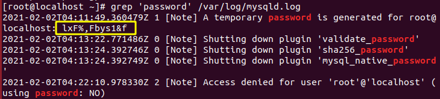
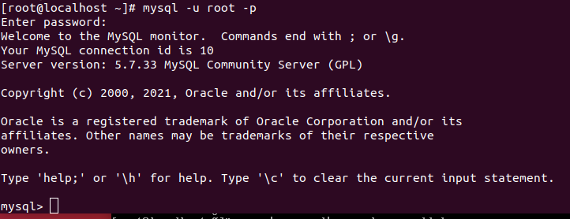

<h1 style="color:orange">Cài đặt MySQL</h1>
<h2 style="color:orange">1. Tải và chuẩn bị MySQL repository</h2>

1. Kiểm tra xem hệ thống đã được cập nhật

       # yum install update
2. Sau đó hãy cài MySQL  repositories. Các phiên bản khác có thể tìm thấy [tại đây](https://dev.mysql.com/downloads/repo/yum/):

       # wget http://dev.mysql.com/get/mysql57-community-release-el7-9.noarch.rpm
3. Cài đặt package từ repository:

       # sudo rpm -Uvh mysql57-community-release-el7-9.noarch.rpm
100% là có thể cài đặt MySQL
<h2 style="color:orange">2. Cài MySQL trên server</h2>

Cài đặt MySQL:

       # sudo yum install -y mysql-server
<h2 style="color:orange">3. Khởi động MySQL</h2>

1. Khởi động mysql:

       # systemctl start mysql
2. Xem tình trạng hoạt động mysql

       # systemctl status mysql
3. Dừng mysql:

       # systemctl stop mysql
4. Khởi động mysql mỗi khi bật server:

       # systemctl enable mysql
       # systemctl disable mysql (để ngăn khởi động mysql mỗi khi reboot)
<h2 style="color:orange">4. Đổi mật khẩu</h2>
Khi cài MySQL CentOS 7, một mật khẩu tạm cho root được tạo ra. Nhập lệnh sau để thấy nó:

     # sudo grep 'password' /var/log/mysqld.log
 
Thay đổi mật khẩu của MySQL:
1. Đầu tiên, chạy lệnh:
     
       # sudo mysql_secure_installation
 
2. Gõ mật khẩu đủ mạnh (Mật khẩu mạnh là 8-12 ký tự, bao gồm số, ký tự đặc biệt, in hoa, in thường.) để mysql chấp nhận.

3. Làm theo các bước trên màn hình và nhấn "y" để hoàn tất các bước cài đặt.
-----> Đã có MySQL để sử dụng 
<h2 style="color:orange">5. Đăng nhập MySQL</h2>
Sử dụng lệnh:

     # mysql -uroot -p
Với option -p để  yêu cầu đăng nhập password.
 

Gõ \h để xem các tùy chọn trong mysql.
 

Lưu ý: 
1. Tất cả lệnh trong MySQL đều kết thúc bằng dấu chấm phẩy (;), nếu không có chấm phẩy sẽ không thực thi lệnh.
2. Mặc dù không cần thiết, lệnh trong MySQL sẽ được VIẾT HOA; bảng, database, text, tên user sẽ được viết thường để dễ nhận biết. Tuy vậy,MySQL command line không nhạy cảm viết hoa hay thường
<h2 style="color:orange">6. Kết nối đến MySQL-server</h2>

- Cách 1: Đăng nhập trực tiếp trên Console ssh
- Cách 2: Sử dụng phpMyadmin Hướng dẫn cài đặt phpmyadmin
- Cách 3: Sử dụng Client như MySQL Workbench
Đối với Cách 1 và 2 chúng ta không cần phải chỉnh sửa quyền đăng nhập của user vì chúng thực hiện hoàn toàn trên localhost của MySQL server

Đối với Cách 3 thì chúng ta phải chỉnh sửa lại quyền đăng nhập của user để có thể kết nối từ bên ngoài vào.