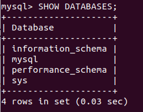
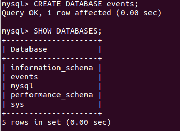
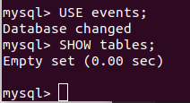
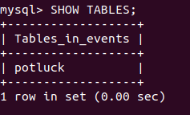
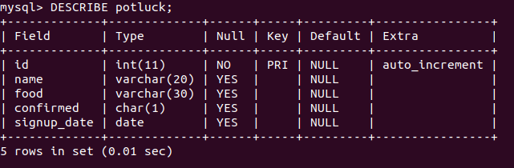
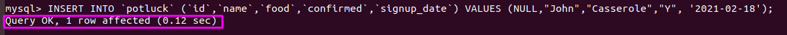
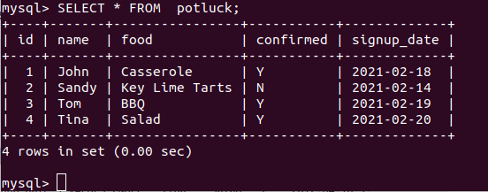
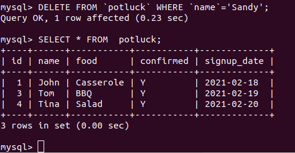

<h1 style="color:orange">MySQL-shell</h1>
<h2 style="color:orange">1. Tạo và chỉnh sửa MySQL database</h2>
MySQL tổ chức thông tin trong database; mỗi database chứa bảng với dữ liệu cụ thể.

Kiểm tra database nào đang có sẵn:

       SHOW DATABASES;
Kết quả trả ra: 
 

Tạo database:

      CREATE DATABASE database name;
      CREATE DATABASE events;
Ví dụ gọi database là "events"

 
Trong MySQL từ dùng thay cho delete là DROP. Để xóa database dùng lệnh:

      DROP DATABASE database name;
      DROP DATABASE events;
<h2 style="color:orange">2. Truy cập MySQL database</h2>
Một khi đã có database mới, có thể bắt đầu điền thông tin.
Bước đầu tạo bảng trong database

Mở database muốn dùng:

     USE events;
Để xem những bảng mà database chứa:

     SHOW tables;
 
Vì đây là database mới lập nên chưa có gì.
<h2 style="color:orange">3. Tạo bảng MySQL</h2>
TƯởn tượng mình chuẩn bị tạo một party, dùng MySQL để theo dõi tiến độ.

Tạo bảng MySQL:

    CREATE TABLE potluck (id INT NOT NULL PRIMARY KEY AUTO_INCREMENT, 
    name VARCHAR(20),
    food VARCHAR(30),
    confirmed CHAR(1), 
    signup_date DATE);
Dòng lệnh này tiến hành những điều sau:
1. Tạo 1 bảng tên "potluck" trong database "events".
2. Tạo 5 cột trong bảng - id, name, food, confirmed, và signup_date.
3. Cột id có command (INT NOT NULL PRIMARY KEY AUTO_INCREMENT) tự động đánh số mỗi cột.
4. Cột name bị giới hạn bởi lệnh VARCHAR dưới 20 ký tự.
5. Cột food chỉ rõ đồ ăn mỗi người mang. Lệnh VARCHAR giới hạn 30 ký tự.
6. Cột "confirmed" ghi lại người đó có đi hay không, Y hoặc N.
7. Cột "date" chỉ ra thời gian họ chấp nhận lời mời tới event. MySQL cần ngày tháng được viết dưới dạng yyyy-mm-dd

Lưu ý: VARCHAR(), CHAR(), DATE là những datatype; để xem đầy đủ các [datatype](https://www.w3schools.com/sql/sql_datatypes.asp)

Dùng lệnh SHOW TABLES; để xem list bảng:

 
Để xem bảng được cấu tạo thế nào:

     DESCRIBE potluck;
Lưu ý: Mặc dù MySQL command line không chú ý tới viết hoa hay thường, tên bảng và database lại chú ý tới điều này: potluck không giống POTLUCK hay Potluck.

 
<h2 style="color:orange">4. Thêm thông tin vào bảng MySQL</h2>
Chúng ta đã có bảng. Giờ là lúc điền thông tin.

Sử dụng format này để thêm thông tin vào mỗi hàng:

    INSERT INTO `potluck` (`id`,`name`,`food`,`confirmed`,`signup_date`) VALUES (NULL,"John","Casserole","Y", '2021-02-18');

 

Thêm vào 1 số người nữa:

     INSERT INTO `potluck` (`id`,`name`,`food`,`confirmed`,`signup_date`) VALUES (NULL, "Sandy", "Key Lime Tarts","N", '2021-02-14');
     INSERT INTO `potluck` (`id`,`name`,`food`,`confirmed`,`signup_date`) VALUES (NULL, "Tom", "BBQ","Y", '2021-02-19');
     INSERT INTO `potluck` (`id`,`name`,`food`,`confirmed`,`signup_date`) VALUES (NULL, "Tina", "Salad","Y", '2021-02-20');

Dùng lệnh
 
     SELECT * FROM table name;
     SELECT * FROM potluck;
để xem nội dung bảng:
 
<h2 style="color:orange">5. Cập nhật thông tin vào bảng MySQL</h2>
Bây giờ đã có danh sách của bảng potluck. Có thể thay đổi tùy ý. Ví dụ, Sandy đã confirm là có đi; dùng lệnh sau để update vào bảng:

     UPDATE `potluck`
     SET
     `confirmed`='Y'
     where `name`='Sandy';

Thông tin WHERE này nên để ở PRIMARY KEY, vd `id` hay `mã sv` 
Cũng có thể dùng câu lệnh này để  thay đổi thông tin 1 ô, ngay cả khi nó không có thông tin.
<h2 style="color:orange">6. Thêm và xóa cột</h2>
Ví dụ bảng thiếu thông tin: email người tham gia

Dùng lệnh:

     ALTER TABLE `potluck` ADD email VARCHAR(40) AFTER `name`;
Để xóa cột 

     ALTER TABLE `potluck` DROP email;
Thay đổi datatype của cột

     ALTER TABLE table_name
     MODIFY `column_name` datatype;

     ALTER TABLE potluck
     MODIFY `signup_date` year;
Chuyển datatype của cột signup_date từ date --> year. 
Đầy đủ các [datatype](https://www.w3schools.com/sql/sql_datatypes.asp)
<h2 style="color:orange">7. Xóa hàng</h2>
Nếu cần thiết có thể xóa cả hàng với câu lệnh:

     DELETE FROM `table name` WHERE `column name`='field text'
     DELETE FROM `potluck` WHERE `name`='Sandy'
 
<h2 style="color:orange">8. Backup database</h2>

1. Để backup toàn bộ database
     
     BACKUP DATABASE databasename
     TO DISK = 'filepath';

     BACKUP DATABASE testDB
     TO DISK = 'D:\backups\testDB.bak';
2. Để backup những phần của database thay đổi từ lần backup trước

     BACKUP DATABASE testDB
     TO DISK = 'D:\backups\testDB.bak'
     WITH DIFFERENTIAL;
<h2 style="color:orange">9. Xóa table</h2>

     DROP TABLE table_name;
     DROP TABLE Shippers;
Ngoài ra, còn câu lệnh 

     TRUNCATE TABLE table_name;
để xóa nội dung của table chứ không xóa table.
<h2 style="color:orange">10. SQL constraint</h2>

- SQL constrain dùng để định nghĩa rule cho cột và table. Nếu như thêm vào dữ liệu vi phạm constrain thì sẽ bị hủy.

      CREATE TABLE table_name (
        column1 datatype constraint,
        column2 datatype constraint,
        column3 datatype constraint,
      ....
      );

Những constrain sau thường được dùng trong SQL:
- NOT NULL: đảm bảo 1 cột không có giá trị null
- UNIQUE: đảm bảo tất cả giá trị trong 1 cột khác nhau.
- PRIMARY KEY: Tổng hợp NOT NULL và UNIQUE. Định dạng mỗi hàng trong 1 table.
- FOREIGN KEY: Định dạng UNIQUE và NOT NULL mỗi hàng ở table khác.
- CHECK: đảm bảo các giá trị trong 1 cột thỏa mãn 1 điều kiện nhất định.
- DEFAULT: Đặt 1 giá trị mặc định cho cột khi không có giá trị nào được xác định.
- INDEX: tạo và lấy dữ liệu từ database nhanh chóng.