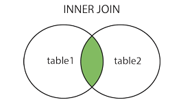
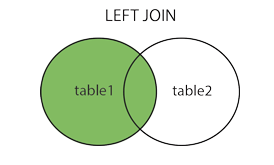
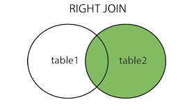
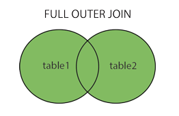

<h1 style="color:orange">Toán tử JOIN trong SQL</h1>

JOIN dùng để kết hợp các hàng từ 2 hay nhiều tables, dựa trên những cột liên quan giữa chúng.

    SELECT Orders.OrderID, Customers.CustomerName, Orders.OrderDate
    FROM Orders
    INNER JOIN Customers ON Orders.CustomerID=Customers.CustomerID;
[Kết quả](https://www.w3schools.com/sql/trysql.asp?filename=trysql_select_join) 
Hiển thi table mới với thứ tự các cột OrderID từ table Order, CustomerName của table Customers, cột OrderDate của table Orders. 
Dựa trên CustomerID của table Orders và table Customers trùng nhau.   
Table mới sẽ cho ra số hàng = đúng với số  hàng trong table có số hàng lớn hơn.

Các kiểu JOIN:
- INNER JOIN: Trả về kết quả khớp nhau ở cả hai table
- LEFT OUTER JOIN: Trả về tất cả kết quả ở bảng bên trái, và những kết quả matched của table bên phải.
- RIGHT OUTER JOIN: Trả về tất cả kết quả ở bảng bên phải, và những kết quả matched của table bên trái.
- FULL OUTER JOIN: Trả về tất cả kết quả ở cả hai table trái và phải.
 
<h2 style="color:orange">1. Inner JOIN</h2>
INNER JOIN trả về kết quả khớp nhau ở cả hai table

 

     SELECT column_name(s)
     FROM table1
     INNER JOIN table2
     ON table1.column_name = table2.column_name;

     SELECT Orders.OrderID, Customers.CustomerName
     FROM Orders
     INNER JOIN Customers ON Orders.CustomerID = Customers.CustomerID;
Hiển thị bảng mới với cột OrderID của table Order và cột CustomerName của table Customers. 

- INNER JOIN 3 bảng:

     SELECT Orders.OrderID, Customers.CustomerName, Shippers.ShipperName
     FROM ((Orders
     INNER JOIN Customers ON Orders.CustomerID = Customers.CustomerID)
     INNER JOIN Shippers ON Orders.ShipperID = Shippers.ShipperID);
<h2 style="color:orange">2. LEFT JOIN</h2>
LEFT OUTER JOIN trả về tất cả kết quả ở bảng bên trái(table 1), và những kết quả matched của table bên phải(table 2). Nếu không có kết quả nào từ bảng bên phải thì hiển thị là null.

 
     SELECT column_name(s)
     FROM table1
     LEFT JOIN table2
     ON table1.column_name = table2.column_name;

     SELECT Customers.CustomerName, Orders.OrderID
     FROM Customers
     LEFT JOIN Orders ON Customers.CustomerID = Orders.CustomerID
     ORDER BY Customers.CustomerName;
<h2 style="color:orange">3. RIGHT JOIN</h2>
LEFT OUTER JOIN trả về tất cả kết quả ở bảng bên phải(table 2), và những kết quả matched của table bên trái(table 1). Nếu không có kết quả nào từ bảng bên trái thì hiển thị là null.

 

      SELECT column_name(s)
      FROM table1
      RIGHT JOIN table2
      ON table1.column_name = table2.column_name;

      SELECT Orders.OrderID, Employees.LastName, Employees.FirstName
      FROM Orders
      RIGHT JOIN Employees ON Orders.EmployeeID = Employees.EmployeeID
      ORDER BY Orders.OrderID;
<h2 style="color:orange">4. FULL JOIN</h2>
FULL OUTER JOIN trả về tất cả kết quả ở cả hai table trái và phải.

 

      SELECT column_name(s)
      FROM table1
      FULL OUTER JOIN table2
      ON table1.column_name = table2.column_name
      WHERE condition;

      SELECT Customers.CustomerName, Orders.OrderID
      FROM Customers
      FULL OUTER JOIN Orders ON Customers.CustomerID=Orders.CustomerID
      ORDER BY Customers.CustomerName;
Lưu ý: FULL OUTER JOIN = FULL JOIN
<h2 style="color:orange">5. SELF JOIN</h2>
SELF JOIN là JOIN bình thường nhưng table tự JOIN với chính nó.

      SELECT column_name(s)
      FROM table1 T1, table1 T2
      WHERE condition;

      VD: SELECT A.CustomerName AS CustomerName1, B.CustomerName AS CustomerName2, A.City
      FROM Customers A, Customers B
      WHERE A.CustomerID <> B.CustomerID
      AND A.City = B.City
      ORDER BY A.City;
[Kết quả](https://www.w3schools.com/sql/trysql.asp?filename=trysql_select_join_self)
<h2 style="color:orange">6. CROSS JOIN</h2>
https://www.mysqltutorial.org/mysql-cross-join/