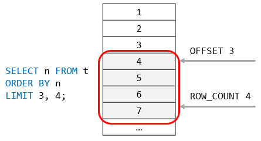

<h1 style="color:orange">Hàm LIMIT</h1>
Hàm limit dùng để hiển thị kết quả

Syntax:

      SELECT 
       select_list
      FROM
      table_name
     LIMIT [offset,] row_count;
Trong đó:
- `offset` thể hiện hàng đầu tiên trả về. off set của hàng đầu tiên là 0, không phải 1.
-  `rowcount` thể hiện số hàng trả về
 
ví dụ ở đây, offset bằng 3 (tức hàng thứ 4), rowcount bằng 4
<h2 style="color:orange">Ví dụ</h2>

      SELECT 
      customerNumber, 
       customerName, 
      creditLimit
      FROM
      customers
      ORDER BY creditLimit DESC
      LIMIT 5;
Trả về kết quả của 5 hàng customerNumber, customerName, creditLimit với creditLimit lớn nhất.
 

      SELECT 
        customerNumber, 
        customerName, 
        creditLimit
      FROM
        customers
      ORDER BY creditLimit
      LIMIT 5;
Trả về kết quả của 5 hàng customerNumber, customerName, creditLimit với creditLimit nhỏ nhất.
 
TUy vậy, giá trị thấp nhất có thể bằng nhau và có thể có nhiều hơn 5 kết quả nhỏ nhất -----> xảy ra rối

Có thể chỉnh lại bằng cách sắp xếp thêm giá trị cột khác

      SELECT 
       customerNumber, 
       customerName, 
       creditLimit
      FROM
        customers
      ORDER BY 
        creditLimit, 
        customerNumber
     LIMIT 5;
 
