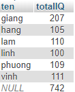

<h1 style="color:orange">ROLL UP</h1>
Roll up là hàm con của GROUP BY. 

    SELECT 
    select_list
    FROM 
    table_name
    GROUP BY
    c1, c2, c3 WITH ROLLUP;

Cho bảng:
 
Ví dụ với sinh viên:

     SELECT DISTINCT
    `ten` , SUM(`IQ`) totalIQ
    FROM
    `sinhvien`
    GROUP BY 
    `ten` WITH ROLLUP;
Kết quả: 
 

Nếu GROUP BY hơn 1 trường dữ liệu: Thêm 1 cột score:
 

    SELECT DISTINCT
    `ten` , `IQ`, SUM(`score`) totalscore
    FROM
     `sinhvien`
    GROUP BY 
    `ten`, `IQ` WITH ROLLUP;
Kết quả sẽ như sau: 
 
Vậy là sau khi GROUP BY thì score đã tự động được cộng dồn và ROLLUP sử dụng kết quả đó để thực hiện.