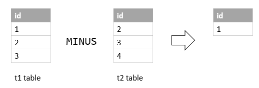

<h1 style="color:orange">Minus</h1>
Hàm Minus so sánh kết quả từ 2 query và trả về hàng mà có trong query 1 nhưng không có trong query 2.

Syntax:

    SELECT select_list1 
    FROM table_name1
    MINUS 
    SELECT select_list2 
    FROM table_name2;
- Số thứ tự và cột ở select_list1 và select_list2 phải giống nhau.
- data types ở cả hai cột trong 2 query phải giống nhau (kiểu int, float, date, year, ...)
<h2 style="color:orange">1. Ví dụ</h2>
Tạo 2 bảng 

    CREATE TABLE t1 (
    id INT PRIMARY KEY
    );

    CREATE TABLE t2 (
    id INT PRIMARY KEY
    );

    INSERT INTO t1 VALUES (1),(2),(3);
    INSERT INTO t2 VALUES (2),(3),(4);
Dùng lệnh MINUS:

    SELECT id FROM t1
    MINUS
    SELECT id FROM t2;
Kết quả trả về id có ở table1 nhưng không có trong table2

Lưu ý: Microsoft SQL và PostgreSQL sử dụng hàm EXCEPT thay cho MINUS với chức năng tương tự.
<h2 style="color:orange">2. Minus trong MySQL</h2>
Tuy vậy, MySQL không hỗ trợ hàm Minus nên có thể dùng LEFT JOIN để thay thế:

    SELECT 
    select_list
     FROM 
    table1
    LEFT JOIN table2 
    ON join_predicate
    WHERE 
    table2.column_name IS NULL;
Ví dụ:
    
    SELECT 
      t1.id
    FROM
    t1
    LEFT JOIN
    t2 ON t1.id=t2.id
    WHERE
    t2.id IS NULL;