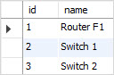
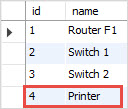
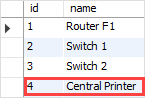

<h1 style="color:orange">Insert on duplicate key update</h1>
Nếu insert 1 giá trị vào cột PRIMARY KEY hoặc UNIQUE thì MySQL sẽ hiển thị lỗi.

Insert on duplicate key về cơ bản giống lệnh update, tuy vậy cách thức hoạt động khác nhau.
<h2 style="color:orange">Ví dụ</h2>
Tạo bảng devices có cột id và name

    CREATE TABLE devices (
    id INT AUTO_INCREMENT PRIMARY KEY,
    name VARCHAR(100)
    );
Insert vào các giá trị

    INSERT INTO devices(name)
    VALUES('Router F1'),('Switch 1'),('Switch 2');

Insert vào thêm 1 giá trị Printer

    INSERT INTO devices(name) 
    VALUES ('Printer');

    INSERT INTO devices(id,name) 
    VALUES 
    (4,'Printer') 
    ON DUPLICATE KEY UPDATE name = 'Central Printer';
