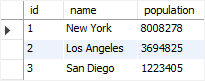
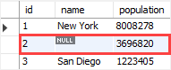

<h1 style="color:orange">Replace</h1>
Hàm REPLACE hoạt động tương tự hàm update. 
Tuy vậy những giá trị không thêm vào hàm REPLACE đặt là NULL.
<h2 style="color:orange">Ví dụ</h2>
Tạo bảng với 3 cột 

      CREATE TABLE cities (
    id INT AUTO_INCREMENT PRIMARY KEY,
    name VARCHAR(50),
    population INT NOT NULL
    );
Insert

     INSERT INTO cities(name,population)
     VALUES('New York',8008278),
	  ('Los Angeles',3694825),
	  ('San Diego',1223405);

     REPLACE INTO cities(id,population)
     VALUES(2,3696820);
 
Gía trị 2 không có nên để là null

Thêm giá trị vào table

     REPLACE INTO cities
     SET id = 4,
     name = 'Phoenix',
     population = 1768980;
