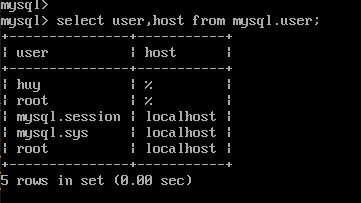
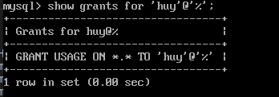
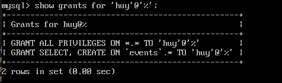

<h1 style="color:orange">User trong MySQL</h1>
Ngay khi bắt đầu sử dụng MySQL database, bạn sẽ được cung cấp username và password. Những thông tin đăng nhập này sẽ cho bạn quyền “root access”. Một user root có toàn quyền truy cập tới database và bảng trong databases.

Nhưng qua thời gian, bạn sẽ cần cho quyền truy cập tới database tới một người khác mà không cho phép họ sử dụng toàn quyền. Ví dụ, công ty thuê lập trình viên để bảo trì database, nhưng không muốn họ có quyền xóa hoặc chỉnh sửa những thông tin nhạy cảm, sẽ cần cung cấp một thông tin đăng nhập không phải root user. Cách này, công ty có quyền kiểm soát lập trình viên có thể và không thể làm gì với dữ liệu.

Để xem mysql có những user nào dùng lệnh:

      SELECT user,host FROM mysql.user;

<h2 style="color:orange">1. Tạo user</h2>

1. Đăng nhập vào MySQL bằng user root:

        # mysql -uroot -p
Nếu đăng nhập vào MySQL bằng user khác dùng

       # mysql -u'user_name' -p
2. Tạo user mới:

         mysql> CREATE USER 'new_user'@'localhost' IDENTIFIED BY 'password';
- new_user là tên user;
- password là mật khẩu để đăng nhập user đó.

3. Để gán toàn quyền của database cho user mới tạo, thực thi lệnh sau:

       mysql> GRANT ALL PRIVILEGES ON *.* TO 'new_user'@'localhost';
4. Để thay đổi ngay lập tức:

       mysql> FLUSH PRIVILEGES;
<h2 style="color:orange">2. Hiển thị quyền user</h2>

      SHOW GRANTS FOR 'user_name'@'localhost';

<h2 style="color:orange">3. Gán quyền user</h2>
Gán quyền user bằng câu lệnh:

    GRANT [permission type] ON [database name].[table name] TO ‘non-root’@'localhost’;

Trong đó,
1. Permission type là những quyền, có những quyền:
- ALL PRIVILEGES - Toàn quyền sử dụng những lệnh dưới.
- CREATE – Cho phép user tạo databases/tables
- SELECT – Cho phép user truy xuất data
- INSERT – Cho phép user tạo thêm dòng trong bảng
- UPDATE – Cho phép user chỉnh sửa các entry trong bảng
- DELETE – Cho phép user xóa entry trong bảng
- DROP – Cho phép user xóa hoàn toàn bảng/database
2. database name là tên database
3. table name là tên table

Ví dụ: 
1. muốn cung cấp toàn quyền cho user 'huy'@'localhost' cho 1 table trong 1 database nhất định.

       GRANT ALL PRIVILEGES ON events.potluck TO 'huy'@'localhost'
-events là tên database 
-potluck là tên table 

2. muốn cung cấp toàn quyền cho user 'huy'@'localhost' cho 1 database nhất định.

        GRANT ALL PRIVILEGES ON events.* TO 'huy'@'localhost'
-events là tên database

3. muốn cung cấp quyền select, create cho user 'huy'@'localhost' cho 1 database nhất định.
        
        GRANT CREATE, SELECT ON events.* TO 'huy'@'localhost'
<h2 style="color:orange">4. Thu quyền user</h2>
Muốn thu lại quyền từ user mysql. Từ quyền root

      REVOKE [permission type] ON [database name].[table name] FROM ‘non-root’@‘localhost’;
Cách họạt động tương tự lệnh GRANT

Lưu ý: mysql hoạt động theo lệnh từ trên xuống dưới trong bảng show grant. Ví dụ:
 
Trong hình Mysql đã có lệnh `GRANT ALL PRIVILEGES ON *.* TO 'huy'@'%' nên dù có gõ lệnh

PROVOKE SELECT, CREATE ON events.* TO 'huy'@'%' thì user 'huy'@'%' vẫn có thể select và create với database events.
