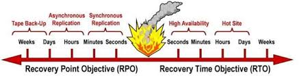

<h1 style="color:orange">RPO là gì</h1>

RPO (Recovery Point Object) là thời điểm phục hồi  
 

- Thời điểm ở đây là thời điểm cụ thể, ví dụ như 1 phút trước, 1 ngày trước, 1 tuần trước hoặc 1 tháng trước, là 1 thời điểm đã xảy ra và business họ muốn dữ liệu được phục hồi vào đúng thời điểm mà họ mong muốn.

Ví dụ như: Công ty ABC muốn hệ thống backup của họ có khả năng phục hồi dữ liệu 1 ngày trở về trước từ thời điểm cần phục hồi dữ liệu thì RPO là 1 ngày. Hay công ty muốn có thể khôi phục lại dữ liệu ở bất kỳ thời điểm nào thì RPO của họ là zero. 
 
<h1 style="color:orange">RTO là gì</h1>
RTO (Recovery time Object), là thời gian để phục hồi đến RPO chỉ định tính từ lúc chủ doanh nghiệp đưa ra yêu cầu.

Ví dụ như phòng nhân sự mất file tính lương và họ yêu cầu bạn trong vòng 1 tiếng phải phục hồi cho họ ngay, như vậy RTO = 1 giờ. 

Cũng như RPO, RTO cũng đóng vai trò tỷ lệ nghịch với chi phí, RTO càng nhỏ thì chí phí càng cao.

RPO, RTO lý tưởng = 0, tuy vậy 0 chỉ là con số lý tưởng, thực tế không có hệ thống nào trên thế giới đạt đến con số này.

- Thông thường RTO và RPO là cặp đôi đồng hành, thường RPO ngắn thì đòi hỏi RTO cũng ngắn, không có lý nào 1 doanh nghiệp yêu cầu bạn phục hồi dữ liệu và hệ thống cho tôi tính từ thời điểm sự cố xẫy ra và thời gian phục hồi cho phép là 1 tuần.

- Trong RTO vai trò năng lực của đội ngũ thực hiện công tác phục hồi hệ thống là cực kỳ quan trọng, đối với RPO bạn có thể set lịch để task backup tự động chạy, và công việc chính chỉ là monitoring thì RTO đòi hỏi bạn phải bắt tay vào restore, và việc nầy hết sức cẩn trọng và tỉ mỉ, đối với những hệ thống lớn chỉ cần 1 sai lầm nhỏ sẽ dẫn đến hậu quả vô cùng nghiêm trọng, đối với 1 hệ thống vừa và nhỏ việc bạn restore sai thời điểm sẽ làm cho mục đích của việc phục hồi dữ liệu không đúng như yêu cầu, thậm chí làm mất luôn những file đang có.
<h2 style="color:orange">RTO lớn và nhỏ thì kéo theo những gì cần quan tâm trong giải pháp backup?</h2>

- RTO càng nhỏ đòi hỏi hệ thống backup của bạn phải hoạt động real time, nghĩa là bên cạnh hệ thống production bạn đang sài thì phải có 1 hệ thống backup chạy song song. Đối với server có thể là cluster, đối với mặt dữ liệu có thể là backup file ra, hay backup hệ thống hệ điều hành ra 1 thiết bị lưu trữ khác. Chung quy là RTO chạy về 0 tương ứng với việc chi phí và nhân lực đầu tư để vận hành và duy trì hệ thống backup sẽ rất đắt đỏ.
- Đối với 1 số doanh nghiệp đòi hỏi RTO = 0, điển hình là các ngân hàng, các công ty cung câp service IT cho khách hàng với cam kết on time 24/24 kể cả động đất sóng thần. Với các doanh nghiệp loại nầy, thay vì họ chỉ tốn 1 triệu $ đầu tư cho hệ thống production chạy thì giờ họ sẽ tốn thêm 2, 3 triệu $ thậm chí nhiều hơn để đầu tư những site tương tự ở vị trí khác nhau và hệ thống backup chạy real time cùng production vận hành liên tục.
- Đối với nhiều công ty lớn ví dụ như google, microsoft, amazon, thì RTO của họ gần như là zero, và họ có những hệ thống backup của backup của backup, có nghĩa là nhiều lần backup, cùng 1 lúc ra lệnh thực thi ghi chép 1 file dữ liệu có thể được ghi và lưu trữ ở nhiều nơi khác nhau trên thế giới và việc backup cho các loại dữ liệu nầy hầu như real time. Nên bất kỳ thời điểm nào chúng ta cần phục hồi lại

=======> Tóm lại RTO = 0 tương ứng với việc ta phải đầu tư chi phí cực cao.
<h2 style="color:orange">Việc triển khai giải pháp backup cho doanh nghiệp thì RTO như thế nào là hợp lý?</h2>

- Nếu công ty bạn việc tương tác với khách hàng 24/24 ,1 giờ off time cũng gây thiệt hại lớn cho doanh nghiệp, thì chắc chắn khỏi phải bàn, RTO phải là zero.
- Việc tính toán RTO phải dựa trên tiêu chí là lượng dữ liệu mất quy ra bao nhiêu tiền, và đầu tư vào hệ thống backup có mang lại giá trị tương xứng hay không, ví dụ như bạn mất dữ liệu 1 ngày, thiệt hại tính ra là 1 triệu VNĐ, nhưng bạn tốn chi phí để duy trì hệ thống backup là 10 tr/ ngày thì chắc chắn là phải xem lại 2 yếu tố, 1 là RTO có phù hợp hay chưa, 2 hệ thống backup của bạn đầu tư có phù hợp với chi phí mà doanh nghiệp bạn tạo ra hay chưa. Và dĩ nhiên đứng về góc độ quản lý chủ doanh nghiệp họ phán ngay, thôi thì tao vứt 1 triệu còn hơn là mất 10 tr nuôi backup.
<h2 style="color:orange">RPO vs RTO và góc nhìn giải pháp</h2>

 
- Thông thường RTO và RPO là bộ đôi đi cùng với nhau để quyết định giá trị của 1 hệ thống backup và những giải pháp đi kèm.
- Với những hệ thống đòi hỏi RPO tính bằng 1 vài  phút đến 1 vài giây  thông thường người ta hay sử dụng những hệ thống Synchronous Replication (Nhân rộng đồng bộ) dữ liệu được đặt ở nhiều site khác nhau và đồng bộ liên tục.
- Với RPO được tính bằng 1 vài giờ đến 1 ngày thông thường người ta sử dụng Asynchronous Replication (Nhân rộng không đồng bộ). Dữ liệu được đặt ở nhiều site khác nhau và thời gian đồng bộ được tính bằng giờ, ngày.
- Đối với những hệ thống yêu cầu RPO không quá rush ( được tính bằng vài ngày cho đến 1 tuần) thì việc lưu trữ backup trên tape thường được sử dụng nhiều, thông thường sau khi hoàn thành task backup dữ liệu được lưu vào tape và đặt ở 1 nơi khác cách xa công ty ( thường là đặt trong các safe box tại  ngân hàng). 
-----> Việc đòi hỏi thời gian up-time 24/24 kể cả lúc sự cố xẫy ra (RTO=0) đòi hỏi bạn phải trang bị hệ thống HA ở nhiều site khác nhau, đối với việc HA thời gian down time hầu như là zero.

– Khi sự cố xẫy ra, việc phục hồi nguyên hệ thống được tính bằng nhiều giờ đến nhiều ngày thông thường hay dùng hot site.

+ Hot site là 1 nơi đặt cách xa công ty và có trang bị đầy đủ các hạ tầng tối thiểu để vận hành 1 hệ thống mà site chính đang có, bao gồm từ hạ tầng về công nghệ thông tin và nơi làm việc cho nhân viên và dĩ nhiên dữ liệu định kỳ vẫn được sync lên hot site.
+ Trong thời gian chuyện hoạt động tạm thời lên hot site, bạn tiến hành xây dựng lại site chính. Khi site chính đã phục hồi, công việc cần làm là sync dữ liệu từ hot site về site chính.
+ Đối với các công ty lớn thông thường hot site luôn nằm trong kế hoạch BCP (Business Continueus Plainning) của họ.