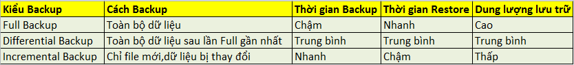

<h1 style="color:orange">Các kiểu back-up dữ liệu</h1>
<h2 style="color:orange">1. Full backup</h2>
Full Backup có nghĩa là backup toàn bộ dữ liệu đang có của bạn

- Ví dụ :
Bạn có một thư mục trong đó có 4 file dữ liệu : 1 2 3 4

Khi bạn cấu hình Full Backup thì phần mềm backup sẽ backup hết cả 4 file dữ liệu đó : 1 2 3 4

1. Ưu điểm của Full Backup :

Dễ dàng phục hồi lại dữ liệu. Khi cần phục hồi lại thì sẽ phục hồi lại toàn bộ dữ liệu của ngày Backup Full.
Tính an toàn cao cho dữ liệu.

2. Nhược điểm của Full Backup:
Thời gian backup lâu. Dữ liệu càng nhiều thì thời gian backup càng lâu 
Tốn dung lượng lưu trữ. Nếu mỗi ngày đều chạy full backup thì rất tốn dung lượng ổ cứng. Ví dụ một ổ cứng 1TB nếu backup full mỗi ngày thì trong 1 tuần sẽ cần 7TB lưu trữ. 
Chi phí đầu tư thiết bị lưu trữ lớn. 
<h2 style="color:orange">2. Differential Backup</h2>
Differential Backup là backup những gì thay đổi so với lần Full Backup gần nhất

Ví dụ : ( Tính trong trường hợp các file dữ liệu không có thay đổi )

Trong thư mục có 4 file dữ liệu : 1 2 3 4

Khi cấu hình backup: Full Backup vào Chủ Nhật, Differential Backup vào Thứ Hai, Thứ Ba, Thứ Tư, Thứ Năm, Thứ Sáu, và Thứ Bảy.

Nếu thứ 2 trong thư mục có thêm một file số 5 : 1 2 3 4 5 thì Differential backup sẽ sao lưu file số : 5

Nếu thứ 3 trong thư mục có thêm file số 6: 1 2 3 4 5 6 –> Differential backup sẽ sao lưu phần thay đổi so với ngày Full Backup gần nhất là chủ nhật nên sẽ sao lưu file số 5 6

Nếu thứ 4 thêm,sửa, xóa file 3 thì Differential backup sẽ sao lưu phần thay đổi so với ngày Full Backup gần nhất là chủ nhật nên sẽ sao lưu file số 5 6 3
Tương tự như vậy cho các ngày tiếp theo.

1. Ưu điểm của Differential Backup :

- Thời gian backup nhanh hơn 
- Dung lượng backup nhỏ hơn so với Full Backup. Tiết kiệm dung lượng lưu trữ 
- Tốc độ phục hồi dữ liệu sẽ nhanh hơn so với Incremental Backup 
2. Nhược điểm của Differential Backup :

- Khi cần khôi phục dự liệu cần có 2 bản backup: 
1 File Full Backup lần gần nhất và 1 File Differential Backup vào thời điểm cần restore

Trường hợp cụ thể như ở ví dụ:

Giả sử bạn cần restore file về thời điểm Thứ Ba – bạn cần có file Full Backup của Chủ Nhật và Differential backup của Thứ Ba
<h2 style="color:orange">3. Incremental Backup</h2>
Incremental Backup là backup những gì thay đổi so với lần Incremental Backup gần nhất

Ví dụ: ( Tính trong trường hợp các file dữ liệu không có thay đổi )

Trong thư mục có 4 file dữ liệu : 1 2 3 4

Khi cấu hình backup: Full Backup vào Chủ Nhật, Incremental Backup vào Thứ Hai, Thứ Ba, Thứ Tư, Thứ Năm, Thứ Sáu, và Thứ Bảy.

Nếu Thứ 2 trong thư mục có thêm một file số 5 : 1 2 3 4 5 thì Incremental Backup sẽ sao lưu file số : 5

Nếu Thứ 3 trong thư mục có thêm file số 6: 1 2 3 4 5 6 –> Incremental Backup sẽ sao lưu phần thay đổi so với ngày Incremental Backup gần nhất là Thứ 2 nên sẽ sao lưu file số 6

Nếu Thứ 3 trong thư mục thêm, sửa, xóa file số 3: 1 2 4 5 6 –> Incremental Backup sẽ sao lưu phần thay đổi so với ngày Incremental Backup gần nhất là Thứ 3 nên sẽ sao lưu file số 3

1. Ưu điểm của Incremental Backup :

- Thời gian backup nhanh nhất
- Dung lượng backup bé nhất
2. Nhược điểm của Incremental Backup :

Khi cần khôi phục dữ liệu phải có đủ các bản backup: 
1 File Full backup lần gần nhất và tất cả các File Incremental  Backup từ thời điểm Full Backup đến thời điểm cần restore 
Thời gian Restore lâu hơn so với Differential Backup.

- Trường hợp cụ thể như ở ví dụ :

Giả sử bạn cần restore file về thời điểm Thứ Ba – bạn cần có file Full Backup của Chủ Nhật và Incremental backup của Thứ Hai và Incremental backup của Thứ Ba

Bảng so sánh:

Vì những ưu điểm và nhược điểm của từng cách backup. Tùy theo hiện trạng hệ thống bạn có thể chọn cho mình giải pháp tối ưu nhất.

Giải pháp được các nhà backup khuyến cáo nên lựa chọn thường như sau :

Full Backup hàng tháng.

Differential Backup hàng tuần.

Incremental Backup hàng ngày.
<h2 style="color:orange">4. Synthetic Backup</h2>
Từ tiếng Anh "synthetic" có nghĩa là “tổng hợp”, ý tưởng của phương pháp mới này là file đã được thu thập không phải là một copy trực tiếp của bất kỳ file đã tạo trước hoặc file hiện hành nào. Thay vào đó, một file "synthetic" là hợp nhất của các file gốc. 

Ví dụ: một synthetic back up thường là tổng hợp của 1 file full backup và 1 file differential. 

Synthetic backup có tác dụng khi hê thống không cho phép có đủ thời gian cho 1 bản full back up. Mục đích của synthetic back up là để thực hiện sao lưu nhanh chóng và giảm chi phí và thời gian cho việc phục hồi dữ liệu.
<h2 style="color:orange">5. So sánh full backup và Synthetic Backup</h2>
Không như full backup hay incremental backup, dữ liệu không được lấy thằng từ nguồn để tạo ra 1 full backup

Giả sử ta tạo 1 full back up vào ngày Chủ Nhật và các incremental backup từ thứ 2 đến thứ 7. Sau đó, vào ngày Chủ Nhật tiếp theo, synthetic backup sẽ tổng hợp bản full backup và các incremental backup để tạo ra 1 bản giống hệt tổng hợp cả full và incremental mà không copy thằng từ nguồn. Sau đó, các bản full và incremental trước có thể xóa bỏ. Sau đó từ thứ hai trở đi, sẽ lặp lại tiến trình.

Gỉa sử, cần khôi phục nguồn hồm thứ 4, cần thêm bản synthetic backup hôm chủ nhật tuần trước và bản incremental backup từ thứ 2 và thứ 3 để khôi phục dữ liệu về sáng thứ 4.

Sự khác biệt lớn nhất là phần lớn tiến trình backup diễn ra ở backup repository thay vì từ nguồn. Điều này giải phóng việc sử dụng tài nguyên trên máy chủ / nguồn của bạn và bỏ qua việc phải sao chép một lượng lớn dữ liệu qua mạng xảy ra khi bạn kéo một bản sao lưu đầy đủ đang hoạt động.

Khác biệt thứ hai là sau lần full backup đầu tiên, bạn sẽ không bao giờ phải tạo một bản full backup thứ hai từ nguồn. Cải thiện đáng kể hiệu năng khi muốn khôi phục thì cần ít bản incremental backup hơn.