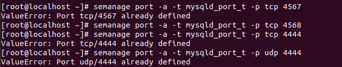
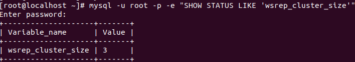
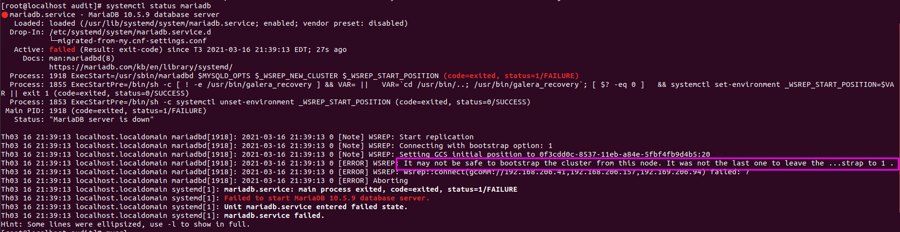
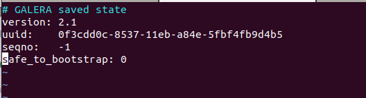

<h1 style="color:orange">Cài đặt galera 3 node trong mariadb</h1>
Chuẩn bị : 3 máy

- Máy 1 (node1): 192.168.206.41
- Máy 2 (node2): 192.168.206.157
- Máy 3 (node3): 192.168.206.94
<h2 style="color:orange">1. Cài mariadb trên cả 3 máy</h2>

Nếu như cả 3 máy đã có mariadb, vì galera dựa trên `rsync`, cần phải cài thêm `policycoreutils-python` cho những bước sau và để điều khiển SELinux:

    # sudo yum install rsync policycoreutils-python
Lệnh này sẽ xác nhận cả 3 máy có phiên bản mới nhất của rsync và policycoreutils-python, nếu không sẽ bắt cài.
<h2 style="color:orange">2. Cấu hình file config trên cả 3 máy</h2>

1. Trên node1 (192.168.206.41):

       # vim /etc/my.cnf.d/server.cnf

    
    [mysqld]
    binlog_format=ROW
    default-storage-engine=innodb
    innodb_autoinc_lock_mode=2
    bind-address=0.0.0.0

    # Galera Provider Configuration
    wsrep_on=ON
    wsrep_provider=/usr/lib64/galera-4/libgalera_smm.so

    # Galera Cluster Configuration
    wsrep_cluster_name="test_cluster"
    wsrep_cluster_address="gcomm://192.168.206.41,192.168.206.157,192.168.206.94"

    # Galera Synchronization Configuration
    wsrep_sst_method=rsync

    # Galera Node Configuration
    wsrep_node_address="192.168.206.41"
    wsrep_node_name="node1"

Trong đó :
- `wsrep_cluster_address`: Danh sách các node thuộc Cluster, sử dụng địa chỉ IP (Trong bài lab, sử dụng dải IP Replicate 192.168.206.41, 192.168.206.157, 192.168.206.94)
- `wsrep_cluster_name`: Tên của cluster
- `wsrep_node_address`: Địa chỉ IP của node đang thực hiện
- `wsrep_node_name`: Tên node

2. Trên những node còn lại (192.168.206.157, 192.168.206.94):

       # vim /etc/mysql/my.cnd.d/server.cnf
Tương tự node1, tuy vậy thay đổi 2 dòng:

    . . .
    # Galera Node Configuration
    wsrep_node_address="This_Node_IP"
    wsrep_node_name="This_Node_Name"
    . . .
<h2 style="color:orange">2. Cấu hình firewall trên 3 máy</h2>

- Galera cần các port 4444, 4567, 4568 để hoạt động.
- Mariadb cần port 3306 để hoạt động

      # firewall-cmd --permanent --zone=public --add-port={3306,4444,4567,4568}/tcp
      # firewall-cmd --permanent --zone=public --add-port=4567/udp
Add các địa chỉ các node vào firewall

      # firewall-cmd --permanent --zone=public --add-source=192.168.206.41/32
      # firewall-cmd --permanent --zone=public --add-source=192.168.206.157/32
      # firewall-cmd --permanent --zone=public --add-source=192.168.206.94/32
      # firewall-cmd --reload
<h2 style="color:orange">3. Cấu hình SELinux trên 3 máy</h2>

Cấu hình SELinux cho các port:

    semanage port -a -t mysqld_port_t -p tcp 4567
    semanage port -a -t mysqld_port_t -p udp 4567
    semanage port -a -t mysqld_port_t -p tcp 4568
    semanage port -a -t mysqld_port_t -p tcp 4444
Note: Nếu nhận được 'ValueError' có nghĩa là SELinux đã set trên những port này 
 

Nhập lệnh :

    sudo semanage permissive -a mysqld_t
Dừng mariadb

    sudo systemctl stop mariadb

1. Trên node 1(192.168.206.41):

       sudo galera_new_cluster
Tạo database và bảng cho mục đích cố định khi log SST:

       # mysql -u root -p -e 'CREATE DATABASE selinux;
       > CREATE TABLE selinux.selinux_policy (id INT NOT NULL AUTO_INCREMENT, PRIMARY KEY(id));
       > INSERT INTO selinux.selinux_policy VALUES ();'
2. Chạy mariadb trên 2 node còn lại:
       
       sudo systemctl start mariadb
Để tạo IST events, trên 3 node chạy:

       mysql -uroot -p -e 'INSERT INTO selinux.selinux_policy VALUES ();'
Kiểm tra 

       mysql> show status like 'wsrep_cluster_size';
 

<h2 style="color:orange">4. Nếu tắt mariadb</h2>
Khởi động lại cluster theo trình tự.

Lưu ý : Khi thoát node nào cuối cùng trong cluster thì khi start lại cluster phải start node đó đầu tiên bằng: galera_new_cluster. Ví dụ ở đây thoát node 3 cuối cùng trong cluster.
1. Node3:

       # galera_new_cluster
2. Node1,2:
       
       # systemctl start mariadb
3. Nếu không phải là node cuối cùng khởi động cluster sẽ xảy ra lỗi như:
- cannot connect to mysql.sock
 
------> kiểm tra xem galera có chạy bthg

Khi bật node đầu tiên lên, mariadb sẽ dựa vào file config để xem node nào đang online và tương tự các node kia cũng vậy -----> tự động join vào cluster.

4. Trường hợp cả 3 máy sập cùng 1 lúc ----> không biết node nào là node tắt cuối cùng.
https://dba.stackexchange.com/questions/151941/how-to-restart-mariadb-galera-cluster

Vào file trên 1 node bất kì

    vim /var/lib/mysql/grastate.dat
và đổi dòng safe_to_bootstrap từ 0 thành 1
 
Sau đó có thể galera_new_cluster bình thường trên chính node đó.

Sau khi galera_new_cluster trên node đó thì dòng safe_to_boostrap trong file tự động đổi về` 0; nếu muốn start galera chỉ định thì phải vim vào để đổi lại.