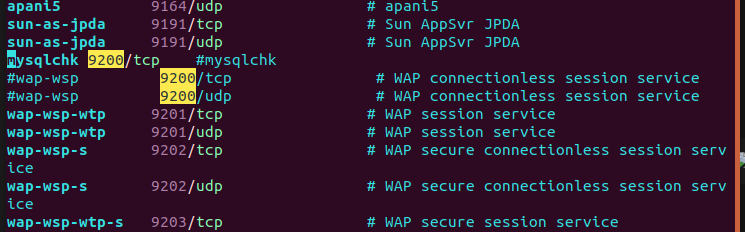
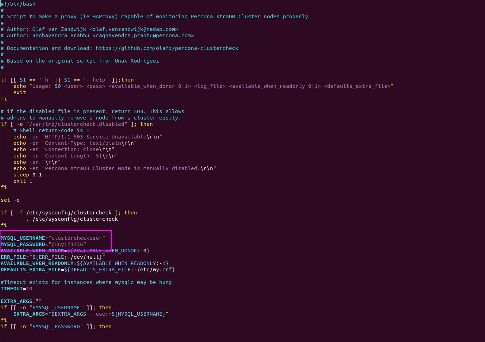
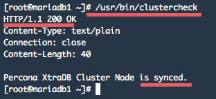
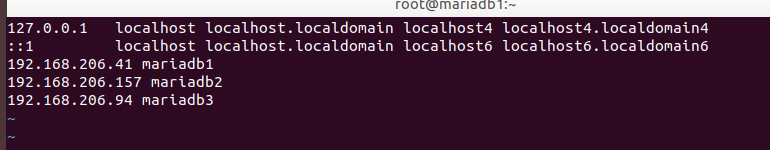
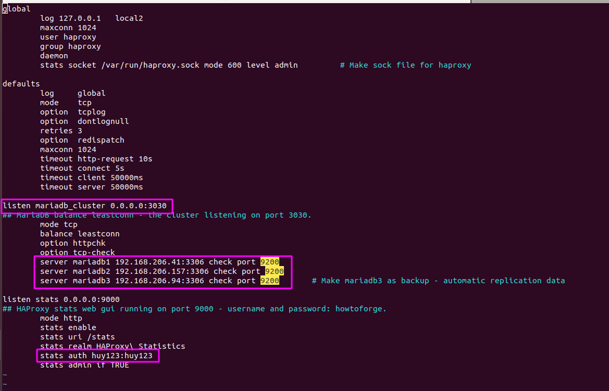
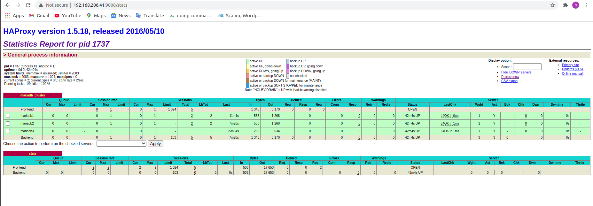
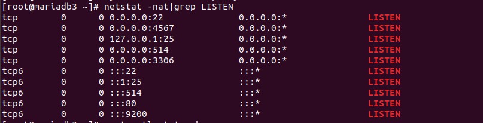
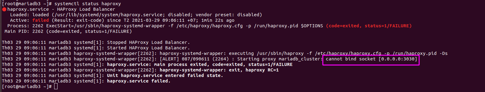

<h1 style="color:orange">Cài đặt HAProxy cho cluster galera mariadb</h1>
<h2 style="color:orange">1. Chuẩn bị</h2>
Chuẩn bị 3 máy trong cùng dải địa chỉ: 
192.168.206.41: mariadb1 và haproxy1 (haproxy cài chung trên mariadb1) 
192.168.206.157: mariadb2 và haproxy2 (haproxy cài chung trên mariadb2) 
192.168.206.94: mariadb3 
Cài đặt cluster galera trên 3 server có mariadb đã cho sẵn. 
Cài đặt trên phiên bản CentOS7 3.10.0-1160.11.1, Mariadb 10.5.9, haproxy 1.5.18-9

Lưu ý những bước sau chỉ cấu hình trên haproxy server, không phải trên mariadb server
<h2 style="color:orange">2. Cài clustercheck (xinetd)</h2>
Xinted cũng thực hiện các chức năng: điều khiển các kết nối mạng đến hệ thống. File config của Xinetd sẽ quy định các service mà xinetd quản lý. Xinetd khởi chạy cùng với thời gian khởi chạy hệ thống và nằm yên (chạy daemon) cho tới khi có yêu cầu kết nối được gửi tới. Khi một request gửi tới một port được quản lý bởi Xinetd nó sẽ gửi request này tới server tương ứng mà nó quản lý, theo những quy định riêng của nó.

Vì vậy, Chúng ta cóp thể goi xnetd như là một siêu máy chủ 
-------> xinetd hỗ trợ haproxy quản lý và truy xuất dữ liệu DB

    # yum -y install MariaDB-Galera-server MariaDB-client galera rsync xinetd percona-toolkit precona-xtrabackup xinetd wget
2. Tải về file script của clustercheck

       # wget https://raw.githubusercontent.com/olafz/percona-clustercheck/master/clustercheck
Phân quyền execute cho script

       # chmod +x clustercheck
       # mv clustercheck /usr/bin/ (chuyển vào file thực thi người dùng)
3. Tạo file xinetd script để chạy clustercheck

       # vim /etc/xinetd.d/mysqlchk
và paste

       # default: on
       # description: mysqlchk
       service mysqlchk
       {
        disable = no
        flags = REUSE
        socket_type = stream
        port = 9200             # This port used by xinetd for clustercheck
        wait = no
        user = nobody
        server = /usr/bin/clustercheck
        log_on_failure += USERID
        only_from = 0.0.0.0/0
        per_source = UNLIMITED
       }
4. Thêm clustercheck vào service list
      
       # vim /etc/services
Tìm đến dòng 10101 và sửa thành :

       mysqlchk        9200/tcp                # mysqlchk
 
       #wap-wsp         9200/tcp                # WAP connectionless session service
       #wap-wsp         9200/udp                # WAP connectionless session service

     # systemctl start xinetd
Để chạy clustercheck, phải tạo user mới trong Mariadb. Tạo user mới và phân quyền trong mariadb

     # mysql -u root -p
     > CREATE USER 'clustercheckuser'@'localhost' IDENTIFIED BY 'password';
     > GRANT PROCESS ON *.* TO 'clustercheckuser'@'localhost' IDENTIFIED BY 'clustercheckpassword!' ;
     exit;
Lưu ý: phải vào file clustercheck để khai báo user và password vừa mới tạo để file clustercheck chạy.  

Tại bước này, tất cả mariadb đã được sync

      # /usr/bin/clustercheck
sẽ hiện kết quả 
 
Đảm bảo code là 200 
nếu là 503 thì là lỗi, chưa được
<h2 style="color:orange">5. Cài đặt firewall</h2>
Cài đặt firewall trên tất cả server(haproxy và mariadb)

    # firewall-cmd --permanent --add-port=3306/tcp
    # firewall-cmd --permanent --add-port=4567/tcp
    # firewall-cmd --permanent --add-port=873/tcp
    # firewall-cmd --permanent --add-port=4444/tcp
    # firewall-cmd --permanent --add-port=9200/tcp
Trong đó: 
- 3306: dùng cho MySQL/MariaDB client connections.
- 4567 = Galera Cluster replication traffic.
- 873  = Rsync ports.
- 4444 = For all other State Snapshot Transfer (SST).
- 9200 = xinetd - clustercheck.
<h2 style="color:orange">4. Cài haproxy</h2>

1. Vào file /etc/hosts trên haproxy khai báo tên các DB

        # vim /etc/hosts

      # yum install -y haproxy
2. Tùy chỉnh file rsyslog
      
        # vim /etc/rsyslog.conf
Uncomment UDP port

      # Provides UDP syslog reception
      $ModLoad imudp
      $UDPServerRun 51
----> save file
3. Thêm file cấu hình haproxy vào rsyslog

        # vi /etc/rsyslog.d/haproxy.conf
paste vào các cấu hình
     
      local2.=info     /var/log/haproxy-access.log
      local2.notice    /var/log/haproxy-info.log
      :wq!
      -----> # systemctl restart rsyslog
4. Tạo file config haproxy
- Back up file haproxy config có sẵn

      # cd /etc/haproxy/
      # mv haproxy.cfg haproxy.cfg.orig
      # vim /etc/haproxy/haproxy.cfg
paste config sau vào file haproxy.cfg

      global
        log 127.0.0.1   local2
        maxconn 1024
        user haproxy
        group haproxy
        daemon
        stats socket /var/run/haproxy.sock mode 600 level admin         # Make sock file for haproxy
 
      defaults
        log     global
        mode    http
        option  tcplog
        option  dontlognull
        retries 3
        option  redispatch
        maxconn 1024
        timeout connect 5000ms
        timeout client 50000ms
        timeout server 50000ms
 
      listen mariadb_cluster 0.0.0.0:3030
      ## MariaDB balance leastconn - the cluster listening on port 3030.
        mode tcp
        balance leastconn
        option httpchk
        option tcp-check
        server mariadb1 192.168.206.41:3306 check port 9200
        server mariadb2 192.168.206.157:3306 check port 9200
        server mariadb3 192.168.206.94:3306 check port 9200     # Make mariadb3 as backup - automatic replication data
 
      listen stats 0.0.0.0:9000
      ## HAProxy stats web gui running on port 9000 - username and password: howtoforge.
        mode http
        stats enable
        stats uri /stats
        stats realm HAProxy\ Statistics
        stats auth huy123:huy123
        stats admin if TRUE

* Lưu ý: thay đổi địa chỉ IP và ID, password phù hợp.
- Trong 1 số tài liệu sẽ không có dòng: option tcp-check gây ra lỗi không có server
- Port 3030 là port cân bằng tải Mariadb, có thể truy cập trên tất cả Mariadb với cân bằng tải IP và port đó.
- Port 9000 là port cho web-gui, cho phép HAproxy quản trị trong browser.

      # firewall-cmd --permanent --add-port=9000/tcp
      # firewall-cmd --permanent --add-port=3030/tcp
      # firewall-cmd --reload
      # systemctl start haproxy
<h2 style="color:orange">5. Kiểm tra haproxy</h2>
<h3 style="color:orange">5.1. Truy cập HAproxy web-gui</h3>
http://192.168.206.41:9000/stats

<h3 style="color:orange">5.2. Sử dụng lệnh</h3>
Từ server haproxy vào truy xuất tới mariadb của các server

      # mysql -u root -p -h 192.168.206.41 -P 3030 -e "select Host, User, Password from mysql.user"
Lưu ý: 192.168.206.41 là địa chỉ của haproxy1, không phải địa chỉ của mariadb1.

Đoạn này phải tạo user 'root'@'%' trên DB.
<h2 style="color:orange">6. Cấu hình SELinux</h2>
Ở đây tuy truy cập vào web-gui haproxy hoạt động bình thường nhưng khi truy cập tới DB thì lại không truy xuất được dữ liệu. Lý do là do SElinux chặn đường haproxy và chặn port.

Kiểm tra các port được lắng nghe trên haproxy server

      # netstat -nat|grep LISTEN
 
 

Cấu hình SElinux định nghĩa port
      
      # sudo yum install rsync policycoreutils-python
      # semanage port -a -t http_port_t -p tcp 3030
Cấu hình SElinux mở port
      
      # semanage port -m -t http_port_t -p tcp 3030
Kiểm tra lại

      # netstat -nat|grep LISTEN
Lúc này SElinux đã mở port nhưng vẫn cấm haproxy, sử dụng lệnh

      # setsebool -P haproxy_connect_any 1
cho phép SELinux bỏ chặn haproxy