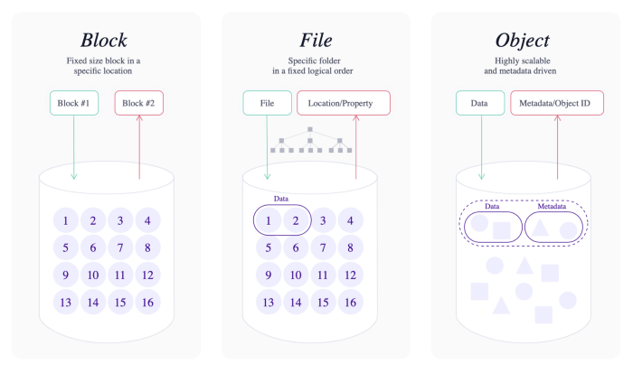
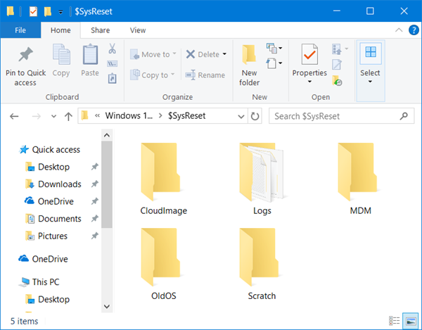
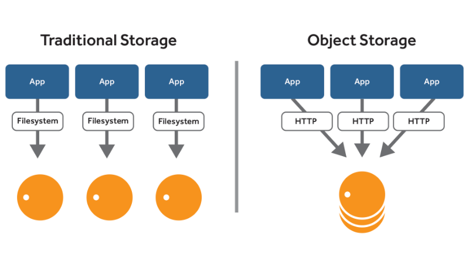
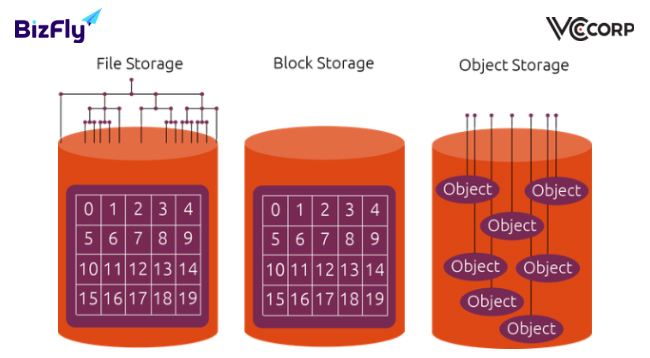
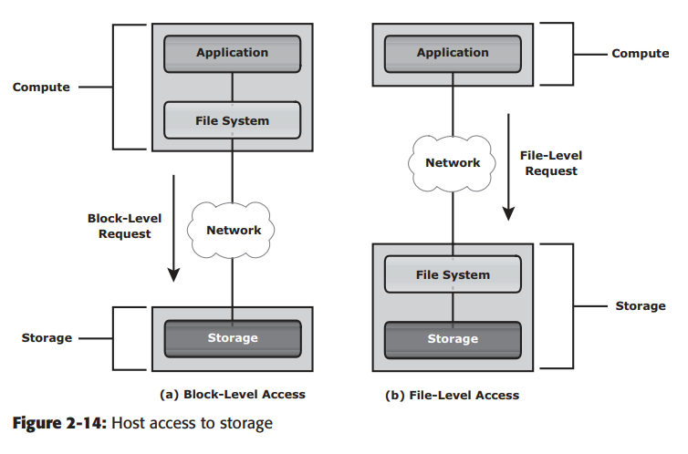
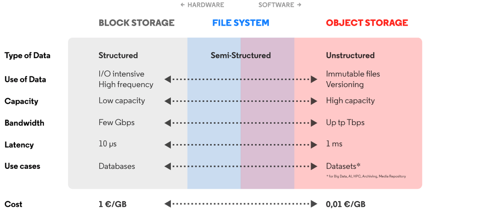

<h1 style="color:orange">Storage</h1>

 
<h2 style="color:orange">1. File Storage</h2>

 
File storage là một giải pháp lưu trữ dữ liệu dưới dạng các files và đại diện nó tới người dùng cuối như là kiến trúc thư mục theo tầng. Lợi ích chính đó là việc cung cấp một giải pháp thân thiện người dùng và lấy lại files. Để xác định vị trí trong file storage chúng ta cần đường dẫn đầy đủ của file. Ví dụ /home/images/beach.jpeg.

File storage là kiểu lưu trữ lâu đời nhất và phổ biến nhất cho hệ thống DAS và NAS.
<h2 style="color:orange">2. Block Storage</h2>
Block storage phân dữ liệu thành các khối (block) và lưu chúng như là các mảnh riêng biệt. Mỗi khối đều có định dang duy nhất. Như vậy một phần dữ liệu có thể lưu trữ trong môi trường Linux và phần khác có thể lưu trữ trên môi trường Windows.

Block storage thường được cấu hình để nới lỏng sự phụ thuộc môi trường của người dùng và phân chúng ra làm nhiều phần có thể giúp việc lấy dữ liệu tốt hơn. Bất cứ khi nào dữ liệu được yêu cầu, phần mềm storage dữ tập hợp phần khối dữ liệu và gửi chúng cho người dùng.

Block storage thường được triển khai trong môi trường SAN.
<h2 style="color:orange">3. Object Storage</h2>

 
Object storage là một trong những hệ thống storage gần đây nhất. Nó được tạo ra ở trong ngành công nghiệp điện toán đám mây với yêu cầu lưu trữ một lượng lớn dữ liệu phi cấu trúc. Nó là cấu trúc trong đó các files được chia thành các mảnh và được trải ra trên phần cứng. Trong object storage , dữ liệu được chia thành các đơn vị nhỏ gọi là objecst thay vì lưu trữ như là các files hoặc là block trên server.

Object Storage hoạt động như là một đơn vị mô-đun. Mỗi trong số chúng là một kho tự quản lý bao gồm:

- Dữ liệu: ảnh, video, dữ liệu backup của website
- Một định danh duy nhất, cho phép object được tìm thấy trong một hệ thống phân tán
- Metadata mô tả dữ liệu : tác giả, quyền, ngày tháng dữ liệu được tạo.

Để lấy dữ liệu, hệ thống storage sử dụng metadata và định danh, điều này cho phép việc tải hơn và cho phép quản trị viên áp dụng các điều khoản khác nhau để tìm kiếm.

Object storage yêu cầu một HTTP API đơn giản. Object storage mang lại sự hiệu quả về mặt chi phí. Bạn chỉ chi trả những gì bạn sử dụng. Nó có thể scale một cách dễ dàng, và là một sự lựa chọn tuyệt vời cho các hệ thống lưu trữ đám mây công cộng. Đó là hệ thống storage phù hợp với các loại dữ liệu động.
<h2 style="color:orange">4. So sánh File-block-object</h2>

 

Thông thường, data có thể truy cập qua network qua những kiểu sau: block level, file level, object level. 
Nhìn chung, application yêu cầu data từ file system (OS) khác file level; bằng cách chỉ ra tên file và vị trí. File system lấy tên và vị trí để tìm đến địa chỉ block của data (logical block level) và gửi yêu cầu đến storage. Storage gửi data

File:
- Lưu trữ thư mục dạng file, có thể thấy trong window hay trong linux (thư mục dạng cây)
- Khi client dùng file storage từ xa thì client sẽ mount 1 file từ storage để sử dụng qua internet (có thể là nfs hay samba trên centos7)
- Trong file-level, file system được tạo ở storage và file request được gửi qua internet (2.14-b)

Block:
- Tương tự file, tuy vậy client không chỉ mount 1 point mà mount 1 ổ từ storage (có thể 1 ổ vật lý hoặc 1 ổ ảo, nhưng thường là ổ ảo) gọi là block. Dung lượng 1 block thường chỉ có thể tới vài Tb. Ví dụ như iSCSI.
- Với block-level, file system được tạo ở host và dữ liệu truy cập qua network ở block level. Trong trường hợp này, dữ liệu thô hay logical volume được mount tới host để tạo file system (2.14-a)

Hình dưới só sánh sự khác nhau giữa file-level và block-level: 
 

Object:
- Sử dụng http, https để lưu trữ. Từ những app trên client, truyền tải dữ liệu vào app ----> app sẽ chuyển dữ liệu đến storage qua đường http hoặc https. Ví dụ thực tế là google drive, fshare, ...

 
So sánh khả năng hoạt động giữa 3 loại.

Block:
- I/O cao
- Khả năng lưu trữ bị giới hạn (vài tb)
- băng thông vài Gbps
- Latency thấp, chỉ 10^-6 s -----> tốc độ hoạt động tốt nhất
- giá thành cao hơn nhiều object storage

Object:
- file cố định, hỗ trợ versioning
- versioning là kiểu lưu trữ tiết kiệm tài nguyên. Ví dụ trong kiểu lưu trữ file hay block, nếu thay đổi 1 file thì nó sẽ biến thành 1 file hoàn toàn mới với mã băm khác. Tuy vậy, trong object storage thì nó lưu file và lưu phần thay đổi ------> tiết kiệm bộ nhớ.
- Khả năng lưu trữ cao hơn gấp nhiều lần block storage (khả năng scale lớn, đây cũng là lý do lớn nhất ng ta dùng object)
- Băng thông vài Tb
- Latency cao ------> tốc độ hoạt động thấp
- Giá rẻ

File:
- Là kiểu lưu trữ trung lập giữa 2 loại trên với giá thành cũng trung bình.
- Về khả năng lưu trữ thì trên storage cấp càng nhiều tài nguyên cho file thì khả năng lưu trữ càng cao
- Tốc độ đọc/ghi bằng với kiểu block
<h2 style="color:orange">5. Ứng dụng trong NAS-DAS-SAN</h2>

- NAS sử dụng nfs hay samba (lưu trữ kiểu file-level)
- SAN dùng block-level
- máy client thường được đặt trong mạng local của SAN để đảm bảo tối đa tốc độ hoạt động (latency).

So sánh hiệu năng: block (SAN)> file(NAS) > object