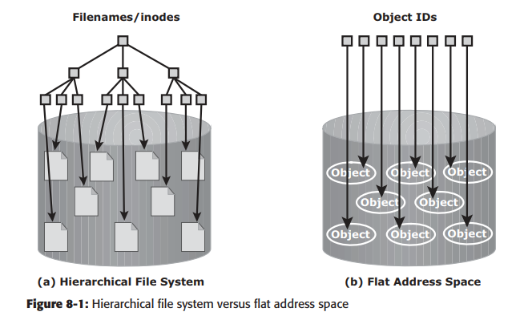
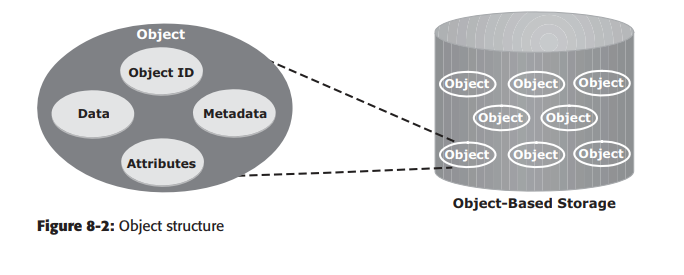
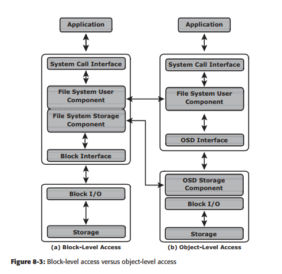
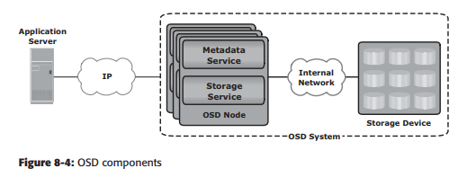
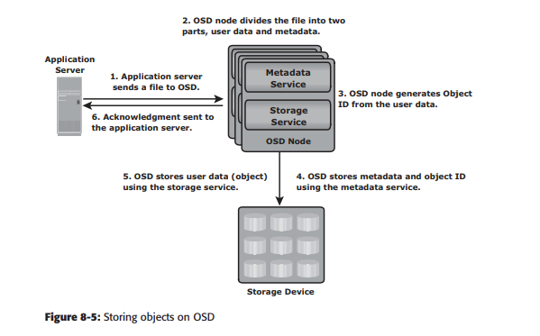
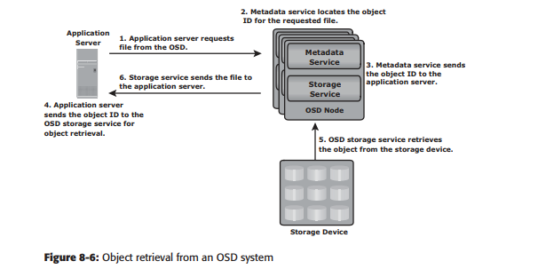

<h1 style="color:orange">Storage</h1>

 
<h2 style="color:orange">1. File Storage</h2>

 
File storage là một giải pháp lưu trữ dữ liệu dưới dạng các files và đại diện nó tới người dùng cuối như là kiến trúc thư mục theo tầng. Lợi ích chính đó là việc cung cấp một giải pháp thân thiện người dùng và lấy lại files. Để xác định vị trí trong file storage chúng ta cần đường dẫn đầy đủ của file. Ví dụ /home/images/beach.jpeg.

File storage là kiểu lưu trữ lâu đời nhất và phổ biến nhất cho hệ thống DAS và NAS.
<h2 style="color:orange">2. Block Storage</h2>
Block storage phân dữ liệu thành các khối (block) và lưu chúng như là các mảnh riêng biệt. Mỗi khối đều có định dang duy nhất. Như vậy một phần dữ liệu có thể lưu trữ trong môi trường Linux và phần khác có thể lưu trữ trên môi trường Windows.

Block storage thường được cấu hình để nới lỏng sự phụ thuộc môi trường của người dùng và phân chúng ra làm nhiều phần có thể giúp việc lấy dữ liệu tốt hơn. Bất cứ khi nào dữ liệu được yêu cầu, phần mềm storage dữ tập hợp phần khối dữ liệu và gửi chúng cho người dùng.

Block storage thường được triển khai trong môi trường SAN.
<h2 style="color:orange">3. Object-based storage devices (OSD)</h2>

 
OSD tổ chức và lưu unstructed data, vd: ảnh, nhạc, phim như là object. Object-based storage cung cấp khả năng mở rộng, tự quản lý, bảo vệ và chia sẻ dữ liệu storgae. OSD chứa data dưới dạng object. Sử dụng không gian địa chỉ phẳng để chứa dữ liệu. Vì thế, không có kiến trúc dạng tầng như thư mục hay file; do đó, một số lượng lớn object có thể được chứa trong hệ thống OSD.

 
Một object chứa data, metadata (kích thước, ngày, chủ sở hữu,...), attribute của data (quyền, kiểu truy cập,...). Mỗi object còn chứa một ID duy nhất của object (object ID). Object ID được tạo ra sử dụng thuật toán như hàm băm cho data và đảm bảo mỗi object đều có 1 ID duy nhất.

 
<h3 style="color:orange">3.1. Cấu trúc Object-based storage</h3>
Một I/O request với block level đi qua các layer. I/O request bởi một application đi qua file system, network và tới ổ đĩa. Khi file system nhận I/O request từ application, file system dẫn I/O request đến disk block. Block interface dùng để gửi I/O qua network đến storage device. I/O rồi được ghi vào ổ.

 
File system có 2 thành phần: user component và storage component. User component của file system có chức năng điều khiển tầng kiến trúc file, đánh tên và điều khiển quyền truy cập. Storage component map data tới ổ vật lý.

Với OSD, mỗi khi application truy cập data trên OSD, request gửi tới file system user component. File system user component giao tiếp với OSD interface, sau đó gửi request tới storage device. Storage device có OSD storage component chịu trách nhiệm điều khiển truy cập đến object trên ổ storage device. Hình trên chỉ ra truy cập object-level. Sau khi object được lưu, OSD gửi bản tin acknowledgement đến application server. OSD storage component quản lý tất cả ổ phía dưới và dung lượng lưu trữ. Nó cũng quản lý bảo mật của object.
<h3 style="color:orange">3.2. Thành phần Object-based storage</h3>
Hệ thống OSD bao gồm 3 thành phần chính: node, private network và storage.

 
OSD system bao gồm 1 hoặc nhiều node. 1 Node là 1 server chạy môi trường OSD và cung cấp khả năng lưu, lấy và quản lý dữ liệu. OSD node có 2 service chính: metadata service và storage service. Metadata service chịu trách nhiệm tạo object ID của 1 file. Storage service quản lý set disk mà data được lưu. OSD node kết nối tới storage qua mạng riêng (internal network). Internal network cũng cấp kết nối node-to-node và node-to-storage. Application truy cập node để lưu và lấy dữ liệu qua mạng IP (external network). Với một số ứng dụng, như CAS, metadata service có thể ở trên application server.

<h3 style="color:orange">3.3. Hoạt động Object-based storage</h3>
Chu trình lưu của OSD được thể hiện trong hình:

 
1. Application server gửi request lưu tới OSD node.
2. OSD node chia file thành 2 phần: userdata và metadata.
3. OSD node tạo object ID
4. OSD node lưu metadata và object ID sử dụng metadata service.
5. OSD node lưu userdata bằng storage service.
6. Bản tin acknoledgement được gửi tới application server chỉ ra rằng object đã được lưu. 
Sau khi object được lưu. Một user truy cập data trên OSD bằng filename tương tự. Application server lấy dữ liệu được lưu bằng object ID.

Chu trình lấy dữ liệu trong OSD được thể hiện trong hình dưới:

 
1. Application gửi read request đến hệ thống OSD.
2. Metadata service lấy object ID cho file được yêu cầu.
3. Metadata service gửi object ID đến application server.
4. Application server gửi object ID đến OSD storage service để lấy object
5. OSD storage service lấy object từ storage device.
6. OSD storage service gửi file đến application server
<h3 style="color:orange">3.4. Lợi ích Object-based storage</h3>
Với unstructed data, thiết bị object-based storage cung cấp nhiều lợi ích so với storage truyền thống. Cấu trúc Storage lý tưởng nên cung cấp hiệu năng, khả năng mở rộng, bảo mật và chia sẻ dữ liệu qua nhiều platform. Storage truyền thống, SAN và NAS không cung cấp tất cả khả năng chỉ trong 1 giải pháp duy nhất. 

Object thường ứng dụng lưu dữ liệu trong bệnh viện hoặc trong ngân hàng.
<h2 style="color:orange">4. So sánh File-block-object</h2>

 

Thông thường, data có thể truy cập qua network qua những kiểu sau: block level, file level, object level. 
Nhìn chung, application yêu cầu data từ file system (OS) khác file level; bằng cách chỉ ra tên file và vị trí. File system lấy tên và vị trí để tìm đến địa chỉ block của data (logical block level) và gửi yêu cầu đến storage. Storage gửi data

File:
- Lưu trữ thư mục dạng file, có thể thấy trong window hay trong linux (thư mục dạng cây)
- Khi client dùng file storage từ xa thì client sẽ mount 1 file từ storage để sử dụng qua internet (có thể là nfs hay samba trên centos7)
- Trong file-level, file system được tạo ở storage và file request được gửi qua internet (2.14-b)

Block:
- Tương tự file, tuy vậy client không chỉ mount 1 point mà mount 1 ổ từ storage (có thể 1 ổ vật lý hoặc 1 ổ ảo, nhưng thường là ổ ảo) gọi là block. Dung lượng 1 block thường chỉ có thể tới vài Tb. Ví dụ như iSCSI.
- Với block-level, file system được tạo ở host và dữ liệu truy cập qua network ở block level. Trong trường hợp này, dữ liệu thô hay logical volume được mount tới host để tạo file system (2.14-a)

Hình dưới só sánh sự khác nhau giữa file-level và block-level: 
 

Object:
- Sử dụng http, https để lưu trữ. Từ những app trên client, truyền tải dữ liệu vào app ----> app sẽ chuyển dữ liệu đến storage qua đường http hoặc https. Ví dụ thực tế là google drive, fshare, ...

 
So sánh khả năng hoạt động giữa 3 loại.

Block:
- I/O cao
- Khả năng lưu trữ bị giới hạn (vài tb)
- băng thông vài Gbps
- Latency thấp, chỉ 10^-6 s -----> tốc độ hoạt động tốt nhất
- giá thành cao hơn nhiều object storage

Object:
- file cố định, hỗ trợ versioning
- versioning là kiểu lưu trữ tiết kiệm tài nguyên. Ví dụ trong kiểu lưu trữ file hay block, nếu thay đổi 1 file thì nó sẽ biến thành 1 file hoàn toàn mới với mã băm khác. Tuy vậy, trong object storage thì nó lưu file và lưu phần thay đổi ------> tiết kiệm bộ nhớ.
- Khả năng lưu trữ cao hơn gấp nhiều lần block storage (khả năng scale lớn, đây cũng là lý do lớn nhất ng ta dùng object)
- Băng thông vài Tb
- Latency cao ------> tốc độ hoạt động thấp
- Giá rẻ

File:
- Là kiểu lưu trữ trung lập giữa 2 loại trên với giá thành cũng trung bình.
- Về khả năng lưu trữ thì trên storage cấp càng nhiều tài nguyên cho file thì khả năng lưu trữ càng cao
- Tốc độ đọc/ghi bằng với kiểu block
<h2 style="color:orange">5. Ứng dụng trong NAS-DAS-SAN</h2>

- NAS sử dụng nfs hay samba (lưu trữ kiểu file-level)
- SAN dùng block-level
- máy client thường được đặt trong mạng local của SAN để đảm bảo tối đa tốc độ hoạt động (latency).

So sánh hiệu năng: block (SAN)> file(NAS) > object