<h1 style="color:orange">SCSI</h1>
SCSI (Small computer system interface) thực chất là 1 chuẩn giao tiếp. Khi bạn nghe nói Card SCSI thì đây là 1 card giao tiếp các thiết bị theo chuẩn SCSI. Khi bạn nghe nói ổ cứng, CD-ROM, CD-RW, .... SCSI thì đây là những thiết bị giao tiếp theo chuẩn SCSI mà thôi.

Tốc độ truyền dữ liệu của nó cũng nhanh hơn so với giao diện IDE (Thường dùng để nối ổ cứng với Mainboard trong các máy tính bình thường). SCSI được dùng trong các máy chủ. Nhưng bây giờ đã có USB2.0 và IEEE là 2 giao diện đang phổ biến với tốc độ truyền dữ liệu rất cao và dễ dàng cài đặt hơn SCSI.

Khi dùng ổ SCSI thì phải có card SCSI (còn gọi là SCSI controller) thường được dùng cho server vì có tốc độ quay lớn (10000-15000 rpm) nhưng bù lại việc lắp đặt SCSI phức tạp và có chi phí cao hơn.
<h1 style="color:orange">iSCSI</h1>
iSCSI là Internet SCSI (Small Computer System Interface) : là một giao thức cho phép truyền tải các lệnh SCSI qua mạng IP bằng cách sử dụng giao thức TCP/IP. Nó truy cập thiết bị lưu trữ theo dạng block-level là truy cập theo từng khối.

Lệnh iSCSI được đóng gói trong lớp TCP/IP và truyền qua mạng nội bộ LAN hoặc cả qua mạng Internet Public mà không cần quan tâm đến các thiết bị chuyên biệt như Fiber Channel, chỉ cần cấu hình đúng Gigabit ethernet và iSCSI.

iSCSI sử dụng không gian nhớ ảo như LUN trên linux, VHD’s trên windows, giảm chi phí vì sử dụng các thiết bị sẵn có như switch, hub, router,…

iSCSI có rất nhiều ưu điểm nổi bật như:

- Chi phí rẻ hơn nhiều so với Fiber Channel SAN
- Tạo và quản lý được nhiều ổ cứng cho nhiều máy tính nội-ngoại mạng(VPN).
- Gián tiếp mở rộng dung lượng lưu trữ cho các máy tính nội-ngoại mạng(VPN).
- Cài VMware trên ổ cứng iSCSI hoặc cài phần mềm từ xa.
- Hiển thị y hệt ổ cứng trong máy, thân thiện với người dùng phổ thông.
- Bảo mật cao bằng mật khẩu.
- Kết nối rất nhanh, không cần qua nhiều bước.
- Thích hợp cho doanh nghiệp quản lý dữ liệu của máy nhân viên.

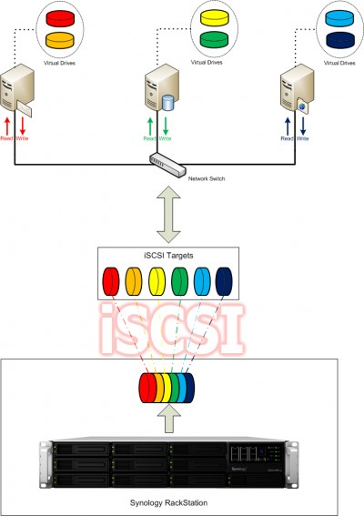 
<h2 style="color:orange">1. Thành phần iSCSI</h2>

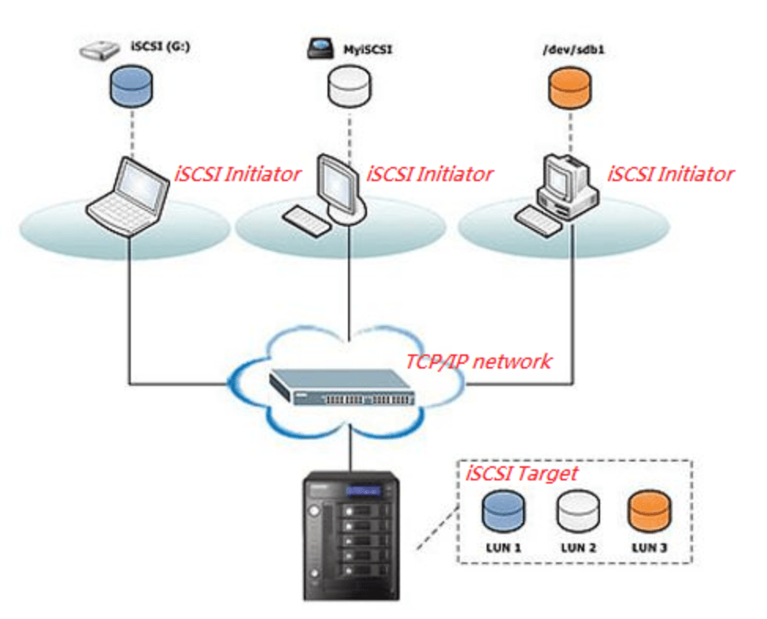 
iSCSI bao gồm 2 thành phần chính:

- iSCSI Inititor ( iSCSI Initiator Node): là thiết bị client trong kiến trúc hệ thống lưu trữ qua mạng. iSCSI Inititor sẽ kết nối đến máy chủ iSCSI Target và truyền tải các lệnh SCSI thông qua đường truyền mạng TCP/IP. iSCSI Inititor có thể được khởi chạy từ chương trình phần mềm trên OS hoặc phần cứng thiết bị hỗ trợ iSCSI.
- iSCSI Target( iSCSI Target Node): thường là một máy chủ lưutrữ có thể là hệ thống NAS. Từ máy chủ iSCSI Target sẽ tiếp nhận các request gửi từ iSCSI Inititor gửi đến và gửi trả dữ liệu trả về. iSCSI Target quản lý các ổ đĩa iSCSI với các tên gọi LUN ( Logical Unit Number) được sử dụng để chia sẻ ổ đĩa lưu trữ iSCSI với phía iSCSI Inititor (client).
<h2 style="color:orange">2. iSCSI hoạt động như thế nào</h2>

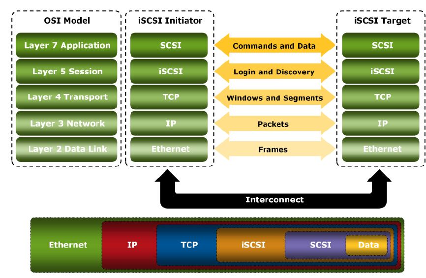 
Hình ảnh các gói tin SCSI hoạt động ở layer nào trong mô hình OSI.

1. Máy tính client là iSCSI Inititator khởi tạo một request yêu cầu truy xuất dữ liệu đến máy server là iSCSI Target.
2. Tiếp đến máy iSCSI sẽ tạo một số lệnh SCSI tương ứng với yêu cầu của client.
3. Các lệnh SCSI và các thông tin sẽ được đóng gói trong gói tín SCSI Protocol Data Unit ( SCSI PDU). Thông tin PDU được sử dụng cho kết nối giữa target và initiator với các thông tin nhằm xác định các node, thiết lập session, truyền tải lệnh iSCSI và truyền tải dữ liệu.

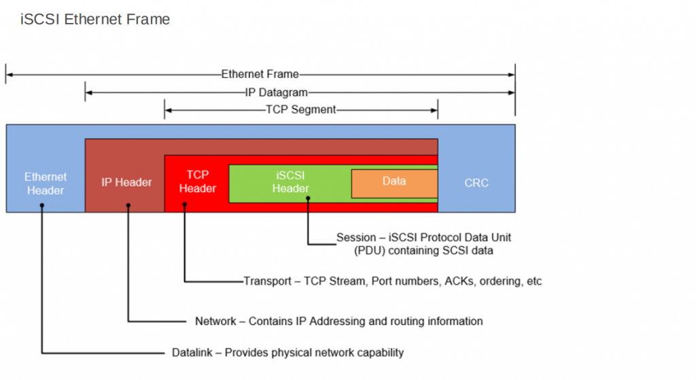 

4. Sau đó gói tin PDU được đóng gói trong lớp TCP/IP và truyền tải qua mạng network đến iSCSI target.
5. Máy chủ iSCSI nhận gói tin và tiến hành mở gói tin ra kiểm tra iSCSI PDU nhằm trích xuất các thành phần liên quan.
6. Sau đó lệnh SCSI được đưa vào iSCSI controller để thực thi, sau khi thực thi xong sẽ trả về iSCSI response cho máy Inititator, cuối cùng cho phép block data truyền tải giữa Inititator và Target.

Tất cả quá trình bắt đầu đến truyền tải trên được gọi là một session.
<h2 style="color:orange">2. Ưu/nhược điểm iSCSI</h2>
<h3 style="color:orange">2.1. Ưu điểm iSCSI</h3>

- Chi phí lắp đặt và vận hành rẻ vì sử dụng chung các thiết bị đã có sẵn như switch, hub, router, ..
- Khả năng mở rộng linh hoạt.
- Sử dụng hệ thống mạng đơn giản nên các công ty có thể đơn giản hóa việc tạo dựng một môi trường.
- Có nhiều kiểu bảo vệ chống tấn công như CHAP, IPsec.
- Có thể hoạt động sử dụng cùng VPN đến truyền tải thông tin bảo mật an toàn.
- Sử dụng danh sách kiểm soát truy cập (ACL) để kiểm tra truy cập dữ liệu và đảm bảo an toàn cho người sử dụng.
<h3 style="color:orange">2.2. Nhược điểm iSCSI</h3>

- Độ trễ cao
- Tốc độ chậm phụ thuộc vào loại cable sử dụng.
- Kém an toàn có thệ bị tấn công  Packet sniffing à loại cyberattack trong đó phần mềm độc hại hoặc thiết bị của bên tấn công nắm bắt các gói di chuyển trên một mạng dễ bị tấn công. (thường sảy ra với các công ty nhỏ)
<h1 style="color:orange">3. iSCSI install</h1>
Chuẩn bị :
iSCSI target: 192.168.206.41/24 
iSCSI initiator: 192.168.206.157 
Trên iSCSI target thêm sẵn 1 ổ vật lý sdb

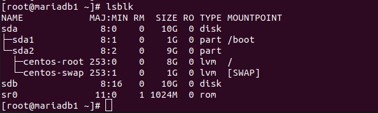 

<h2 style="color:orange">3.1. Trên iSCSI target</h2>
<h3 style="color:orange">3.1.1. Tạo logical volume</h3>
Ở đây sẽ cung cấp cho iSCSI initiator ổ ảo nên chúng ta sẽ thực hiện tạo logical volume. Có thể cung cấp cho iSCSI initiator ổ vật lý luôn nhưng điều này thường thực tế không sử dụng.

Tạo physical volume
    
    # pvcreate /dev/sdb
Tạo volume group 

    #  vgcreate vg_iscsi /dev/sdb
với vg_iscsi là tên volume group

Tạo logical volume

    # lvcreate -l 100%FREE -n lv_iscsi vg_iscsi
với lv_iscsi là tên volume group 
vg_iscsi là tên volume group 
<h3 style="color:orange">3.1.2. targetcli</h3>
Tải package targetcli để cấu hình iSCSI target

    # yum install -y targetcli
vào targetcli

    # targetcli
check status cấu hình

    /> ls
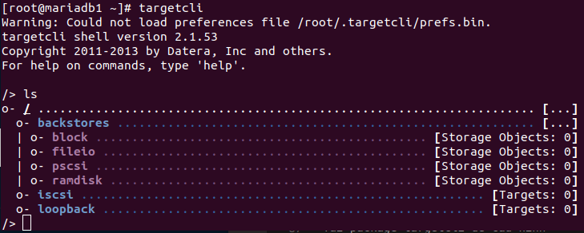 

1. Di chuyển đến khối block để khởi tạo ISCSI

       /> cd /backstores/block
Tạo một block ISCSI có tên là iscsi_store trong logical volume lv_iscsi đã tạo

    /backstores/block> create iscsi_store /dev/vg_iscsi/lv_iscsi
    /backstores/block> ls (để kiểm tra)
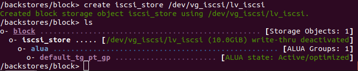 

2. Khởi tạo kết nối iqn như sau

       /backstores/block> cd /iscsi
       /iscsi> create iqn.2018-11.local.domain.iscsi:cluster
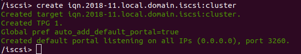 
Hệ thống sẽ tạo TPG Authentication TPG1 và khởi tạo default sẽ chạy với port 3260

3. Khi đã tạo TPG Authentication thì bắt buộc sẽ phải set rule cho kết nối này bằng cách đi thẳng vào vùng acls với lệnh sau

       /iscsi> cd /iscsi/iqn.2018-11.local.domain.iscsi:cluster/tpg1/acls
Ah, tới đây hiểu như thể nào, có nghĩa là tới bước này set rule cho ai vào, như bài lab thì xác định 2 vé cho 2 thằng node 1,2 vào thì set quyền nó ra như sau

    /iscsi/iqn.20...ter/tpg1/acls>create iqn.2018-11.local.domain.iscsi:node1node2
Dùng cd.. ra ngoài một node và set attribute authentication bằng 0, và tại sao lại là không vì 0 là không xác thực (No Authentication)

    /iscsi/iqn.20...ter/tpg1/acls> cd ../
    /iscsi/iqn.20...ter/tpg1/> set attribute authentication=0
Tiếp theo set attribute generate_node_acls=1 là bỏ qua chế độ ALC
 
    /iscsi/iqn.20...ter/tpg1/>set attribute generate_node_acls=1
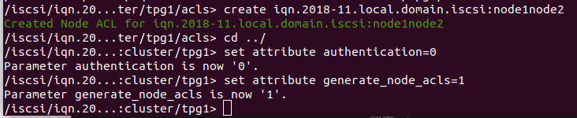 

4. Đi đến vùng LUN để tạo LUN

       /iscsi/iqn.20...ter/tpg1/> cd /iscsi/iqn.2018-11.local.domain.iscsi:cluster/tpg1/luns
Và dùng lệnh sau để tạo LUN , tại đây sẽ lấy thông tin về LUN và lưu nó ở block iscsi_store đã tạo

    /iscsi/iqn.20...ter/luns/> create /backstores/block/iscsi_store

    > ls để kiểm tra
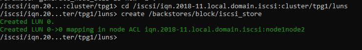 
5. Tạo portal

       > cd ../
       /iscsi/iqn.20...ter/tpg1/> cd portals/
       
       /iscsi/iqn.20...ter/tpg1/portals> create 192.168.206.41
6. Kiểm tra 
       
       > cd /
       > ls
       > exit để lưu
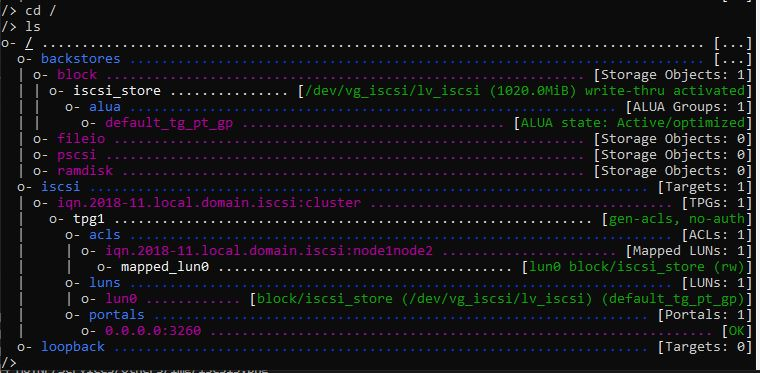 
<h3 style="color:orange">3.1.3. Cấu hình firewall</h3>

    # firewall-cmd --permanent --zone=public --add-port=3260/tcp
    # firewall-cmd --reload

    # systemctl start target
    # systemctl enable target
<h2 style="color:orange">3.1. Trên iSCSI initiator</h2>

1. Cài iscsi-initiator-utils package

       # yum install -y iscsi-initiator-utils
2. Truy cập vào file /etc/iscsi/initiatorname.iscsi để tạo ACL

       # vim /etc/iscsi/initiatorname.iscsi
thêm vào iqn client vừa tạo trên máy target

    InitiatorName=iqn.2018-11.local.domain.iscsi:node1node2
    :wq!
3. Tìm iscsi target

       # iscsiadm -m discovery -t sendtargets -p 192.168.206.41
       # systemctl start iscsi
       # systemctl enable iscsi
4. Kiểm tra 

       # lsblk
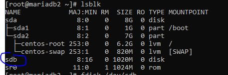 
------> thành công 
Bây giờ có thể chia ổ và mount ổ bình thường