<h1 style="color:orange">Intelligent storage system</h1>
Với sự tiên tiến công nghệ, giải pháp intelligent storage đã được đưa vào thực tế. Intelligent storage system bao gồm khe RAID cung cấp tối đa khả năng I/O. Intelligent storage cấu hình với cache và nhiều đường I/O sử dụng thuật toán phức tạp để đảm bảo hiệu năng hiện nay. Những khe nay tối đa khả năng quản lý, cấp phát và sử dụng tài nguyên storage. Hỗ trợ ổ SSD và các công nghệ tiên tiến hiện tại như virtual storage provisioning.
<h1 style="color:orange">Thành phần intelligent storage system</h1>
Interlligent storage system bao gồm 4 thành phần chính: front end, cache. backend và physical disks.

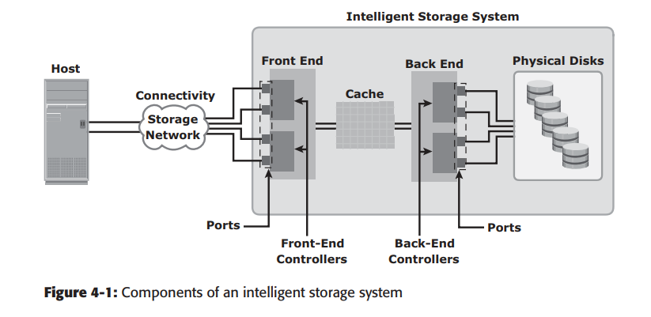 
1 I/O request nhận được từ host ở front-end port được xử lý qua cache và backend, để lấy dữ liệu từ physical disk. Một read request có thể được thực hiện tại cache nếu data được tìm thấy ở cache. Hiện tại, intelligent storage system có frontend, cache và backend được tích hợp trên 1 mainboard (được gọi là storage processor hay storrage controller).
<h2 style="color:orange">1. Frontend</h2>
Frontend cung cấp interface giữa storage system và host. Nó bao gồm 2 thành phần: frontend port và frontend controller. Thông thường, 1 frontend sẽ có nhiều controller, với mỗi controller có vài port cho phép kết nối nhiều host đến intelligent storage system. Frontend controller hỗ trợ giao thức FC channel, iSCSI, FICON, FCoE. Frontend controllers dẫn data đến và đi từ cache qua internal data bus. Khi cache nhận dữ liệu ghi, frontend controller gửi bản tin acknowledgement về host.
<h2 style="color:orange">2. Cache</h2>
Cache là bộ nhớ đệm chứa dữ liệu tạm thời để giảm thiểu thời gian thực hiện I/O request từ host. 
Cache cải thiện hiệu năng bằng cách tách riêng host khỏi cơ chế lấy dữ liệu của ổ đĩa (HDD), khi phải đợi ổ đĩa quay. Ổ đĩa quay thường tốn vài ms để truy xuất trong khi lấy dữ liệu từ cache tốn ít hơn 1ms. Write data đầu tiên ghi vào cache sau đó ghi vào ổ cứng.
<h3 style="color:orange">2.1. Cấu trúc cache</h3>
Cache chia thành các trang, là đơn vị nhỏ nhất của cache. Kích thước trang cache được cấu hình theo I/O application. Cache bao gồm `data store` và `tag RAM`. Data store chứa data trong khi tag RAM lưu vị trí của data trên data store lẫn trong disk.

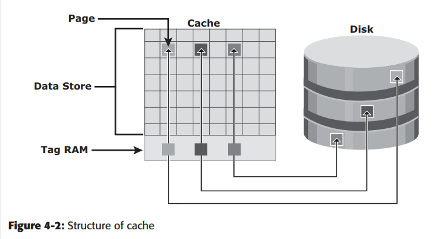 
Tag RAM chỉ ra vị trí dữ liệu ở cả cache và disk. Tag RAM có dirty bit flag, chỉ ra rằng dữ liệu đã được ghi trên disk hay chưa. Nó cũng chứa thông tin về thời gian, như thời gian của lần truy cập cuối, được dùng để chỉ ra data đã lâu không được truy cập trong cache và có thể xóa đi.
<h3 style="color:orange">2.2. Tiến trình đọc cache</h3>

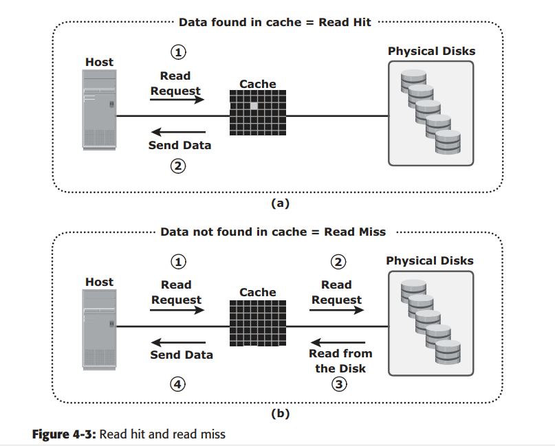 
Khi host gọi read request, storage controller (frontend và backend controller) đọc tag RAM để xem data có ở cache. Nếu có, gọi là `read cache hit` hay `read hit` và dữ liệu được gửi thẳng tới host mà không cần sự tham gia của disk -----> cải thiện thời gian phản hồi.

Nếu request không tìm thấy data trong cache, gọi là `cache miss` và dữ liệu phải được đọc từ disk. Backend truy cập vào disk và kéo dữ liệu. data -----> cache -----> frontend. Cache miss tăng thời gian truy xuất.

Thuật toán prefetch hay read-ahead được dùng khi read request xuất hiện liên tục. Khi read request liên tục, một nhóm các block data liên quan được gọi từ disk sang cache sẵn. -----> luôn là cache hit.
<h3 style="color:orange">2.3. Tiến trình ghi cache</h3>
Khi I/O ghi vào cache, tốn ít thời gian vào disk hơn. Ghi liên tục còn tăng hiệu suất khi các bản ghi nhỏ có thể tập hợp thành bản lớn hơn và truyển vào disk 1 thể.

Tiến trình ghi vào cache như sau:
- `Write-back cache:` Data ghi vào cache và bản tin acknoledgement gửi về host. Sau đó, data từ vài bản ghi được gửi đến disk. Tiến trình ghi nhanh khi nó được tách biệt khỏi cơ chế delya của disk. Tuy vậy, dữ liệu chưa được gửi vào disk có thể mất nếu cache down.
- `write-through cache:` data ở cache được ghi vào disk và bản tin acknowledgement gửi đến host.

Dữ liệu có thể bỏ qua cache trong 1 số TH, như request I/O lớn. Trong tiến trình, kích thước của I/O request vượt quá kích thước được cho sẵn, gọi là `write aside size, bản ghi được gửi thẳng đến disk để không tốn tài nguyên cache. Đặc biệt hữu dụng trong trường hợp cache đang chứa nhiều data và phục vụ small random I/O.
<h3 style="color:orange">2.4. Áp dụng cache</h3>
Cache có thể được áp dụng 2 dạng: dedicated cache và global cache. Với dedicated cache, một số vị trí trong cache sẽ được giữ cho đọc/ghi. Trong global cache, cả đọc/ghi dùng bất cứ vị trí nào trống trong cache. Quản lý Cache dễ dàng hơn với global bởi vì chỉ có 1 set địa chỉ được quản lý.

Global cache cho biết % cache có thể đọc/ghi còn lại trong cache. Thông thường, phần đọc sẽ nhỏ, nhưng có thể tăng lên nếu có nhiều read request.
<h3 style="color:orange">2.5. Quản lý cache</h3>
Cache là tài nguyên có giới hạn và đắt tiền. Khi cache đầy, một vài page phải được giải phóng để lưu data mới. Những thuật toán thường được dùng:

- `Least recently used (LRU):` Một thuật toán quản lý data liên tục xác định những cache page không được dùng trong 1 thời gian dài. LRU xóa các page này hoặc đánh dấu để tái sử dụng.
- `Most recently used (MRU):` Thuật toán đối nghịch LRU, những page được dùng gần nhất được xóa hoặc đánh dấu. Vì thuật toán cho rằng, cái gì vừa dùng sẽ không được dùng lại sớm.

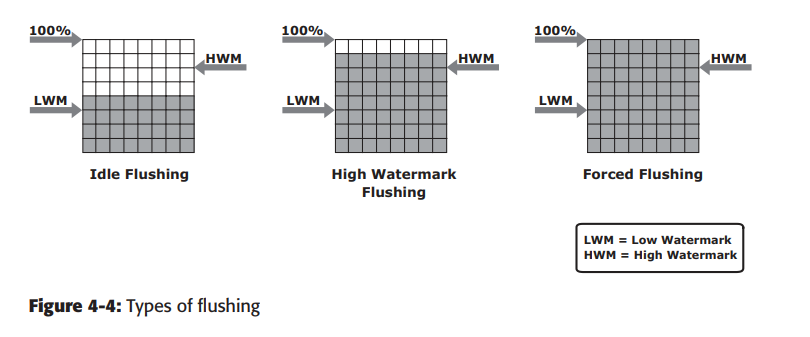 
Khi cache được làm đầy, hệ thống storage phải flush dirty page (data ghi vào cache nhưng chưa ghi vào disk) để lấy chỗ trống. Flushing là tiến trình ghi data từ cache vào disk. Trong nền tảng I/O, người ta dùng `watermark` để đánh dấu mốc flushing. `High watermark (HWM)`, cache đẩy nhanh tiến trình flushing. `Low watermark(LWM)`, storage dừng flushing.
- `Idle flushing:` Diễn ra liên tục, với tốc độ từ từ
- `HWM flushing:` diễn ra khi cache chạm HWM. Việc này ảnh hưởng đến tiến trình I/O.
- `forced flushing:` Khi cache chạm 100% sử dụng, ảnh hưởng lớn đến thời gian phản ứng I/O.
<h3 style="color:orange">2.6. Bảo vệ dữ liệu trong cache</h3>
Bất cứ tình huống sập nguồn nào cũng ảnh hưởng đến data trong cache. Người ta dùng 2 giải pháp:

- `Cache mirroring:` Mỗi lần ghi được đẩy vào 2 memory card khác nhau. Nếu có vấn đề với 1 card, bản ghi sẽ vẫn còn trong card còn lại. Tiến trình này chỉ thực hiện với ghi, đọc không cần vì data đẩy từ disk > cache. 
- `Cache vaulting:` Một số nhà cung cấp storage sử dụng một số disk vật lý xóa dữ liệu của cache khi bị sập nguồn. Điều này gọi là cache vaulting và những disk vật lý này là vault drives. Khi có điện trở lại, dữ liệu ở những ổ này được ghi lại vào cache và rồi ghi vào ổ cứng định sẵn (không phải ổ vật lý nêu trên).
<h2 style="color:orange">3. Backend</h2>
Backend cung cấp đường nối giữa cache và disk, bao gồm backend port và backend controller. Nó điều khiển luồng giữa cache và các ổ disk. Nó cũng cung cấp tính năng lưu dữ liệu nhưng hạn chế. Thuật toán của backend controller cung cấp phát hiện và sửa lỗi, cùng với tính năng RAID.

Storage system được cấu hình với dual controller và nhiều port, giúp cân bằng tải và tính high availablity cao.
<h2 style="color:orange">4. Disk vật lý</h2>
Đĩa vật lý được nối với backend controller. Hỗ trợ nhiều kiểu như: FC, SATA, SAS và SSD.
<h2 style="color:orange">Storage provisioning</h2>
<h3 style="color:orange">4.1. Thick provisioning</h3>

RAID set thường có dung lượng lớn vì chúng gộp nhiều ở vật lý. `Logical unit` được tạo từ các slice của RAID (chia thành các unit nhỏ hơn). Logical unit được trải đều ở các physical disk thuộc RAID set đó. Mỗi logical unit tạo từ RAID set được gán unique ID, gọi là logical unit number (LUN). LUN này là thick provisioning.

Trong môi trường ảo hóa, LUN được mount tới hypervisor, hypervisor sẽ nhận LUN là ổ vật lý. LUN này cấu hình với hypervisor file system, máy ảo được tạo trên nó. Ổ ảo là file trên hypervisor file system. Virtual disk sau đó được mount tới máy ảo và máy ảo sẽ thấy những ổ ảo này như những ổ vật lý. Để máy ảo có thể dùng ổ ảo, một vài bước sẽ được thực hiện như hình dưới. Tại đây, LUN có thể chia sẻ và dùng bởi nhiều máy ảo.

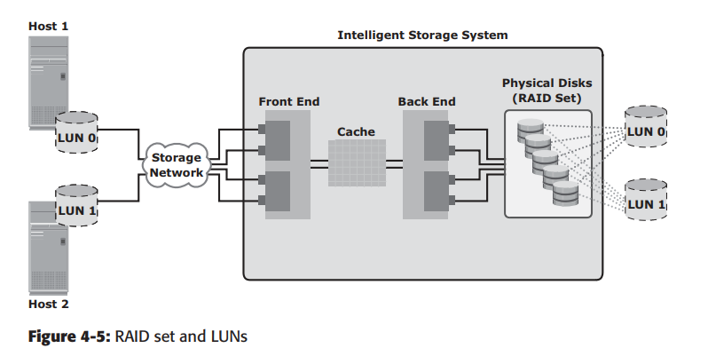 
<h3 style="color:orange">4.2. 
Mở rộng LUN: MetaLUN</h3>

MetaLUN là phương pháp mở rộng LUN yêu cầu thêm dung lượng hoặc hiệu năng. Một metaLUN có thể tạo ra bởi LUN gốc và LUN thành phần. MetaLUN có thể theo 2 kiểu `concatenated` hoặc `striped`.

`Concatenated` đơn giản add thêm ổ vào LUN gốc, LUN thành phần thêm vào không cần phải có dung lượng ngang LUN gốc. Tất cả LUN trong concatenated metaLUN phải được bảo vệ (parity hoặc mirrored) hoặc RAID 0. Kiểu RAID trong LUN có thể mixed. Ví dụ, RAID 10 LUN có thể concatenated với RAID 5 LUN. Concatenated cấu hình nhanh nhưng không cung cấp độ lợi hiệu năng.

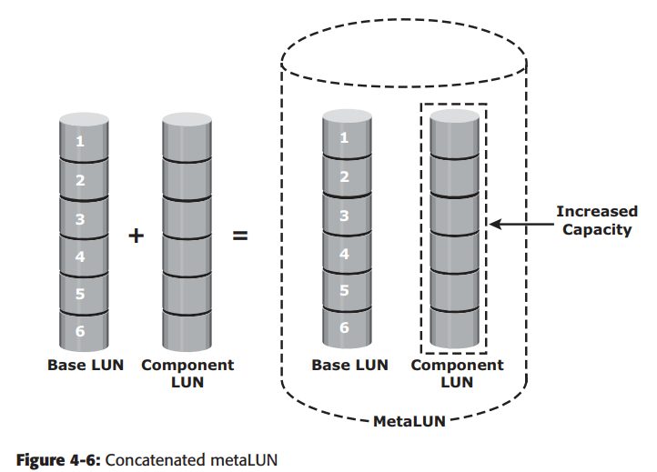 

`Striped` chia LUN gốc vào các LUN thành phần. Trong mở rộng striped, tất cả LUN phải cùng dung lượng và RAID level. Mở rộng Striped tăng hiệu năng.
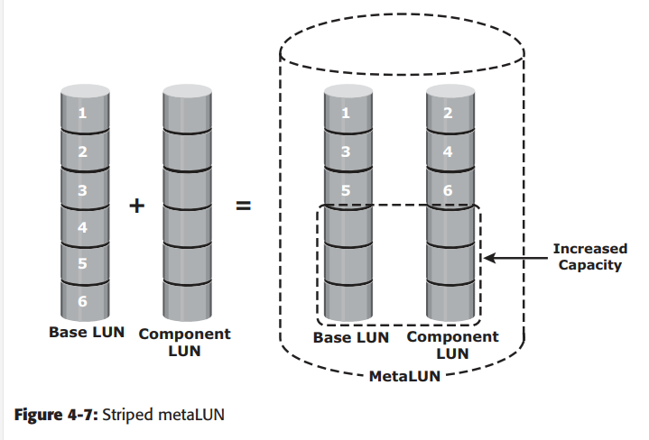 
Tất cả 2 kiểu mở rộng đều phải trên cùng 1 loại ổ: FC hoặc ATA.
<h3 style="color:orange">4.3. Thin provisioning</h3>
Thin Volume được tạo ra có 1 dung lượng chia sẵn (allocated size) nhưng chỉ chiếm dung lượng của ổ đĩa đúng bằng dung lượng của dữ liệu thực tế có trên Volume (used size).

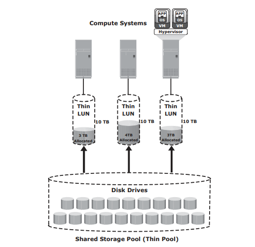 
<h3 style="color:orange">4.4. So sánh thick và thin provisioning</h3>

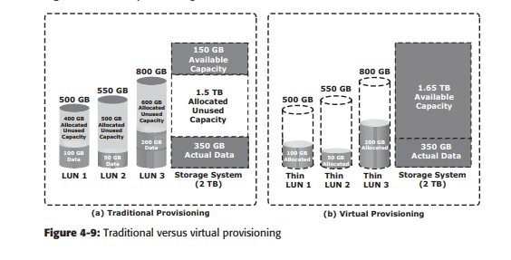 
Thin LUN phù hợp với trường hợp người quản trị chưa dự tính được dung lượng mà ứng dụng sẽ sử dụng trong tương lai. Thin LUN giúp giảm năng lượng sử dụng, giá thành và đơn giản hóa quản lý tài nguyên.

Thick LUN phù hợp với việc người quản trị dự tính được dung lượng mà ứng dụng sử dụng. Thick LUN cung cấp sự chính xác khi cấp phát tài nguyên và cho phép người quản trị thêm vào LUN của RAID level khác.

Cả thin và thick LUN đều có thể cùng tồn tại trên 1 ổ đĩa.
<h2 style="color:orange">5. LUN masking</h2>
LUN masking là quy trình điều khiển truy cập tài nguyên chỉ ra LUN nào host có thể truy cập. LUN masking được diễn ra trên ổ đĩa. Ví dụ, 1 ổ đĩa lưu trữ data của phòng sales và phòng tài chính. Nếu không có LUN masking, cả 2 bộ phận có thể truy cập và thay đổi dữ liệu của nhau. LUN masking sẽ chỉ cho phép host chỉ định được truy cập dữ liệu.
<h2 style="color:orange">6. LUN masking</h2>
Intelligent storage system có 2 kiểu:

- High-end storage system
- Midrange storage system 
High-end storage system được thực thi với cấu hình active-active. Midrange storage system cấu hình active-passive. Cả hai kiểu cấu hình này càng ngày càng ít khác nhau.
<h2 style="color:orange">6.1. High-end storage system</h2>
Ổ đĩa cấu hình active-active, nhắm tới application của các tập đoàn lớn. Được cấu hình với số lượng lớn controller và cache-memory. Ổ active-active chỉ ra rằng host có thể truy cập I/O request vào LUN qua bất kì controller front-end nào.

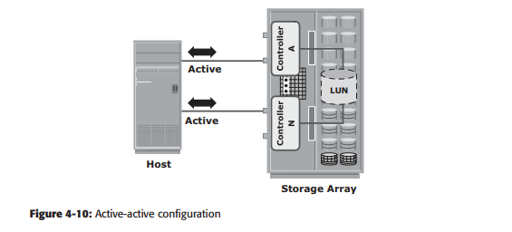 
<h2 style="color:orange">6.2. Midrange storage system</h2>
Cấu hình active-passive hợp với doanh nghiệp vừa và nhỏ. Cung cấp giải pháp tốt nhất với giá thành nhỏ. Với Ổ active-passive, 1 host chỉ có thê I/O đến LUN qua 1 controller đang active.

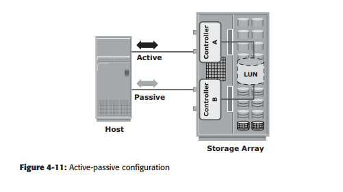 
Trong ví dụ trên, host chỉ có thể truy cập qua controller A. Đường qua controller B giữ nguyên passive.