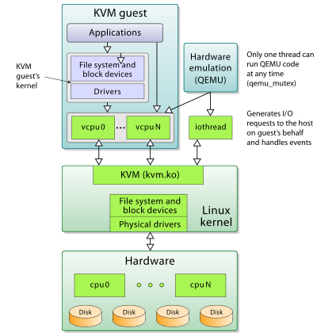

<h1 style="color:orange">KVM</h1>
<h2 style="color:orange">1. Giới thiệu</h2>
KVM ra đời phiên bản đầu tiên vào năm 2007 bởi công ty Qumranet tại Isarel, KVM được tích hợp sẵn vào nhân của hệ điều hành Linux bắt đầu từ phiên bản 2.6.20. Năm 2008, RedHat đã mua lại Qumranet và bắt đầu phát triển, phổ biến KVM Hypervisor.

KVM (Kernel-based virtual machine) là giải pháp ảo hóa cho hệ thống linux trên nền tảng phần cứng x86 có các module mở rộng hỗ trợ ảo hóa (Intel VT-x hoặc AMD-V).

Về bản chất, KVM không thực sự là một hypervisor có chức năng giả lập phần cứng để chạy các máy ảo. Chính xác KVM chỉ là một module của kernel linux hỗ trợ cơ chế mapping các chỉ dẫn trên CPU ảo (của guest VM) sang chỉ dẫn trên CPU vật lý (của máy chủ chứa VM). Hoặc có thể hình dung KVM giống như một driver cho hypervisor để sử dụng được tính năng ảo hóa của các vi xử lý như Intel VT-x hay AMD-V, mục tiêu là tăng hiệu suất cho guest VM.

KVM hiện nay được thiết kế để giao tiếp với các hạt nhân thông qua một kernel module có thể nạp được. Hỗ trợ một loạt các hệ thống điều hành máy guest như: Linux, BSD, Solaris, Windows, Haiku, ReactOS và hệ điều hành nghiên cứu AROS. Sử dụng kết hợp với QEMU, KVM có thể chạy Mac OS X.

Trong kiến trúc của KVM, Virtual machine được thực hiện như là quy trình xử lý thông thường của Linux, được lập lịch hoạt động như các scheduler tiểu chuẩn của Linux. Trên thực tế, mỗi CPU ảo hoạt động như một tiến trình xử lý của Linux. Điều này cho phép KVM được hưởng lợi từ tất cả các tính năng của nhân Linux. 
 
<h2 style="color:orange">2. Tính năng KVM</h2>
<h3 style="color:orange">2.1. Tính bảo mật</h3>
Vì Virtual machine được coi như một tiến trình xử lý của Linux, nên nó tận dụng được mô hình bảo mật tiêu chuẩn của Linux để cung cấp khả năng điều khiển và cô lập tài nguyên. Nhân Linux sử dụng SELinux (Security-Enhanced Linux) để thêm quyền điều khiển truy cập, bảo mật đa mức và bảo mật đa tiêu chí, và thực thi các chính sách bắt buộc. SELinux cung cấp cơ chế cách ly tài nguyên nghiêm ngặt và hạn chế cho các tiến trình chạy trong nhân Linux.

- Ngoài ra, dự án Svirt tích hợp bảo mật Mandatory Access Control (MAC) với KVM – xây dựng trên SELinux để cung cấp một nền tảng ảo hóa cho phép người quản trị định nghĩa các chính sách cho sự cô lập máy ảo. Svirt đảm bảo máy ảo không thể bị truy cập bởi các tiến trình khác (hoặc máy ảo khác), việc này có thể được mở rộng thêm bởi người quản trị hệ thống định nghĩa ra các quyền hạn đặc biệt: như là nhóm các máy ảo chia sẻ chung nguồn tài nguyên.
<h3 style="color:orange">2.2. Quản lý bộ nhớ</h3>

- KVM thừa kế tính năng quản lý bộ nhớ mạnh mẽ của Linux. Vùng nhớ của máy ảo được lưu trữ trên cùng một vùng nhớ dành cho các tiến trình Linux khác và có thể swap. KVM hỗ trợ NUMA (Non-Uniform Memory Access - bộ nhớ thiết kế cho hệ thống đa xử lý) cho phép tận dụng hiệu quả vùng nhớ kích thước lớn.
- KVM hỗ trợ các tính năng ảo của mới nhất từ các nhà cung cấp CPU như EPT (Extended Page Table) của Microsoft, Rapid Virtualization Indexing (RVI) của AMD để giảm thiểu mức độ sử dụng CPU và cho thông lượng cao hơn.
- Việc chia sẻ bộ nhớ được hỗ trợ thông qua một tính năng của nhân gọi là Kernel Same-page Merging (KSM). KSM quét tất cả các yêu cầu về vùng nhớ cần thiết cho máy ảo và định danh cho từng máy ảo, sau đó tổ hợp vào thành một yêu cầu về vùng nhớ duy nhất để chia sẻ chung cho các máy ảo, lưu trữ vào một bản copy.
<h3 style="color:orange">2.3. Storage</h3>

- KVM sử dụng khả năng lưu trữ hỗ trợ bởi Linux để lưu trữ các images máy ảo, bao gồm các local disk với chuẩn IDE, SCSI và SATA, Network Attached Storage (NAS) bao gồm NFS và SAMBA/CIFS, hoặc SAN được hỗ trợ iSCSI và Fibre Chanel.
- Một lần nữa, bởi vì KVM là một phần trong nhân Linux, nên nó có thể tận dụng hạ tầng lưu trữ đã được chứng minh và đáng tin cậy với sự hỗ trợ từ tất cả các nhà cung cấp hàng đầu trong lĩnh vực Storage.
- KVM cũng hỗ trợ các image của máy ảo trên hệ thống chia sẻ tập tin như GFS2 cho phép các image máy ảo được chia sẻ giữa các host hoặc các logical volumn.
- Định dạng image tự nhiên của KVM là QCOW2 – hỗ trợ việc snapshot cho phép snapshot nhiều mức, nén và mã hóa dữ liệu.
<h3 style="color:orange">2.4. Live Migration</h3>

- KVM hỗ trợ live migration cung cấp khả năng di chuyển ác máy ảo đang chạy giữa các host vật lý mà không làm gián đoạn dịch vụ. Khả năng live migration là trong suốt với người dùng, các máy ảo vẫn duy trì trạng thái bật, kết nối mạng vẫn đảm bảo và các ứng dụng của người dùng vẫn tiếp tục duy trì trong khi máy ảo được đưa sang một host vật lý mới.

- KVM cũng cho phép lưu lại trạng thái hiện tại của máy ảo để cho phép lưu trữ và khôi phục trạng thái đó vào lần sử dụng tiếp theo.
<h3 style="color:orange">2.5. Performance and scalability</h3>
KVM kế thừa hiệu năng và khả năng mở rộng của Linux, hỗ trợ các máy ảo với 16 CPUs ảo, 256GB RAM và hệ thống máy chủ lên tới 256 cores và trên 1TB RAM.
<h2 style="color:orange">3. KVM kết hợp QEMU</h2>
Mô hình kvm kết hợp với QEMU

 

Trong đó :
- `User-facing tools:` Là các công cụ quản lý máy ảo hỗ trợ KVM. Các công cụ có giao diện đồ họa (như virt-manager) hoặc giao diện dòng lệnh như (virsh) và virt-tool (Các công cụ này được quản lý bởi thư viện libvirt).
- `Management layer:` Lớp này là thư viện libvirt cung cấp API để các công cụ quản lý máy ảo hoặc các hypervisor tương tác với KVM thực hiện các thao tác quản lý tài nguyên ảo hóa, bởi vì KVM chỉ là một module của nhân hỗ trợ cơ chế mapping các chỉ dẫn của CPU ảo để thực hiện trên CPU thật, nên tự thân KVM không hề có khả năng giả lập và quản lý tài nguyên ảo hóa. Mà phải dùng nhờ các công nghệ hypervisor khác, thường là QEMU.
- `Virtual machine:` Chính là các máy ảo người dùng tạo ra. Thông thường, nếu không sử dụng các công cụ như virsh hay virt-manager, KVM sẽ sử được sử dụng phối hợp với một hypervisor khác điển hình là QEMU.
- `Kernel support:` Chính là KVM, cung cấp một module làm hạt nhân cho hạ tầng ảo hóa (kvm.ko) và một module kernel đặc biệt chỉ hỗ trợ các vi xử lý VT-x hoặc AMD-V (kvm-intel.ko hoặc kvm-amd.ko) để nâng cao hiệu suất ảo hóa.

Một số lưu ý về KVM và QEMU:
- Có thể hình dung KVM giống như driver cho hypervisor để sử dụng được virtualization extension của physical CPU nhằm boost performance cho guest VM. KVM như định nghĩa trên trang chủ thì là core virtualization infrastructure mà thôi, nó được các hypervisor khác lợi dụng làm back-end để tiếp cận được các công nghệ hardware acceleration (Dịch code để mô phỏng phần cứng)

- QEMU là một Emulator nên nó có bộ dịch của nó là TCG (Tiny Code Generate) để xử lý các yêu cầu trên CPU ảo và giả lập kiến trúc của máy ảo. Nên có thể coi, QEMU như là một hypervisor type 2 (hypervisor chỉ chung cho chức năng ảo hóa). Nhằm nâng cao hiệu suất của VM. Cụ thể, lúc tạo VM bằng QEMU có VirtType là KVM thì khi đó các instruction có nghĩa đối với virtual CPU sẽ được QEMU sử dụng KVM để mapping thành các instruction có nghĩa đối với physical CPU. Làm như vậy sẽ nhanh hơn là chỉ chạy độc lập QEMU, vì nếu không có KVM thì QEMU sẽ phải quay về (fall-back) sử dụng translator của riêng nó là TCG để chuyển dịch các instruction của virtual CPU rồi đem thực thi trên physical CPU.

=> Khi QEMU/KVM kết hợp nhau thì tạo thành type-1 hypervisor.

-------> QEMU cần KVM để boost performance và ngược lại KVM cần QEMU (modified version) để cung cấp giải pháp full virtualization hoàn chỉnh.

Do KVM kết hợp QEMU nên các máy ảo và mạng ảo có file cấu hình xml sẽ được lưu lại tại thư mục /etc/libvirt/qemu/
