<h1 style="color:orange">Các mô hình mạng trên KVM</h1>
<h1 style="color:orange">NAT</h1>
<h2 style="color:orange">1. Mô hình</h2>
Một máy chạy hệ điều hành CentOS 7 hoặc Ubuntu cài đặt KVM có một card mạng kết nối với internet và cài đặt một VM bên trong máy đó.

Chú ý máy vật lý ở đây là máy cài KVM. Máy này có thể là một máy ảo nhưng ở đây ta coi nó như một server vật lý.

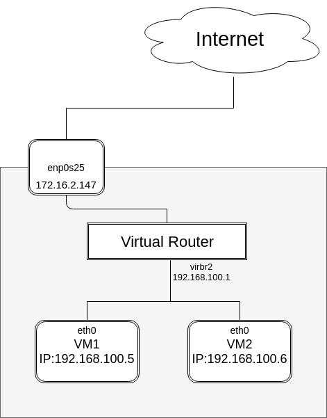 
Nếu như với mô hình linux bridge KVM tạo ra một virtual switch thì ta cũng có thể hình dung với mô hình mạng NAT này KVM sẽ tạo ra một thiết bị là virtual router. Khi ta tạo một dải mạng với mô hình NAT thì lúc này virtual router sẽ NAT từ dải mạng mà ta tạo ra ra địa chỉ của card mạng vật lý trên KVM host để đi ra ngoài internet.

Khi một dải mạng tạo ra ta sẽ thấy trên KVM host xuất hiện một thêm một card mạng. Card mạng này đóng vai trò là gateway cho dải mạng mà ta tạo ra.
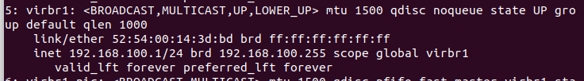 

Mô hình đường đi được biểu thị như sau 
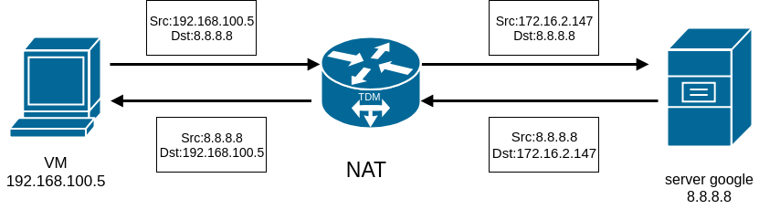 
<h2 style="color:orange">2. Tạo NAT trên KVM</h2>

Trước tiên vào công cụ `virt-manager` trên thanh công cụ click vào `Edit` chọn `Connection Details` chọn `Virtual Networks` và click vào biểu tượng dấu cộng như bên dưới 
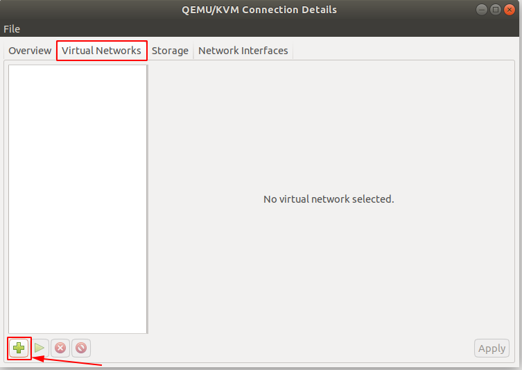 

Đặt tên cho mạng muốn tạo 
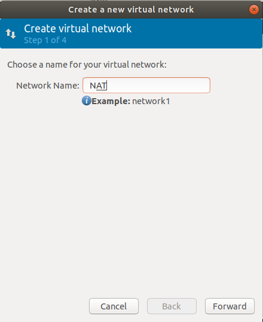 

Chọn dải mạng và địa dải địa chỉ IP cấp phát cho VM nếu dùng cấp phát DHCP hoặc dùng static thì tích vào ô enable static route definition. Sau đó click Forward. 
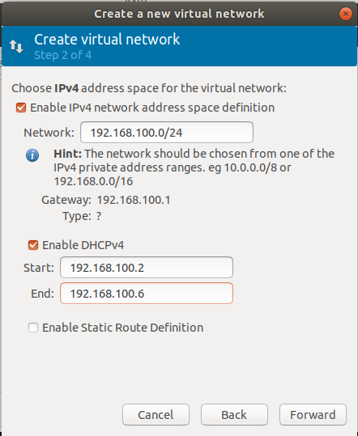 

Nếu bạn muốn sử dụng cả IPv6 thì click chọn ở đây. Ở đây tôi không sử dụng đến nó nên tôi không chọn 
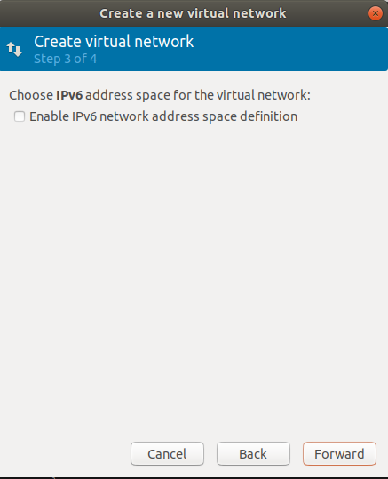 

Chỉ ra card mạng mà bạn muốn dùng nó để gắn vào virtual router để làm đường đi ra internet 
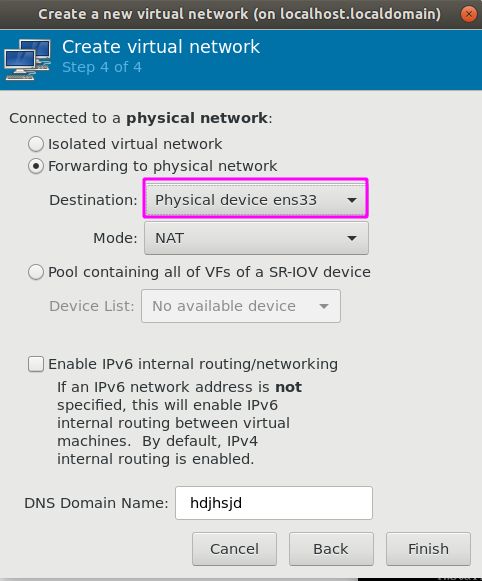 

Vào trong VM kết nối đến mạng này sau đó reboot lại VM 
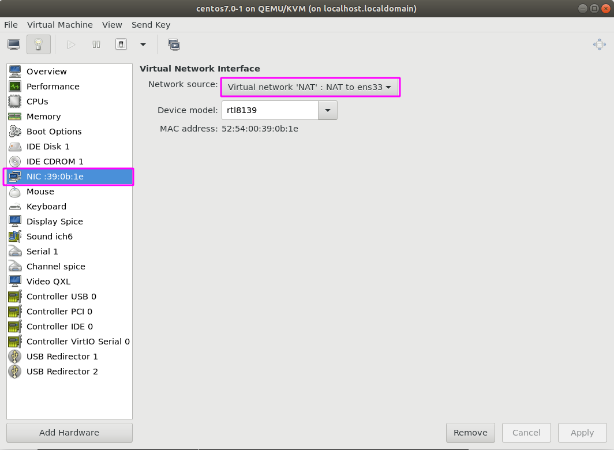 

Ta có thể kiểm tra VM đã nhận đúng dải mạng 
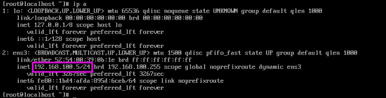 
<h1 style="color:orange">Bridge</h1>
<h2 style="color:orange">1. Cấu trúc</h2>

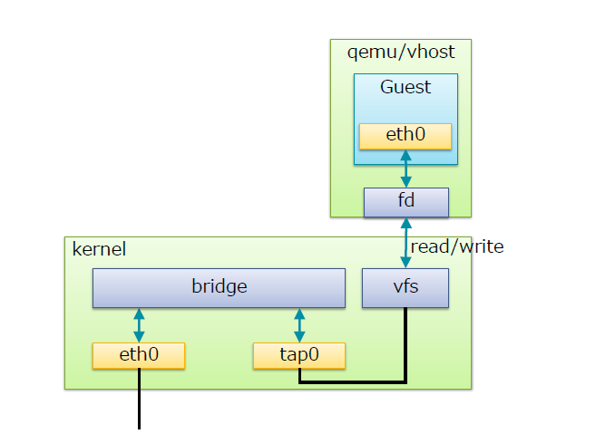 

Trong đó:
- Bridge ở đây là switch ảo
- Tap hay tap interface là giao diện mạng để các VM kết nối với switch do Linux bridge tạo ra(nó hoạt động ở lớp 2 của mô hình OSI)
- fd: Forward data có nhiệm vụ chuyển dữ kiệu từ VM tới switch.
Switch ảo do Linux bridge tạo ra có chức năng tương tự với 1 con switch vật lý.

Switch ảo do Linux bridge tạo ra có chức năng tương tự với 1 con switch vật lý. 
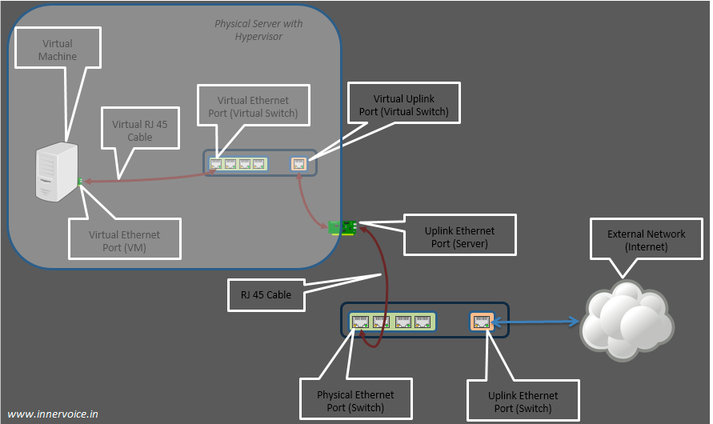 
Ta có thể thấy rõ hơn cách kết nối của VM ra ngoài internet. Khi máy vật lý của ta có card mạng kết nối với internet(không phải card wireless). Trên switch ảo của ta sẽ phải có đường để kết nối ra ngoài internet(cụ thể là kết nối với card mạng của máy vật lý). Ta có thể hình dung card mạng trên máy vật lý sẽ được gắn trực tiếp vào switch ảo nên ta có thể thấy sau khi add switch ảo và card vật lý có cùng địa chỉ MAC. Và trên card vật lý sẽ không còn địa chỉ IP mà nó được gắn cho switch ảo.
<h2 style="color:orange">2. Tạo và quản lý linux bridge</h2>
CentOS7 đã được cài đặt sẵn module bridge. Dùng lệnh sau kiểm tra xem module đã được load chưa

    # modinfo bridge
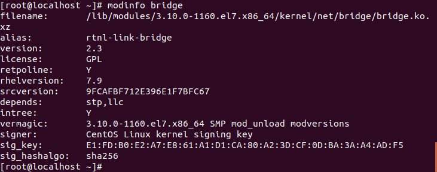 
Nếu module chưa được load, dùng lệnh sau để load:

    # modprobe --first-time bridge
Cài đặt bridge-utils để điều khiển network

    # yum install bridge-utils -y
<h2 style="color:orange">2. Tạo bridge trên KVM</h2>

Để tạo bridge, tạo 1 file `ifcfg-virbrN` thay N với 1 số, vd "0" trong "/etc/sysconfig/network-scripts/"

    # vim /etc/sysconfig/network-scripts/ifcfg-virbr0
Nếu muốn tạo 1 file có tên khác cho bridge, tạo 1 file mới tên `ifcfg-<tên
_bridge>. Đồng thời cũng đặt DEVICE=<tên_bridge> trong file config

Paste vào cấu hình sau trong file config
    
    DEVICE="virbr0"
    BOOTPROTO="static"
    IPADDR="192.168.206.175"
    NETMASK="255.255.255.0"
    GATEWAY="192.168.206.1"
    DNS1=8.8.8.8
    ONBOOT="yes"
    TYPE="Bridge"
    NM_CONTROLLED="no"
với 192.168.206.175 là địa chỉ muốn đặt tĩnh cho bridge trong dải đia chỉ dhcp 
Lưu ý: Bridge phải viết hoa chữ B đầu
<h3 style="color:orange">2.1. Trên card mạng chính</h3>

    # vim /etc/sysconfig/network-scripts/ifcfg-ens33
Paste vào cấu hình

    DEVICE=eno16777736
    TYPE=Ethernet
    BOOTPROTO=none
    ONBOOT=yes
    NM_CONTROLLED=no
    BRIDGE=virbr0
Restart network

    # systemctl restart network
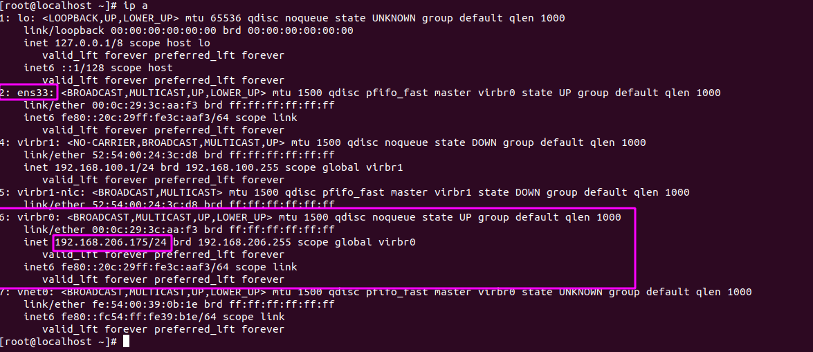 
<h2 style="color:orange">3. Trên máy ảo</h2>
Trên KVM

    # virt-manager
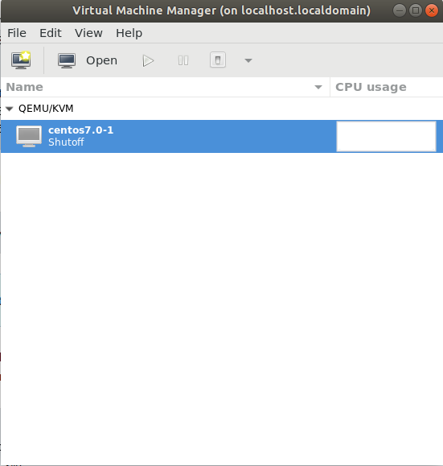 
Chọn Edit -> Virtual Machine Details

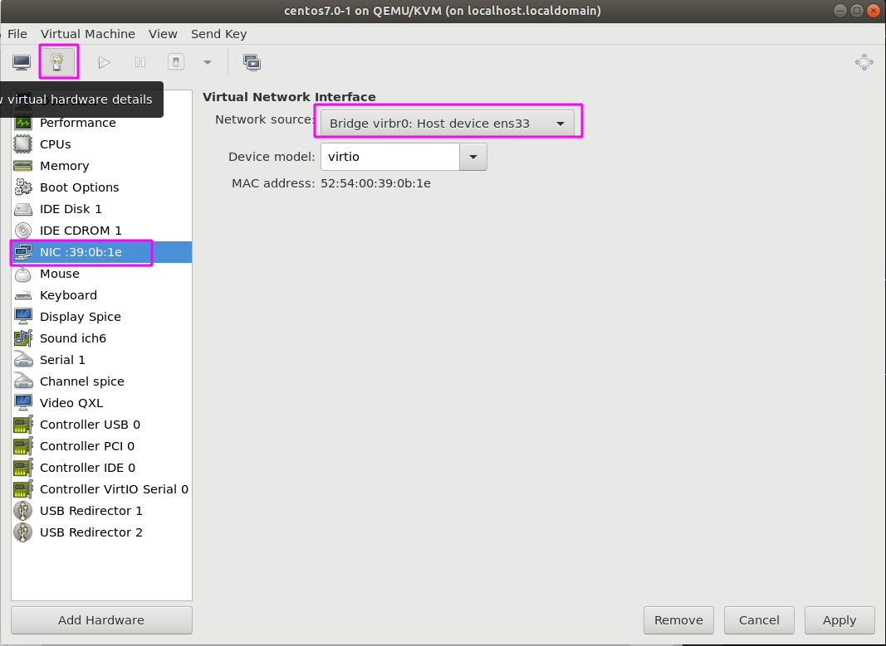 
Show virtual machine hardware details -> chọn card mạng -> network source: bridge virbr0: Host device ens33 vừa tạo.

Vào máy ảo kiểm tra: 
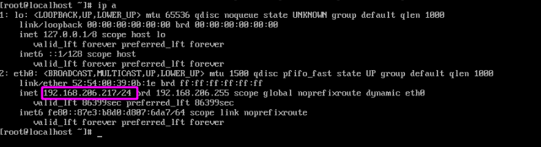 
Máy ảo đã nhận ip của dải bridge.

<h2 style="color:orange">4. Nơi cấp dhcp cho NAT và Bridge</h2>
Ta thấy được sự khác biệt của NAT MODE và Bridge MODE trong KVM là: Khi sử dụng kiểu mạng NAT thì nơi cấp DHCP cho VM chính là NAT cấp cho VM. Còn khi sử dụng kiểu mạng bridge thì Bridge không thể cấp DHCP cho VM mà router nơi ta cắm mạng vào PC mới có thể cấp DHCP.