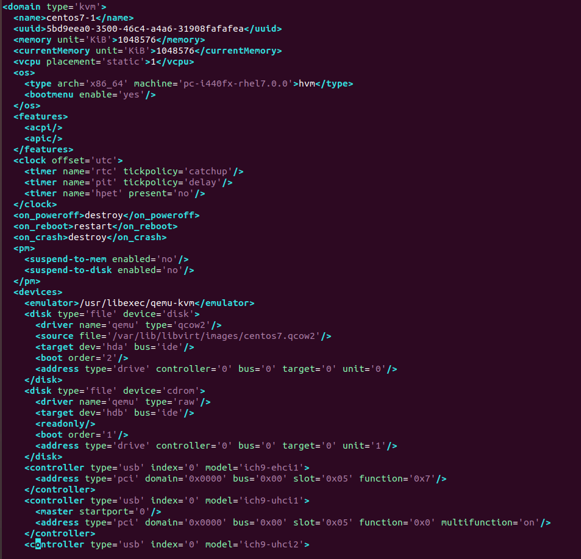
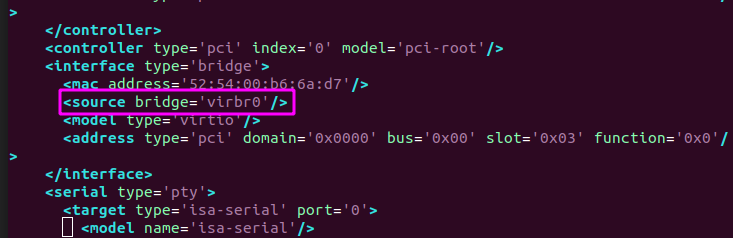

<h1 style="color:orange">File XML</h1>

Mặc định khi tạo máy ảo file lưu trữ thông tin máy sẽ được lưu trong `/etc/libvirt/qemu/`; file còn lại là storage được lưu trong `/var/lib/libvirt/images` 
Nội dung file 1 file lưu trữ thông tin máy ảo (host, KVM guest):

 

Trong đó : 
- domain: thẻ không thể thiếu trong file domain xml. `type` cho biết loại hypervisor đang sử dụng.
- name: tên máy ảo, ở đây là centos7-1
- uuid: Mã nhận dạng quốc tế duy nhất cho máy ảo. Format theo RFC 4122. Nếu thiếu trường uuid khi khởi tạo, mã này sẽ tự động generate.
- memory = max memory: dung lượng tối đa RAM có thể sử dụng, ở đây là 1 Gib
- currentMemory: DUng lượng RAM thực tế đang được sử dụng, ở đây là 1 Gib
- vcpu placement='static': số lượng vCPU của máy, ở đây là 1 core.
- source: đường dẫn tới ổ ddiax: /var/lib/libvirt/images/centos7.qcow2
- Máy ảo được boot từ CDROM, sử dụng Linux Bridge virbr0 
 