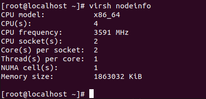
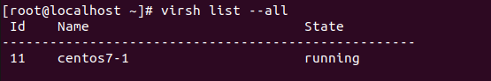
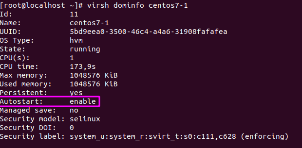
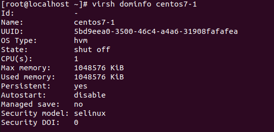
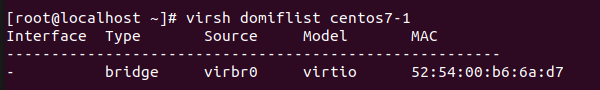
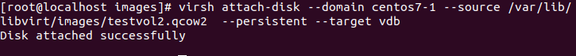
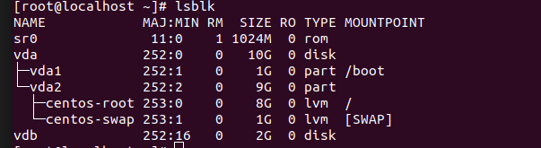
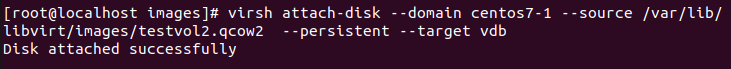

<h1 style="color:orange">Các lệnh virsh-command</h1>
Cấu hình cơ bản của virsh command

    # virsh [OPTION]... <command> <domain> [ARG]...

<h2 style="color:orange">1. Xem thông tin KVM host</h2>

    # virsh nodeinfo
 
<h2 style="color:orange">2. Danh sách các domains (KVM guest)</h2>

    # virsh list --all 
 
<h2 style="color:orange">3. Danh sách các domains đang được bật (KVM guest)</h2>

    # virsh list
<h2 style="color:orange">4. bật VM</h2>

    # virsh start centos7-1
Trong đó centos7-1 là tên VM
<h2 style="color:orange">5. bật VM khi bật máy host</h2>

    # virsh autostart centos7-1
Trong đó centos7-1 là tên VM

    # virsh dominfo centos7-1
để kiểm tra thông tin VM

 
Autostart: enable
<h2 style="color:orange">6. Disable autostart</h2>

    # virsh autostart --disable centos7-1
    # virsh dominfo centos7-1
để kiểm tra lại
<h2 style="color:orange">7. Để tắt VM</h2>

    # virsh shutdown centos7-1
    # virsh list
để kiểm tra
 
    # virsh destroy centos7-1
để force quit vm

    # for i in `sudo virsh list | grep running | awk '{print $2}'` do sudo virsh shutdown $i
<h2 style="color:orange">8. reboot VM</h2>

    # virsh reboot centos7-1
để restart VM
<h2 style="color:orange">9. remove VM</h2>
Để xóa 1 vm bao gồm cả các volume storage, dùng những dòng lệnh sau:

    # sudo virsh destroy centos7-1 2> /dev/null
    # sudo virsh undefine centos7-1
    # sudo virsh pool-refresh default
    # sudo virsh vol-delete --pool default centos7.qcow2
TRong ví dụ này, storage volume có tên là /var/lib/libvirt/images/centos7.qcow2
<h2 style="color:orange">10. Suspend máy ảo</h2>

Để suspend một máy ảo:

    # virsh suspend centos7-1
Lưu ý : Khi một domain đang trong trạng thái suspend, nó vẫn tiêu thụ RAM, Disk nhưng I/O ko hoạt động. Điều kiện, máy ảo phải đang được bật.

Để resume lại máy ảo khi đã bị suspend :

    # virsh resume centos7-1
<h2 style="color:orange">11. Chỉnh sửa thông số máy ảo</h2>

    # virsh edit centos7-1
sau khi chỉnh sửa cập nhật lại cấu hình :

    # virsh define /etc/libvirt/qemu/centos7-1.xml
<h2 style="color:orange">12. Xóa máy ảo</h2>

    # virsh destroy centos7-1
    # virsh undefine /etc/libvirt/qemu/centos7-1.xml
Sau khi xóa máy ảo, chọn có xóa image không. Nếu xóa image:

    # rm -rf /vả/lib/libvirt/images/centos7.qcow2
Ở đây file storage là centos7.qcow2
<h2 style="color:orange">13. Save máy ảo</h2>
Để save tình trạng hoạt động của máy

    # virsh save centos7-1.save
để quay lại bản save từ file:
    
    # virsh restore centos7-1.save
<h1 style="color:orange">Các lệnh kiểm tra thông tin</h1>
<h2 style="color:orange">1. Xem file .xml máy ảo</h2>

    # virsh dumpxml centos7-1
Tương tự lệnh cat 
<h2 style="color:orange">2. Xem thông tin máy ảo</h2>

    # virsh dominfo centos7-1
 
<h2 style="color:orange">3. Xem các cổng máy ảo</h2>

    # virsh domiflist centos7-1
 
<h1 style="color:orange">Các thao tác clone</h1>

    # virt-clone -o centos7-1 -n centos7-2 -f /var/lib/libvirt/images/centos7-2.qcow2
Ở đây tên máy đích là centos7-1, tên máy được clone ra là centos7-2 với disk image là centos7-2.qcow2.
<h1 style="color:orange">Các thao tác snapshot</h1>
<h2 style="color:orange">1. Tạo snapshot</h2>

    # virsh snapshot-create-as --domain centos7-1 --name "Begin" --description "ban khoi tao"
<h2 style="color:orange">2. Show các snapshot đã tạo</h2>

    # virsh snapshot-list centos7-1
Xem thông tin chi tiết các snapshot đã tạo

    # virsh snapshot-info centos7-1 --snapshotname "Begin"
<h2 style="color:orange">3. Reverse lại 1 snapshot đã tạo</h2>

    # virsh snapshot-revert centos7-1 --snapshotname "Begin"
<h2 style="color:orange">4. Xóa 1 snapshot đã tạo</h2>

    # virsh snapshot-delete centos7-1 --snapshotname "Begin"
<h1 style="color:orange">Console máy ảo</h1>

1. Đăng nhập trên máy ảo

       # vi /etc/default/grub
chỉnh sửa
    
    GRUB_TERMINAL_OUTPUT="serial"
    GRUB_SERIAL_COMMAND="serial --unit=0 --speed=115200 --word=8 --parity=no --stop=1"
    :x!

    grub2-mkconfig -o /boot/grub2/grub.cfg
reset máy init 6

2. Start dịch vụ trên máy ảo để host có thể console

       # systemctl enable serial-getty@ttyS0.service
       # systemctl start serial-getty@ttyS0.service
3. Trên KVM host, thực hiện lệnh :

       # virsh console centos7-1
Để thoát kvm console nhấn tổ hợp phím Crtl+Shift+]

<h1 style="color:orange">Quản lý volumes</h1>
<h2 style="color:orange">1. Tạo volume</h2>

Để tạo 1 volume 2Gb tên là test_vol2 

    # sudo virsh vol-create-as default  test_vol2.qcow2  2G
    # du -sh * /var/lib/libvirt/images/ để kiểm tra
Trong đó :
- default: là pool name
- test_vol2: là tên volume
- 2G là dung lượng ổ ảo
<h2 style="color:orange">2. Xóa volume</h2>

    # sudo virsh vol-delete test_vol2.qcow2 --pool default
    # sudo virsh pool-refresh  default
    # sudo virsh vol-list default (để kiểm tra)
<h2 style="color:orange">3. Đính volume vào máy ảo</h2>

    # virsh attach-disk --domain centos7-1 --source /var/lib/libvirt/images/test_vol2.qcow2 --persistent --target vdb
Trong đó :
- --persistent: hỗ trợ hot swap (lắp ổ cứng khi máy đang bật)
- --target vdb: disk device trong máy ảo
 

Vào máy ảo để kiểm tra
 
<h2 style="color:orange">3. Gỡ volume khỏi máy ảo</h2>

    # sudo virsh detach-disk --domain centos7-1 --persistent --live --target vdb
 
<h2 style="color:orange">4. Thêm dung lượng cho volume</h2>
Có thể thêm dung lượng cho image trực tiếp bằng lệnh

    # sudo qemu-img resize /var/lib/libvirt/images/centos7.qcow2 +1G
    # sudo qemu-img resize /var/lib/libvirt/images/testvol2.qcow2 +1G
<h2 style="color:orange">5. Điều chỉnh số CPU máy ảo</h2>
Những câu lệnh sau điều chỉnh cpu ảo cho máy ảo

    # sudo virsh setvcpus --domain centos7-1 --maximum 2 --config
    # sudo virsh setvcpus --domain centos7-1 --count 2 --config
    # sudo virsh reboot centos7-1
    # virsh dominfo centos7-1 (để kiểm tra)
<h2 style="color:orange">6. Điều chỉnh RAM máy ảo</h2>

    # sudo virsh setmaxmem test 2048 --config
    # sudo virsh setmem test 2048 --config
    # sudo virsh reboot test

Ngoài ra có thể điều chỉnh RAM lẫn CPU trong file .xml của máy ảo

    # virsh edit centos7-1
sau khi chỉnh sửa cập nhật lại cấu hình :

    # virsh define /etc/libvirt/qemu/centos7-1.xml
<h2 style="color:orange">7. Xem địa chỉ ip của máy ảo mà không cần virt-manager hay console</h2>

    # virsh start Centos7-test
    # virsh domifaddr Centos7-test
Điều kiện là phải start vm có tên Centos7-test trước.