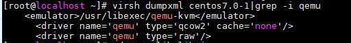
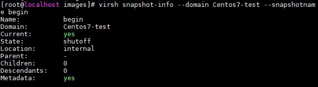

<h1 style="color:orange">Snapshot KVM</h1>

Câu lệnh tạo snapshot KVM sử dụng snapshot-create-as:

    # virsh snapshot-create-as --domain {VM-NAME} --name "{SNAPSHOT-NAME}"
Trong đó, 
- --domain {VM-NAME}: Domain name/VM name/id/uuid
- --name "{SNAPSHOT-NAME}": Tên bản snapshot
<h2 style="color:orange">1. Để xem các snapshot 1 VM (1 domain)</h2>

    # virsh snapshot-list --domain Centos7-test
Trong đó tên vm là Centos7-test

Lưu ý : chỉ ổ sử dụng qcow2 mới hỗ trợ snapshot

    # virsh dumpxml Centos7-test | grep -i qemu

<h2 style="color:orange">2. Để xem các snapshot 1 VM (1 domain)</h2>

    # virsh snapshot-list --domain Centos7-test
<h2 style="color:orange">2.Tạo snapshot</h2>

    # virsh snapshot-create-as --domain Centos7-test --name "begin" --description "Snapshot before upgrading" --live
Lệnh này tạo snapshot với 1 vm đang chạy. Điều này chỉ capture trạng thái của disk chứ không phải trạng thái RAM đang chạy.

Nếu bỏ option --live đi thì phải tắt máy mới có thể tạo snapshot
<h2 style="color:orange">3. Xem chi tiết snapshot</h2>

    # virsh snapshot-info --domain Centos7-test --snapshotname begin

<h2 style="color:orange">4. Revert snapshot</h2>

    # virsh snapshot-revert --domain Centos7-test --snapshotname begin --running
Option --running là khởi động vm ngay khi revert
<h2 style="color:orange">5. Xóa snapshot</h2>

    # virsh snapshot-delete --domain Centos7-test --snapshotname begin
<h2 style="color:orange">6. Snapshot trạng thái disk nhưng không snapshot trạng thái vm (RAM đang chạy)</h2>

    # virsh snapshot-create-as --name "snap01" --description "RHEL 7.6 snapshot" --disk-only --live --domain Centos7-test
<h2 style="color:orange">7. virsh help</h2>

    # virsh help snapshot-create-as
để xem các option snapshot.
<h2 style="color:orange">8. Vị trí lưu file snapshot</h2>
Mặc định file snapshot được lưu trong:

    # /var/lib/libvirt/qemu/snapshot
dưới dạng file xml, file này chứa metadata của snapshot để phục hồi lại trạng thái vm mỗi khi revert file.