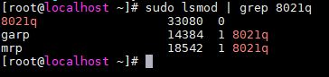
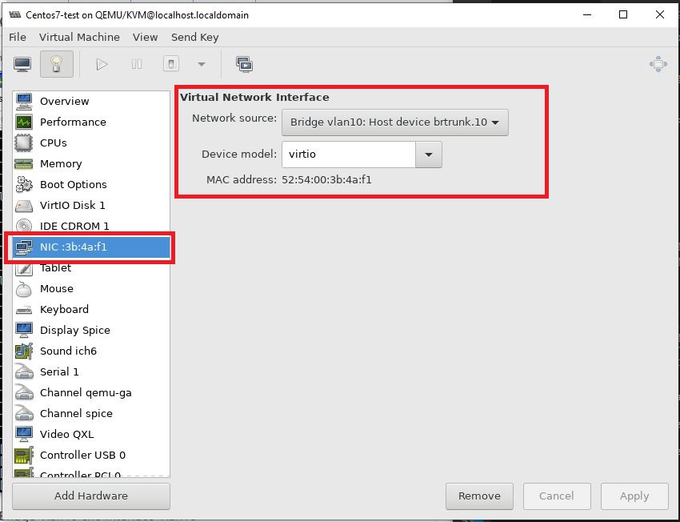
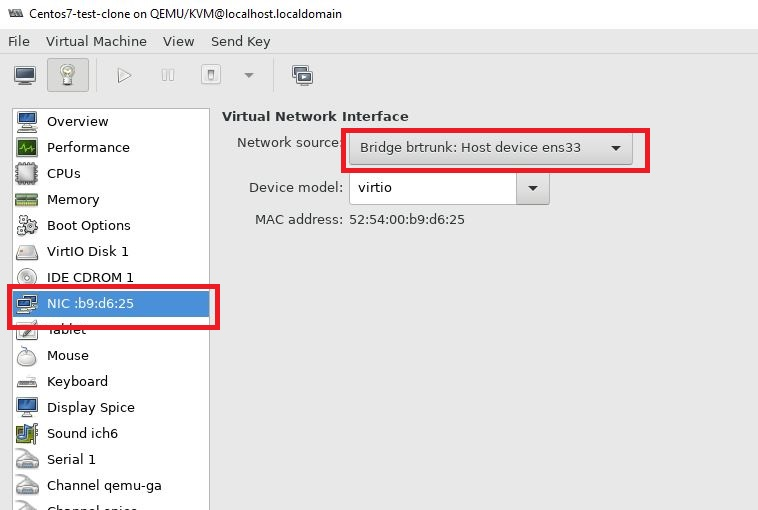
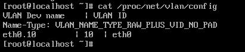
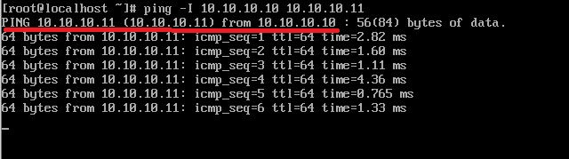
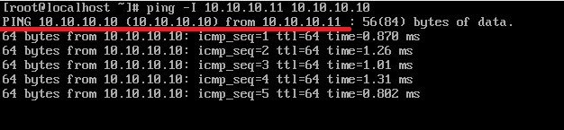
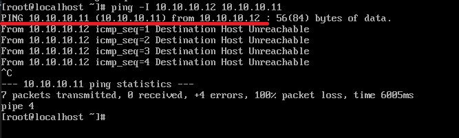

<h1 style="color:orange">LAB 1</h1>
Mô hình thí nghiệm: 

Các máy 1,2,3,4 đều dùng OS Centos7 là máy ảo nằm trên server KVM Centos7 có card mạng ens33
- Bridge brtrunk là switch ảo được gắn card ens33
- interface brtrunk.10 là interface nằm trên switch brtrunk được gắn tag vlan 10.
- bridge vlan 10 là switch ảo được tạo ra được gắn với interface brtrunk.10
- Máy 1 được nối vào switch vlan 10 có địa chỉ: 10.10.10.10/24
- Máy 2 được nối trực tiếp vào switch brtrunk có địa chỉ: 10.10.10.11/24
<h2 style="color:orange">1. Mô tả mục đích</h2>
Cấu hình máy 1 và 2 vào vlan 10 để các máy khác ngoài vlan10 không thể giao tiếp với 2 máy 1 và 2.

- Các bridge (switch) được tạo ra mặc định chạy mode trunking, chứ không chạy mode access nên không cần vào hẳn switch cấu hình access vlan chạy qua interface nào.
- Vlan chạy trong Centos7 sử dụng các tag vlan để hoạt động. Đối với máy 1 là tag vlan nằm trên interface brtrunk.10 -----> những máy ảo nào nối với bridge vlan10 ----> auto kết nối với vlan10. Đối với máy 2, chúng ta đánh tag vlan vào interface eth0 bằng cách tạo interface eth0.10

Lưu ý : máy 3 khi nối vào bridge vlan10 ----> auto vào vlan10.
<h2 style="color:orange">2. Trên server KVM</h2>
Kiểm tra xem kernel đã load module 802.1q chưa. Module 802.1q là chuẩn để chạy nhiều VLAN trong server. Với tính năng này, switch có thể tách biệt các package trong đường truyền bởi các gói tin được đánh tag VLAN id.

    # sudo lsmod|grep 8021q
 
Nếu server chưa load chuẩn 802.1q ----> dùng lệnh sau để load:

    # sudo modprobe 8021q
Tuy vậy khi server reboot thì sẽ phải load lại. Để cấu hình chuẩn 802.1q load cùng server:

    # vim /etc/modules-load.d/modules.conf
paste vào

    8021q
phân quyền cho file vừa tạo
    
    # chmod +x /etc/modules-load.d/modules.conf
<h3 style="color:orange">2.1. Tạo bridge brtrunk</h3>

    # vim /etc/sysconfig/network-scripts/ifcfg-brtrunk
paste vào

    DEVICE=brtrunk
    TYPE=Bridge
    BOOTPROTO=none
    ONBOOT=yes
    NM_CONTROLLED=no
Lưu ý : Type=Bridge; Bridge viết hoa chữ cái đầu 
NM_CONTROLLED=no: Network manager không điều khiển switch. Thiếu dòng này sẽ có lỗi.
<h3 style="color:orange">2.2. Cắm ens33 vào bridge brtrunk</h3>

    # vim /etc/sysconfig/network-scripts/ifcfg-ens33
thêm các dòng

    TYPE=Ethernet
    BOOTPROTO=none
    NAME=ens33
    DEVICE=ens33
    ONBOOT=yes
    BRIDGE=brtrunk
    NM_CONTROLLED=no
<h3 style="color:orange">2.3. Tạo interface vlan10 trên bridge brtrunk</h3>

    # vim /etc/sysconfig/network-scripts/ifcfg-brtrunk.10
paste vào

    DEVICE=brtrunk.10
    BOOTPROTO=none
    ONBOOT=yes
    VLAN=yes
    BRIDGE=vlan10
    TYPE=Ethernet
    NM_CONTROLLED=no
<h3 style="color:orange">2.4. Tạo bridge vlan10 nối vào interface brtrunk.10</h3>

    # vim /etc/sysconfig/network-scripts/ifcfg-vlan10
paste vào

    DEVICE=vlan10
    TYPE=Bridge
    BOOTPROTO=none
    ONBOOT=yes
    NM_CONTROLLED=no
<h2 style="color:orange">3. Nối các VM với switch vừa tạo</h2>
<h3 style="color:orange">3.1. Máy 1 (10.10.10.10)</h3>
Trên server KVM:

    # virt-manager
Nối máy 1 với bridge vlan10 
 

Đặt địa chỉ ip

    # vim /etc/sysconfig/network-scripts/ifcfg-eth0
paste vào

    IPADDR=10.10.10.10
    NETMASK=255.255.255.0
    NETWORK=10.10.10.0
Lưu ý : vì máy 1 đã được gắn vào bridge vlan10 có tag vlan10 nên không cần đánh tag hay cấu hình gì thêm
<h3 style="color:orange">3.2. Máy 2 (10.10.10.11)</h3>
Trên server KVM

    # virt-manager
Nối máy 2 với bridge brtrunk 
 

Kiểm tra xem kernel đã load module 802.1q chưa.

    # sudo lsmod|grep 8021q
 
Nếu server chưa load chuẩn 802.1q ----> dùng lệnh sau để load:

    # sudo modprobe 8021q
Tuy vậy khi server reboot thì sẽ phải load lại. Để cấu hình chuẩn 802.1q load cùng server:

    # vim /etc/modules-load.d/modules.conf
paste vào

    8021q
phân quyền cho file vừa tạo
    
    # chmod +x /etc/modules-load.d/modules.conf
<h3 style="color:orange">3.2.1 Cấu hình network trên máy 2 (10.10.10.10)</h3>

    # vim /etc/sysconfig/network-scripts/ifcfg-eth0
paste vào

    BOOTPROTO="none"
    DEVICE="eth0"
    ONBOOT="yes"
    TYPE="Ethernet"
Tạo interface eth0.10 đánh tag vlan10

    DEVICE=eth0.10
    BOOTPROTO=none
    ONBOOT=yes
    IPADDR=10.10.10.11
    NETMASK=255.255.255.0
    NETWORK=10.10.10.0
    VLAN=yes
Tạo file configuration rule cho vlan10

    # /etc/sysconfig/network-scripts/rule-eth0.10
    thêm vào
    from 10.10.10.0/24 tab 1 priority 500
Tạo file route configuration cho vlan10

    # /etc/sysconfig/network-scripts/route-eth0.10
    thêm vào 
    default via 10.10.10.1 dev eth0.10 table 1
Cấu hình sysctl cho phép packet forwarding trên server:

    # vim /etc/sysctl.d/99-sysctl.conf
    thêm vào
    net.ipv4.ip_forward=1
    net.ipv4.conf.all.arp_filter=0
    net.ipv4.conf.all.rp_filter=2
Áp dụng những thay đổi vừa xong

    # sudo sysctl -p /etc/sysctl.d/99-sysctl.conf
    # init 6
Kiểm tra interface vlan

    # cat /proc/net/vlan/config
 

    # systemctl restart network
<h3 style="color:orange">4. Kiểm tra</h3>
Trên máy 1 và máy 2 ping qua lại nhau

 
 

Tạo máy 4 nối thẳng với brtrunk đặt địa chỉ 10.10.10.12 nhưng không cấu hình vlan10 như máy 2.

Tiến hành ping máy 2:
 
Ta thấy mặc dù cắm chung 1 switch nhưng máy 4 không nhìn thấy máy 2 và ngược lại; vì không chung 1 vlan 
------> Cấu hình thành công