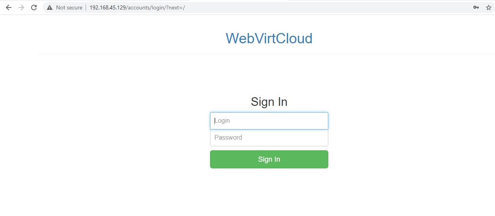
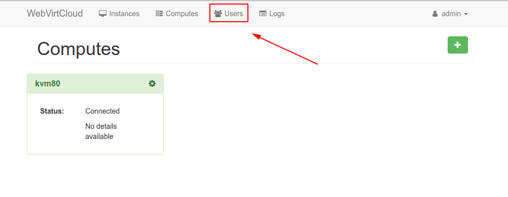
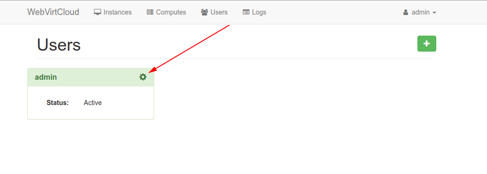
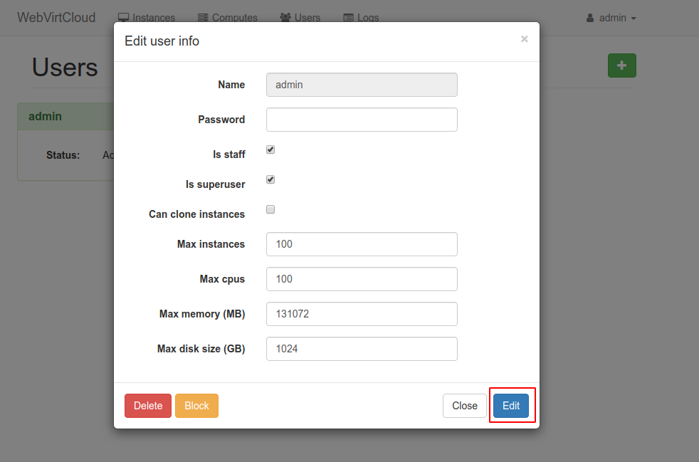
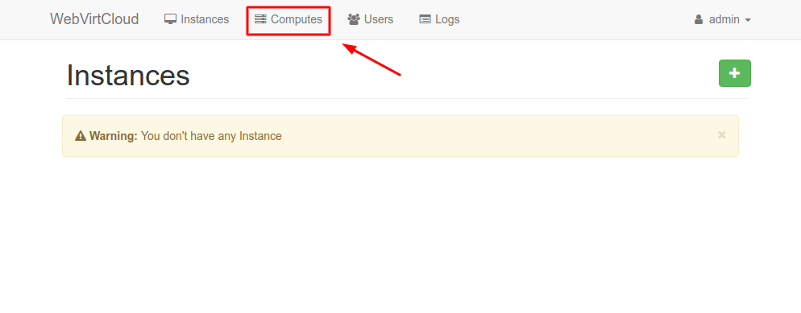
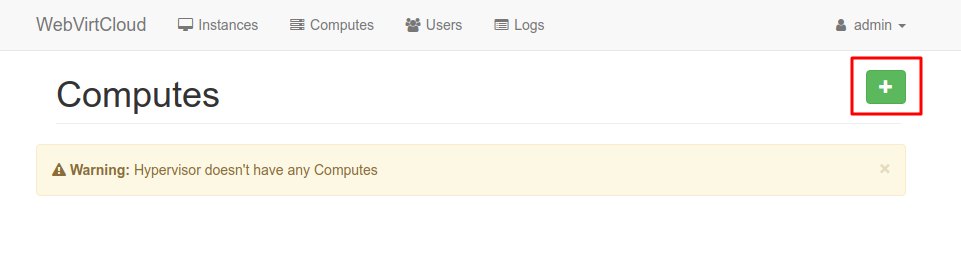
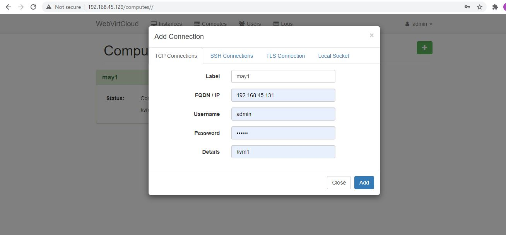

<h1 style="color:orange">Cài đặt webvirtcloud</h1>
Webvirtcloud là phần mềm dùng để quản lý KVM tương tự virt-manager; tuy vậy có nhiều lời thế hơn.
<h2 style="color:orange">1. Chuẩn bị</h2>
Server KVM: 192.168.45.131/24 
Server webvirtcloud: 192.168.45.129/24 
2 server sử dụng Centos 7.9.2009. 

Tuy vậy có thể cài bản mới nhất của webvirtcloud trên centos8 và debian [tại đây](https://github.com/retspen/webvirtcloud)
<h2 style="color:orange">2. Trên webvirtcloud server</h2>
Cài các packages cần thiết

    # yum install epel-release -y
    yum -y install python-virtualenv python-devel libvirt-devel glibc gcc nginx supervisor python-lxml git python-libguestfs
webvirtcloud sử dụng nginx để quản lý qua web
<h3 style="color:orange">2.1. Tạo thư mục và clone source từ trang chủ về</h3>

    # cd /srv
    # git clone https://github.com/retspen/webvirtcloud && cd webvirtcloud
    # git checkout 1e2fbc8
    # cp webvirtcloud/settings.py.template webvirtcloud/settings.py
<h3 style="color:orange">2.2. Thay thế secret key trong file settings.py</h3>

    # vim /srv/webvirtcloud/settings.py

    SECRET_KEY = 'Huy123'
<h3 style="color:orange">2.3. Cài đặt webvirtcloud</h3>

    # virtualenv venv
    # source venv/bin/activate
    # venv/bin/pip install -r conf/requirements.txt
    # cp conf/nginx/webvirtcloud.conf /etc/nginx/conf.d/
    # venv/bin/python manage.py migrate
<h3 style="color:orange">2.4. Cấu hình supervisor</h3>
Thêm các cấu hình sau vào cuối file /etc/supervisord.conf

    # vi /etc/supervisord.conf
Thêm đoạn code sau vào cuối file.

    [program:webvirtcloud]
    command=/srv/webvirtcloud/venv/bin/gunicorn webvirtcloud.wsgi:application -c /srv/webvirtcloud/gunicorn.conf.py
    directory=/srv/webvirtcloud
    user=nginx
    autostart=true
    autorestart=true
    redirect_stderr=true

    [program:novncd]
    command=/srv/webvirtcloud/venv/bin/python /srv/webvirtcloud/console/novncd
    directory=/srv/webvirtcloud
    user=nginx
    autostart=true
    autorestart=true
    redirect_stderr=true
<h3 style="color:orange">2.5. Cấu hình nginx</h3>

    vim /etc/nginx/nginx.conf
Comment toàn bộ đoạn sau

    #    server {
    #        listen       80 default_server;
    #        listen       [::]:80 default_server;
    #        server_name  _;
    #        root         /usr/share/nginx/html;
    #
    #        # Load configuration files for the default server block.
    #        include /etc/nginx/default.d/*.conf;
    #
    #        location / {
    #        }
    #
    #        error_page 404 /404.html;
    #            location = /40x.html {
    #        }
    #
    #        error_page 500 502 503 504 /50x.html;
    #            location = /50x.html {
    #        }
    #    }

Sau đó chỉnh sửa file /etc/nginx/conf.d/webvirtcloud.conf

    # vim /etc/nginx/conf.d/webvirtcloud.conf
Xóa toàn bộ code và paste đoạn sau vào file

    upstream gunicorn_server {
        #server unix:/srv/webvirtcloud/venv/wvcloud.socket fail_timeout=0;
        server 127.0.0.1:8000 fail_timeout=0;
    }
    server {
        listen 80;

        server_name servername.domain.com;
        access_log /var/log/nginx/webvirtcloud-access_log; 

        location /static/ {
            root /srv/webvirtcloud;
            expires max;
        }

        location / {
            proxy_pass http://gunicorn_server;
            proxy_set_header X-Real-IP $remote_addr;
            proxy_set_heade X-Forwarded-for $proxy_add_x_forwarded_for;
            proxy_set_header Host $host:$server_port;
            proxy_set_heade X-Forwarded-Proto $remote_addr;
            proxy_connect_timeout 600;
            proxy_read_timeout 600;
            proxy_send_timeout 600;
            client_max_body_size 1024M;
        }
    }
<h3 style="color:orange">2.6. Phân quyền cho thư mục</h3>

    # chown -R nginx:nginx /srv/webvirtcloud
<h3 style="color:orange">2.7. Cấu hình firewall và SELinux</h3>

    # firewall-cmd --permanent --add-port=80/tcp
    # firewall-cmd --permanent --add-port=6080/tcp
    # firewall-cmd --reload
Nginx hoạt động trên port 80 và webvirtcloud trên port 6080

    # yum install policycoreutils-python -y
    # semanage permissive -a httpd_t

    # systemctl restart nginx
    # systemctl restart supervisord
    # systemctl enable nginx
    # systemctl enable supervisord
<h2 style="color:orange">3. Trên KVM server</h2>
Để có thể kết nối KVM đến WebvirtCloud, cần thêm một số bước sau:

    # vim /etc/libvirt/libvirtd.conf
Uncomment và chỉnh sửa những dòng sau

    listen_tls = 0
    listen_tcp = 1
    tcp_port = "16509"
    listen_addr = "0.0.0.0"
    auth_tcp = "none" 
Chỉnh sửa file /etc/sysconfig/libvirtd

    # vim /etc/sysconfig/libvirtd
    
    LIBVIRTD_ARGS="--listen"
Cấu hình firewalld

    # firewall-cmd --permanent --add-port=16509/tcp
    # firewall-cmd --permanent --add-port=5900-5999/tcp
    # firewall-cmd --reload

    # systemctl restart libvirtd
<h2 style="color:orange">4. Sử dụng webvirtcloud</h2>
Vào web:

    https://192.168.45.129

Nhập id và password mặc định: admin/admin
<h3 style="color:orange">4.1. đổi password</h3>

 
 
 
Nhập password và các trường bắt buộc ----> edit.
<h3 style="color:orange">4.2. Add compute</h3>

 
 
 
Nhập các thông số ---> edit
