<h1 style="color:orange">Cài đặt KVM trên CentOS7</h1>
<h2 style="color:orange">1. Chuẩn bị</h2>

- 1 máy chạy CentOS 7 có 4 CPU, 2GB RAM, 20GB disk 
- địa chỉ: 192.168.1.89 
- máy ảo để làm lab kvm được tạo trên phần mềm vmware: 
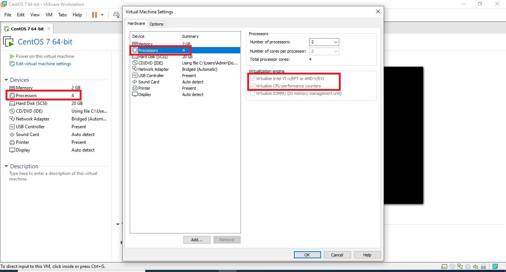 
Khi tạo máy phải cài máy ảo > 2CPU và tích vào phần hỗ trự VT-x và AMD cùng với CPU performance counters
<h2 style="color:orange">2. Cài đặt trên máy thật</h2>
<h3 style="color:orange">2.1. Kiểm tra máy có hỗ trợ ảo hóa</h3>

    # egrep -c "svm|vmx" /proc/cpuinfo
nếu kết quả lớn hơn 0 thì máy hỗ trợ ảo hóa
<h3 style="color:orange">2.2. Cài đặt các gói cần thiết</h3>

    # yum -y install qemu-kvm libvirt virt-install bridge-utils virt-manager
Trong đó:
- qemu-kvm: Phần phụ trợ cho KVM
- libvirt: cung cấp libvirt mà bạn cần quản lý qemu và KVM bằng libvirt.
- bridge-utils: chứa một tiện ích cần thiết để tạo và quản lý các thiết bị bridge
- virt-manager: cung cấp giao diện đồ họa để quản lý máy ảo
- virt-install: Cung cấp lệnh để cài đặt máy ảo

Sau khi cài xong các packages

    # lsmod|grep kvm
để kiểm tra module KVM 
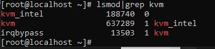 
<h3 style="color:orange">2.3. Bật libvirt</h3>

    # systemctl start libvirtd
    # systemctl enable libvirtd
Sau khi bật libvirtd, kiểm tra ta sẽ thấy máy xuất hiện 1 card mạng mới: 
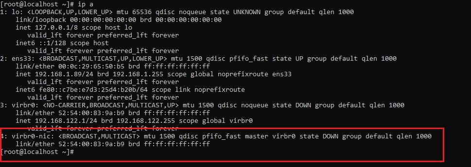 

Sử dụng nmtui để tạo file config cho card mạng này

    # nmtui
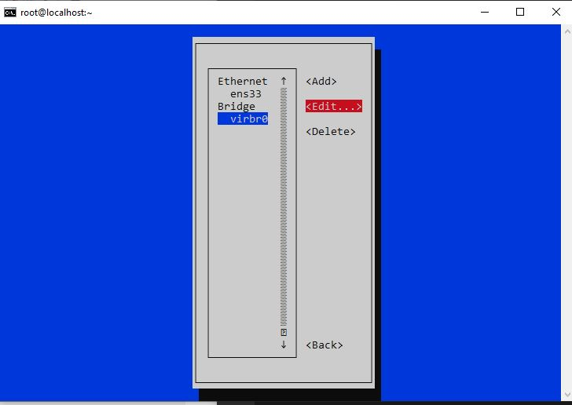 
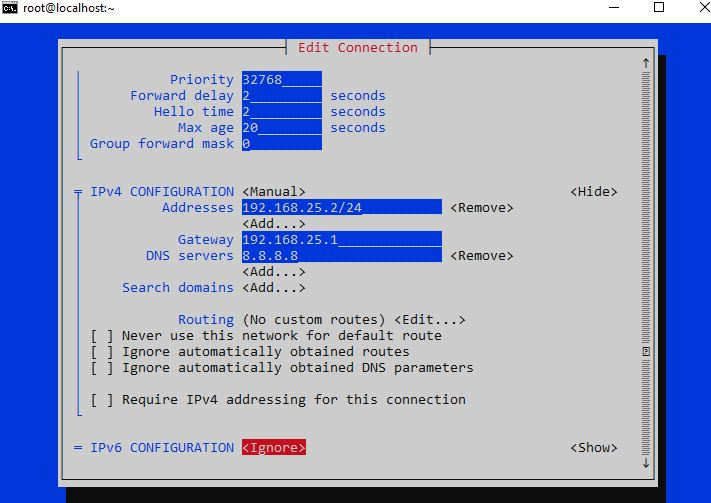 
Mặc định khi cài địa chỉ sẽ là 192.168.122.1, ta sẽ tạo 1 card bridge br0 ở chế độ NAT để khi tạo KVM sẽ gắn card mạng vào bridge này:

Sau khi save, 

    # vim /etc/sysconfig/network-script/ifcfg-virbr0
    chỉnh lại ONBOOT=yes
    # systemctl restart network
    để cấu hình được thực thi
    # ip a
    để kiểm tra
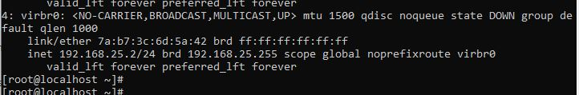 
<h2 style="color:orange">3. Sử dụng công cụ Virt-manager để cài VM</h2>
<h3 style="color:orange">3.1. Download file ISO Centos-7</h3>

    # cd /var/lib/libvirt/images
    # wget http://mirror.bizflycloud.vn/centos/7.9.2009/isos/x86_64/CentOS-7-x86_64-Minimal-2009.iso
Đối với bản Centos minimal thì để sử dụng công cụ đồ họa Virt-manager, ta cần cài gói X-window.

    # yum install "@X Window System" xorg-x11-xauth xorg-x11-fonts-* xorg-x11-utils -y
Lưu ý: vì cài bản Minimal nên OS không hỗ trợ GUI, chúng ta phải ssh vào máy muốn cài KVM với option -X để lấy GUI từ máy ssh vào

    # ssh -X root@192.168.1.89
Option -X là X11 forwarding là chương trình có sãn trên những OS UNIX-like 
Từ bây giờ, mọi hành động sẽ được thực hiện qua ssh 

Lưu ý: nếu như phải ssh qua window 10 thì phải dùng putty và Xming theo hướng dẫn sau: 
https://cets.seas.upenn.edu/answers/x11-forwarding.html 
https://superuser.com/questions/119792/how-to-use-x11-forwarding-with-putty 

<h3 style="color:orange">3.2. Truy cập Virt-manager để cấu hình VM</h3>

    # virt-manager
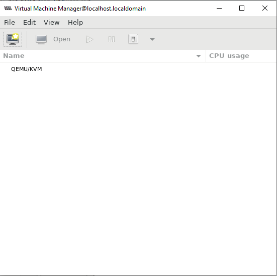 

1. Tạo máy ảo 
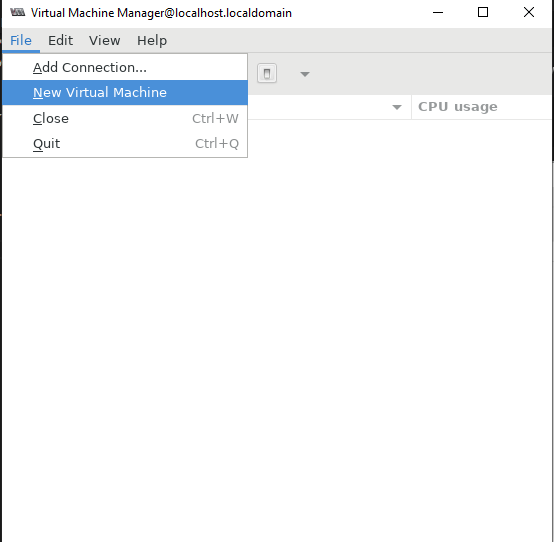 
2. Chọn kiểu cài đặt hệ điều hành 
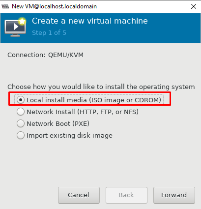 
3. Chọn đường dẫn file ISO ta đã tải ở trên: 
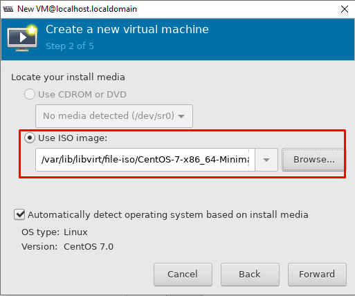 
4. Cài đặt các thông số cơ bản cho máy ảo: 
Lưu ý: Phần Network selection ta sẽ gắn card mạng vào bridge br0 
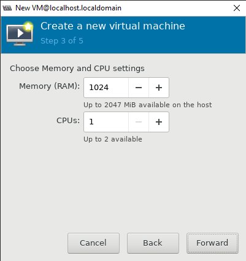 
Thiết lập RAM và CPU 
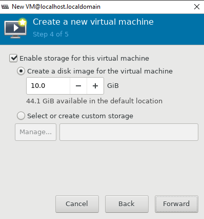 
Thiết lập Disk 
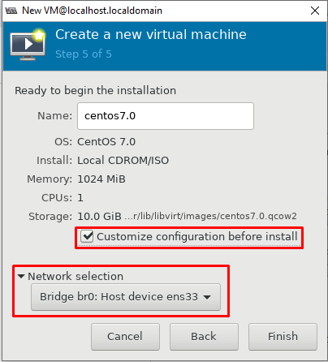 
Thông tin máy, network

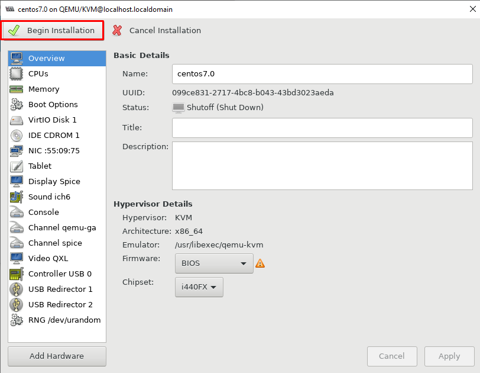 
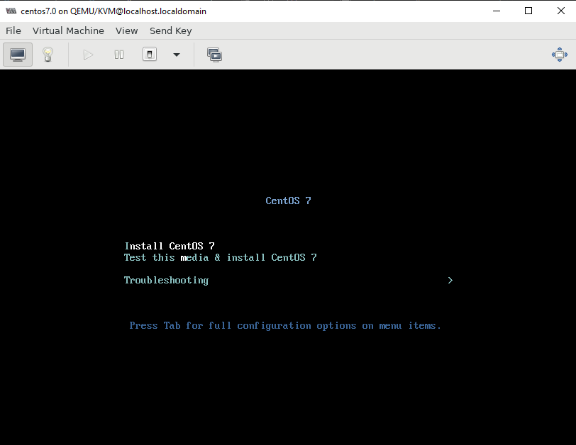 
Sau đó cài OS như bình thường
<h3 style="color:orange">3.3. Xem danh sách và trạng thái các máy ảo KVM</h3>

    # virsh list --all
để kiểm tra trạng thái máy ảo 
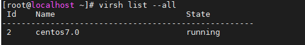 

<h2 style="color:orange">4. Đóng images</h2>

 
Click chuột phải vào QEMU/KVM chọn Details 

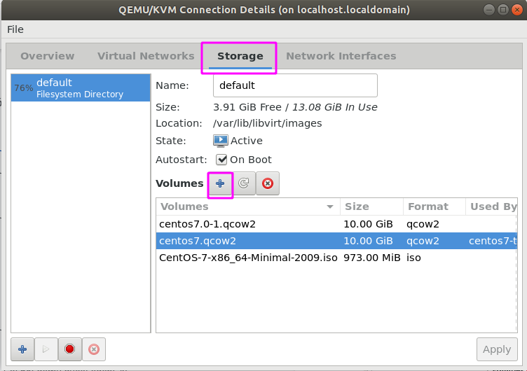 
Tạo 1 image mới

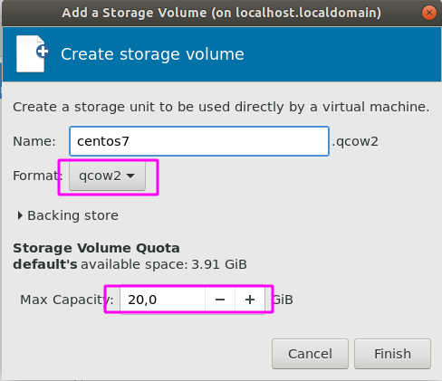 
Set dung lượng với định dạng qcow2
<h3 style="color:orange">4.1. Tạo máy ảo sử dụng image vừa tạo</h3>
Sau đó khi tạo máy ảo muốn dùng image này đến phần "select or create custom storage"

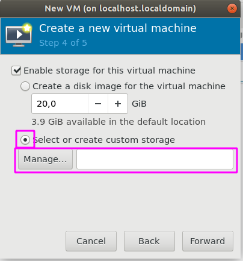 
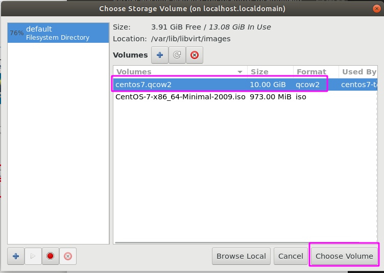 
Chọn image storage mà ta vừa tạo.

<h3 style="color:orange">4.2. Chỉnh thông số của KVM guest (máy ảo)</h3>

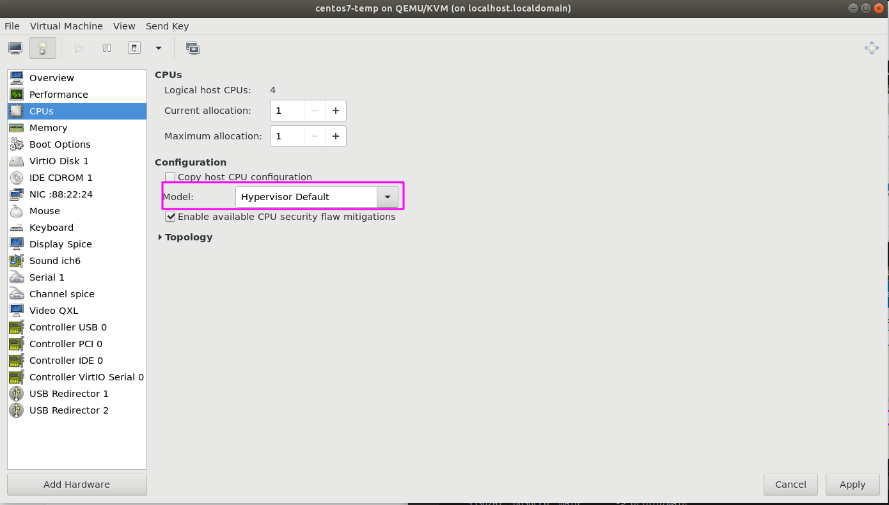 
Thông số CPU để hypervisor default

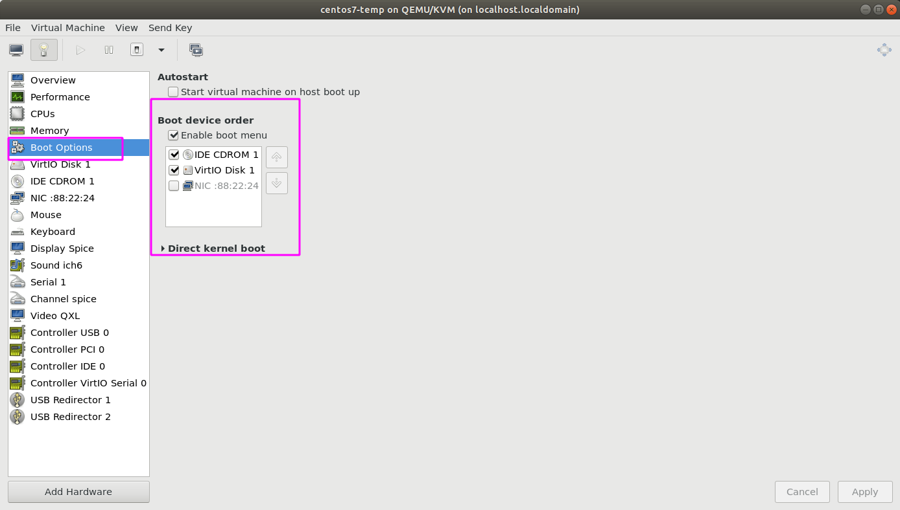 
Thứ tự boot máy ảo

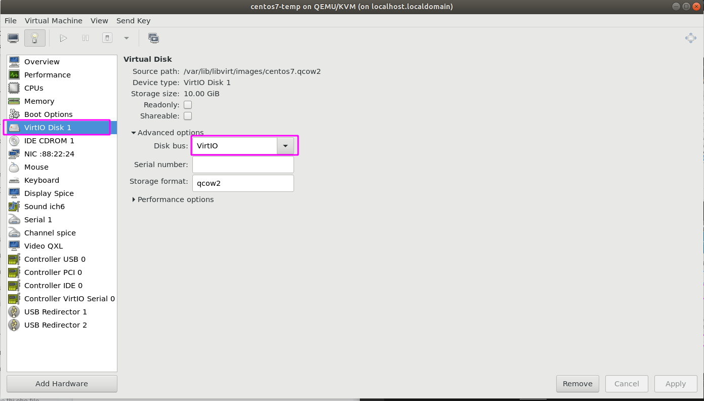 
Virsh disk để là Virti0

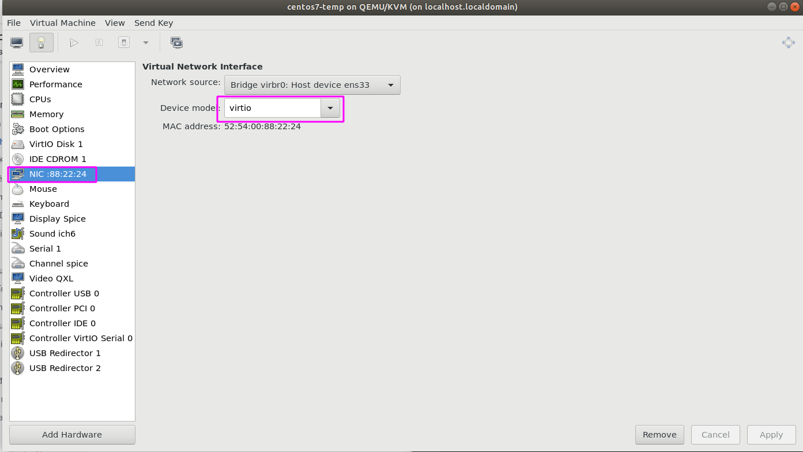 
Card NIC là Virti0

Tài liệu tham khảo: https://drive.google.com/drive/folders/1UGXK0tTHxC3iX7FXiQ3T2-clmacFjoIk
<h2 style="color:orange">5. Sử dụng công cụ Virsh command để cài VM</h2>
<h3 style="color:orange">5.
1. Cài package virt-install</h3>

    # yum install -y virt-install
<h3 style="color:orange">5.
2. cài máy ảo</h3>

    # virt-install \
      --name=Centos7-test \
      --vcpus=1 \
      --memory=512 \
      --cdrom=CentOS-7-x86_64-Minimal-1804.iso \
      --disk=/var/lib/libvirt/images/centos7-test,size=3 \
      --os-variant=rhel7 \
      --network bridge=virbr0

Trong đó :

- `--name` đặt tên cho máy ảo
- `--vcpus` số CPU tạo cho máy ảo
- `--memory` dung lượng RAM tạo cho máy ảo (đơn vị MiB)
- `--cdrom` chỉ ra đường dẫn đến file ISO. Nếu boot bằng cách khác dùng option --location sau đó chỉ ra đường dẫn đến file (có thể là đường dẫn đến file trên internet)
- `--disk` chỉ ra vị trí lưu disk của máy ảo.
size chỉ ra dung lượng disk của máy ảo (đơn vị GiB)
- `--os-variant` loại OS đang tạo. Option này có thể chỉ ra hoặc không nhưng nên sử dụng nó vì nó sẽ cải thiện hiệu năng của máy ảo sau này. Nếu bạn không biết HĐH bạn đang tạo thuộc loại nào bạn có thể tìm kiếm thông tin này bằng cách dùng lệnh osinfo-query os
- `--network` loại mạng mà VM sử dụng.