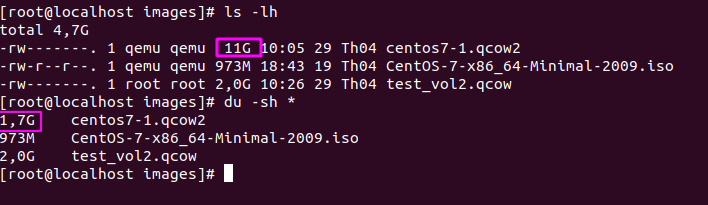

<h1 style="color:orange">Các định dạng file trong KVM</h1>
<h2 style="color:orange">1. Tổng quan file image trong KVM</h2>

- File Image là một file đóng gói hết tất cả nội dung của một đĩa CD/DVD vào trong nó.
- Trong KVM Guest có 2 thành phần chính đó là VM definition được lưu dưới dạng file xml tại `/etc/libvirt/qemu.` File này chứa các thông tin của máy ảo như tên, thông tin về tài nguyên của VM (RAM, CPU)… File còn lại là storage thường được lưu dưới dạng file image tại thư mục `/var/lib/libvirt/images.`
- 3 định dạng thông dụng nhất của file image sử dụng trong KVM đó là ISO, raw và qcow2.
<h2 style="color:orange">2. Định dạng file image phổ biến trong KVM</h2>
<h3 style="color:orange">2.1. File ISO</h2>

- File ISO là file ảnh của 1 đĩa CD/DVD, nó chứa toàn bộ dữ liệu của đĩa CD/DVD đó. File ISO thường được sử dụng để cài đặt hệ điều hành vủa VM, người dùng có thể import trực tiếp hoặc tải từ trên internet về.
- Boot từ file ISO cũng là một trong số những tùy chọn mà người dùng có thể sử dụng khi tạo máy ảo.
<h3 style="color:orange">2.2. File RAW</h2>

- Là định dạng file image phi cấu trúc
- Khi người dùng tạo mới một máy ảo có disk format là raw thì dung lượng của file disk sẽ đúng bằng dung lượng của ổ đĩa máy ảo bạn đã tạo.
- Định dạng raw là hình ảnh theo dạng nhị phân (bit by bit) của ổ đĩa.
- Mặc định khi tạo máy ảo với virt-manager hoặc không khai báo khi tạo VM bằng virt-install thì định dạng ổ đĩa sẽ là raw. Hay nói cách khác, raw chính là định dạng mặc định của QEMU.
<h3 style="color:orange">2.2. File qcow2</h3>

- QCOW (QEMU Copy on write) là một định dạng tập tin cho đĩa hình ảnh các tập tin được sử dụng bởi QEMU , một tổ chức màn hình máy ảo. Hai phiên bản của các định dạng tồn tại: qcow, và qcow2, trong đó sử dụng các .qcow và .qcow2 mở rộng tập tin, tương ứng.
- Copy on write (cow) Copy-on-write ( COW ), đôi khi được gọi là chia sẻ tiềm ẩn, là một kỹ thuật quản lý tài nguyên được sử dụng trong lập trình máy tính để thực hiện có hiệu quả thao tác “nhân bản” hoặc “sao chép” trên các tài nguyên có thể thay đổi. Nếu một tài nguyên được nhân đôi nhưng không bị sửa đổi, không cần thiết phải tạo một tài nguyên mới; Tài nguyên có thể được chia sẻ giữa bản sao và bản gốc. Sửa đổi vẫn phải tạo ra một bản sao, do đó kỹ thuật: các hoạt động sao chép được hoãn đến việc viết đầu tiên. Bằng cách chia sẻ tài nguyên theo cách này, có thể làm giảm đáng kể lượng tiêu thụ tài nguyên của các bản sao chưa sửa đổi.
- Qcow2 là một phiên bản cập nhật của định dạng qcow, nhằm để thay thế nó. Khác biệt với bản gốc là qcow2 hỗ trợ nhiều snapshots thông qua một mô hình mới, linh hoạt để lưu trữ ảnh chụp nhanh. Khi khởi tạo máy ảo mới sẽ dựa vào disk này rồi snapshot thành một máy mới.
- Qcow2 hỗ trợ việc tăng bộ nhớ bằng cơ chế Thin Provisioning (Máy ảo dùng bao nhiêu file có dung lượng bấy nhiêu).

 
Dung lượng thât sự của file qcow2 11G chỉ có 1.7G
<h2 style="color:orange">3. So sánh raw và qcow2</h2>
<h3 style="color:orange">3.1. RAW</h3>
Ưu điểm

- đơn giản và dễ di chuyển sang máy khác.
- file nhị phân của ổ đĩa
- Hiệu suất tốt nhất khi không phải dành tài nguyên cho metadata

Nhược điểm: 
- Không có nén dữ liệu, mã hóa và snapshot.
- Backup cần toàn bộ ổ đĩa
- file bị xóa vẫn chiếm tài nguyên và phải bị xóa bỏ hoàn toàn.
<h3 style="color:orange">3.2. QCOW2</h3>
Ưu điểm :

- images có dung lượng nhỏ hơn.
- Có thể nén
- Mã hóa AES để bảo vệ disk image
- Cho nhiều snapshots máy ảo.
- Phân bổ trước lớn hơn làm tăng hiệu suất khi kích thước hình ảnh tăng lên.

Nhược điểm :
- Giảm hiệu suất nhỏ với raw image khi dành tài nguyên cho metadata, nén và mã hóa.
- Người ta cần sử dụng fstrim để cắt tệp hình ảnh, vì tệp bị xóa sẽ làm tăng kích thước hình ảnh.
<h2 style="color:orange">4. Chuyển đổi giữa RAW và qcow2</h2>
Để chuyển đổi từ định dạng raw sang qcow2, ta dùng câu lệnh:

    #  qemu-img convert -f raw -O qcow2 /var/lib/libvirt/images/VM.img /var/lib/libvirt/images/VM.qcow2
Đổi ngược lại :

    #  qemu-img convert -f qcow2 -O raw /var/lib/libvirt/images/VM.qcow2 /var/lib/libvirt/images/VM.raw
Sau khi chuyển đổi, tiến hành shutdown máy ảo. Đồng thời, sửa file xml của VM bằng câu lệnh:

    # virsh edit VMname
Tiến hành khởi động máy ảo. Lưu ý rằng file bạn muốn chuyển đổi sẽ không bị mất đi, bạn phải tiến hành xóa bỏ nó bằng tay.
<h1 style="color:orange">Phân biệt thin và thick provisioning</h1>
<h2 style="color:orange">Thin provisioning</h2>

`THICK provision:`​​ nếu bạn cấp 100GB cho VPS, VPS đó sẽ chiếm hết 100GB trên ổ cứng cài ESXI.

`THIN provision:`​​ nếu bạn cấp 100GB cho VPS, VPS sẽ sử dụng đến đâu thì chiếm phần đó. ví dụ cài OS lên mất 10GB, tổng dung lượng VPS chiếm chỉ 10GB, 90GB vẫn được giải phóng để làm việc khác.

So sánh ưu nhược điểm:

`THICK provision:​​` ​​ tốc độ đọc ghi của VPS có phần nhanh hơn, do được cấp phát cố định 1 khoảng trên ổ cứng. quản lý dễ dàng.

`THIN provision:`​​ tốc độ đọc ghi VPS có phần chậm hơn THICK provision. Quản lý có phần phức tạp hơn. Nhưng ưu điểm: linh động trong quản lý ổ đĩa, phần dung lượng giải phóng có thể dễ dàng chia sẻ giữa các VPS. Đặc biệt nếu phải backup và restore với trường hợp backup và restore sẽ nhanh hơn rất nhiều.​​

Ví​​ dụ​​ như ở​​ hình trên ô cứng có tổng dung lương 3.63TB, đã cấp provision 2.89TB​​ vậy nếu các VPS sử dụng ổ cứng này đều full hết thì chỉ có thể cấp 0.74TB cho các VPS còn lại. Tất nhiên việc các VPS đồng loạt full cùng 1 lúc rất ít khi xảy ra.

Thêm 1 lưu ý nữa rất quan trọng, đôi khi các bạn nhẩm tính thấy sao cấp phát tài nguyên thì ít mà Provision lại tốn vậy, có lẽ phải gấp 2-3 lần so với dung lượng cấp cho VPS.​​ Có phải Vmware đã sai ở đâu đó. Khi đó​​ các bạn nên kiểm tra lại xem các VPS có nhiều bản snapshot hay không. Vmware tính toán mỗi bản snapshot của VPS cũng làm dung lượng của Provision tăng rất nhiều.​​ Cách xử lý là bạn nên xoá các bản Snapshot không cần thiết.