<h1 style="color:orange">Migration KVM</h1>
Trong quá trình vận hành để phục vụ cho việc bảo trì và nâng cấp hệ thống chúng ta cần chuyển các VM từ host này sang host khác. Với các VM đang chạy các ứng dụng quan trọng chúng ta không thể tắt nó đi trong quá trình chuyển. Trên KVM việc live migrate sẽ đảm bảo được các yêu cầu này.
<h2 style="color:orange">1. Chuẩn bị</h2>
Chuẩn bị ba máy cài đặt hệ điều hành CentOS 7 trong đó một máy dùng để cài đặt NFS dùng làm máy lưu file disk của VM và 2 máy cài đặt KVM.

3 máy cùng trong 1 vùng mạng LAN
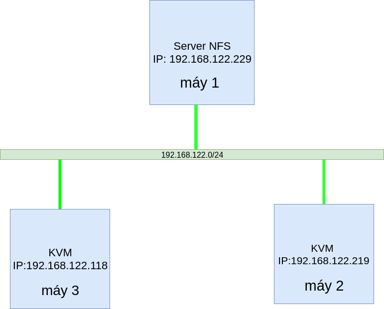 
Mô hình tương tự như trên nhưng: 
- Máy 1 - máy nfs: 192.168.206.157
- Máy 2 - máy KVM: 192.168.206.156 - máy cần migrate vm sang
- Máy 3 - máy KVM: 192.168.206.175 - máy chứa vm cần migrate

<h1 style="color:orange">Live migration KVM</h1>
<h2 style="color:orange">1. Cấu hình phân giải tên miền cho 2 máy KVM</h2>

Để có thể live migrate giữa 2 KVM host thì 2 máy này cần biết tên miền của nhau. Có thể cấu hình dịch vụ DNS phân dải tên miền cho các 2 máy này. Đây là mô hình lap có ít máy nên sẽ cấu hình luôn trong file `/etc/hosts`

Trên cả 2 kvm, khai báo tên miền trong file /etc/hosts:

    # vim /etc/hosts
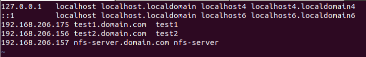 
Chú ý đặt tên miền chuẩn FQDN, vd: test1.domain.com, nếu không sẽ xảy ra lỗi.

    # bash
để máy nhận file `/etc/hosts`
<h2 style="color:orange">2. Trên máy NFS</h2>

Cài đặt nfs package

    # yum install nfs-utils nfs-utils-lib
Tạo thư mục để chia sẻ tài nguyên

    # mkdir /root/storage
Phân quyền cho file vừa tạo

    # chmod -R 755 /root/storage
    # chown nfsnobody:nfsnobody /root/storage
Vào file `/etc/exports` để thiết lập quyền truy cập

    # vim /etc/exports
paste vào cấu hình 

    /root/storage    192.168.206.0/24(rw,sync,no_root_squash,no_all_squash)
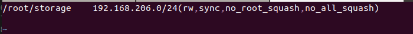 
Cấu hình firewall trên nfs server

    # firewall-cmd --permanent --zone=public --add-service=nfs
    # firewall-cmd --permanent --zone=public --add-service=mountd
    # firewall-cmd --permanent --zone=public --add-service=rpc-bind
    hoặc
    # firewall-cmd --permanent --zone=public --add-port=111/udp
    # firewall-cmd --permanent --zone=public --add-port=2049/tcp
    # firewall-cmd --reload
Khởi động nfs

    # systemctl enable rpcbind
    # systemctl enable nfs-server
    # systemctl enable nfs-lock
    # systemctl enable nfs-idmap

    # systemctl start rpcbind
    # systemctl start nfs-server
    # systemctl start nfs-lock
    # systemctl start nfs-idmap
Khi thay đổi file `/etc/exports` thì chỉ cần restart dịch vụ rpcbind và nfs-server

Kiểm tra

    # showmount -e localhost
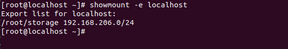 
<h2 style="color:orange">2. Trên 2 máy KVM</h2>

Cả 2 máy đều cài đặt đầy đủ các package KVM 

Cài đặt NFS pack-age

    # yum install nfs-utils nfs-utils-lib
Tạo và mount thư mục tới file vừa tạo:
    
    # mkdir -p /root/storage
    # mount -t nfs 192.168.206.157:/root/storage /root/storage
Lưu ý : 2 file storage trên 2 máy KVM phải có cùng tên và ở cùng vị trí. vd: file storage ở trên kvm 1 có đường dẫn là /root/storage thì file mount trên kvm 2 cũng phải là /root/storage, nếu không sẽ xảy ra conflict trong việc migrate.

Kiểm tra xem thư mục đã mount thành công chưa

    # showmount -e 192.168.206.157
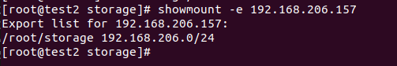 

Để tự động mount tới NFS Server khi 2 máy chủ KVM reboot, thì bạn sửa file /etc/fstab, thêm dòng sau vào cuối file

    # vim /etc/fstab
    
    192.168.206.157:/root/storage /root/storage nfs rw,sync,hard,intr 0 0
<h3 style="color:orange">2.1. Cấu hình SELinux và firewalld</h3>
Cấu hình SELinux cho phép nfs

    # setsebool -P virt_use_nfs on
Cấu hình firewalld

    # firewall-cmd --add-service={libvirt,libvirt-tls} --permanent
    # firewall-cmd --add-port=49152-49215/tcp --permanent
    # firewall-cmd --add-port=16509/tcp --permanent
    # firewall-cmd --reload
<h3 style="color:orange">2.2. Cấu hình nhận file storage trên 2 máy</h3>

    # virt-manager
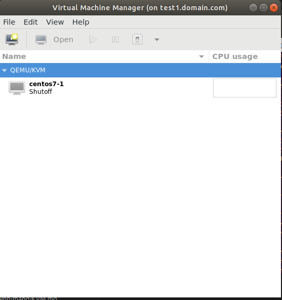 
chuôt phải vào QEMU/KVM --> details --> storage --> thêm storage mới
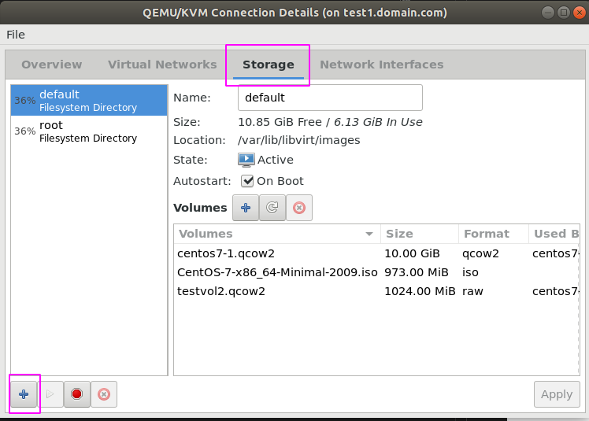 
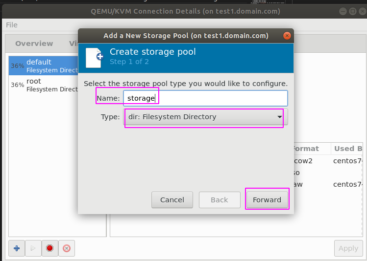 
Tên tùy ý, ở đây đặt là storage, type: kiểu file là dir để phù hợp với nfs 

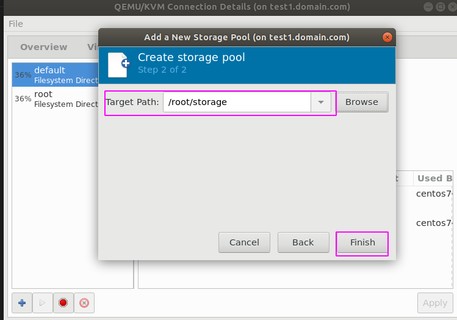 
Target path là file /root/storage vừa tạo bước trước

<h3 style="color:orange">2.3. Trên KVM1 - 192.168.206.175</h3>

Sau đó tạo image qcow2 trong file này để máy ảo sử dụng
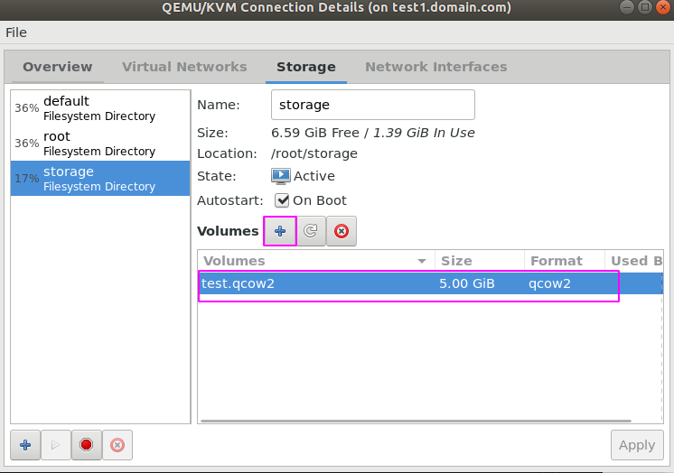 

Tạo máy ảo sử dụng file storage vừa tạo
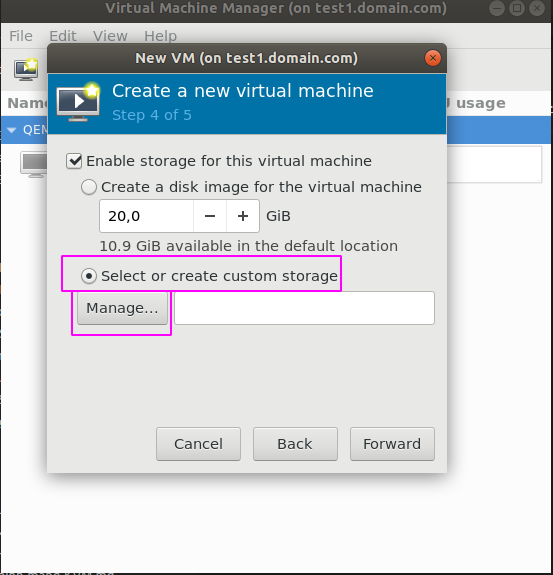 
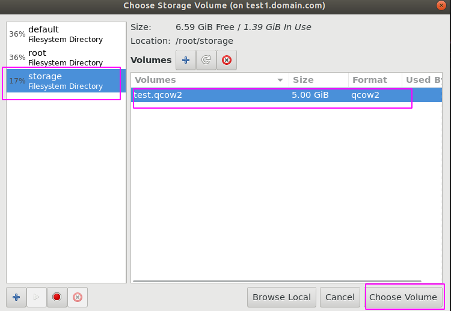 
TRong thực tế, với những máy đã có sẵn, ta tiến hành move file image storage của máy đang chạy sang file được share nfs để tiến hành migrate

Lý thuyết migrate: 
- Muốn live migrate thì CPU của 2 máy KVM phải có các flags giống nhau

      # cat /proc/cpuinfo
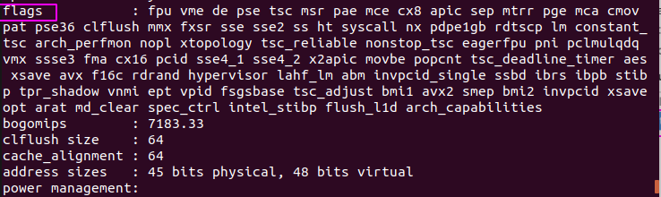 
- Khi live migration thì chương trình sẽ đọc file xml của máy ảo, nên phải để cấu hình kvm2 tương tự kvm 1.

   + ví dụ card mạng mà máy ảo dùng để là bridge ens33, vì card mạng của 2 máy đều tên là ens33
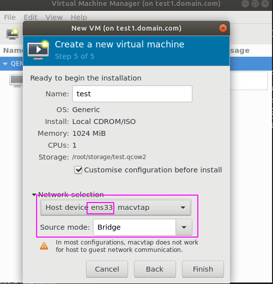 
   + file storage image cũng phải cùng là /root/image

<h3 style="color:orange">2.4. Trên KVM1 - 192.168.206.175 migrate máy ảo</h3>

Chỉnh sửa file xml của máy ảo tên test - là máy định migrate

    # virsh edit test
Thêm vào đoạn sau trong file test.xml
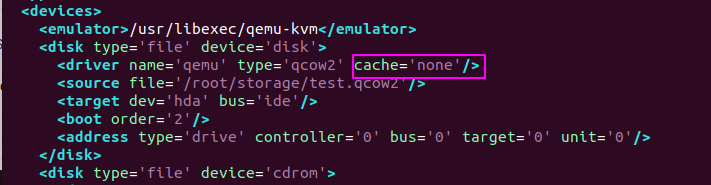 

    # virsh define /etc/libvirt/qemu/test.xml
Start máy

    # virsh start test
Kiểm tra trạng thái máy

    # virsh list -all
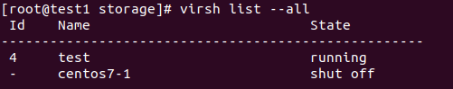 
Máy ảo tên test đang chạy 

Trên máy ảo, tiến hành lệnh ping 8.8.8.8

Migrate máy sang KVM 2, lưu ý, KVM 2 cũng phải cài đặt đầy đủ KVM

    # virsh migrate --live test qemu+ssh://192.168.206.156/system
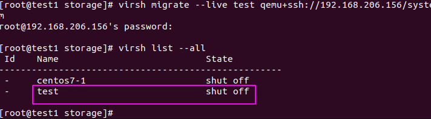 
Máy test ảo trên KVM1 đã off
<h3 style="color:orange">2.5. Trên KVM2 - 192.168.206.156</h3>

    # virsh list --all
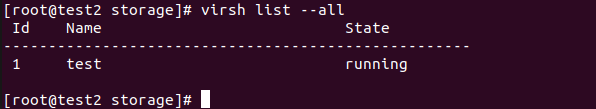 

Máy ảo đang chạy trên KVM2
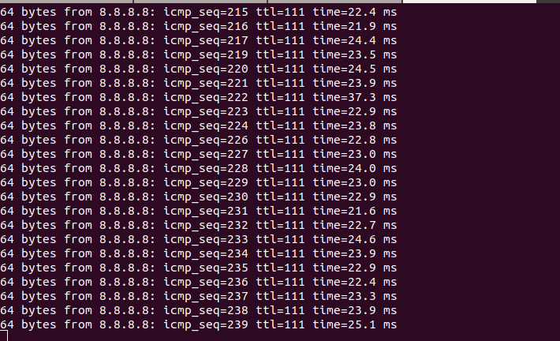 
Trong đó lệnh ping trên máy ảo test vẫn hoạt động bình thường mà không có gián đoạn.

------> Bây giờ ta có thể tắt KVM 1 đi mà máy ảo test vẫn hoạt động bình thường. Tuy vậy, vì file test.xml vẫn được định nghĩa trên KVM1 mà không có trên KVM2 nên nếu KVM2 tắt máy test thì sẽ bị mất trong kho VM.

Sau khi sửa hoặc nâng cấp xong KVM1, từ KVM 2 có thể migrate back lại

    # virsh migrate --live test qemu+ssh://192.168.206.157/system
<h1 style="color:orange">Cold migration KVM</h1>

Bởi vì live (hot) migration chỉ là giải pháp mang tính tạm thời. Muốn migrate hoàn toàn vm thì ta phải sử dụng Cold migration.

Tìm thời điểm thích hợp để shutdown kvm2. Chuyển file test.xml từ kvm1 sang kvm2

    [kvm1] # scp /etc/libvirt/qemu/test.xml 192.168.206.156:/etc/libvirt/qemu/
sử dụng lệnh
   
    # openssl dgst -md5 -hex /etc/libvirt/qemu/test.xml
để kiểm tra cho chắc chắn
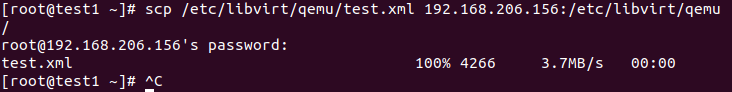 

Trên kvm2:

    [kvm2] # virsh define /etc/libvirt/qemu/test.xml
-----> đã migrate hoàn toàn.

Trong thực tế, migrate máy từ server này sang server khác. Người ta thực hiên rút ổ cứng và lắp vào server muốn migrate. Mục đích là để chuyển hoàn toàn file xml và file storage image của máy ảo sang KVM mới.

Trong bài toán này, nếu muốn cold migrate, ta có thể tắt test vm trên KVM 1 và chuyển file storage image và file xml sang KVM 2 mà không cần trung gian server NFS

Trên KVM 1:
    
    [kvm1] # scp /etc/libvirt/qemu/test.xml 192.168.206.156:/etc/libvirt/qemu/
    [kvm1] # scp /root/storage/test.qcow2 192.168.206.156:/root/storage
Trên KVM 2:

    [kvm2] # virsh define /etc/libvirt/qemu/test.xml