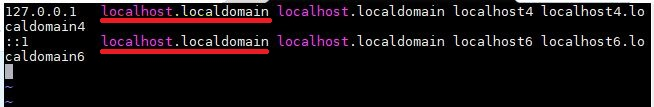
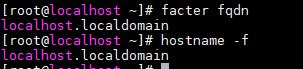
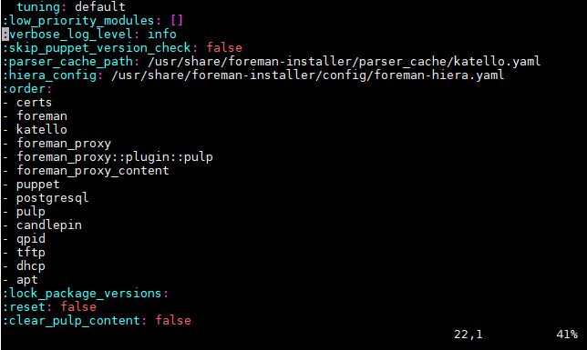
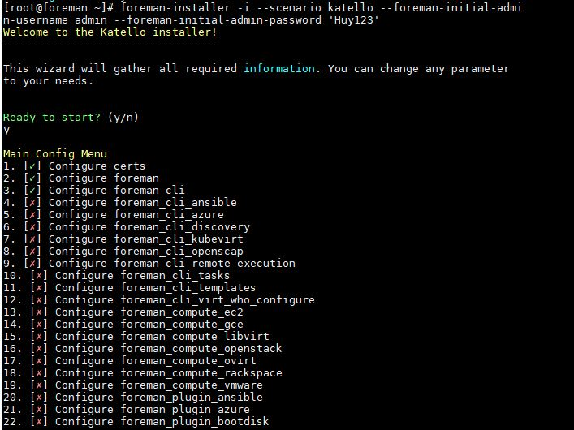
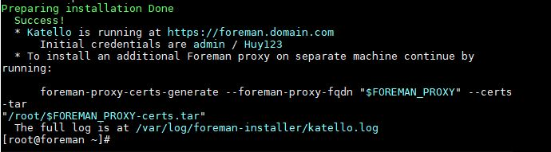
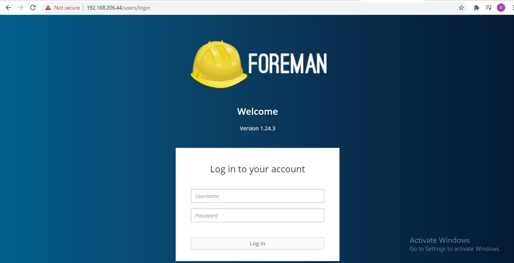
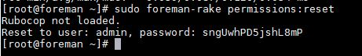
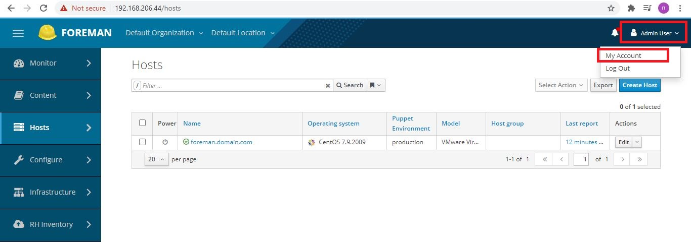
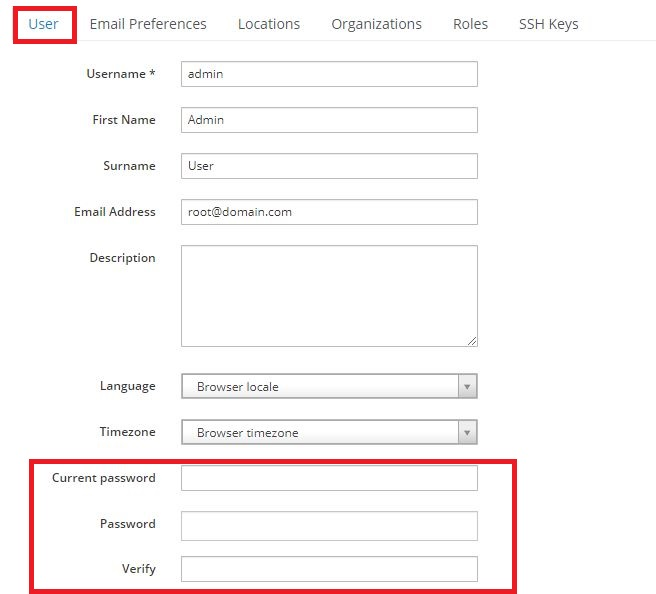

<h1 style="color:orange">Foreman-install</h1>
Chuẩn bị:

server centos 7.9.2009 
ip 192.168.206.44/24 

<h2 style="color:orange">1. Setup hostname</h2>

       # vim /etc/hosts
 

đổi đoạn được gạch chân thành localhost.localdomain 
hoặc có thể khai báo tên miền của mình

    192.168.206.44 foremanhost.localdomain.com
Với 192.168.206.44 là địa chỉ server đang cài đặt foreman;  
foremanhost.localdomain.com khai báo theo chuẩn fqdn.

    # vim /etc/hostname

    foremanhost.localdomain.com
    # init 6
làm sao cho 2 lệnh sau cho ra cùng 1 kết quả

    # hostname -f
    # facter fqdn
 
<h3 style="color:orange">1.1. Cài NTP</h3>
Đồng bộ thời gian cho foreman server với katello là 1 phần quan trọng. Cài đặt với chrony

    # timedatectl set-timezone Asia/Ho_Chi_Minh
    # yum install chrony
    # systemctl enable chronyd
    # systemctl start chronyd
    # chronyc sources
Enable đồng bộ NTP

    # set-ntp true
kiểm tra 

    # timedatectl status
 
<h3 style="color:orange">1.2. Cài đặt firewall</h3>
Cài các port cần thiết

       # firewall-cmd --permanent --add-port={53,80,443,3000,3306,5646,5647,5671,5672,5910-5930,5432,8140,8443,9090}/tcp
       # firewall-cmd --permanent --add-port={53,67,68,69}/udp
       # firewall-cmd --reload
<h2 style="color:orange">2. Cài đặt Foreman với Katello</h2>
Trước khi cài katello, đảm bảo các package trên máy đã được update

    # yum install -y update
Thêm các repo cần thiết. Ở đây ta sử dụng foreman 1.24 và puppet6 cùng với katello 3.14

    # yum -y localinstall https://yum.theforeman.org/releases/1.24/el7/x86_64/foreman-release.rpm
    # yum -y localinstall https://fedorapeople.org/groups/katello/releases/yum/3.14/katello/el7/x86_64/katello-repos-latest.rpm 
    # yum -y localinstall http://yum.puppetlabs.com/puppet6-release-el-7.noarch.rpm
    # yum -y localinstall https://dl.fedoraproject.org/pub/epel/epel-release-latest-7.noarch.rpm
    # yum -y install foreman-release-scl
<h3 style="color:orange">2.1. Cài đặt katello</h3>

    yum install katello -y

Để set up với nhiều module bằng cách thêm vào file katello.yaml. Việc này nên được thực hiện trước khi chạy foreman-installer

    # vim /etc/foreman-installer/scenarios.d/katello.yaml
 

<h3 style="color:orange">2.2. Cài đặt foreman</h3>

    # foreman-installer -i --scenario katello --foreman-initial-admin-username admin --foreman-initial-admin-password 'Huy123'
Với option -i là cài đặt thủ công, tùy chọn những package nào sẽ được cài đặt. Nếu không có option này sẽ cài đặt hết ----> tốn time

 
 

Choose an option from menu... 16 
Ví dụ ở đây chọn option 16 ----> chọn 1 để enable ----> 4 để back to menu ---> lựa chọn option khác.

Sau khi cài đặt xong thì sẽ hiện ra màn hình: 
 

Với ID là admin; password đã được tùy chọn từ trước.

<h2 style="color:orange">3. Vào giao diện web quản lý foreman</h2>
Vào trình duyệt web

    https://192.168.206.44
 
Đăng nhập với username: admin 
và password đã tạo 
 
----> cài đặt hoàn tất

<h2 style="color:orange">4. Quản lý foreman cơ bản</h2>
Mỗi khi server reboot thì ta dùng lệnh

    # foreman-maintain service start
để bật foreman
    
Các lệnh quản lý foreman

    # foreman-maintain service list
    # foreman-maintain service status
    # foreman-maintain service stop
    # foreman-maintain service restart
<h3 style="color:orange">4.1. Mật khẩu</h3>
Nếu quên password thì có thể đăng nhập vào server cài đặt foreman với quyền root. Dùng lệnh :

    # sudo foreman-rake permissions:reset
để máy gen ra 1 mật khẩu mới 
 

Đổi mật khẩu. Vào quản lý foreman trên giao diện web:
 
 

Gõ mật khẩu cũ vào current password 
Mật khẩu mới muốn set vào password và verify ----> submit.

https://access.redhat.com/solutions/3338201

yum install tfm-rubygem-foreman_setup.noarch

để unregister host từ foreman làm theo hướng dẫn sau: https://www.linuxsysadmins.com/register-a-linux-client-with-foreman/