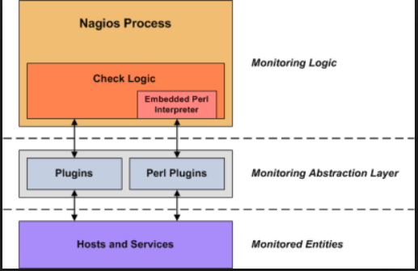
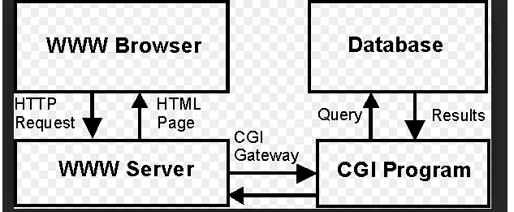
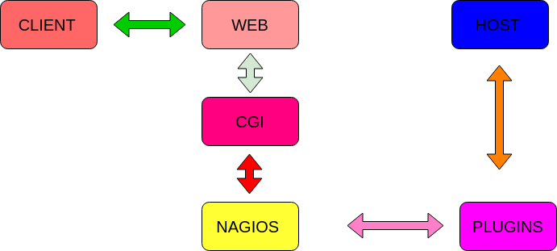

<h1 style="color:orange">Nagios core</h1>
<h2 style="color:orange">1. Khái niệm</h2>

- Nagios(Nagios Ain’t Gonna Insist On Sainthood) Là một phần mềm mà nguồn mở miễn phí của máy tính dùng để giám sát hệ thống, dịch vụ, mạng...
- Nagios cung cấp dịch vụ giám sát và cảnh bảo cho server. Nó thông báo lần một khi gặp sự cố và lần 2 khi sự cố đã được khắc phục.
- Ban đầu nagios được thiết kế để chạy trên linux
- Một chút về lịch sử của nagios: nagios được tạo ra bởi Ethan Galstad và năm 1999 và được biết đến với cái tên Nestaint. Đến năm 2002 đã chính thức đổi tên thành nagios. Đến năm 2009 được đổi tên thành nagios core
- Các phầm mềm tương tự nagios : Zenoss, Zabbix, Microsoft System Center Manager (SCOM) và SolarWinds; munin.

Một số chức năng nagios cung cấp 
- Giám sát dịch vụ mạng
- Giám sát tài nguyên máy chủ
- Giám sát phần cứng
- Giám sát từ xa
- Cung cấp đồ thị dữ liệu
- Cung cấp dịch vụ nagios bằng giao diện web
- Cảnh báo khi xảy ra sự cố thông qua (mail, sms,...)
<h2 style="color:orange">2. Các phiên bản Nagios</h2>

- Nagios core = nagios
- Nagios Log Server : Là một phiên bản dùng để quản lý và giám sát nhật ký doanh nghiệp.
- Nagios XI : Là phần mềm giám sát doanh nghiệp
- Nagios Fusion : Khi có nhiều nagios core và nagios XL. fusion được tạo ra để tổng hợp lại tất cả nagios
- Nagios BPI : Dùng để giám sát các quy trình làm việc
- Nagios Plugins : Được dùng để kiểm tra trạng thái của máy. Nagios sẽ sử dụng kết quả từ plugins để xác định trạng thái của máy.
- So sánh giữa nagios XI và nagios core thì nagios XI sẽ có tất cả tính năng của nagios core và một số tính năng mà nagios core không có vì nagios XI mất phí.
<h2 style="color:orange">3. Các khái niệm trong Nagios</h2>
<h3 style="color:orange">3.1. Plugins</h3>

 
- Plugins Là một lớp trừ tượng ở giữa nagios server và host hay service. Là một dòng lệnh hay có thể là một đoạn script.  
- Plugins có chức năng kiểm tra host và service rồi trả lại kết quả cho nagios server.
<h3 style="color:orange">3.2. Webserver</h3>

- Apache, nginx là một phầm mềm của web server. Nó sẽ cung cấp trang web mà ta yêu cầu truy cập.
- Là nơi lưu trữ các file; thành phần của một website (file html; css; ảnh ...)
- Cung cấp cho người dùng dữ liệu website mà họ muốn truy cập và sử dụng
- Nó sẽ cung cấp cho người dùng cuối thông qua mạng internet.
<h3 style="color:orange">3.3. Database</h3>

- DB bao gồm DATA và DBMS
- DATA : Là loại dữ liệu của nagios server. Dữ liệu này là thông tin của các client sau khi được kiểm tra
- DBMS: là hệ quản trị cơ sở dữ liệu. Được thiết kế nhằm mục đích quản lý dữ liệu dễ dàng hơn, bảo mật cao hơn. Theo mặc định thì DATA của nagios server sẽ được lưu trữ trong file nhưng có thể lưu trữ nó ở trong một hệ quản trị cơ sở dữ liệu
- Trong nagios có hỗ trợ 2 DB là mysql và postgreSQL.
<h3 style="color:orange">3.4. CGI (Common gateway interface)</h3>

 
- CGI hay còn được gọi là giao diện dòng lệnh nó cung cấp giao thức để web server sử dụng. (Hiểu đơn giản là apache hay nginx nói chuyện với database MySQL bằng CGI)
- Web server thường gửi thông tin biểu mẫu cho một quy trình xử lý dữ liệu và có thể gửi lại thông báo xác nhận . Quá trình đó được gọi là CGI
- CGI có thể được viết nên từ ngôn ngữ nào đó như : C, perl, shell…

Ưu điểm của CGI: 
- Là một tiêu chuẩn rõ ràng và được hỗ trợ
- CGI thường được viết bằng C; perl; hoặc shell
- CGI sử dụng giao diện HTML
- Tương thích với các trình duyệt web hiện nay
- Viết được bằng tất cả ngôn ngữ
- CGI sử dụng mã đã được viết hơn là mã riêng
- Nhiều tasks dễ chạy hơn java 

Nhược điểm 
- Tốn nhiều thời gian xử lý
<h2 style="color:orange">4. Ưu và nhược điểm Nagios</h2>
<h3 style="color:orange">4.1. Ưu điểm</h3>

- Là một phần mềm mã nguồn mở và miễn phí
- Giám sát tập trung
- Có thể tích hợp được nhiều ngôn ngữ khác nhau
- Có một cộng đồng phát triển plugins lớn, vì vậy có rất nhiều các plugins đã có sẵn.
<h3 style="color:orange">4.2. Nhược điểm</h3>

- Giao diện đồ họa lâu đời
- Không có khả năng tự phát hiện host khi được thêm vào. Người quản trị sẽ phải cấu hình thủ công tất cả các host và các service. Việc này ảnh hưởng đến khả năng mở rộng quy mô khó khăn.
<h2 style="color:orange">5. Luồng hoạt động của Nagios core</h2>

 
- Bước 1: Client sẽ sử dụng giao thức http để tạo yêu cầu thông tin website cho nagios server
- Bước 2: Web server sẽ sử dụng CGI để lấy thông tin từ nagios server
- Bước 3: Nagios server sẽ xem lại file cache. Nếu trong đó có thông tin mà client yêu cầu thì nó sẽ lập tức trả lại kết quả. Nếu không có nagios sẽ tạo ra một plugins để kiểm tra lại thông tin mà client yêu cầu
- Bước 4: Plugins sẽ check thông tin theo yêu cầu và sau đó trả lại thông tin lại cho nagios server
- Bước 5: Sau khi được nhận thông tin từ plugins thì nagios server sẽ lưu trữ thông tin đó vào một file hoặc một DB do cài đặt của người quản trị. Và đồng thời nó sẽ lưu trữ thông tin này vào file cache nếu người quản trị có sử dụng chức năng của file này.
- Bước 6: Nagios sẽ xác định những việc phải làm dựa trên thông tin được trả về từ nagios. Có cần cảnh báo hay không và đánh giá trạng thái của các host hay service. Rồi sau đó trả lại thông tin cho webserver
- Bước 7: Web server sẽ sử dụng lại giao thức http trả lại thông tin mà client yêu cầu.