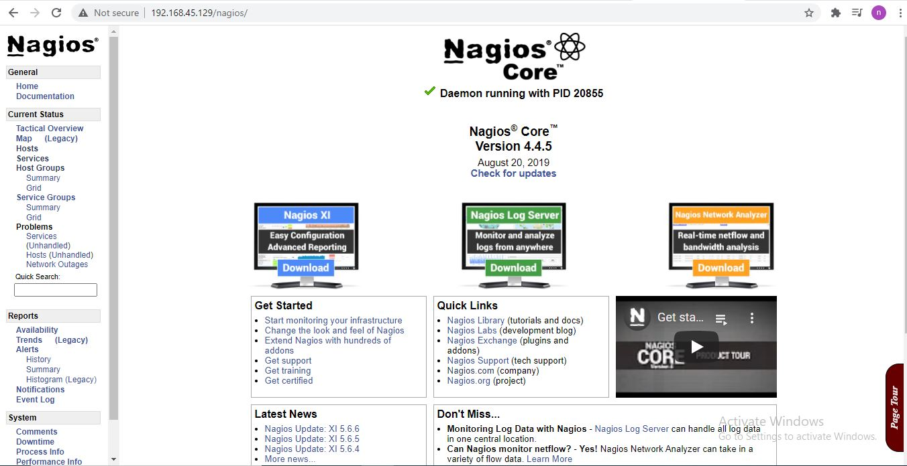
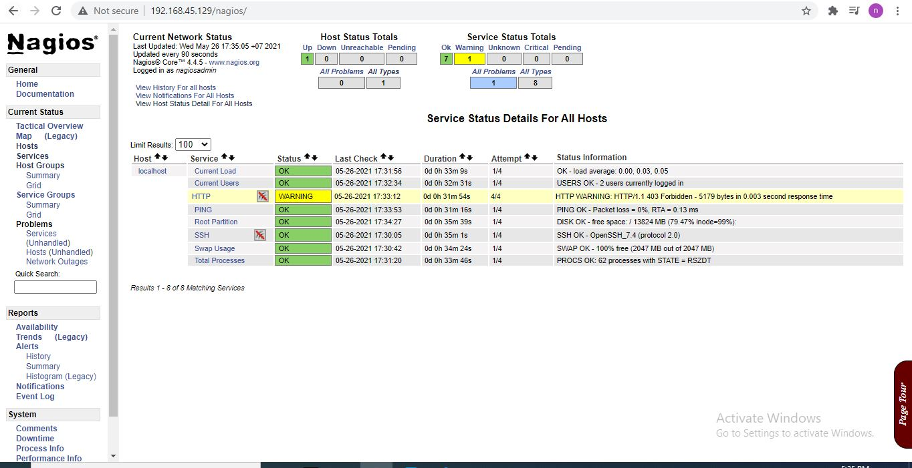

<h1 style="color:orange">Cài đặt Nagios core</h1>
Hướng dẫn sử dụng Nagios Core 4.4.5 và Nagios Plugins 2.2.1. 
Phiên bản CentOS7 7.9.2009
<h2 style="color:orange">1. Cài các package cần thiết</h2>

    # yum install -y gcc glibc glibc-common wget unzip httpd php gd gd-devel perl postfix

Tải từ source

    # cd /tmp
    # wget -O nagioscore.tar.gz https://github.com/NagiosEnterprises/nagioscore/archive/nagios-4.4.5.tar.gz
    # tar xzf nagioscore.tar.gz
Install

    # cd /tmp/nagioscore-nagios-4.4.5/
    # ./configure
    # make all
Tạo user và group nagios

    # make install-groups-users
    # usermod -a -G nagios apache
    # groupadd nagcmd
    # usermod -a -G nagcmd nagios
    # usermod -a -G nagcmd apache
Install file nhị phân

    # make install
Installl service chạy daemon và cấu hình chúng chạy onboot, bao gồm cả apache

    # make install-daemoninit
    # systemctl enable httpd.service
Install và cấu hình file lệnh

    # make install-commandmode
Install file config. Điều này cần thiết vì Nagios cần một số file config để có thể start

    # make install-config
Install file Apache config

    # make install-webconf
<h2 style="color:orange">2. Cấu hình firewall và SELinux</h2>

    # firewall-cmd --zone=public --add-port=80/tcp --permanent
    # firewall-cmd --reload
Cấu hình SElinux cho phép Apache và Nagios chạy

    # yum install -y policycoreutils-python
    ​# sudo setsebool -P httpd_unified 1
Cấu hình cho Nagios

    # chcon -R -t httpd_sys_content_t /usr/local/nagios/sbin/
    # chcon -R -t httpd_sys_content_t /usr/local/nagios/share/
    # chcon -R -t httpd_sys_script_exec_t /usr/local/nagios/sbin/
Bởi vì file /nagios/sbin chứa script nên cần cho phép script
<h2 style="color:orange">3. Tạo user và password cho nagios</h2>

    # htpasswd -c /usr/local/nagios/etc/htpasswd.users nagiosadmin
Ở đây user là nagios admin

    # systemctl start httpd.service
    # systemctl start nagios.service
Để đổi pass user nagiosadmin

    # htpasswd /usr/local/nagios/etc/htpasswd.users nagiosadmin
<h2 style="color:orange">4. Cài nagios plugins</h2>
Sau khi cài nagios xong vào https:/192.168.45.129/nagios -----> service sẽ thấy lỗi:

    (No output on stdout) stderr: execvp(/usr/local/nagios/libexec/check_load, ...) failed. errno is 2: No such file or directory
vì chưa có plugins

Cài plugins

    # yum install -y gcc glibc glibc-common make gettext automake autoconf wget openssl-devel net-snmp net-snmp-utils epel-release
    # yum install -y perl-Net-SNMP
Tải từ source

    # cd /tmp
    # wget --no-check-certificate -O nagios-plugins.tar.gz https://github.com/nagios-plugins/nagios-plugins/archive/release-2.2.1.tar.gz
    # tar zxf nagios-plugins.tar.gz
Compile file và install

    # cd /tmp/nagios-plugins-release-2.2.1/
    # ./tools/setup
    # ./configure
    # make
    # make install
restart nagios và kiểm tra

    # systemctl start nagios.service
    # systemctl stop nagios.service
    # systemctl restart nagios.service
    # systemctl status nagios.service

Vào browser: https:/192.168.45.129/nagios để kiểm tra
 
 