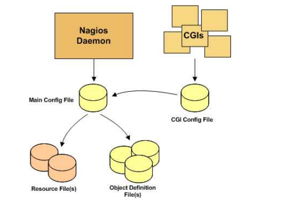
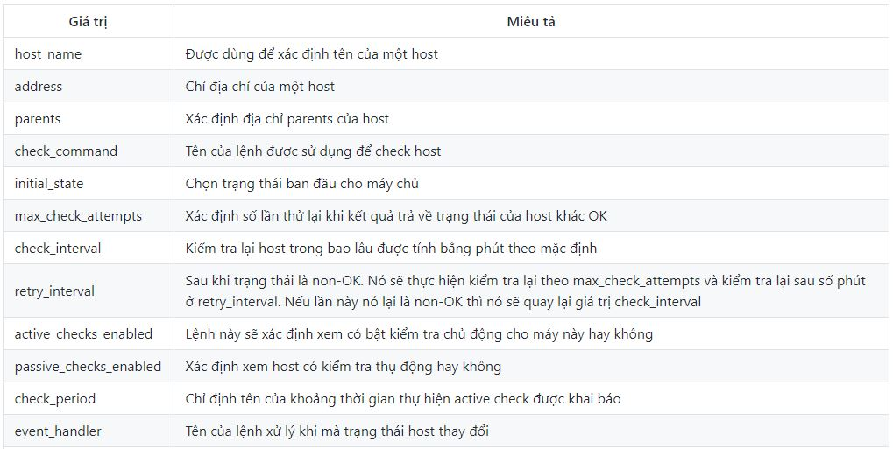
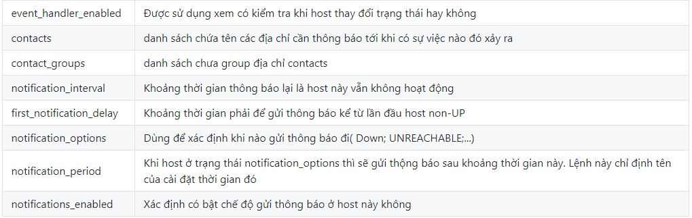
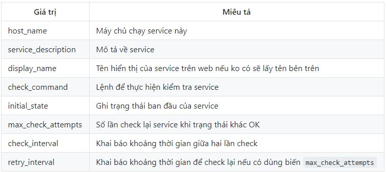
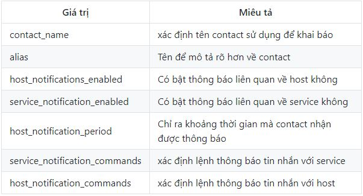
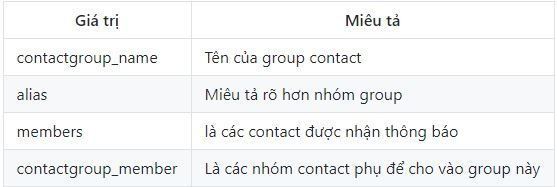
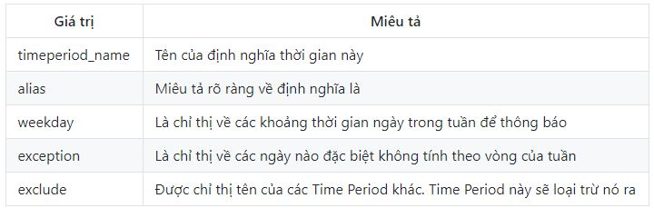

<h1 style="color:orange">Cấu trúc file config</h1>
Mô hình của file config. Trong nagios có 4 file cấu hình chính. Và được liên kết với nhau bởi file cấu hình chính.

 

- `Main Configuration File`: Là tệp tin cấu hình chính của nagios. Nó là nơi lưu trữ tất cả các thông tin của nagios. Tất cả các tệp tin được sử dụng đều được khai báo tại File này
- `Resource File(s)`: Là nơi lưu trữ các giá trị macros (macros là các biến)
- `Object Definition Files`: Là nơi lưu trữ các thông tin; cách thức giám sát của host và service.
- `CGI Configuration File`: Là nơi lưu trữ các điều kiện cho CGI hoạt động.

Khi mà có yêu cầu kiểm tra dịch vụ. Trước khi bắt đầu thực thi lệnh thì nagios sẽ đi vào Resource File để thay các giá trị macros để có thể thực thi được câu lệnh.
<h1 style="color:orange">Main Configuration File</h1>

Main Configuration File là nơi lưu trữ thông tin chính của nagios. có tên là nagios.cfg và được lưu trong `/usr/local/nagios/etc/nagios.cfg`. Các biến main file là:

1. Logfile

       log_file = /usr/local/nagios/var/nagios.log
Biến này được dùng để chỉ định nơi tạo file log của nó. debug của file config cũng được lưu lại vào file log này

2. Object Configuration File

        cfg_file=/usr/local/nagios/etc/hosts.cfg
Biến này dùng để trỏ đến file Object Configuration File

3. Object Configuration Directory

        cfg_dir=/usr/local/nagios/etc/commands
Biến này được sử dụng để khai báo một thư mục chứa các file Object Configuration File

Format: cfg-dir=name

4. Status File 
Đây là biến dùng để khai báo file lưu trữ trạng thái hiện tại của các client

        status_file=/usr/local/nagios/var/status.dat
5. Nagios User 
Biến này xác định user mà tiến trình nagios chạy

        nagios_user=nagios
6. Nagios Group 
Biến này xác định group mà tiến trình nagios sử dụng

        nagios_group=nagios
7. State Retention Option 
- Biến này để xác định rằng trước khi máy chủ nagios tắt nó có lưu trữ lại trạng thái của các host và service hay không.
- Format: retain_state_information=<0/1>
- Example

        retain_state_information=0
8. State Retention File 
Biến này để khai báo file lưu trữ cho State Retention Option

        state_retention_file=/usr/local/nagios/var/retention.dat
9. Resource File 
Là nơi lưu trữ các giá trị của macros

        resource_file=/usr/local/nagios/etc/resource.cfg
10. Use Retained Program State Option 
- Biến này xác định là có áp dụng state option cho các biến được lưu trữ trong đó hay không
- Format: use_retained_program_state=<0/1>
- Example:

        use_retained_program_state=1
11. Notifications Option 
- Biến này xác định xem có gửi thông báo khi restart nagios hay không. Theo mặc định thì cài đặt này sẽ bị bỏ qua do sử dụng State Retention option. và bật tính năng Use Retained Program State Option
- Format: enable_notifications=<0/1>
- Example:

      enable_notifications=1
12. Service Check Execution Option 
- Biến này xác định có kiểm tra lại dịch vụ khi mà restart nagios hay không. Theo mặc định thì cài đặt này sẽ bị bỏ qua do sử dụng State Retention option. và bật tính năng Use Retained Program State Option
- Format: execute_service_checks=<0/1>
- Example:

      execute_service_checks=1
13. Host Check Execution Option 
Biến này xác định có kiểm tra lại host khi mà restart nagios hay không. Theo mặc định thì cài đặt này sẽ bị bỏ qua do sử dụng State Retention option. và bật tính năng Use Retained Program State Option
- Format: execute_host_checks=<0/1>
- Example:

      execute_host_checks=1
14. Event Handler Option 
- Biến này được bật thì khi mà host hay service thay đổi trạng thái thì các lệnh sẽ được chạy. Theo mặc định thì cài đặt này sẽ bị bỏ qua do sử dụng State Retention option. và bật tính năng Use Retained Program State Option
- Format: enable_event_handlers=<0/1>
- Example:

      nable_event_handlers=<0/1>
15. Syslog Logging Option 
- Dùng để khai báo xem có bật syslog hay không
- Example:

       use_syslog=1
16. Notification Logging Option 
- Dùng để khai báo xem có sử dụng log thông báo hay không. Ví dụ thông báo lỗi
- Example:
 
      log_notifications=1
17. Global Host Event Handler Option 
- Dùng để xác định lệnh được sử dụng khi có host thay đổi trạng thái
- Format: global_host_event_handler=<command>
- Example:

      global_host_event_handler=log-host-event-to-db
<h1 style="color:orange">Object Configuration File</h1>
Các file này đã được khai báo trong file main configuration. Một số điều kiện khi cấu hình file

- Tên chỉ thị phân biệt chữ hoa và thường
- Những dòng sau dấu # sẽ không được xử lý
- Các file sau có thể được tìm thấy trong `/usr/local/nagios/etc/objects/`

1. templates.cfg
- Trong templates.cfg sẽ lưu trữ các mẫu cài đặt định nghĩa về host trong linux hay windown hoặc service....
- Có thể sử dụng theo mặc định. Mỗi cài đặt mặc định đó sẽ được đặt cho một cái tên khi muốn sử dụng thì dùng cái tên đó để khai báo
2. Host Definition
- Host: Dùng để chỉ một thiết bị như máy tính; server; máy in.... Các giá trị cần thiết

 
 

Ví dụ:

    define host{
      host_name                      bogus-router         
      address                        192.168.1.254
      parents                        server-backbone
      check_command                  check-host-alive
      check_interval                 5
      retry_interval                 1
      max_check_attempts             5
      check_period                   time-name
      process_perf_data              0
      retain_nonstatus_information   0
      contact_groups                 router-admins
      notification_interval          30
      notification_period            time-name
      notification_options           d,u,r
    }
3. Service Definition
- Service là một số dịch vụ để kiểm tra máy chủ. như check ram, disk, cpu hay một số giao thức http, ping ..

 
4. Contact Definition
Dùng để xác định các địa chỉ được liên hệ như là địa chỉ mail cảnh báo 

 

    define contact{
      contact_name                    nagiosadmin             
      use                             generic-contact       
      alias                           Nagios Admin        
      email                           nguyenanhduchihi@gmail.com     
      service_notification_period             24x7
      service_notification_options            w,u,c,r
      service_notification_commands           notify-service-by-email
      host_notification_period                24x7
      host_notification_options               d,u,r
      host_notification_commands              notify-host-by-email
    }
5. Contact Group Definition 
- Dùng để xác định nhóm các địa chỉ được liên hệ như là địa chỉ mail cảnh báo 

 

    define contactgroup {
      contactgroup_name   novell-admins
      alias               Novell Administrators
      members             jdoe,rtobert,tzach
    }
6. Time Period Definition
- Được dùng để xác định thời gian được cài đặt để cảnh báo và check host hoặc service.

 
7. Command Definitions
- Được dùng để xác định thông tin các lệnh để thực hiện để thông báo và kiểm tra

- command_name: Được dùng để xác định tên của lệnh
- command_line: Được dùng để xác định lệnh thực thi

      define command {
         command_name    check_pop
         command_line    /usr/local/nagios/libexec/check_pop -H $HOSTADDRESS$
      }
