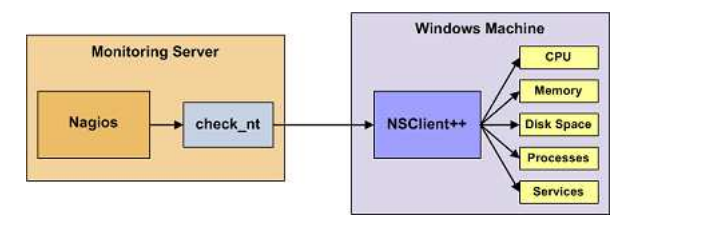
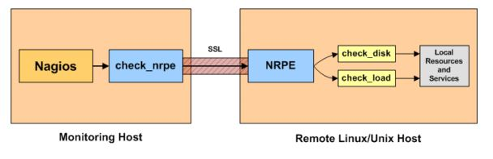
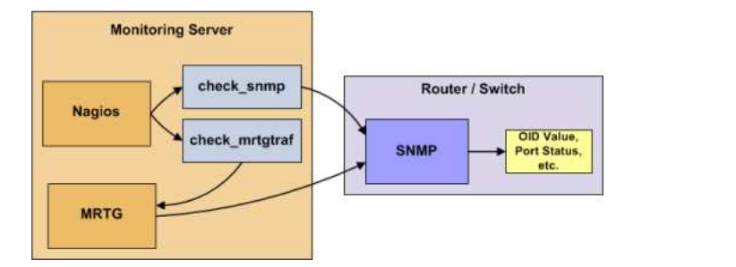

<h1 style="color:orange">Lý thuyết plugins</h1>
Trong nagios sẽ có những cộng đồng phát triển. Thế nên dẫn đến việc sẽ có 2 nhóm chính tạo ra nagios plugins là

- Nagios plugins chính thức. Sẽ luôn được phát triển bởi nhà phát triển nagios và luôn được update
- Nagios plugins do cộng đồng phát triển. Sẽ không được phát triển đều sẽ có những bản không được phát triển lỗi rất có thể gây ra lỗi trong hệ thống nagios

Có rất nhiều loại nagios được tạo ra từ hai nhóm trên. Các loại nagios plugins được phân biệt bởi một số đặt điểm: 
- Các plugins cho hệ điều hành phân phối.
- Các plugins cho Switch và router
- Các plugins cho file log
<h1 style="color:orange">Phân loại nagios plugins</h1>
<h2 style="color:orange">1 . Plugins dành cho windows</h2>
Plugins Dành cho hệ điều hành windows Có thể giám sát được một số mục như sau:

- Memory usage
- CPU load
- Disk usage
- Service states
- Running processes và nhiều mục khác nữa

Sẽ phải cài đặt một agent lên máy windows. Nếu không cài agent lên thì nagios sẽ không giám sát được hệ điều hành windows. Có rất nhiều loại agent dành cho windows như NSclient++ ; NC_Net;NRPE; NCPA.... Nhưng hiện nay phổ biến nhất là NSClient++

 

Nagios sẽ sử dụng check_nt đã được khai báo sẵn trong nagios để giám sát hệ điều hành windows:
- Nagios sẽ sử dụng check_nt để tạo ra yêu cầu khai báo cho NSClient++
- Sau đó NSClient++ sẽ giám sát hệ thống windows rồi trả kết quả về cho nagios server.
<h2 style="color:orange">2. Plugins dành cho Linux</h2>
Plugins dành cho linux Có thể giám sát được:

- Memory usage
- CPU load
- Disk usage
- Service states
- Running processes và nhiều mục khác nữa

Có nhiều cách khác nhau để thực hiện giám sát một máy hệ điều hành linux. Có thể sử dụng ssh để thực hiện giám sát. Cài đặt plugins check_by_ssh trên nagios server. Nhưng phương pháp này sẽ dẫn đến việc nagios server sẽ phải làm việc nặng hơn so với các phương pháp khác. Có một phương pháp khác phổ biến thường được sử dụng với hệ điều hành linux là Sử dụng agent plugins NRPE.

 

- Bước 1: Nagios server tạo yêu cầu giám sát đến nrpe được cài đặt trên host
- Bước 2: nrpe thực hiện yêu cầu bằng và trả lại kết quả cho nagios server
- Bước 3: Nagios server thực hiện công việc của nó.
<h2 style="color:orange">3. Plugins dành cho Router và switch</h2>
Plugins dành cho router và switch Sẽ giám sát được một số điều trên router và switch

- Mất gói.
- Thông tin trạng thái SNMP.
- Băng thông/ tốc độ lưu lượng. 
Giám sát router và switch sẽ sử dụng SNMP (Simple Network Management Protocol).

 

Giám sát router và switch thì nagios server sẽ sử dụng 2 khối lệnh chính
- check_snmp : Dùng để giám sát trạng thái của thiết bị
- check_mrtgtraf : Dùng để giám sát Băng thông và tốc độ lưu lượng của thiết bị

Các bước giám sát:
- Nagios tạo ra yêu cầu và sẽ phân tích xem sử dụng check_mrtgtraf hay check_snmp.
- Nagios sẽ gửi yêu cầu đó tới SNMP tại thiết bị rồi trả lại kết quả cho nagios server.

Giao thứ SNMP:
- Là một giao thức để kiểm tra, giám sát các thiết bị chạy trên các nền tảng khác nhau như là router, switch; server....
- Có kiến trúc theo mô hình client-server. Các host giám sát được gọi là managers và các client được gọi là agents.
- Agent của giao thức SNMP nhận mọi gói tin ở port 161.
- Agent trả lời và Manager nhận thông tin ở port 162.