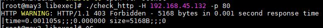

<h1 style="color:orange">Thêm host linux cho nagios server quản lý</h1>
Mặc định khi cài nagios thì server sẽ tự quản lý chính nó. 

NRPE (Nagios Remote Plugin Executor) plugin cho phép add các remote Linux host hay thiết bị mạng. NRPE cho phép Nagios server giám sát tài nguyên từ xa trên Linux host. Vì những tài nguyên này thường không để lộ ra ngoài nên bắt buộc phải cài NRPE agent trên Linux host. 
Lưu ý: NRPE yêu cầu Nagios Plugin cũng phải cài trên máy Linux.

Chuẩn bị: 
Linux host: 192.168.45.131/24 
Nagios server: 192.168.45.129/24 
<h2 style="color:orange">1. Trên Linux host</h2>
Cài các packages cần thiết

    # yum install -y gcc glibc glibc-common openssl openssl-devel perl wget
Tải NRPE từ source

    # cd /tmp
    # wget --no-check-certificate -O nrpe.tar.gz https://github.com/NagiosEnterprises/nrpe/archive/nrpe-4.0.3.tar.gz
    # tar xzf nrpe.tar.gz
Cài đặt file

    # cd /tmp/nrpe-nrpe-4.0.3/
    # ./configure --enable-command-args --enable-ssl
    # make all
Thêm option --enable-ssl để tránh lỗi ssl sau này.

Tạo user và group

    # make install-groups-users
Tạo file nhị phân để check nrpe

    # make install
    # make install-daemon
Cài đặt config file

    # make install-config
Update service trong file /etc/services. Thêm vào cuối file

    #Nagios services
    nrpe    5666/tcp   nrpe
Chạy daemon của nrpe. Lưu ý bước này sẽ có 1 số hướng dẫn trên mạng cài xinetd cho nrpe chạy trên xinetd. Nhưng ở đây mình cài nrpe chạy daemon riêng của nó

    # make install-init
    # systemctl enable nrpe.service
Cấu hình firewall

    # firewall-cmd --zone=public --add-port=5666/tcp --permanent
    # firewall-cmd --reload
Cập nhật file cấu hình

    # vim /usr/local/nagios/etc/nrpe.cfg

    allowed_hosts=127.0.0.1,192.168.45.129
    dont_blame_nrpe=1
Ở đây 192.168.45.129 là địa chỉ nagios server.

    # systemctl start nrpe.service
Kiểm tra nrpe

    # /usr/local/nagios/libexec/check_nrpe -H 127.0.0.1
Kết quả ra như này là thành công 
 
<h2 style="color:orange">1.2. Cài nagios plugin</h2>

    # yum install -y gcc glibc glibc-common make gettext automake autoconf wget openssl-devel net-snmp net-snmp-utils epel-release
    # yum install -y perl-Net-SNMP
Tải từ source

    # cd /tmp
    # wget --no-check-certificate -O nagios-plugins.tar.gz https://github.com/nagios-plugins/nagios-plugins/archive/release-2.2.1.tar.gz
    # tar zxf nagios-plugins.tar.gz
Compile và cài đặt

    # cd /tmp/nagios-plugins-release-2.2.1/
    # ./tools/setup
    # ./configure
    # make
    # make install
Kiểm tra nrpe plugins:
- Bình thường những câu lệnh cấu hình sẵn chứa trong file `/usr/local/nagios/etc/nrpe.cfg`. Nếu muốn thêm tùy chọn để quản lý ta cũng sẽ thêm vào file này

       ví dụ
       command[check_load]=/usr/local/nagios/libexec/check_load -w .15,.10,.5 -c .30,.25,.20
 

Sử dụng command check_load để test

    # /usr/local/nagios/libexec/check_nrpe -H 127.0.0.1 -c check_load
 
<h2 style="color:orange">2. Trên Nagios server</h2>
Cài nrpe

    # cd /tmp
    # wget --no-check-certificate -O nrpe.tar.gz https://github.com/NagiosEnterprises/nrpe/archive/nrpe-4.0.3.tar.gz
    # tar xzf nrpe.tar.gz
Compile

    # cd /tmp/nrpe-nrpe-4.0.3/
    # ./configure --enable-command-args --enable-ssl
    # make all
    # make install
    # make install-daemon
Kiểm tra kết nối với linux host

    # /usr/local/nagios/libexec/check_nrpe -H 192.168.45.131
 
<h3 style="color:orange">2.1. Tạo file config để thêm host</h3>

    # cd /usr/local/nagios/etc/
    # touch hosts.cfg
Thêm file vừa tạo vào config nagios

    # vim /usr/local/nagios/etc/nagios.cfg
    
    Thêm dòng sau:
    cfg_file=/usr/local/nagios/etc/hosts.cfg
 
Cấu hình file hosts.cfg

    # vim /usr/local/nagios/etc/hosts.cfg
paste vào
    
    ## Default Linux Host Template ##
    define host{
    name                            linux-box               ; Name of this template
    use                             generic-host            ; Inherit default values
    check_period                    24x7        
    check_interval                  5       
    retry_interval                  1       
    max_check_attempts              10      
    check_command                   check-host-alive
    notification_period             24x7    
    notification_interval           30      
    notification_options            d,r     
    contact_groups                  admins  
    register                        0                       ; DONT REGISTER THIS - ITS A TEMPLATE
    }

    ## Default
    define host{
    use                             linux-box               ; Inherit default values from a template
    host_name                       may1		        ; The name we're giving to this server
    alias                           may1                ; A longer name for the server
    address                         192.168.45.131            ; IP address of Remote Linux host
    }
Chú ý phần host_name: may1 ; alias và address: 192.168.45.131

Ở dưới paste tiếp service

    define service{
        use                     generic-service
        host_name               may1
        service_description     CPU Load
        check_command           check_nrpe!check_load
        }

    define service{
        use                     generic-service
        host_name               may1
        service_description     Total Processes
        check_command           check_nrpe!check_total_procs
        }

    define service{
        use                     generic-service
        host_name               may1
        service_description     Current Users
        check_command           check_nrpe!check_users
        }
    define service{
        use                     generic-service
        host_name               may1
        service_description      disk load
        check_command           check_nrpe!check_sda2
        }
Chú ý service check `disk load` lệnh ở đây là check_sda2 vì trên máy Linux host muốn check ổ sda2 
 

Tuy vậy nếu muốn check ổ khác ta có thể sửa trong `/usr/local/nagios/etc/nrpe.cfg` 
 
<h3 style="color:orange">2.2. Thêm định nghĩa lệnh NRPE</h3>

    # vim /usr/local/nagios/etc/objects/commands.cfg
paste vào 

    ###############################################################################
    # NRPE CHECK COMMAND
    #
    # Command to use NRPE to check remote host systems
    ###############################################################################

    define command{
        command_name check_nrpe
        command_line $USER1$/check_nrpe -H $HOSTADDRESS$ -c $ARG1$
        }
Kiểm tra file config nagios xem có lỗi gì không

    # /usr/local/nagios/bin/nagios -v /usr/local/nagios/etc/nagios.cfg
Kết quả ra 

    Total Warnings: 0
    Total Errors:   0
là không có lỗi

    # systemctl restart nagios
 

<h2 style="color:orange">3. Thêm option check ram</h2>
Mặc định NRPE không có sẵn cấu hình check RAM nên phải tải thêm plugin về
<h3 style="color:orange">3.1. Trên linux host</h3>

    # cd /usr/local/nagios/libexec/
    # wget https://raw.githubusercontent.com/justintime/nagios-plugins/master/check_mem/check_mem.pl
    # chmod +x check_mem.pl
Chỉnh sửa file nrpe.cfg thêm lệnh check ram vào bên trong nrpe

    # vim /usr/local/nagios/etc/nrpe.cfg

    command[check_mem]=/usr/local/nagios/libexec/check_mem.pl -f -w 20 -c 10
    # systemctl restart nrpe
<h3 style="color:orange">3.2. Trên nagios server</h3>

    # vim /usr/local/nagios/etc/hosts.cfg
Thêm service

    define service{
        use                     generic-service
        host_name               may1
        service_description     Memory
        check_command           check_nrpe!check_mem
        }
<h2 style="color:orange">4. ADD thêm host để quản lý</h2>
Các bước thực hiện trên linux host thực hiện như trên

Ở server nagios có thể tùy thích paste thêm máy vào file `/usr/local/nagios/etc/hosts.cfg` sau cấu hình may1 hoặc tạo hẳn file cấu hình mới: `/usr/local/nagios/etc/may2.cfg` và paste config trong file hosts.cfg vào, thay đổi hostname và address.

Lưu ý: khai báo file vào trong `/usr/local/nagios/etc/nagios.cfg`

    # vim /usr/local/nagios/etc/nagios.cfg

    cfg_file=/usr/local/nagios/etc/may2.cfg
<h2 style="color:orange">5. Check http</h2>
<h3 style="color:orange">5.1. Trên linux host</h3>
Kiểm tra: 
 
    # cd /usr/local/nagios/libexec/
    # ./check_http -H 192.168.45.132 -p 80
Chú ý: ./ là để chạy file check_http có trong `/usr/local/nagios/libexec/`

Kết quả  
 
Làm tương tự thêm option check RAM: 
Chỉnh sửa file nrpe.cfg thêm lệnh check_http 

    # vim /usr/local/nagios/etc/nrpe.cfg
    
    command[check_http]=/usr/local/nagios/libexec/check_http -H 192.168.45.131 -p 80
    # systemctl restart nrpe
<h3 style="color:orange">5.2. Trên nagios server</h3>

    # vim /usr/local/nagios/etc/hosts.cfg
Thêm service

    define service{
       use                     generic-service
       host_name               may1
       service_description     Memory
       check_command           check_nrpe!check_mem
    }

Tham khảo: https://linux.101hacks.com/unix/check-http/