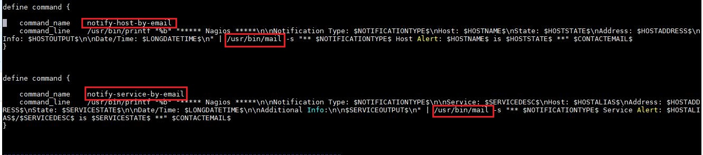
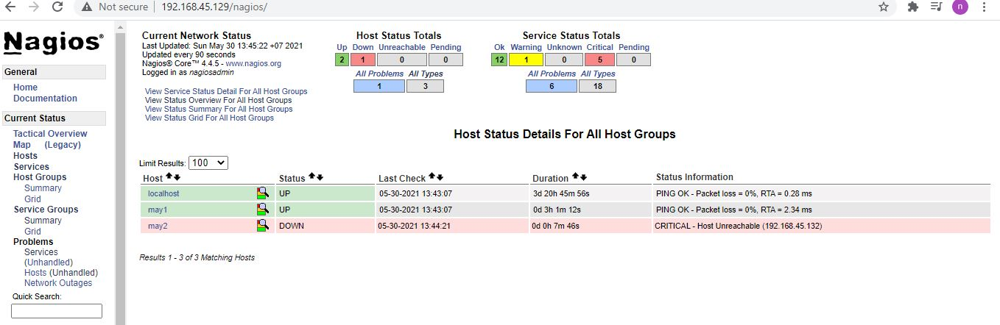
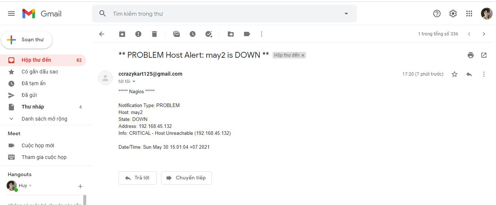
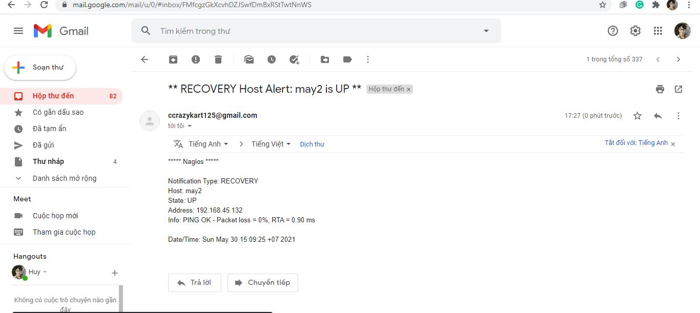

<h1 style="color:orange">1. Hướng dẫn gửi mail qua postfix</h1>
Postfix là một phầm mềm nguồn mở được dùng để gửi mail (Mail Transfer Agent-MTA). Được phát hành bởi IBM với mục tiêu thay thế trình gửi mail phổ biến là sendmail.
<h2 style="color:orange">1.1. Remove sendmail</h2>
Trước tiên cần kiểm tra xem sendmail đã được cài đặt chưa bằng câu lệnh

    # rpm -qa | grep sendmail
Nếu có kết quả trả về chứng tỏ sendmail đã được cài đặt. Ta cần remove nó

    # yum remove sendmail*
<h2 style="color:orange">1.2. Install postfix</h2>
Cài các packages

    # yum -y install postfix cyrus-sasl-plain mailx
Đặt postfix như MTA mặc định của hệ thống

    # alternatives --set mta /usr/sbin/postfix
Nếu câu lệnh bị lỗi và trả về output `/usr/sbin/postfix has not been configured as an alternative for mta` thì thực hiện lệnh sau:

    # alternatives --set mta /usr/sbin/sendmail.postfix
    # systemctl restart postfix
    # systemctl enable postfix
<h2 style="color:orange">1.3. Cấu hình postfix</h2>
    
    # vim /etc/postfix/main.cf
paste vào

    relayhost = [smtp.gmail.com]:587
    smtp_use_tls = yes
    smtp_sasl_auth_enable = yes
    smtp_sasl_password_maps = hash:/etc/postfix/sasl_passwd
    smtp_tls_CAfile = /etc/ssl/certs/ca-bundle.crt
    smtp_sasl_security_options = noanonymous
    smtp_sasl_tls_security_options = noanonymous

Tạo file `/etc/postfix/sasl_passwd` và thêm vào dòng sau

    [smtp.gmail.com]:587 username:password
    vd
    [smtp.gmail.com]:587 mail1@gmail.com:matkhau
Trong đó:

- username: là địa chỉ email dùng để gửi mail
- password: là password của email dùng để gửi mail

Phân quyền cho file vừa tạo

    # postmap /etc/postfix/sasl_passwd
    # chown root:postfix /etc/postfix/sasl_passwd*
    # chmod 640 /etc/postfix/sasl_passwd*
    # systemctl restart postfix
<h2 style="color:orange">1.4. Cho phép ứng dụng truy cập gmail</h2>
Nếu sử dụng gmail làm địa chỉ người gửi thì bạn phải cho phép ứng dụng truy cập gmail của bạn

Đăng nhập bằng gmail để thực hiện gửi mail đã khai báo bên trên trên trình duyệt và truy cập vào địa chỉ sau

https://myaccount.google.com/lesssecureapps

Bật chế độ cho phép ứng dụng truy cập
 

Kiểm tra

    # echo "test mail" | mail -s "mail kiem tra" phuonghuynguyen125@gmail.com
 
Lưu ý: theo như ví dụ trên thì là mail1@gmail.com gửi mail cho phuonghuynguyen125@gmail.com chứ không phải phuonghuynguyen125@gmail.com tự gửi cho chính nó. 
Tuy vậy việc gửi cho chính nó có thể xảy ra.
<h1 style="color:orange">2. Gửi mail cảnh báo nagios</h1>

Thêm các thông tin liên lạc của Nagios Ta sẽ tạo các thông tin liên lạc trong file `/usr/local/nagios/etc/objects/contacts.cfg`

    # vim /usr/local/nagios/etc/objects/contacts.cfg
paste vào

    define contact{
            contact_name                    nagiosadmin             ; Short name of user
            use                             generic-contact         ; Inherit default values from generic-contact template (defined above)
            alias                           Nagios Admin            ; Full name of user

            email                           phuonghuynguyen125@gmail.com        ; <<***** CHANGE THIS TO YOUR EMAIL ADDRESS ******

            service_notification_period             24x7
            service_notification_options            w,u,c,r,f,s
            service_notification_commands           notify-service-by-email
            host_notification_period                24x7
            host_notification_options               d,u,r,f,s
            host_notification_commands              notify-host-by-email
            }

    # systemctl restart nagios
Trong đó: Ý nghĩa của các tham số khai báo trên 
- service_notification_options: trạng thái sẽ gửi cảnh báo của service
- w: warning
- u: unknown service
- c: critical
- r: recovery service (trạng thái OK)
- f: cảnh báo khi service khởi động và tắt FLAPPING
- s: gửi cảnh báo khi dịch vụ downtime trong lịch trình
- host_notification_options: trạng thái sẽ gửi cảnh báo của host
- d: DOWN, cảnh báo khi host rơi vào trạng thái down
<h2 style="color:orange">2.1. Điều chỉnh file /usr/local/nagios/etc/objects/commands.cfg</h2>

    # vim /usr/local/nagios/etc/objects/commands.cfg
tìm đến `command_name notify-host-by-email` và `command_name notify-service-by-email` thay bằng `/usr/bin/mail`

 

    # systemctl restart nagios    
<h2 style="color:orange">2.1. Kiểm tra</h2>
Shutdown host may2 địa chỉ: 192.168.45.132

 

mail cảnh báo
 

Khi khởi động lại linux host may2 cũng có mail
 