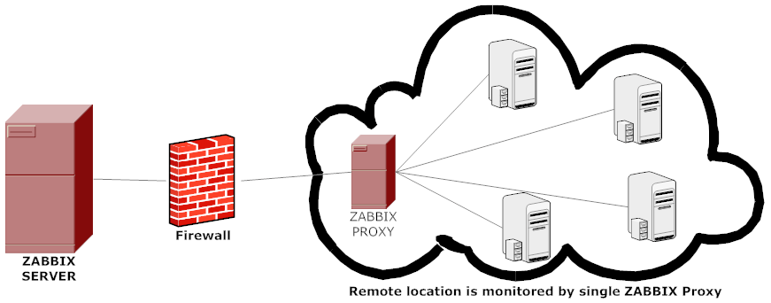

<h1 style="color:orange">Zabbix là gì</h1>
Zabbix là một phần mềm mã nguồn mở được công bố lần đầu 2001, đến năm 2004 thì ra mắt phiên bản ổn định đầu tiên 1.0, có chức năng giám sát các dịch vụ mạng và  tài nguyên công nghệ khác như máy chủ, phần cứng,.. một cách nhanh chóng, hiệu quả. Kết quả phân tích, thống kê số liệu được thể hiện một cách trực quan; các thông báo về vấn đề tiềm ẩn được cập nhật chính xác và kịp thời. 

Zabbix được sáng lập bởi Alexei Vladishev và hiện tại được phát triển cũng như hỗ trợ bởi tổ chức Zabbix SIA. Zabbix được viết và phát hành dưới bản quyền General Public License GPL phiên bản 2. Zabbix sử dụng các cơ chế thông báo vấn đề linh hoạt cho quản trị viên như email, sms, OTT App,.. Zabbix cũng cung cấp báo cáo và dữ liệu cực kì chính xác dựa trên cơ sở dữ liệu đã thu thập được từ thiết bị mạng.

Tất cả báo cáo, thống kê cũng như cấu hình thông số của Zabbix có thể dễ dàng truy cập qua giao diện web tinh tế đẹp mắt. Giúp chúng ta theo dõi được tình trạng hệ thống thiết bị server, dịch vụ,..
<h2 style="color:orange">1. Ưu/nhược điểm</h2>
<h3 style="color:orange">1.1. Ưu điểm</h3>

- Đây là một công cụ mã nguồn mở, dễ phát triển và mở rộng theo ý người dùng. Chi phí đầu tư ban đầu thấp
- Thực hiện chức năng giám sát toàn diện trên các thiết bị phần cứng và dịch vụ mạng 
- Hỗ trợ tốt các máy chủ đặt trên hệ điều hành Linux
- Giao diện thân thiện và đẹp mắt
- Phân quyền user linh động và dễ thực hiện 
- Thông báo các sự cố nhanh chóng qua email hoặc app
- Các chức năng theo dõi thống kê được thực hiện chủ động, dễ thiết lập và sửa đổi
- Sở hữu tài nguyên công cụ lớn với nhiều plugin hỗ trợ cho các dịch vụ hệ thống khác nhau
- Có tính năng chứng thực người dùng 
- Kết quả được trả về dưới dạng biểu đồ trực quan, dễ phân tích và đánh giá.
<h3 style="color:orange">1.1. Nhược điểm</h3>

- Zabbix không hỗ trợ giao diện web mobile 
- Thiết kế template/alerting rule của hệ thống được người dùng đánh giá là không mấy thân thiện vì đôi khi nó yêu cầu cao về kiến thức code của người dùng.
- Sẽ gặp tình trạng mất ổn định và các vấn đề hiệu suất về PHP và Database khi sử dụng hệ thống mạng lớn hơn 1000+ node.
<h2 style="color:orange">2. Thành phần cơ bản zabbix</h2>

1. Zabbix server: Đây là ứng dụng chương trình dịch vụ chính của dịch vụ Zabbix. Zabbix Server sẽ chịu trách nhiệm cho các hoạt động kiểm tra dịch vụ mạng từ xa, thu thập thông tin, lưu trữ, hiển thị, cảnh báo,… từ đó các quản trị viên có thể thao tác giám sát hệ thống tốt nhất.
2. Zabbix Proxy: là một máy chủ được dùng cho việc quản lý nhiều nhánh hệ thống ở xa, hoặc ở các lớp mạng khác nhau. Từ Zabbix Proxy sẽ thu thập các thông tin thiết bị mạng rồi chuyển tiếp về cho máy chủ dịch vụ chính Zabbix Server.
 
3. Zabbix Agent: zabbix agent là chương trình zabbix dùng để cài đặt lên các máy chủ hoặc thiết bị phía client. Từ đó hỗ trợ kết nối từ Zabbix Server để lấy các thông tin cần thiết từ client nhằm kiểm tra các tình trạng hệ thống hoặc theo nhu cầu quản trị viên.
4. Giao diện web: cung cấp giao diện web trên nền tảng mã nguồn PHP cùng phong cách metro tinh tế. Hiện tại có thể xem Zabbix là một trong những ứng dụng có giao diện đẹp nhất, thiết kế vị trí tính năng bắt mắt và hợp lý.
<h2 style="color:orange">3. Zabbix giám sát</h2>

- giám sát phần cứng: Zabbix thực hiện giám sát các vấn đề như nhiệt độ máy chủ, công tắc bộ định tuyến, ... thông qua SNMP.

Dành cho các bạn chưa rõ, SNMP (Simple Network Management Protocol) là tập hợp các giao thức có chức năng kiểm tra hoạt động và hỗ trợ vận hành từ xa cho các thiết bị mạng như router, switch hay server.
- Giám sát hệ thống: Là việc theo dõi các số liệu về dung lượng, tốc độ của hạ tầng như CPU, Ram, ổ cứng,... nhằm đảm bảo tài nguyên của bạn luôn đủ để sử dụng.
- Giám sát mạng: thường sử dụng với các công ty sử dụng giải pháp mạng điện toán đám mây. 
- Giám sát bảo mật: Bao gồm tường lửa, phần mềm chống DDOS, mật khẩu, sao lưu, phục hồi và các hệ thống bảo mật được các nhà cung cấp cài đặt sẵn trên các giải pháp mạng. Báo cáo quá trình hoạt động của các công cụ này, sự ghé thăm của mã độc, những đường link chứa nhiều mã độc truy cập vào trang,... 
- Giám sát web: chức năng này có thể được phát triển cao hơn với nhu cầu kiểm soát của người dùng. Nó đưa ra các số liệu về thời gian tải trang, tốc độ load, thời gian phản hồi,... 
- Theo dõi nhật ký: là quá trình thu thập, lưu trữ, truy vấn dữ liệu. Bạn có thể theo dõi Nginx thông qua nhật ký 500x, lỗi PHP,...