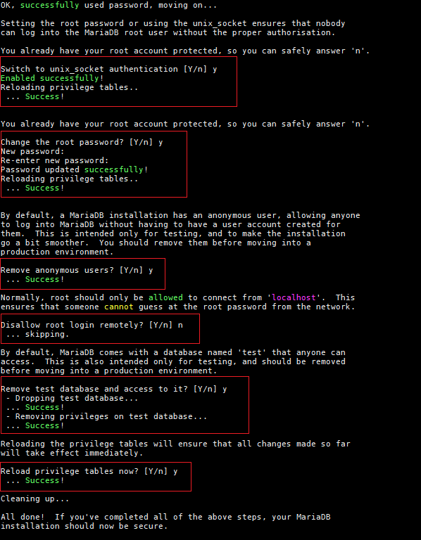

<h1 style="color:orange">Cài đặt Zabbix</h1>
zabbix server: 192.168.45.131/24
<h2 style="color:orange">1. Cài đặt Apache</h2>

    # yum install -y httpd vim
Sau khi cài xong Apache, config file /etc/httpd/conf/httpd.conf

    # vim /etc/httpd/conf/httpd.conf
Thêm vào cuối file

    ServerSignature Off
    ServerTokens Prod
Dòng lệnh ServerTokens cấu hình những gì HTTP server trả lời. Những option phù hợp là Full/OS/Minimal/Minor/Major/Prod. 
Thêm vào những dòng sau: set serverName:

    ServerName zabbix.example.com
Set server admin để nhận mail cảnh báo:

    ServerAdmin admin@example.com
restart lại apache

    # systemctl restart httpd
Cấu hình firewall:

    # sudo firewall-cmd --add-service={http,https} --permanent
    hoặc 
    # sudo firewall-cmd --add-service={80,443}/tcp --permanent
    # sudo firewall-cmd --reload
<h2 style="color:orange">2. Cài đặt Mariadb server</h2>
Mặc định CentOS7 không có repo của Mariadb dùng lệnh:

       vim /etc/yum.repos.d/mariadb.repo
để đặt repository cho Mariadb

Dán nội dung sau vào file

       [mariadb]
       name = MariaDB
       baseurl = http://yum.mariadb.org/10.5.9/rhel7-amd64/
       gpgkey=https://yum.mariadb.org/RPM-GPG-KEY-MariaDB
       gpgcheck=1
để cài mariadb 10.5.9. Ngoài ra cũng có thể tìm bản mới nhất của mariadb tại đây http://yum.mariadb.org
<h3 style="color:orange">2.1. Cài đặt Mariadb</h3>

1. Để gỡ các phiên bản Mariadb hoặc MySQL trước và các gói liên quan

       yum erase mysql
Ngoài ra còn phải dùng lệnh 

       # rpm -qa|grep mysql
Nó sẽ liệt ra tất cả những package mysql trong hệ thống 
 
Sau đó dùng lệnh 

       # yum remove <tên package>
       vd: # yum remove mysql-community-common-5.7.33-1.el7.x86_64
để remove hết tất cả packages mysql cũ

2. Dùng lệnh để cài Mariadb

       yum -y install MariaDB-server MariaDB-client
3. Tương tự Mysql các lệnh điều khiển mariadb

       systemctl start mariadb
       systemctl enable mariadb
4. Để cài đặt Mariadb

       mysql_secure_installation
Đăng nhập lần đầu không cần password. Ấn enter. 
 
Nếu có lỗi không thể kết nối đến file /var/lib/mysql/mysql.sock như trên:

Tạo file mysql.sock trong /var/lib/mysql:

       touch /var/lib/mysql/mysql.sock
       Gán quyền : chmod 777 mysql.sock
       Đổi user: chown mysql:mysql /var/lib/mysql/mysql.sock
Sau đó vào file vim /etc/my.cnf 
 
thêm dòng

      [mysql]
      socket = /var/lib/mysql/mysql.sock
-----> systemctl restart mariadb để mariadb nhận file config

Sau đó mysql_secure_installation triển khai bình thường

 

Tắt plugin unix_socket trong file /etc/my.cnf.d/server.cnf
    
      [mariadb]
      ...
      unix_socket=OFF
5. Khởi động lại mariadb

      systemctl restart mariadb
<h3 style="color:orange">2.2. Đăng nhập Mariadb</h3>

      mysql -uroot -p
Gõ password 
 
<h3 style="color:orange">2.3. Tạo database cho zabbix sử dụng</h3>
Sau khi Database server được cài đặt, tạo database cho Zabbix user:

    # export zabbix_db_pass="Huy123"
    # mysql -uroot -p <<MYSQL_SCRIPT
       > create database zabbix character set utf8 collate utf8_bin;
       > grant all privileges on zabbix.* to zabbix@'localhost' identified by '${zabbix_db_pass}';
       > FLUSH PRIVILEGES;
       > MYSQL_SCRIPT
 
- Password ở đây là password để truy cập Mariadb.
- Huy123 là password cho database zabbix
<h2 style="color:orange">3. Cài zabbix 5.0</h2>
Thêm repo của zabbix 5.0:

    # sudo yum install -y https://repo.zabbix.com/zabbix/5.0/rhel/7/x86_64/zabbix-release-5.0-1.el7.noarch.rpm
Install zabbix 5.0 server và frontend với Mysql support:

    # sudo yum install zabbix-server-mysql zabbix-agent zabbix-get
Install Zabbix frontend:

    # sudo yum-config-manager --enable zabbix-frontend
    # sudo yum -y install centos-release-scl
    # sudo yum -y install zabbix-web-mysql-scl zabbix-apache-conf-scl
<h3 style="color:orange">3.1. Import data cho server với Mariadb</h3>

    # sudo su -
    # zcat /usr/share/doc/zabbix-server-mysql*/create.sql.gz | mysql -uzabbix -p zabbix
 
Nhập password của zabbix database, ở trên là Huy123
<h2 style="color:orange">4. Cấu hình và start zabbix server</h2>

    # vim /etc/zabbix/zabbix_server.conf

    DBName=zabbix
    DBUser=zabbix
    DBPassword=StrongPassword
cấu hình PHP cho Zabbix frontend - set timezone

    # vim /etc/opt/rh/rh-php72/php-fpm.d/zabbix.conf
    php_value[date.timezone] = Asia/Ho_Chi_Minh
Bắt đầu zabbix và các tiến trình liên quan

    # sudo systemctl restart zabbix-server zabbix-agent httpd rh-php72-php-fpm
    # systemctl enable zabbix-server zabbix-agent httpd rh-php72-php-fpm
<h3 style="color:orange">4.1. Cấu hình firewall</h3>

    # sudo firewall-cmd --add-port={10051/tcp,10050/tcp} --permanent
    # sudo firewall-cmd --reload

    # sudo systemctl restart httpd
<h3 style="color:orange">4.2. Cấu hình SELinux</h3>
<h3 style="color:orange">4.2.1. Cấu hình SELinux cho Apache</h3>
Để cấu hình policies SELinux, cần phải cài đặt SEMANAGE bằng lệnh:
    
    # yum install -y policycoreutils-python
Sử dụng httpd_unified boolean để SElinux cho phép tất cả các file Apache đều hoạt động:
 
    # sudo setsebool -P httpd_unified 1
<h3 style="color:orange">4.2.2. Cấu hình SELinux cho zabbix</h3>
Yêu cầu phải cài SEMANAGE.
SELinux tạo rất nhiều messages trong file /var/log/audit/audit.log

    # grep zabbix_t /var/log/audit/audit.log | audit2allow -M zabbix_server_custom
Có thể nhìn nội dung file vừa tạo tại thư mục hiện tại đang đứng:
 
    # ls -l
 
Đẩy policy module vừa tạo vào SELinux policy

    # semodule -i zabbix_server_custom.pp
Zabbix server có thể chưa start được do vẫn thiếu SELinux rules. 
Lặp lại tập hợp lệnh ít nhất 3 lần và check zabbix server log sau mỗi lần lặp lại. Đó là do mỗi khi SELinux rule được thêm vào, zabbix logged vào audit log. Do đó có thể nhận thêm vấn đề mới và thêm vào SElinux policy. 
Xóa file policy sau khi đã add thành công

    # rm zabbix_server_custom.*

Ngoài ra, kiểm tra:

    # getsebool -a | grep zabbix
 
Nếu các trường trên để off thì sử dụng lệnh:

    # setsebool -P zabbix_can_network=1
    # setsebool -P zabbix_can_connect_zabbix=1
Hoặc đơn giản cấu hình Selinux cho mọi tiến trình zabbix hoạt động
    
    # semanage permissive -a zabbix_agent_t
khởi động lại zabbix và apache

    # sudo systemctl restart zabbix-server zabbix-agent httpd rh-php72-php-fpm
    # systemctl restart httpd
<h2 style="color:orange">5. Đăng nhập zabbix lần đầu</h2>
Truy cập "http://(Zabbix server’s hostname or IP address)/zabbix/" để bắt đầu cài đặt trên web

 
 
 
Với password ở đây là password để truy cập database zabbix.
 
 
Khi vào login page, sử dụng username và password default để đăng nhập:

   Username: "Admin"
   Password: "zabbix"
Định dạng page trông như sau: 
 
<h2 style="color:orange">5.1. Đổi password zabbix</h2>

Administration > Users > Admin > Password > Change Password