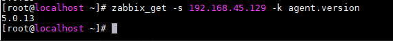
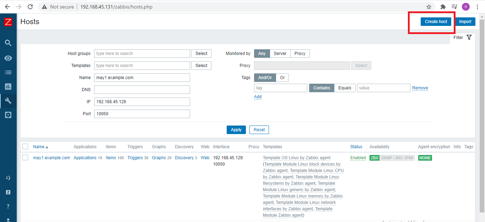
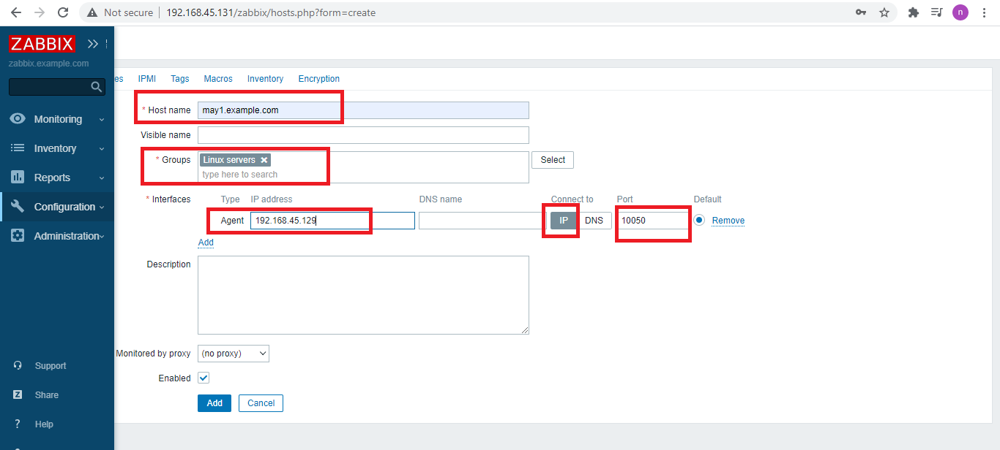
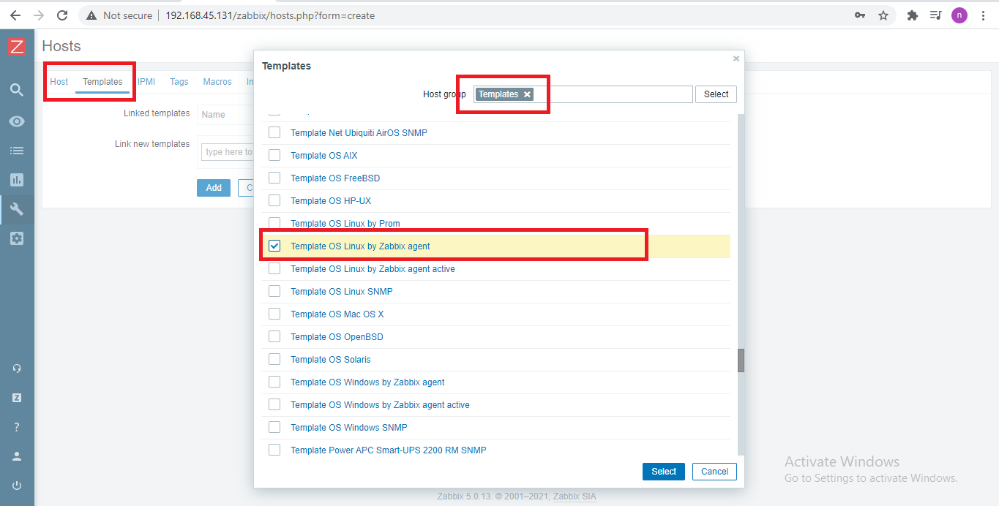
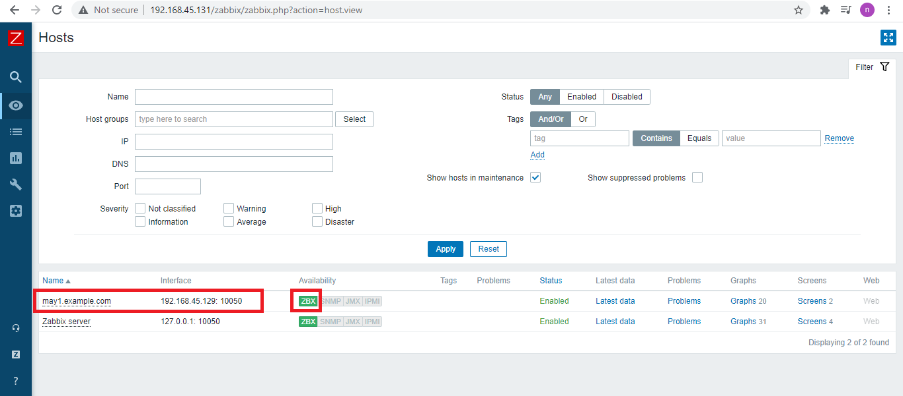

<h1 style="color:orange">Thêm host vào Zabbix để quản lý</h1>
Chuẩn bị:  
zabbix server: 192.168.45.131/24 
zabbix host: Centos7: 192.168.45.129/24 
<h2 style="color:orange">1. Trên host Centos7</h2>
Cài repo zabbix agent:

    # sudo yum install -y https://repo.zabbix.com/zabbix/5.0/rhel/7/x86_64/zabbix-release-5.0-1.el7.noarch.rpm
Cài zabbix agent

    # yum install zabbix-agent -y
Cấu hình file zabbix agent:  /etc/zabbix/zabbix_agentd.conf

    # vim /etc/zabbix/zabbix_agentd.conf

    Server=<IP_ZABBIX_SERVER>
    ServerActive=<IP_ZABBIX_SERVER>
    Hostname=<ZABBIX_SERVER_HOSTNAME>
    vd:
    Server=192.168.45.131
    ServerActive=192.168.45.131
    Hostname=zabbix.example.com
Cấu hình firewall

    # firewall-cmd --zone=public --add-port={10050,10051}/tcp --permanent
    # firewall-cmd --reload
Khởi động lại dịch vụ

    # systemctl enable zabbix-agent
    # systemctl restart zabbix-agent
<h3 style="color:orange">1.1. Kiểm tra việc cài đặt</h3>
Trên zabbix server

    # zabbix_get -s <ZABBIX_AGENT_IP> -k agent.version
    # zabbix_get -s 192.168.45.129 -k agent.version
Nếu hiện phiên bản của zabbix-agent là thành công 
 
<h2 style="color:orange">2. Trên giao diện web quản lý của zabbix server</h2>
Configuration ----> Hosts ------> Create host

 
 

Trong đó:
- hostname: tên của máy host muốn quản lý, đặt tên dễ nhớ để dễ quản lý
- Groups: đây là trường bắt buộc, vì là máy Centos7 nên để group là `Linux servers`
- Địa chỉ IP và port mặc định: 10050

 
Ngoài ra, còn có những template được nhà phát hành zabbix định sẵn để chúng ta không mất nhiều thời gian tự cấu hình xem zabbix sẽ giám sát dịch vụ nào của host. Nếu muốn giám sát thêm các dịch vụ khác có thể tự cấu hình.

Vào phần Templates cạnh phần Host. Chọn Select ----> templates -----> chọn OS Linux zabbix agent là template thường được sử dụng.

------> Add
 
Thành công