<h1 style="color:orange">Gửi cảnh báo mail qua zabbix</h1>
<h2 style="color:orange">1. Cài đặt phần mềm postfix để gửi mail</h2>
Trên zabbix server tiến hành cài postfix
Postfix là một phầm mềm nguồn mở được dùng để gửi mail (Mail Transfer Agent-MTA). Được phát hành bởi IBM với mục tiêu thay thế trình gửi mail phổ biến là sendmail.
<h2 style="color:orange">1.1. Remove sendmail</h2>
Trước tiên cần kiểm tra xem sendmail đã được cài đặt chưa bằng câu lệnh

    # rpm -qa | grep sendmail
Nếu có kết quả trả về chứng tỏ sendmail đã được cài đặt. Ta cần remove nó

    # yum remove sendmail*
<h2 style="color:orange">1.2. Install postfix</h2>
Cài các packages

    # yum -y install postfix cyrus-sasl-plain mailx
Đặt postfix như MTA mặc định của hệ thống

    # alternatives --set mta /usr/sbin/postfix
Nếu câu lệnh bị lỗi và trả về output `/usr/sbin/postfix has not been configured as an alternative for mta` thì thực hiện lệnh sau:

    # alternatives --set mta /usr/sbin/sendmail.postfix
    # systemctl restart postfix
    # systemctl enable postfix
<h2 style="color:orange">1.3. Cấu hình postfix</h2>
    
    # vim /etc/postfix/main.cf
paste vào

    relayhost = [smtp.gmail.com]:587
    smtp_use_tls = yes
    smtp_sasl_auth_enable = yes
    smtp_sasl_password_maps = hash:/etc/postfix/sasl_passwd
    smtp_tls_CAfile = /etc/ssl/certs/ca-bundle.crt
    smtp_sasl_security_options = noanonymous
    smtp_sasl_tls_security_options = noanonymous

Tạo file `/etc/postfix/sasl_passwd` và thêm vào dòng sau

    [smtp.gmail.com]:587 username:password
    vd
    [smtp.gmail.com]:587 mail1@gmail.com:matkhau
Trong đó:

- username: là địa chỉ email dùng để gửi mail
- password: là password của email dùng để gửi mail

Phân quyền cho file vừa tạo

    # postmap /etc/postfix/sasl_passwd
    # chown root:postfix /etc/postfix/sasl_passwd*
    # chmod 640 /etc/postfix/sasl_passwd*
    # systemctl restart postfix
Cấu hình firewall

    # firewall-cmd --permanent --add-port=587/tcp
    # firewall-cmd --reload
<h2 style="color:orange">1.4. Cho phép ứng dụng truy cập gmail</h2>
Nếu sử dụng gmail làm địa chỉ người gửi thì bạn phải cho phép ứng dụng truy cập gmail của bạn

Đăng nhập bằng gmail để thực hiện gửi mail đã khai báo bên trên trên trình duyệt và truy cập vào địa chỉ sau

https://myaccount.google.com/lesssecureapps

Bật chế độ cho phép ứng dụng truy cập
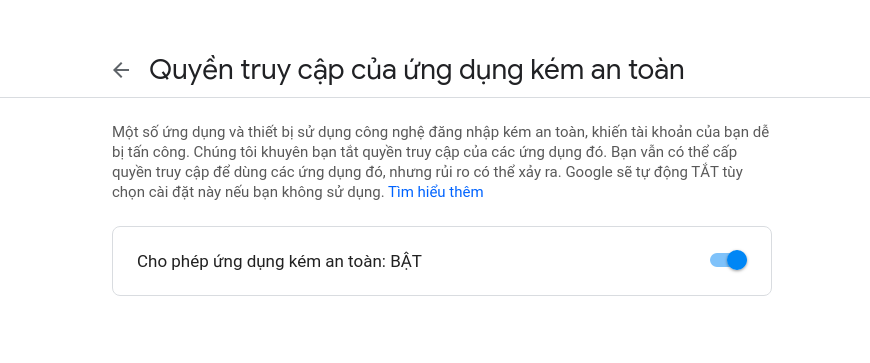 

Kiểm tra

    # echo "test mail" | mail -s "mail kiem tra" phuonghuynguyen125@gmail.com
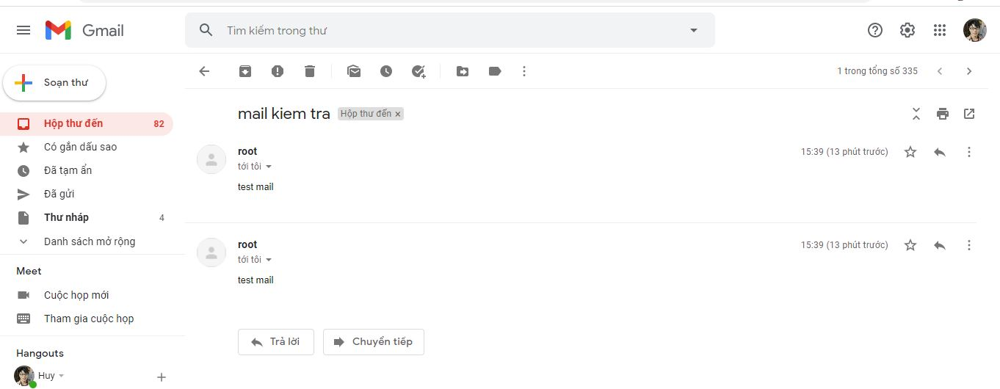 
Lưu ý: theo như ví dụ trên thì là mail1@gmail.com gửi mail cho phuonghuynguyen125@gmail.com chứ không phải phuonghuynguyen125@gmail.com tự gửi cho chính nó. 
Tuy vậy việc gửi cho chính nó có thể xảy ra
<h2 style="color:orange">2. Cấu hình zabbix gửi mail cảnh báo</h2>
Vào giao diện web zabbix: Administration ----> Mediatypes ------> Mail

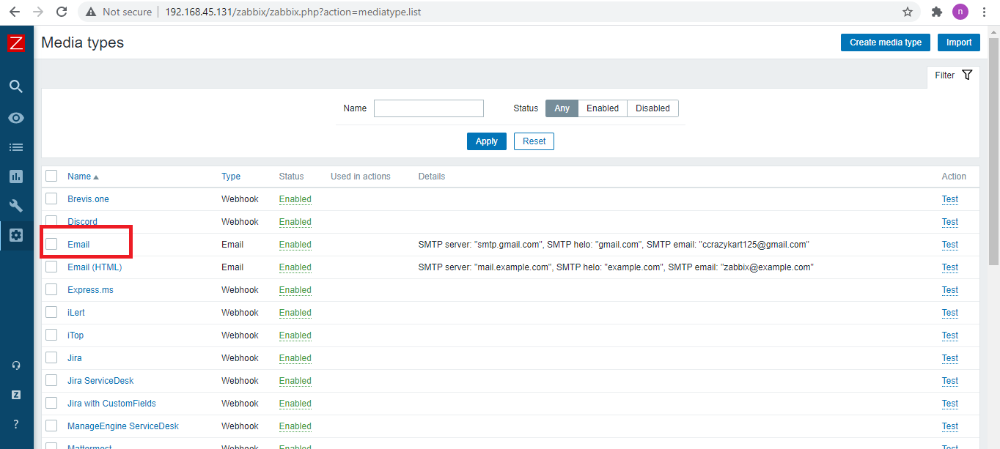 
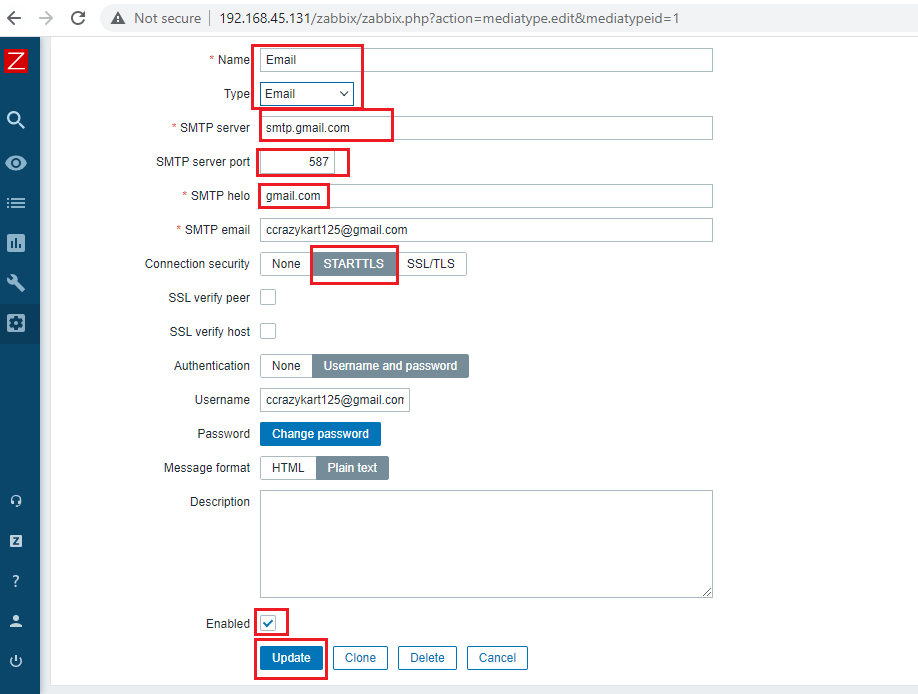 
Cấu hình tương tự như hình trên với:
- connection security: STARTTLS
- username và password là tên gmail và mật khẩu của gmail mà bạn muốn dùng để gửi cảnh báo (From).
- port 587 của postfix 
--------> update.
<h3 style="color:orange">2.1. enable config action</h3>
Trong giao diện web: Configuration ----> Actions:

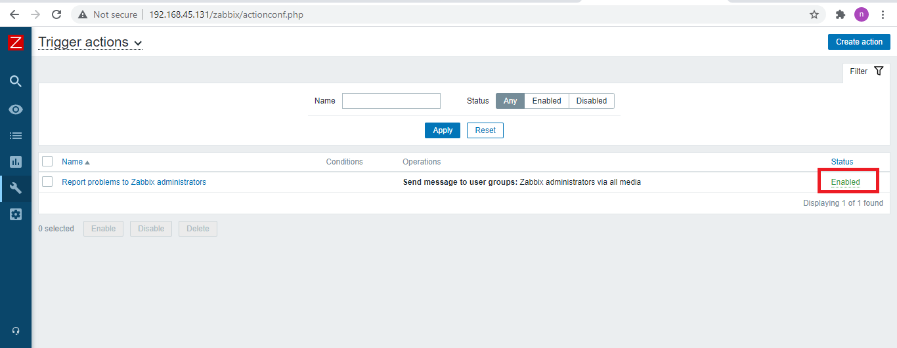 
<h3 style="color:orange">2.2. Cấu hình gmail nhận mail cảnh báo</h3>
Ở trên ta mới cấu hình mail gửi thư, bây giờ ta sẽ cấu hình mail nhận thư. 
Administration -----> Users ------> Admin 

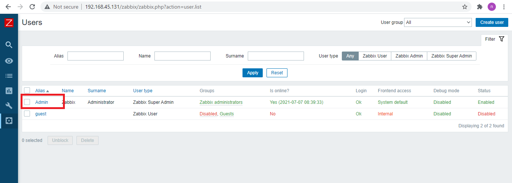 
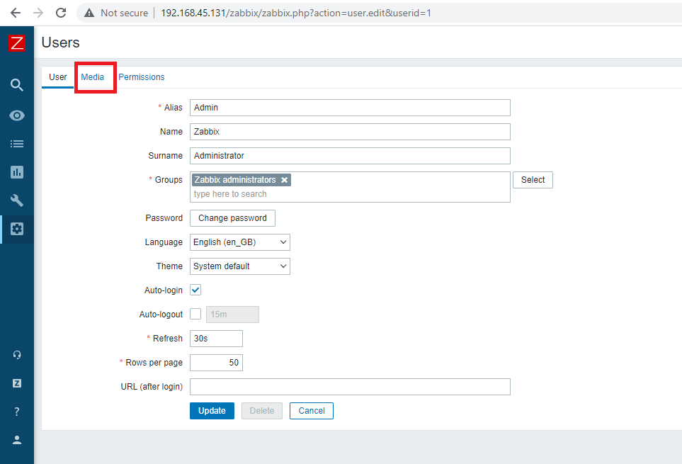 
Vào phần Media 
 
Trong đó:
- Type: email
- Send to: là mail nhận thư cảnh báo

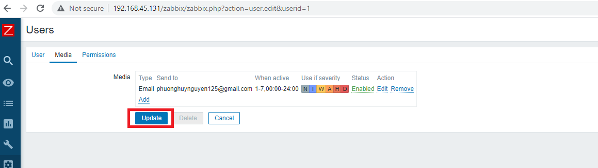 
------> Update
<h2 style="color:orange">3. Test zabbix gửi mail</h2>

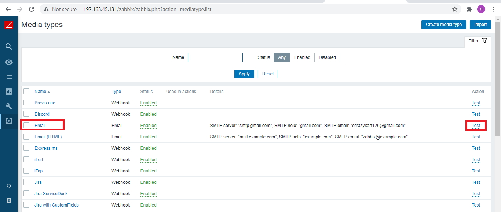 
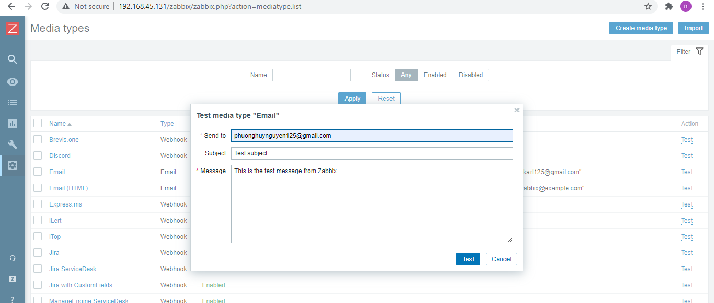 

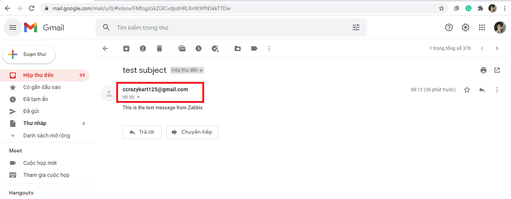 
---------> Thành công 
Nếu không thấy zabbix gửi mail có thể kiểm tra xem zabbix server đã mở port 587 chưa.
<h2 style="color:orange">4. Test zabbix gửi mail cảnh báo</h2>
Thử restart máy 

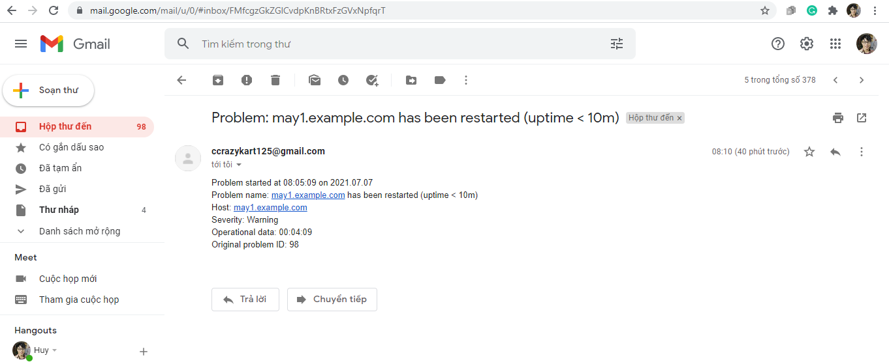 
------> Thành công