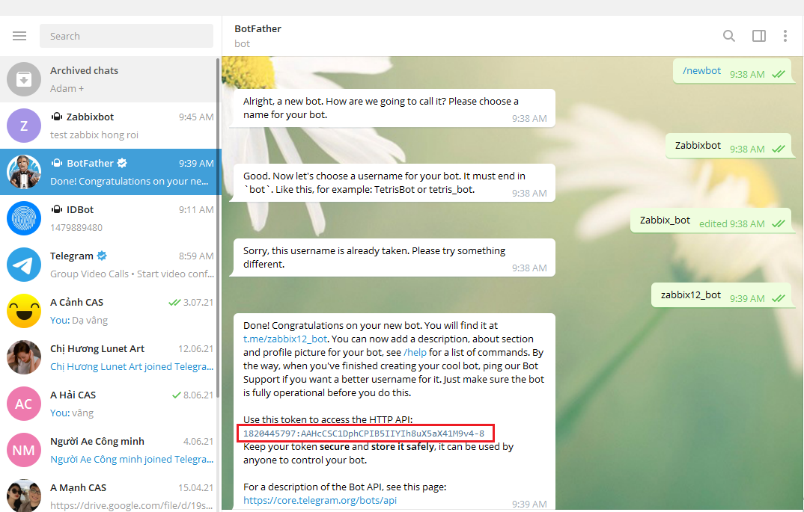
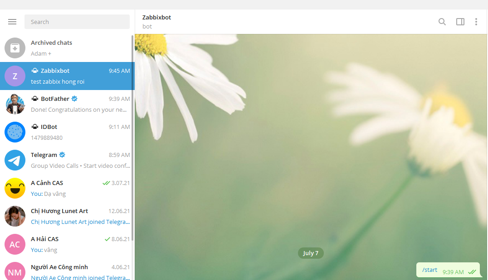

<h1 style="color:orange">Gửi cảnh báo zabbix qua telegram</h1>
Hướng dẫn gửi mail cảnh báo zabbix qua telegram chat. 
Những bước thực hiện sau được thực hiên trên telegram PC. Tuy vậy việc thực hiện trên telegram mobile cũng tương tự
<h2 style="color:orange">Bước 1</h2>
Tìm "@BotFather" và gửi tin nhắn "/newbot". Làm theo hướng dẫn và lấy token mà botfather đưa.

 
<h2 style="color:orange">Bước 2</h2>
Lấy account telegram muốn nhận tin nhắn cảnh báo, tìm "@myidbot" và gửi "/getid".

 
<h2 style="color:orange">Bước 3</h2>
Chat với zabbix12_bot mà @BotFather vừa tạo cho chúng ta:

 
Lấy account telegram muốn tạo nhắn "/start" cho zabbix bot. Nếu không nhắn "/start", zabbit bot sẽ không thể gửi tin nhắn cho tài khoản này.
 
Nếu muốn gửi tin nhắn cho 1 group
- Add "@myidbot" và "@tên zabbix bot" vào nhóm.
- gửi "/getgroupid@myidbot" vào group
- Trong group chat gửi "/start@your_bot_name_here". Nếu không thực hiện bước này,zabbix bot sẽ không thể gửi cảnh báo.

 
<h2 style="color:orange">Bước 4: zabbix setup</h2>
Vào giao diện web của Zabbix: Administration -----> Media type

 
 
Trong đó: 
- Token là token mà @BotFather tạo cho zabbix bot
- Parse Mode là dạng hiển thị của tin nhắn mà zabbix bot thông báo, có 3 kiểu là: Markdown / HTML / MarkdownV2 
-------> Lưu
<h3 style="color:orange">4.1. enable config action</h3>
Trong giao diện web: Configuration ----> Actions:

 
<h3 style="color:orange">4.2. Kiểm tra</h3>
Ấn vào test bên cạnh telegram 

 
 
 
------> Thành công
<h2 style="color:orange">Bước 5: zabbix setup</h2>
Administration ----> Users ------> Admin

 
Media ------> Add 
 

- Type: telegram
- Send to: id mà "@idbot" cung cấp 
-------> Update
<h2 style="color:orange">Bước 6: Kiểm tra</h2>
Trên máy client tắt zabbix-agent

 
-------> Thực hiện cảnh báo thành công
<h2 style="color:orange">Cảnh báo bằng hình ảnh có graphic đi kèm</h2>
Lưu ý: script sau chỉ sử dụng được cho phiên bản 4.4 zabbix chứ không phải 5.0 zabbix trở lên
<h3 style="color:orange">1. Download scripts alert telegram</h3>

    # cd /usr/lib/zabbix/alertscripts
    # wget https://termbin.com/yx3f
    # mv /usr/lib/zabbix/alertscripts/yx3f /usr/lib/zabbix/alertscripts/zabbix-telegram.sh
    # chmod +x zabbix-telegram.sh
<h3 style="color:orange">2. Chỉnh sửa file script</h3>
Để người quản trị có thể nhận được các cảnh báo thông qua telegram, phải sửa tham số ZBX_URL là địa chỉ zabbix server, USERNAME, PASSWORD, BOT_TOKEN là chuỗi token telegram bot đã tạo ở trên nhận cảnh cáo.

 
<h3 style="color:orange">3. Cấu hình cảnh báo telegram trên zabbix</h3>
<h3 style="color:orange">3.1. Tạo media type</h3>
Media type chính là các kênh kể zabbix server gửi cảnh báo có thể là Email, SMS hay một kênh được tạo ra bằng scripts. 
Click Administrator -> Media types -> Create media type 

 
Nhập các thông tin về media type mới

    Name: Telegram (Tên có thể tùy đặt)
    Type: Script
    Script name: Tên của script có trong thư mục alert script của server zabbix
    Script parameter:
    {ALERT.SENDTO}
    {ALERT.SUBJECT}
    {ALERT.MESSAGE}
 
Tạo thành công Media type mới có tên là Telegram 
 
<h3 style="color:orange">4. Tạo action</h3>
Tạo action để khi có sự bất thường đối với các thông số monitor sẽ có alert qua telegram.

Click Configuration -> Action -> Create action 
 
Lưu ý disabled action mặc định của zabbix.
<h3 style="color:orange">4.1. Tại tab action</h3>
Nhập thông tin:

Name: Tên của action muốn tạo 
Tab operation: Thiết lập thông tin về bản tin cảnh báo gửi đi 
 
Default subject (Tiêu đề của thông báo)

    Disaster {HOSTNAME}:{TRIGGER.NAME}-status-{TRIGGER.STATUS}
Default message (Nội dung của thông báo)

    {TRIGGER.NAME} on {HOSTNAME}
    Status:{TRIGGER.STATUS}
    Severity:{TRIGGER.SEVERITY}
    Values:{ITEM.VALUE1}
 
    Item Graphic: [{ITEM.ID1}]
 
Set group hoặc chỉ định user nhận được cảnh báo. 
 
Set cho action gửi cảnh báo qua kênh nào. Có thể lựa chọn một hoặc nhiều kênh.
 
Click add
 
<h3 style="color:orange">4.2. Tab recovery</h3>
Default subject (Tiêu đề của thông báo recovery)

    OK Resolved: {HOSTNAME}:{TRIGGER.NAME}-status-{TRIGGER.STATUS}
Default message (Nội dung của thông báo)

    {TRIGGER.NAME} on {HOSTNAME}
    Status: {TRIGGER.STATUS}
    Severity: {TRIGGER.SEVERITY}
    Values: {ITEM.VALUE1}

    Item Graphic: [{ITEM.ID1}]
Sau khi nhập đủ thông tin click Add
 
Tạo thành công action mới
 

Link tham khảo: https://blogcloud365vn.github.io/monitor/zabbix4-thiet-lap-canh-bao-qua-telegram/