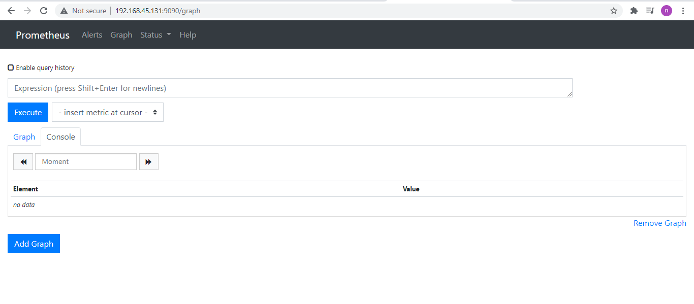

<h1 style="color:orange">1. Đôi nét về Prometheus và Grafana</h1>
<h2 style="color:orange">2. Prometheus và Node-exporter là gì</h2>

`Prometheus` là một open-source systems monitoring và alerting ban đầu được xây dựng tại SoundCloud. Vào năm 2012 nhiều công ty, tổ chức đã đứng ra bảo trợ cho Prometheus, và project này cực kỳ và phát và có rất nhiều người dùng. Hiện tại nó không còn là một project độc lập mà được phát triển bởi rất nhiều công ty khác nhau. Nó sử dụng mã nguồn GoLang của google. Hiện tại thì Prometheus 100% là open source và có Apache 2 License on GitHub.

`Prometheus Node Exporter` là một chương trình exporter viết bằng ngôn ngữ Golang. Exporter là một chương trình được sử dụng với mục đích thu thập, chuyển đổi các metric không ở dạng kiểu dữ liệu chuẩn Prometheus sang chuẩn dữ liệu Prometheus. Sau đấy exporter sẽ expose web service api chứa thông tin các metrics hoặc đẩy về Prometheus.

`Node Exporter` này sẽ đi thu thập các thông số về máy chủ Linux như : ram, load, cpu, disk, network,…. từ đó tổng hợp và xuất ra kênh truy cập các metrics hệ thống này ở port TCP 9100 để Prometheus đi lấy dữ liệu metric cho việc giám sát.
<h2 style="color:orange">3. Grafana là gì</h2>
Là một công cụ trực quan hóa, Grafana là một thành phần phổ biến trong các ngăn xếp giám sát,  thường được sử dụng kết hợp với cơ sở dữ liệu chuỗi thời gian như InfluxDB , Prometheus và Graphite ;  các nền tảng giám sát như Sensu, Icinga , Checkmk , Zabbix , Netdata , và PRTG ; SIEM như Elasticsearch  và Splunk ; và các nguồn dữ liệu khác.

Nói  dễ hình dung là sau khi lấy được metric từ các thiết bị, grafana sẽ sử dụng metric đó để phân tích và tạo ra dashboard mô tả trực quan các metric cần thiết cho việc monitoring ví dụ như cpu, ram, disk, network, iops, session. Grafana lấy dữ liệu từ những phần mềm monitor và chuyển sang dạng biểu đồ rất thân thiện người dùng.

Việc xây dựng Dashboard nó là một phần quan trọng trong việc monitor của hệ thống. Grafana support rất nhiều giải pháp monitor khác nhau.
<h1 style="color:orange">Cài đặt Prometheus và Grafana trên CentOS7</h1>
<h2 style="color:orange">1. Cài đặt Prometheus</h2>
Cài đặt Prometheus trên server CentOS7 giám sát. IP: 192.168.45.131/24
<h3 style="color:orange">1.1. Tải prometheus package</h3>

    # wget https://github.com/prometheus/prometheus/releases/download/v2.8.1/prometheus-2.8.1.linux-amd64.tar.gz
<h3 style="color:orange">1.2. Cấu hình prometheus</h3>
Thêm prometheus user

    # useradd --no-create-home --shell /bin/false prometheus
Tạo thư mục và change owner

    # mkdir /etc/prometheus
    # mkdir /var/lib/prometheus
    # chown prometheus:prometheus /etc/prometheus
    # [root@fosnix ~]# chown prometheus:prometheus /var/lib/prometheus
Extract file prometheus đã tải và dổi tên để dễ cài đặt

    # tar -xvzf prometheus-2.8.1.linux-amd64.tar.gz
    # mv prometheus-2.8.1.linux-amd64 prometheuspackage
Copy "prometheus" và "promtool" từ thư mục "prometheuspackage" đến "/usr/local/bin" và change owner các file đó thành prometheus

    # cp prometheuspackage/prometheus /usr/local/bin/
    # cp prometheuspackage/promtool /usr/local/bin/
    # chown prometheus:prometheus /usr/local/bin/prometheus
    # chown prometheus:prometheus /usr/local/bin/promtool
Copy "consoles" và "console_libraries" từ "prometheuspackage" đến thư mục "/etc/prometheus" và đổi owner thành prometheus user.

    # cp -r prometheuspackage/consoles /etc/prometheus
    # cp -r prometheuspackage/console_libraries /etc/prometheus
    # chown -R prometheus:prometheus /etc/prometheus/consoles
    # chown -R prometheus:prometheus /etc/prometheus/console_libraries
Để config file prometheus, phải tạo prometheus.yml và thêm vào những dòng sau

    # vim /etc/prometheus/prometheus.yml

    global:
      scrape_interval: 10s

    scrape_configs:
      - job_name: 'prometheus_master'
        scrape_interval: 5s
        static_configs:
          - targets: ['localhost:9090']
Đổi ownership của file

    # chown prometheus:prometheus /etc/prometheus/prometheus.yml
Config file prometheus service. Tạo file mới và paste vào

    # vim /etc/systemd/system/prometheus.service

    [Unit]
    Description=Prometheus
    Wants=network-online.target
    After=network-online.target
    [Service]
    User=prometheus
    Group=prometheus
    Type=simple
    ExecStart=/usr/local/bin/prometheus \
    --config.file /etc/prometheus/prometheus.yml \
    --storage.tsdb.path /var/lib/prometheus/ \
    --web.console.templates=/etc/prometheus/consoles \
    --web.console.libraries=/etc/prometheus/console_libraries
    [Install]
    WantedBy=multi-user.target
Restart systemd và prometheus service
 
    # systemctl daemon-reload
    # systemctl start prometheus
    # systemctl enable prometheus
<h3 style="color:orange">1.3. Cấu hình firewall</h3>

    # firewall-cmd --add-port=9090/tcp --permanent
    # firewall-cmd --reload
<h3 style="color:orange">1.4.Vào giao diện web Prometheus </h3>

    http://Your-Server-IP:9090/graph
    http://192.168.45.131:9090/graph
<h2 style="color:orange">2.Add host vào Prometheus</h2>
Máy client IP: 192.168.45.129/24

 
<h3 style="color:orange">2.1. Tải node exporter trên máy client</h3>
 
    # wget https://github.com/prometheus/node_exporter/releases/download/v0.17.0/node_exporter-0.17.0.linux-amd64.tar.gz
Gỉải nén
    
    # tar -xvzf node_exporter-0.17.0.linux-amd64.tar.gz
Tạo user cho node-exporter và chuyển đến /usr/local/bin

    # useradd -rs /bin/false nodeusr
    # mv node_exporter-0.17.0.linux-amd64/node_exporter /usr/local/bin/
Tạo file node-exporter và paste vào cấu hình

    # vim /etc/systemd/system/node_exporter.service

    [Unit]
    Description=Node Exporter
    After=network.target
    [Service]
    User=nodeusr
    Group=nodeusr
    Type=simple
    ExecStart=/usr/local/bin/node_exporter
    [Install]
    WantedBy=multi-user.target
Restart daemon, start và enable exporter

    # systemctl daemon-reload
    # systemctl start node_exporter
    # systemctl enable node_exporter
Cấu hình firewall

    # firewall-cmd --add-port=9100/tcp --permanent
    # firewall-cmd --reload
Kiểm tra 

    http://Your-Server-IP:9100/metrics
    http://192.168.45.129:9100/metrics
 
<h3 style="color:orange">2.2. Trên prometheus server</h3>

    # vim /etc/prometheus/prometheus.yml
thêm vào cuối file

    - job_name: 'node_exporter_centos'
    scrape_interval: 5s
    static_configs:
    - targets: ['192.168.33.30:9100']
như hình sau 
 

    # systemctl restart prometheus
Trên giao diện web 
 
 
<h2 style="color:orange">3. Cài đặt Grafana trên Prometheus server</h2>
Mặc dù có thể cài đặt Grafana trên 1 server riêng và lấy dữ liệu từ Prometheus về. Nhưng ở đây ta sẽ cài Grafana trên Prometheus server luôn.
<h2 style="color:orange">3.1.Thêm grafana repository</h2>

    # vim /etc/yum.repos.d/grafana.repo

    [grafana]
    name=grafana
    baseurl=https://packages.grafana.com/oss/rpm
    repo_gpgcheck=1
    enabled=1
    gpgcheck=1
    gpgkey=https://packages.grafana.com/gpg.key
    sslverify=1
    sslcacert=/etc/pki/tls/certs/ca-bundle.crt
Cáu hình firewall

    # firewall-cmd --add-port=3000/tcp --permanent
    # firewall-cmd --reload
Install grafana

    # yum install grafana -y
    # systemctl start grafana-server
    # systemctl enable grafana-server
Vào giao diện web grafana

    http://192.168.45.131:3000/
 
Đăng nhập với user/pass: admin/admin
 
Giao diện của Grafana

Configuration ----> Datasource -----> add prometheus
 
 
Thêm prometheus server
 
<h2 style="color:orange">3.2. Đổi mật khẩu Grafana</h2>

 
admin ----> change password
<h1 style="color:orange">4. Import grafana dashboard</h1>
<h2 style="color:orange">4.1</h2>
Tìm các dashboard muốn sử dụng tại link gốc của Nph Grafana: https://grafana.com/grafana/dashboards

Ví dụ thêm dashboard có sẵn trên trang chủ: 
 
Ở đây dashboard này có ID 11047.
<h2 style="color:orange">4.2</h2>
Vào giao diện web quản lý grafana: "http://192.168.45.131:3000" 

Create -----> Import
 
Paste ID của dashboard vào
 
 
Trong đó: 
- Tên dashboard: đặt bất kì
- UID dùng để phân biệt dashboard này với các dashboard khác
- Datasource: Prometheus - là datasource mà ta thêm vào trong bước 3.1: 
Configuration ----> Datasource -----> Add datasource 

 
------> Import

 
Ấn biểu tượng save để lưu dashboard. 
Có thể thấy tên job và địa chỉ IP của instance: 192.168.45.129 mà ta cấu hình trong prometheus 
port 9100 là port của node-exporter lấy metrics của client. 
<h2 style="color:orange">4.3</h2>
Để quản lý các dashboard: 

 
Ấn vào biểu tượng dashboard ------> manage. Có thể thấy dashboard vừa tạo.
<h2 style="color:orange">4.4</h2>
Ngoài ra, còn có thể tự cấu hình dashboard tùy ý, tùy chỉnh xem muốn xem tham số nào của client qua hướng dẫn qua video: https://grafana.com/go/webinar/getting-started-with-grafana/?pg=docs-grafana&plcmt=footer-resources-1