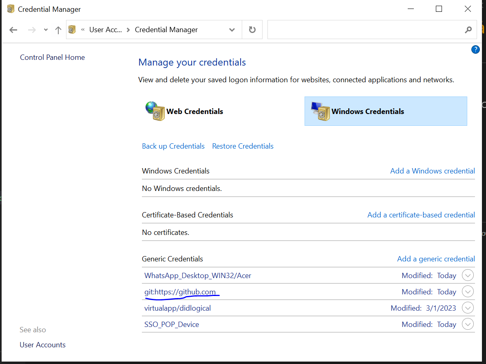

<h1 style="color:orange">Thay đổi tài khoản local trên git</h1>
<h2 style="color:orange">Cho windows</h2>
Control Panel > User Accounts > Credential Manager > Windows Credentials

Xoá git account:
 
Khi push thì nó sẽ yêu cầu nhập user, password mới