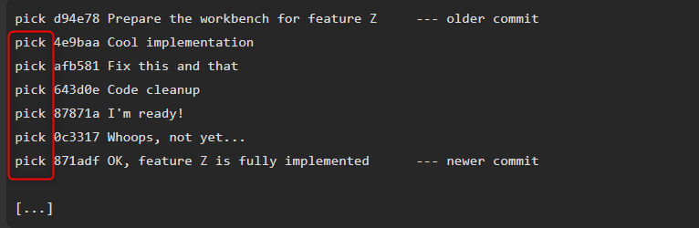
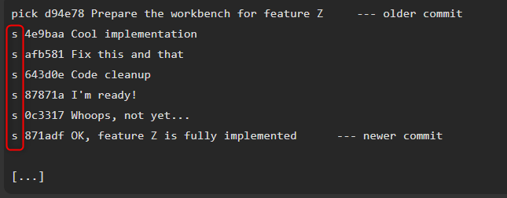

<h1 style="color:orange">Git squash</h1>

Tham khảo: https://www.internalpointers.com/post/squash-commits-into-one-git 
https://asciinema.org/a/11269 
Đổi default editor thành vim:

    # sudo update-alternatives --config editor

Squash là tool dùng để hượp nhiều commit thành 1. Để squash 4 commit gần nhất tại local:

    # git rebase -i origin/master~4 master
Câu lệnh sẽ mở ra default editor. Tại đây, thay `pick` với `s` (viết tắt của squash) ở dòng 2,3,4. Dòng đầu tiên để là `pick`. Save file.
 
 

Sau đó, default editor sẽ mở lại, show message của mỗi commit. Comment các dòng ko muốn và chỉ để lại 1 dòng message đại diện cho 4 commit này. Save file. -> Force push lại đến remote

    # git push origin +master
Option `+` trước tên_branch để force push branch đấy thay vì toàn bộ branch như option `--force`