<h1 style="color:orange">Stress test</h1>
Stress là một câu lệnh được sử dụng để áp một mức tải cho hệ thống để kiểm tra khả năng chịu tải của nó trong thực tế. Nó sẽ tạo ra các process sử dụng rất nhiều tài nguyên của hệ thống như CPU, RAM hay disk để ta có thể kiểm tra được khả năng và ngưỡng mà hệ thống của ta hoạt động tốt nhất. Nó cũng rất có ích để tái hiện lại trạng thái tải cao gây ra lỗi hệ thống để ta có thể tìm cách xử lý.
<h2 style="color:orange">1. Cài đặt stress</h2>

1. Trên CentOS:

       # yum install -y stress
2. Trên Ubuntu:
       
       # sudo apt-get install -y stress
<h2 style="color:orange">2. Test CPU</h2>
Để test CPU sử dụng câu lệnh:

       # stress --cpu N
       hoặc stress -c N
N là số tiến trình được tạo ra để tính toán hàm `sqrt()`. Mỗi hàm sqrt() sẽ làm đầy CPU (100%) và N thường = số thread. VD: có 16 cores, 32 threads thì N tối đa = 32.

VD: Sử dụng lệnh htop để xem CPU
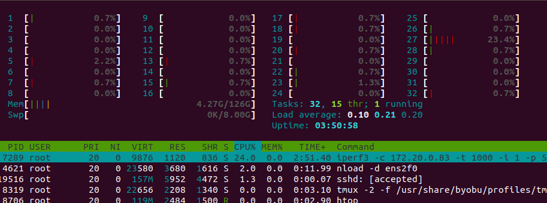 
Sau khi sử dụng lệnh

       # stress -c 32
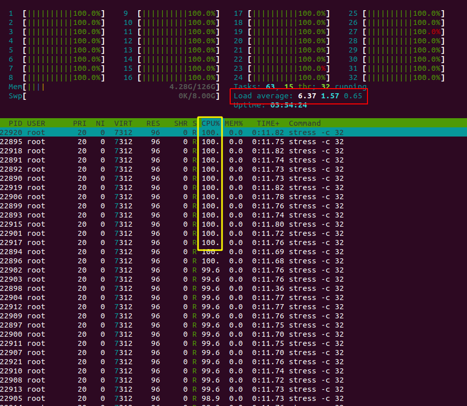 
Tất cả 32 threads đều đầy 100% 
Ngoài ra cũng phải chú ý tới thông số load average: khi server bị quá tải, load average sẽ tăng dần; 8 hoặc 9 sẽ là không tốt cho server. Bình thường người ta sẽ chạy test trong 24h nếu server không bị sập ===> đủ tính ổn định để sử dụng.

Ngoài ra, có thể thêm trường:

       # stress -c 32 --timeout 30 (30 giây)
để chạy test trong 30s mà không cần ấn Crtl + C để thoát.
<h2 style="color:orange">3. Test RAM</h2>
Để test RAM sử dụng câu lệnh:

       # stress -m N
với N là số hàm malloc để làm đầy RAM, mặc định có dung lượng là 256 mb. VD: N=30 sẽ là 30 x 256Mb. Hoặc cũng có thể dùng lệnh:
      
       # stress -m N --vm-bytes 500M
để cài đặt mỗi N = 500M.

VD: Sử dụng câu lệnh:

       # stress -m 500
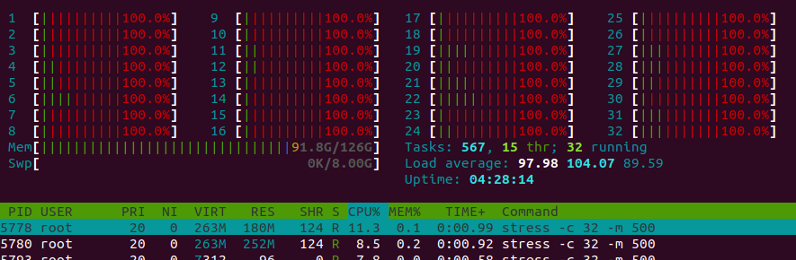 
CPU nhảy lên 100% là vì CPU đẩy dung lượng xuống RAM chứ RAM không thể tự sinh ra dung lượng.

---------> Câu lệnh test cả RAM cả CPU:

        # stress-ng --vm 10 --vm-bytes 96G -c 32 -t 5d -v
.-c: số lượng threads 
.-t: thời gian test (đơn vị s,m,h,d,...) 
.-v: verbosely display
<h2 style="color:orange">4. Test IOPS của disk</h2>
<h3 style="color:orange">4.1. Sử dụng fio để đo IOPS</h3>
I/OPS (in/output per second) là số lượng tác vụ đọc ghi của ổ cứng trong 1 giây. Về lý thuyết, con số này càng cao càng tốt. 

Tuy nhiên, nếu IOPS quá cao, chạm mức giới hạn vật lý, tình trạng thắt cổ chai sẽ xảy ra. IOPS cao ---> latency cao theo ---> giảm throughput.

Đối với IOPS, thông tin quan trọng nhất với IOPS là read/write (75/25, 70/30, 67/33) vì đối với 1 trang web, read luôn nhiều hơn write.

Sử dụng lệnh:

      # fio --randrepeat=1 --ioengine=libaio --direct=1 --gtod_reduce=1 --name=cacthucacthu --filename=cacthucacthu --bs=4k --iodepth=64 --size=4G --readwrite=randrw --rwmixread=75

Với các thông số:
- bs -block size: 4Kb (bình thường người ta sẽ dùng block size =4K hoặc 16K)
- iodepth: 64 tiến trình cùng 1 lúc
- size: 4G - thử lưu 1 file 4G vào ổ cứng
- readwrite: randrw - test cả tốc độ đọc/ghi random
- rwmixread=75 - đọc =75% (vì đọc luôn nhiều hơn ghi)
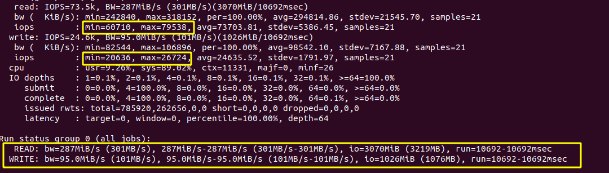 

Với ví dụ trên ta thấy:
- Số tác vụ-iops trong 1s của đọc là 60710(min) và 79538(max); của ghi là 20636 (min) và 26724 (max)
- Tốc độ đọc là 287MiB/s (max là 301Mib/s); ghi là 95MiB/s (max là 101 Mib/s)

Ngoài ra cũng có thể dùng lệnh:

      # fio –randrepeat=1 –ioengine=libaio –direct=1 –gtod_reduce=1 –name=cacthucacthu –filename=cacthucacthu –bs=4k –iodepth=64 –size=4G –readwrite=randread
để chỉ đọc và
      
      fio –randrepeat=1 –ioengine=libaio –direct=1 –gtod_reduce=1 –name=hocvps –filename=hocvps –bs=4k –iodepth=64 –size=4G –readwrite=randwrite
để chỉ ghi.

Một số tốc độ đọc/ghi của các ổ cứng.
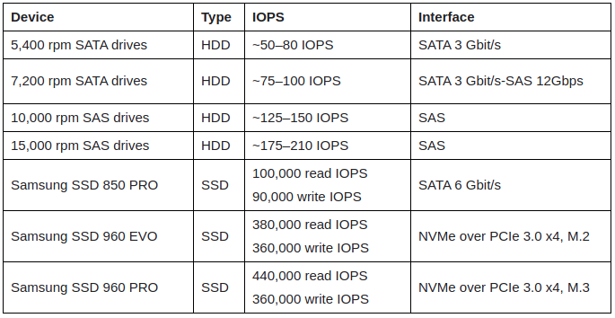 
<h3 style="color:orange">4.2. Ảnh hưởng của RAID lên IOPS</h3>
Tổng IOPS = IOPS per Disk * Số ổ cứng

IOPS thực = (Tổng IOPS * Write%)/(Raid Penalty) + (Tổng IOPS * Read %)

Số ổ cứng = ((Read IOPS) + (Write IOPS*Raid Penalty))/ IOPS per Disk

Với:
- `IOPS per disk` là IOPS trung bình mỗi ổ. VD ở hình trên ổ SAS 15,000 rpm có 175 IOPS
- `Write%-read%:` phần trăm đọc, ghi. vd: 70%-30%
- `Raid penalty` là số ổ cứng tối thiểu mà RAID yêu cầu. vd: raid 0 là 2 ổ, raid 5 là 3 ổ, raid 10 là 4 ổ,...
<h2 style="color:orange">5. Test latency của disk</h2>
Latency là khái niệm về tốc độ xử lý 1 request I/O của hệ thống. Khái niệm này rất quan trọng bởi vì 1 hệ thống lưu trữ mặc dù chỉ có capacity 1000 IOPS với thời gian trung bình xử lý latency 10ms, vẫn có thể tốt hơn 1 hệ thống với 5000 IOPS nhưng latency là 50ms. Đặc biệt đối với các ứng dụng “nhạy cảm” với latency, chẳng hạn như dịch vụ Database.
<h3 style="color:orange">5.1. IOPS vs Latency : Yếu tố nào quyết định hiệu năng hệ thống Storage?</h3>
Để so sánh được hiệu quả hệ thống storage, các yếu tố về môi trường platform và ứng dụng cần phải giống nhau – điều này rất khó, vì hệ thống của doanh nghiệp cần phải chạy multi-workload. Trong một vài trường hợp, việc xử lý/transfer 1 lượng lớn data (high throughput) thì được xem là tốt, nhưng khi cần xử lý số lượng lớn các I/O nhỏ thật nhanh (cần IOPS), thì chưa chắc và ngược lại. Lúc này kích cỡ I/O, độ dài của hàng đợi (queu depth) và mức độ xử lý song song… đều có ảnh hưởng đến hiệu năng.
------

Latency nên được xem là thông số hữu ích nhất, vì nó tác động trực tiếp lên hiệu năng của hệ thống, là yếu tố chính nên dựa vào tính toán ra IOPS và throughput. Nghĩa là việc giảm thiểu latency sẽ giúp cải thiện chung hiệu năng của cả hệ thống
-----> Latency càng thấp càng tốt.
<h3 style="color:orange">5.2. Đo latency bằng ioping</h3>

1. install ioping:

       # yum install -y epel-release && yum install -y ioping || ( apt-get update && apt-get install -y ioping )
2. Sử dụng lệnh:

       # ioping . -c 12
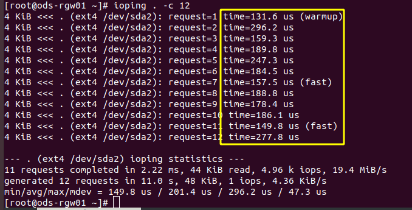 
để check latency của server. Ở ví dụ trên là 149.8 --> 296.2 micro s = tb 0.2ms. Với 1 server thì tốc độ trung bình dưới 0.5ms là hoạt động ổn định.
<h2 style="color:orange">6. iperf</h2>
Iperf là một công cụ miễn phí, dùng để đo lường lượng dữ liệu mạng (throughput) tối đa mà một server có thể xử lý. Công cụ này rất hữu ích để truy tìm ra các vấn đề đối với hệ thống mạng bởi Iperf có thể xác định được server nào không xử lý được lượng dữ liệu mạng (throughput) mà người quản trị mạng mong đợi.
<h3 style="color:orange">6.1. Cài đặt iperf</h3>

1. Debian/Ubuntu        

        # apt-get install iperf
2. CentOS/Fedora              
        
        # yum install epel-release -y 
        # yum install iperf -y

Bạn nên sử dụng Iperf để kiểm tra giữa máy chủ và một máy chủ đặt tại nhiều vị trí khác nhau để có đánh giá chính xác nhất bởi kết quả của việc kiểm tra có thể bị tác động bởi sự giới hạn của các nhà mạng (ISP).
<h3 style="color:orange">6.2. Sử dụng iperf</h3>
TCP Clients & Servers

Iperf yêu cầu cần có hai máy chủ để kiểm tra, một sẽ đóng vai trò và hoạt động như server, máy chủ còn lại sẽ là client kết nối tới máy chủ mà bạn đang kiểm tra tốc độ mạng.
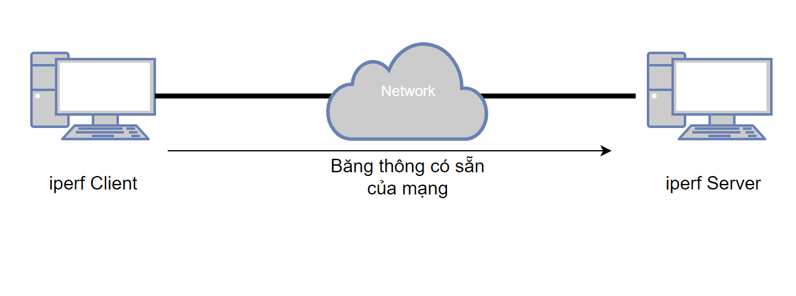 
1. Tiến hành cài đặt iperf trên cả server và client.

       # yum install epel-release -y
       # yum install iperf -y
2. Trên máy server bật iperf:

       # iperf -s
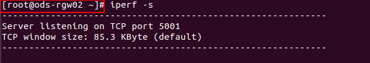 

3. Trên máy client tiến hành lệnh:
 
       # iperf -c 172.16.1.102 -i1 -t 100
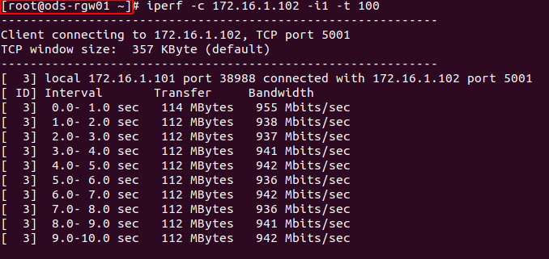 

Với:
- 172.16.1.102 là địa chỉ server
- -i, --interval: Thời gian lấy mẫu để hiển thị kết quả tại thời điểm đó ra màn hình.
- t 100: Tổng thời gian của kết nối, tính bằng giây. Ở đây là 100s

Đồng thời ở server cũng xuất hiện kết quả iperf từ máy client.
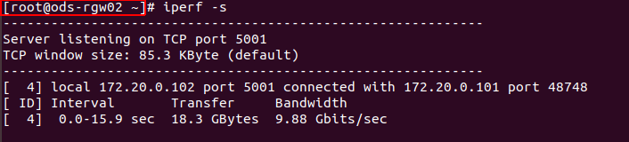
<h3 style="color:orange">6.3. Các tùy chọn iperf</h3>
.-c: chỉ ra địa chỉ IP của server để iperf kết nối đến 
.-f, --format: Chỉ ra định dạng của kết quả hiển thị. ‘b’ = bps, ‘B’ = Bps, ‘k’ = Kbps, ‘K’ = KBps,… 
.-i, --interval: Thời gian lấy mẫu để hiển thị kết quả tại thời điểm đó ra màn hình 
.-p, --port: Định ra cổng để nghe, mặc định nếu không sử dụng tham số này là cổng 5001 
.-u, --udp: Sử dụng giao thức UDP, mặc định iperf sử dụng TCP 
.-P, --parallel: Chỉ ra số kết nối song song được tạo, nếu là Server mode thì đây là giới hạn số kết nối mà server chấp nhận 
.-b: Định ra băng thông tối ta có thể truyền, chỉ sử dụng với UDP, client mode 
.-t: Tổng thời gian của kết nối, tính bằng giây 
.-M: Max segment size 
.-l: Buffer size 
.-w, --window: Trường Windows size của TCP 

Ví dụ:

       # iperf -c 10.10.34.173 -u -b 1000m -i1 -t 100 -m
Giải thích tham số câu lệnh: 
.-c : địa chỉ host của iperf server (10.10.34.173) 
.-u: dùng giao thức UDP 
.-b: giá trị băng thông tối đa là 1000 Mbits 
.-i : khoảng thời gian giữa 2 lần report kết quả theo giây (1s) 
.-t : thời gian thực hiện đẩy traffic theo giây (100s) 
.-m : in ra MTU header 
<h2 style="color:orange">7. Lệnh nload</h2>
Lệnh nload hiển thị mức sử dụng mạng hiện tại.
<h3 style="color:orange">7.1. Cái đặt nload</h3>

- Trên Centos / RHEL

       # yum install epel-release
       # yum install nload
- Trên Ubuntu / Debian

       # apt install nload
<h3 style="color:orange">7.2. Sử dụng nload</h3>
Dùng lệnh:

       # nload
       hoặc nload eth0 (tên port mạng)
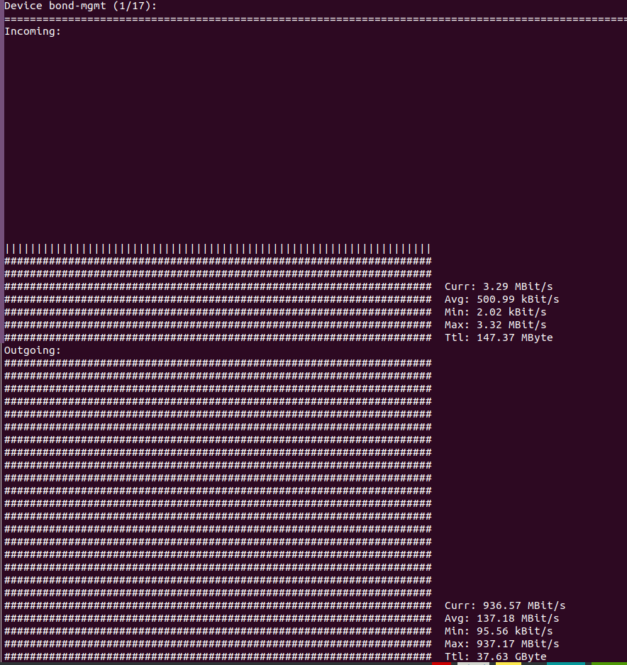 

`Các key shortcut`:
- Sử dụng các nút mũi tên, Tab, Enter để chuyển đổi giữa các interface mạng
- F2: Hiển thị cửa sổ option
- F5: Lưu setting hiện tại vào file cấu hình của người dùng
- F6: reload settings từ file cấu hình
Dùng q hoặc Ctrl + C để thoát.
<h3 style="color:orange">7.3. Các option nload</h3>
.-m: Hiển thị nhiều card cùng lúc 

        # nload -m
.-a: đặt độ dài tính bằng giây của cửa sổ thời gian để tính trung bình (mặc định là 300)

        # nload -a 400
-t: Thay đổi thời gian làm mới interval theo mili giây. Mặc định là 500 (nếu giảm xuống dưới 100 thì giá trị sẽ không chính xác.)

        # nload -ma 400 -t 600
devices: Có thể chỉ định card mạng cụ thể bằng lệnh sau: (Mặc định là tất cả các card mạng)

        # nload devices ens33
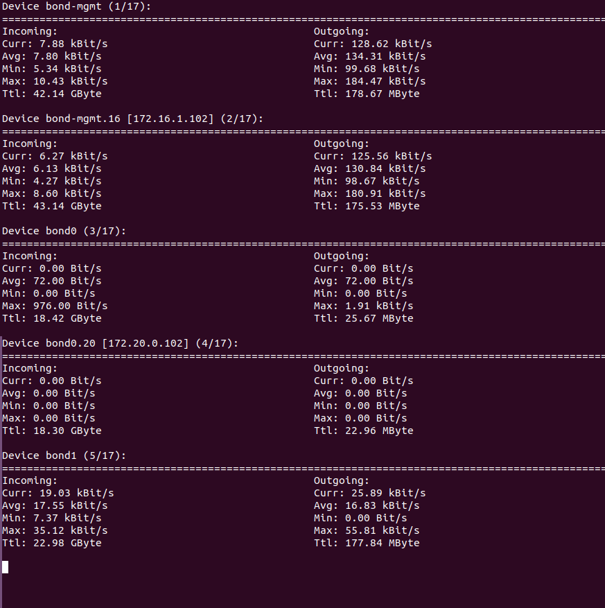 